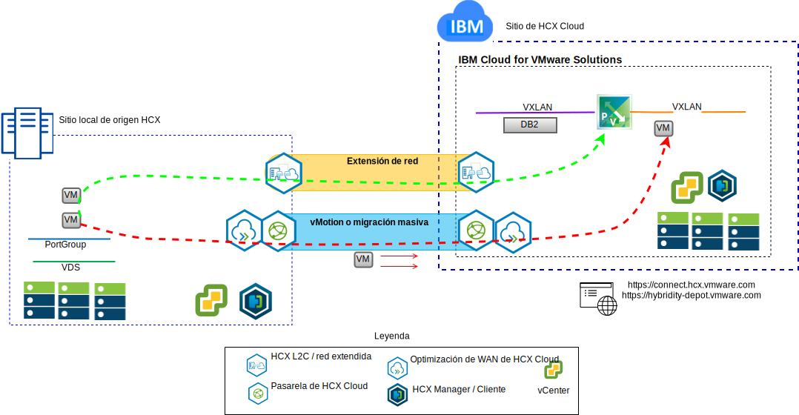

---

copyright:

  years:  2016, 2019

lastupdated: "2019-02-15"

---

# Traspaso de las VM de Stock Trader a IBM Cloud
{: #vcscontent-hcx}

Todd desea ampliar su instancia VMware SDDC local a
VMware vCenter Server on {{site.data.keyword.cloud}} como primer paso de su proceso de modernización. El negocio debe permanecer activo y el tiempo de inactividad se debe reducir al mínimo.

VMware vCenter Server on {{site.data.keyword.cloud_notm}} con el paquete híbrido (Hybridity) permite crear una conexión sencilla entre instancias de vCenter Server y el centro de datos local virtualizado
de VMware.

Los componentes de vCenter Server con el paquete híbrido (Hybridity), que se despliegan como máquinas virtuales en el sitio de destino de {{site.data.keyword.cloud_notm}} VMware, permiten establecer una conexión con los componentes de
HCX instalados en el sitio local de origen homólogo.

Figura 1. vCenter Server con paquete híbrido (Hybridity)

La hibridación crea una interconexión ligeramente acoplada entre {{site.data.keyword.cloud_notm}} local y ofrece las siguientes funciones:

* Interconectividad sencilla: las conexiones de red lógicas se establecen fácilmente sobre cualquier conexión física, como internet pública, VPN privada o enlace directo.
* Extensión de capa 2: las redes locales se amplían a la nube e incluyen subredes locales y direccionamiento IP.
* Cifrado: el tráfico de red se cifra de forma segura entre los dos lados.
* Red optimizada: selecciona la mejor conexión y gestiona la conexión de forma eficiente de modo que el tráfico se transmite de la forma más rápida posible.
* Desduplicación de datos: se puede conseguir una reducción del 50% en el tráfico de red.
* Direccionamiento inteligente: cuando se mueve una carga de trabajo, el direccionamiento de proximidad puede cambiar la pasarela de red para que el tráfico de la red utilice la pasarela del sitio de destino y no lo "devuelva" (hairpin) al sitio de origen.
* Migración con tiempo de inactividad cero: un sistema en ejecución se puede mover a la nube (o recuperar de la misma) mediante vMotion.
* Migración planificada: se puede replicar el número deseado de máquinas virtuales en el sitio de destino y luego se pueden activar en dicho sitio en el momento planificado, sustituyendo los sistemas que se ejecutan en el sitio de origen.
* Migración de políticas de seguridad: si NSX se utiliza en local, las políticas de seguridad, los cortafuegos y otros elementos de seguridad se trasladan junto con la carga de trabajo.

Todd puede migrar Stock Trader de su entorno VMware local al entorno VMware on {{site.data.keyword.cloud_notm}}, cumpliendo con sus requisitos de poco tiempo de inactividad, o nada, y de no tener que volver a configurar las aplicaciones.

## Enlaces relacionados
{: #vcscontent-hcx-related}

* [Visión general de vCenter Server on {{site.data.keyword.cloud_notm}} con el paquete híbrido (Hybridity)](/docs/services/vmwaresolutions/archiref/vcs?topic=vmware-solutions-vcs-hybridity-intro)
