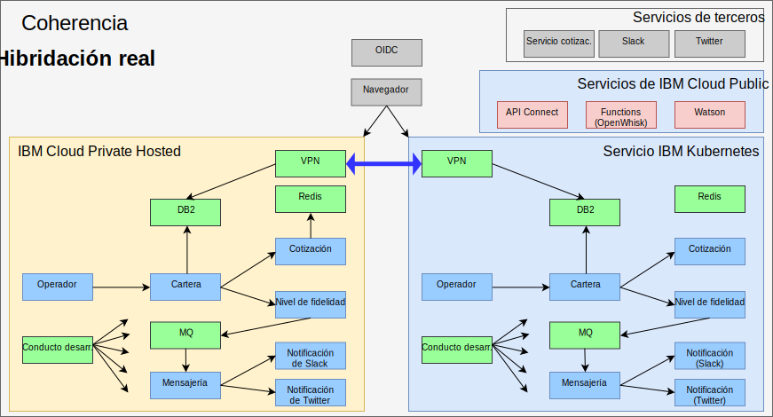

---

copyright:

  years:  2016, 2019

lastupdated: "2019-08-05"

subcollection: vmware-solutions

---

# Hibridación real con IBM Cloud Kubernetes Service
{: #vcscontent-iks}

A medida que el equipo de pruebas de Jane se expande, desea proporcionar un entorno de prueba que pueda ejecutar las principales partes de su aplicación y seguir utilizando los datos que tiene en su entorno. Jane desea que su equipo de pruebas se centre en probar su aplicación, no en gestionar el clúster Kubernetes. Jane y Todd deciden poner en marcha una instancia de [{{site.data.keyword.cloud}} Kubernetes
Service](https://www.ibm.com/cloud/container-service) y Jane
despliega Stock Trader, sin realizar en el mismo ningún cambio de código.

A continuación, Todd añade la VPN strongSwan para establecer conexión entre las redes privadas de cada clúster.

