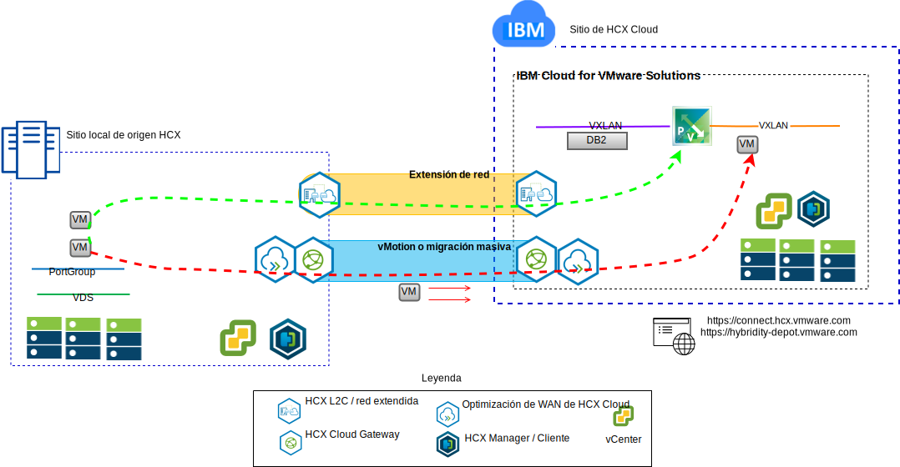

---

copyright:

  years:  2016, 2019

lastupdated: "2019-02-16"

---

# Introducción a VMware Hybrid Cloud Services
{: #vcshcx-intro}

VMware Hybrid Cloud Services (HCX) permite que diversas instancias de centros de datos definidos por software de vSphere (SDDC) interoperen entre distintos tipos de red. Estos incluyen LAN o WAN, estén o no protegidos en Internet público. HCX está diseñado para tratar los problemas de seguridad, compatibilidad, complejidad y rendimiento que el usuario se encontrará al intentar conseguir un despliegue multisitio de varias instancias de vSphere que se extiende más allá de los límites del proveedor de nube y local.

Figura 1. VMware Hybrid Cloud Services

Como tal, HCX es el método preferido para la interoperación entre las ofertas de vSphere completamente automatizadas dentro de {{site.data.keyword.cloud}} y cualquier otra instancia desplegada de vSphere. HCX ahora es una oferta completamente integrada dentro de {{site.data.keyword.vmwaresolutions_short}}.

Esta guía describe el despliegue y las operaciones de HCX, incluyendo las mejores prácticas y la resolución de problemas, tal y como se aceptan y comprenden actualmente. Como HCX se desarrolla utilizando la metodología de desarrollo ágil, no utilice esta guía como origen de facto de las versiones o las plataformas soportadas.

## Enlaces relacionados
{: #vcshcx-intro-related}

* [Visión general de vCenter Server on {{site.data.keyword.cloud_notm}} con el paquete híbrido (Hybridity)](/docs/services/vmwaresolutions/archiref/vcs/vcs-hybridity-intro.html)   
