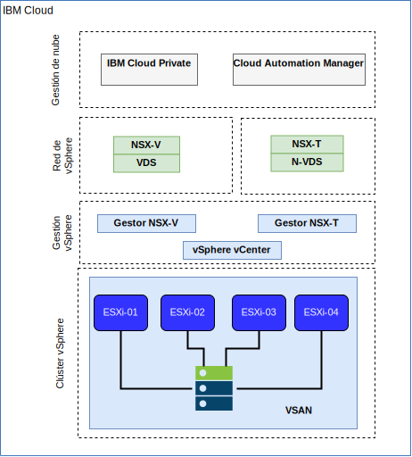

---

copyright:

  years:  2016, 2019

lastupdated: "2018-01-14"

---

# Redes e infraestructura de IBM Cloud

## Direccionamiento y reenvío virtual (VRF)

Puede configurar cuentas de {{site.data.keyword.cloud}} como cuentas de VRF para proporcionar funciones similares a la distribución de VLAN, habilitando así el direccionamiento automático entre los bloques de IP de subred. Todas las cuentas con las conexiones de Direct-Link deben convertirse a, o crearse como, una cuenta de VRF.

## Direct Link

{{site.data.keyword.cloud_notm}} Direct Link Connect ofrece acceso privado a su infraestructura de {{site.data.keyword.cloud_notm}} y a cualquier otra nube enlazada a su proveedor de servicios de red, a través de su centro de datos de IBM Cloud local. Esta opción es perfecta para crear conectividad multinube en un entorno único. Se utiliza una topología de ancho de banda compartida para conectar clientes a la red de {{site.data.keyword.icpfull_notm}}. Al igual que sucede con todos los productos de Direct-Link, puede añadir direccionamiento global, que permite el tráfico de red privada a todas las ubicaciones de {{site.data.keyword.cloud_notm}}.

## Redes privadas virtuales

### strongSwan VPN

El servicio strongSwan IPSec VPN ofrece un canal de comunicación seguro de extremo a extremo sobre internet que se basa en la suite de protocolos Internet Protocol Security (IPSec) estándar del sector.

### Hybridity (HCX)

vCenter Server on {{site.data.keyword.cloud_notm}} con el paquete híbrido (Hybridity) permite ampliar fácilmente las redes de centros de datos locales en {{site.data.keyword.cloud_notm}}, lo que permite migrar las máquinas virtuales (VM) de {{site.data.keyword.cloud_notm}} y al mismo sin realizar ninguna conversión ni cambio.

## Estructura física

La infraestructura física necesaria para desplegar una instancia de producción de {{site.data.keyword.icpfull_notm}} en un clúster de VMware vCenter Server on {{site.data.keyword.cloud_notm}} requiere la siguiente especificación mínima.

Tabla 1. Especificación de vCenter Server para {{site.data.keyword.icpfull_notm}}

| Despliegue de NFS | Despliegue de vSAN |
:--|:----:|:----:
Número de servidores | 3 | 4
CPU | 28 núcleos 2,2 GHz | 28 núcleos 2,2 GHz
Memoria | 384 GB | 384 GB
Almacenamiento | 2000 GB 2IOPS/GB de gestión, 2000 GB 4IOPS/GB de carga de trabajo, 4000 GB 4IOPS/GB de {{site.data.keyword.icpfull_notm}} | Mín 960-GB SSD x 2

Además de los requisitos de hardware de {{site.data.keyword.icpfull_notm}}, debe crear volúmenes persistentes en el entorno {{site.data.keyword.icpfull_notm}} para almacenar la base de datos de Cloud Automation Manager (CAM) y los datos de registro. Aunque CAM da soporte a todos los tipos de volúmenes persistentes a los que da soporte {{site.data.keyword.icpfull_notm}}, las dos configuraciones de almacenamiento recomendadas para CAM son NFS y GlusterFS.

## Estructura virtual

Figura 1. Estructura física de vCenter Server y despliegue de {{site.data.keyword.icpfull_notm}}

Dentro de la instancia de vCenter Server, la instancia de {{site.data.keyword.icpfull_notm}} se despliega con NSX Edge Services Gateway (ESG) y Distributed Logical Router (DLR) dedicados. La instalación de {{site.data.keyword.icpfull_notm}} se carga en la subred VXLAN definida en los componentes anteriores.

El ESG se configura con una regla NAT de origen (SNAT) para permitir el tráfico de salida, lo que permite la conectividad a Internet para descargar los requisitos previos de {{site.data.keyword.icpfull_notm}} y para conectarse a GitHub y Docker. De forma alternativa, puede utilizar un proxy web para la conectividad de Internet. El ESG también se configura para proporcionar acceso a los servicios DNS y NTP.

El ESG también se configura con una regla NAT de destino (DNAT) a las direcciones IP virtuales de {{site.data.keyword.icpfull_notm}} Master/Proxy entre la red de {{site.data.keyword.cloud_notm}} 10.x y el entorno VXLAN.

### Enlaces relacionados

* [Visión general de vCenter Server on {{site.data.keyword.cloud_notm}} con el paquete híbrido (Hybridity)](../vcs/vcs-hybridity-intro.html)
