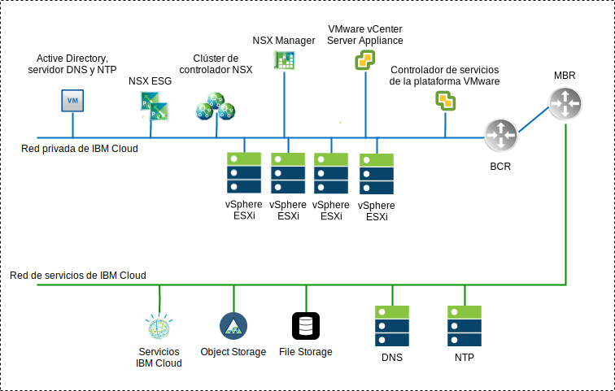
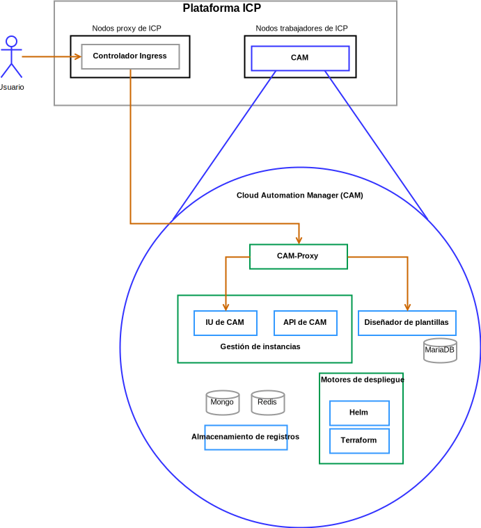

---

copyright:

  years:  2016, 2018

lastupdated: "2018-10-10"

---

# Componentes de la solución

## Componentes de VCS

Figura 1. Diagrama del entorno VCS

### Controlador de servicios de la plataforma
El despliegue de VCS utiliza un único controlador externo de servicios de la plataforma, instalado en una subred portátil en la VLAN privada asociada a las máquinas virtuales de gestión. Su pasarela predeterminada se establece en el direccionador del cliente de fondo (BCR).

### vCenter Server
Al igual que el controlador de servicios de la plataforma, vCenter Server se despliega como un dispositivo. Además, vCenter Server se instala en una subred portátil en la VLAN privada asociada a las máquinas virtuales de gestión. Su pasarela predeterminada se establece en la dirección IP asignada en el BCR para dicha subred determinada.

### NSX Manager
NSX Manager se despliega en el clúster inicial. Se asigna a NSX Manager una dirección IP respaldada por VLAN desde el bloque de direcciones portátiles privado, que está destinado a los componentes de gestión y configurado con los servidores DNS y NTP.

### Controladores NSX
La automatización de IBM Cloud despliega tres controladores NSX dentro del clúster inicial. Se asigna a los controladores una dirección IP respaldada por VLAN desde la subred portátil privada que está destinada a los componentes de gestión.

### NSX Edge / DLR
Se despliegan pares NSX Edge Services Gateway (ESG). En todos los casos, se utiliza un par de pasarela para el tráfico de salida de los componentes de automatización que residen en la red privada. Para vCenter Server e ICP, una segunda pasarela, conocida como el borde gestionado por el cliente, se despliega y se configura con un enlace ascendente a la red pública y una interfaz asignada a la red privada. El administrador puede configurar los componentes NSX necesarios como, por ejemplo, el direccionador lógico distribuido (DLR), los conmutadores lógicos y los cortafuegos. El apartado [arquitectura de referencia de IBM Cloud VCS Networking](../vcsnsxt/vcsnsxt-intro.html) contiene más información sobre el diseño de red.

En la tabla siguiente se resumen las especificaciones de ICP ESG/DLR.

Tabla 1. Especificaciones de ICP ESG

Atributo  |  Especificación
--|--
Edge Service Gateway  |  Dispositivo virtual
Edge tamaño grande |   Número de vCPU	2
Memoria	| Disco de 1 GB	| 1000 GB en almacén de datos local

Tabla 2. Especificaciones de DLR de ICP

Atributo  |  Especificación
--|--|
Direccionador lógico distribuido | 	Dispositivo virtual
Edge tamaño Compacto | Número de vCPU	1
Memoria	| Disco de 512 MB	| 1000 GB en almacén de datos local

## Componentes de ICP
IBM Cloud Private es una plataforma de aplicaciones para desarrollar y gestionar aplicaciones de contenedor locales. Es un entorno integrado para gestionar contenedores que incluye el orquestador de contenedores Kubernetes,
un repositorio de imágenes privadas, una consola de gestión e infraestructuras de supervisión.

Figura 2. Despliegue de ICP virtual con VCS

###	Nodo de arranque
Se utiliza un nodo de arranque o de rutina de carga (opcional) para ejecutar la instalación, la configuración, el escalado de nodos y actualizaciones de clústeres. Solo se necesita un nodo de arranque por clúster. Puede utilizar un único nodo como nodo maestro y de arranque.

### Nodo maestro
Un nodo maestro proporciona servicios de gestión y controla los nodos trabajadores de un clúster. El nodo maestro contiene los procesos responsables de la asignación de recursos, el mantenimiento del estado, la planificación y la supervisión. Dado que un entorno de alta disponibilidad (HA) contiene varios nodos maestro, si el nodo maestro inicial falla, la lógica de la migración tras error promociona automáticamente otro nodo y le asigna el rol de maestro. Los hosts que pueden actuar como nodo maestro se denominan candidatos a maestro.

###	Nodo trabajador
Un nodo trabajador es un nodo que proporciona un entorno contenerizado para ejecutar tareas. A medida que aumenta la demanda, se pueden añadir fácilmente más nodos trabajadores al clúster para mejorar el rendimiento y la eficacia. Un clúster puede contener tantos nodos trabajadores como desee y necesita un mínimo de uno.

### Nodo proxy
Un nodo proxy es un nodo que transmite la solicitud externa a los servicios creados dentro del clúster. Dado que un entorno de alta disponibilidad (HA) contiene varios nodos proxy, si el nodo proxy inicial falla, la lógica de la migración tras error promociona automáticamente otro nodo y le asigna el rol de proxy. Aunque puede utilizar un nodo único como maestro y proxy, es mejor utilizar nodos proxy dedicados para reducir la carga en el nodo maestro. Un clúster debe contener al menos un nodo proxy si se necesita equilibrio de carga dentro del clúster.

### Nodo de gestión
Un nodo de gestión es un nodo opcional que aloja únicamente servicios de gestión como, por ejemplo, supervisión, calibración y registro. Mediante la configuración de nodos de gestión dedicados, puede evitar que el nodo maestro se sobrecargue. Solo puede habilitar el nodo de gestión durante la instalación de IBM Cloud Private.

###	Nodo VA
Un nodo de VA (Vulnerability Advisor) es un nodo opcional que se utiliza para ejecutar los servicios de Vulnerability Advisor. Los servicios de Vulnerability Advisor consumen muchos recursos. Si utiliza el servicio Vulnerability Advisor, especifique un nodo VA dedicado.

Especificaciones de máquina virtual necesarias para una instancia ICP de alta disponibilidad:

Tabla 3. Especificaciones de máquina virtual ICP

Nodo | 	Instancias	| IP	| CPU	| RAM (GB)	| DISCO (GB)
:-----|------------:|:----|----:|----------:|----------:|
Maestro|	3	| IP (x3) VIP (x1)	| 4	| 64	| 200
Gestión	|3	| IP (x3)	|8	|64	|500
Proxy	| 3	| IP (x3)VIP (x1)	|2	|4	|150
Vulnerability Advisor	|3	| IP (x3)	| 4	| 16	|500
GlusterFS	| 3	| IP (x3)	|8	|16	|150
Trabajador	| 3-6	| IP (x3)	|4-8	|4	|150

CAM requiere que los nodos trabajadores tengan una configuración de vCPU y de memoria superior.

Tabla 4. Especificaciones de máquina virtual ICP

Nodo | 	Instancias	| IP	| CPU	| RAM (GB)	| DISCO (GB)
:-----|------------:|:----|----:|----------:|----------:|
trabajador  |  3 | IP (x3)  |  4-8 |16-20   |  150

## Componentes de CAM

IBM Cloud Automation Manager (CAM) es una plataforma de gestión de autoservicio multinube que se ejecuta en ICP que permite a los desarrolladores y a los administradores satisfacer las necesidades de la empresa.

Figura 3. Referencia de componentes de CAM

### Proxy de CAM
Proporciona un acceso de proxy nginx a CAM.

### 	IU de CAM
Los componentes de la interfaz de usuario se dividen entre varios contenedores: IU de conexiones en la nube, IU de la biblioteca de plantillas e IU de instancias desplegadas.

### API de CAM
Las API de CAM se dividen en varios contenedores.

###	Helm
Un contenedor con los binarios necesarios para desplegar diagramas de helm en clústeres de Kubernetes.

###	Terraform
Un contenedor con los binarios necesarios para desplegar recursos de Terraform en varias nubes.

### Registros
La ubicación de los registros de contenedor.

###	Base de datos Mongo
La base de datos principal de la aplicación CAM.

###	Redis
La base de datos Redis se utiliza para almacenar la memoria caché de sesiones y los bloqueos dentro de CAM.

###	Diseñador de plantillas
Una interfaz gráfica de usuario para crear plantillas de Terraform, con capacidad de arrastrar y soltar módulos de Terraform.

###	Base de datos Maria
La base de datos para la aplicación del diseñador de plantillas.

### Enlaces relacionados

* [VMware vCenter Server on IBM Cloud con el paquete híbrido (Hybridity)](../vcs/vcs-hybridity-intro.html)
