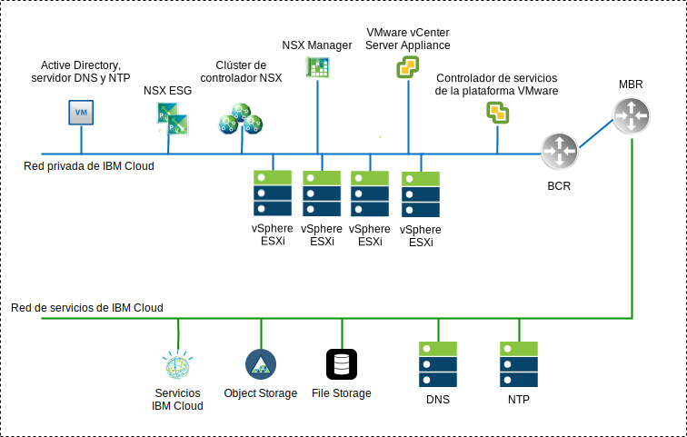
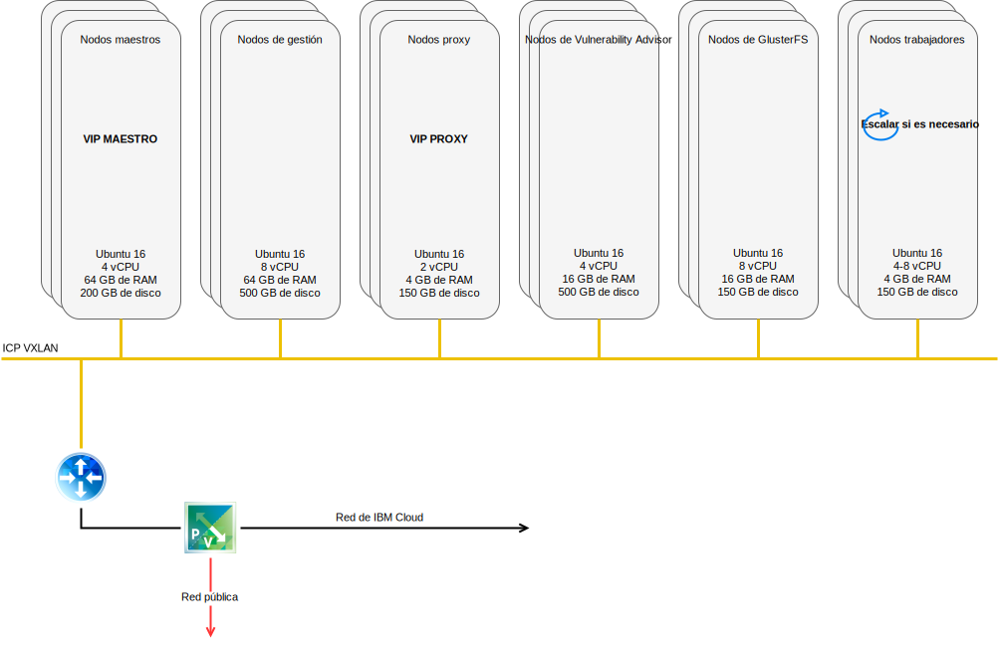
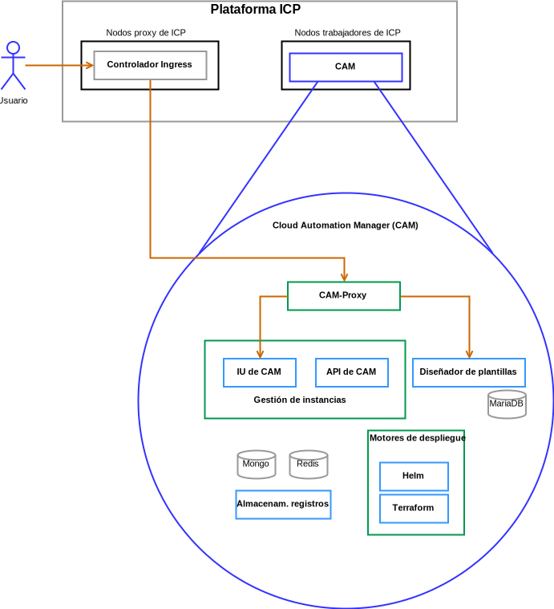

---

copyright:

  years:  2016, 2019

lastupdated: "2019-05-09"

subcollection: vmware-solutions

---

# Componentes de la solución
{: #vcsicp-arch-overview-solution}

## Componentes de VMware vCenter Server on IBM Cloud
{: #vcsicp-arch-overview-solution-vcs-comp}

### Controlador de servicios de la plataforma
{: #vcsicp-arch-overview-solution-psc}

El despliegue de vCenter Server utiliza un único controlador externo de servicios de la plataforma, instalado en una subred portátil en la VLAN privada asociada a las máquinas virtuales (VM) de gestión. Su pasarela predeterminada se establece en el direccionador del cliente de fondo (BCR).

### vCenter Server
{: #vcsicp-arch-overview-solution-vcs}

Al igual que el controlador de servicios de la plataforma, vCenter Server se despliega como un dispositivo. Además, el vCenter Server se instala en una subred portátil en la VLAN privada asociada con las VM de gestión. Su pasarela predeterminada se establece en la dirección IP asignada en el BCR para dicha subred determinada.

### NSX Manager
{: #vcsicp-arch-overview-solution-nsx-manager}

NSX Manager se despliega en el clúster inicial. Se asigna a NSX Manager una dirección IP respaldada por VLAN desde el bloque de direcciones portátiles privado, que está destinado a los componentes de gestión y configurado con los servidores DNS y NTP.

### Controladores NSX
{: #vcsicp-arch-overview-solution-nsx-controllers}

La automatización de {{site.data.keyword.cloud}} despliega tres controladores NSX dentro del clúster inicial. Se asigna a los controladores una dirección IP respaldada por VLAN desde la subred portátil privada que está destinada a los componentes de gestión.

### NSX Edge / DLR
{: #vcsicp-arch-overview-solution-nsx-edge}

Se despliegan pares NSX Edge Services Gateway (ESG). En todos los casos, se utiliza un par de pasarela para el tráfico de salida de los componentes de automatización que residen en la red privada. Para vCenter Server e {{site.data.keyword.icpfull_notm}}, una segunda pasarela, conocida como el borde gestionado por el cliente, se despliega y se configura con un enlace ascendente a la red pública y una interfaz asignada a la red privada. El administrador puede configurar los componentes NSX necesarios como, por ejemplo, el direccionador lógico distribuido (DLR), los conmutadores lógicos y los cortafuegos. La [guía de red de vCenter Server](/docs/services/vmwaresolutions/archiref/vcsnsxt?topic=vmware-solutions-vcsnsxt-intro) contiene más detalles sobre el diseño de red.

En la tabla siguiente se resumen las especificaciones de {{site.data.keyword.icpfull_notm}} ESG y DLR.

Tabla 1. Especificaciones de {{site.data.keyword.icpfull_notm}} ESG

| Atributo | Especificación |
|:--------- |:------------- |
| Edge Service Gateway | Dispositivo virtual |
| Edge tamaño grande | Número de vCPU	2 |
| Memoria | Disco de 1 GB	| 1000 GB en almacén de datos local |

Tabla 2. Especificaciones de DLR de {{site.data.keyword.icpfull_notm}}

| Atributo | Especificación |
|:--------- |:------------- |
| Direccionador lógico distribuido | Dispositivo virtual |
| Edge tamaño Compacto | Número de vCPU	1 |
| Memoria	| Disco de 512 MB	| 1000 GB en almacén de datos local |

## Componentes de IBM Cloud Private
{: #vcsicp-arch-overview-solution-icp-comp}

{{site.data.keyword.icpfull_notm}} es una plataforma de aplicaciones para desarrollar y gestionar aplicaciones locales contenerizadas. Es un entorno integrado para gestionar contenedores que incluye el coordinador de contenedores Kubernetes,
un repositorio de imágenes privadas, una consola de gestión e infraestructuras de supervisión.

###	Nodo de arranque
{: #vcsicp-arch-overview-solution-boot-node}

Se utiliza un nodo de arranque o de rutina de carga (opcional) para ejecutar la instalación, la configuración, el escalado de nodos y actualizaciones de clústeres. Solo se necesita un nodo de arranque por clúster. Puede utilizar un único nodo como nodo maestro y de arranque.

### Nodo maestro
{: #vcsicp-arch-overview-solution-master-node}

Un nodo maestro proporciona servicios de gestión y controla los nodos trabajadores de un clúster. El nodo maestro contiene los procesos responsables de la asignación de recursos, el mantenimiento del estado, la planificación y la supervisión. Dado que un entorno de alta disponibilidad (HA) tiene más de un nodo maestro, si el nodo maestro inicial falla, la lógica de la migración tras error promociona automáticamente otro nodo y le asigna el rol de maestro. Los hosts que pueden actuar como nodo maestro se denominan candidatos a maestro.

###	Nodo trabajador
{: #vcsicp-arch-overview-solution-worker-node}

Un nodo trabajador es un nodo que proporciona un entorno contenerizado para ejecutar tareas. A medida que aumenta la demanda, se pueden añadir fácilmente más nodos trabajadores al clúster para mejorar el rendimiento y la eficacia. Un clúster puede contener tantos nodos trabajadores como desee y necesita un mínimo de uno.

### Nodo proxy
{: #vcsicp-arch-overview-solution-proxy-node}

Un nodo proxy es un nodo que transmite la solicitud externa a los servicios creados dentro del clúster. Dado que un entorno de alta disponibilidad (HA) tiene más de un nodo proxy, si el nodo proxy inicial falla, la lógica de la migración tras error promociona automáticamente otro nodo y le asigna el rol de proxy. Aunque puede utilizar un nodo único como maestro y proxy, utilice nodos proxy dedicados para reducir la carga en el nodo maestro. Un clúster debe tener al menos un nodo proxy si se necesita equilibrio de carga dentro del clúster.

### Nodo de gestión
{: #vcsicp-arch-overview-solution-mgmt-node}

Un nodo de gestión es un nodo opcional que aloja únicamente servicios de gestión como, por ejemplo, supervisión, calibración y registro. Mediante la configuración de nodos de gestión dedicados, puede evitar que el nodo maestro se sobrecargue. Solo puede habilitar el nodo de gestión durante la instalación de {{site.data.keyword.icpfull_notm}}.

###	Nodo de Vulnerability Advisor
{: #vcsicp-arch-overview-solution-va-node}

Un nodo de Vulnerability Advisor es un nodo opcional que se utiliza para ejecutar los servicios de Vulnerability Advisor. Los servicios de Vulnerability Advisor consumen muchos recursos. Si utiliza el servicio Vulnerability Advisor, especifique un nodo VA dedicado.

Se necesitan las siguientes especificaciones de VM para una instancia de {{site.data.keyword.icpfull_notm}} de alta disponibilidad:

Tabla 3. Especificaciones de máquina virtual {{site.data.keyword.icpfull_notm}}

| Nodo | Instancias | IP	| CPU	| RAM (GB)	| DISCO (GB) |
|:---- |:--------- |:-- |:--- |:--------- |:--------- |
| Maestro | 3	| IP (x3) VIP (x1)	| 4	| 64	| 200 |
| Gestión	| 3	| IP (x3)	| 8	| 64	| 500 |
| Proxy	| 3	| IP (x3)VIP (x1)	| 2	| 4	| 150 |
| Vulnerability Advisor	| 3	| IP (x3)	| 4	| 16	| 500 |
| GlusterFS	| 3	| IP (x3)	| 8	| 16	| 150 |
| Trabajador	| 3-6	| IP (x3)	| 4-8	| 4	| 150 |

CAM requiere que los nodos trabajadores tengan una configuración de vCPU y de memoria superior.

Tabla 4. Especificaciones de máquina virtual {{site.data.keyword.icpfull_notm}}

| Nodo | Instancias	| IP | CPU	| RAM (GB)	| DISCO (GB) |
|:---- |:---------- |:-- |:---- |:--------- |:--------- |
| trabajador | 3 | IP (x3) | 4-8 | 16-20 | 150 |

## Componentes de CAM
{: #vcsicp-arch-overview-solution-cam-comp}

{{site.data.keyword.cloud_notm}} Automation Manager (CAM) es una plataforma de gestión de autoservicio multinube de autoservicio que se ejecuta en {{site.data.keyword.icpfull_notm}} que permite a los desarrolladores y a los administradores satisfacer las necesidades de la empresa.

### Proxy de CAM
{: #vcsicp-arch-overview-solution-cam-proxy}

Proporciona un acceso de proxy nginx a CAM.

### Interfaz de usuario de CAM
{: #vcsicp-arch-overview-solution-cam-ui}

Los componentes de la interfaz de usuario se dividen en más de un contenedor. Los componentes se incluyen en la interfaz de usuario de conexiones de la nube, en la interfaz de usuario de la biblioteca de plantillas y en la interfaz de usuario de las instancias desplegadas.

### API de CAM
{: #vcsicp-arch-overview-solution-cam-api}

Las API de CAM se dividen en más de un contenedor.

### Helm
{: #vcsicp-arch-overview-solution-helm}

Un contenedor con los binarios necesarios para desplegar diagramas de helm en clústeres de Kubernetes.

### Terraform
{: #vcsicp-arch-overview-solution-terraform}

Un contenedor con los archivos binarios necesarios para desplegar recursos de Terraform en varias nubes.

### Registros
{: #vcsicp-arch-overview-solution-logs}

La ubicación de los registros de contenedor.

### Base de datos Mongo
{: #vcsicp-arch-overview-solution-mongo-db}

La base de datos principal de la aplicación CAM.

### Redis
{: #vcsicp-arch-overview-solution-redis}

La base de datos Redis se utiliza para almacenar la memoria caché de sesiones y los bloqueos dentro de CAM.

### Diseñador de plantillas
{: #vcsicp-arch-overview-solution-template-designer}

Una interfaz gráfica de usuario para crear plantillas de Terraform, con capacidad de arrastrar módulos de Terraform.

### Base de datos Maria
{: #vcsicp-arch-overview-solution-maria-db}

La base de datos para la aplicación del diseñador de plantillas.

## Enlaces relacionados
{: #vcsicp-arch-overview-solution-related}

* [Visión general de vCenter Server on {{site.data.keyword.cloud_notm}} con el paquete híbrido (Hybridity)](/docs/services/vmwaresolutions/archiref/vcs?topic=vmware-solutions-vcs-hybridity-intro)
