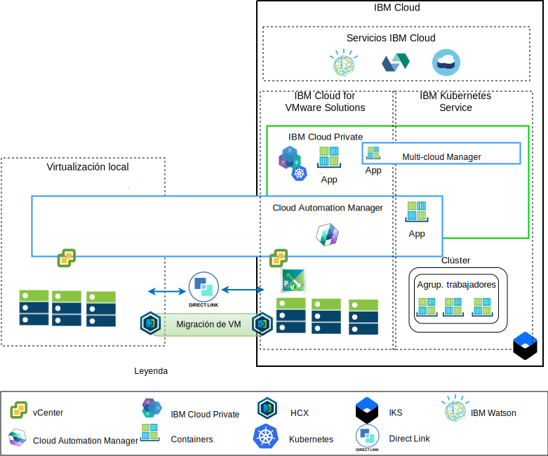
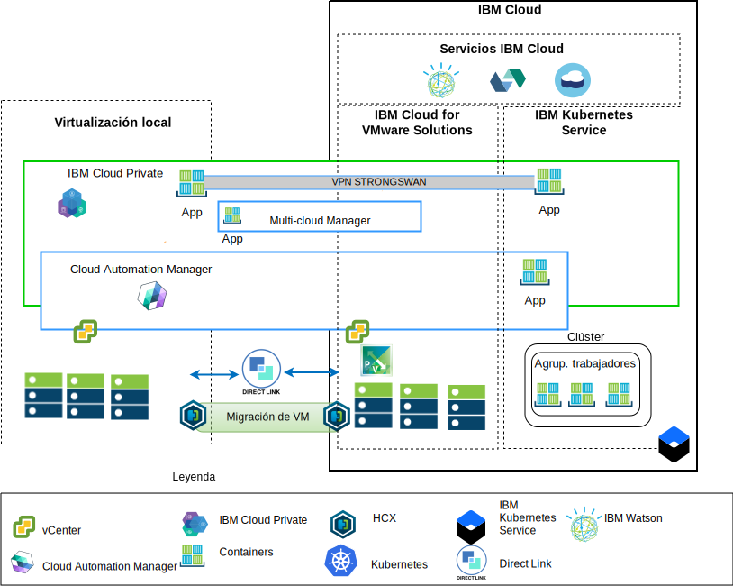

---

copyright:

  years:  2016, 2018

lastupdated: "2018-10-30"

---

# Visión general de la arquitectura

Las ofertas de IBM Cloud for VMware proporcionan automatización para desplegar componentes de tecnología VMware en los centros de datos de IBM Cloud en todo el mundo.
La arquitectura consta de una sola región de nube y permite la ampliación a más regiones de nube ubicadas en otra geografía y/o en otro pod de IBM Cloud dentro del mismo centro de datos.

Los productos IBM Cloud Private (ICP) y Cloud Automation Manager (CAM) se pueden desplegar manualmente en la plataforma de virtualización local, lo que permite gestionar la nube desde ubicaciones locales. Como alternativa, ICP y CAM se ofrecen como extensiones de servicio de un despliegue de VMware vCenter Server on IBM Cloud (VCS) existente o nuevo, mediante automatización, lo que permite gestionar la nube desde IBM Cloud.

ICP es una plataforma de aplicaciones para desarrollar y gestionar aplicaciones de contenedor locales. Es un entorno integrado para gestionar contenedores que incluye el orquestador de contenedores Kubernetes,
un repositorio de imágenes privadas, una consola de gestión e infraestructuras de supervisión.

IBM Multi-Cluster Cloud Manager MCM proporciona visibilidad de usuario, gestión centrada en aplicaciones (política, despliegues, estado, operaciones) y conformidad basada en políticas entre nubes y clústeres. Con MCM, tiene el control sobre los clústeres de Kubernetes. Se asegura de que sus clústeres sean seguros, que funcionen de forma eficiente y que distribuyan una plataforma de gestión de servicios que se ejecute en el ICP que permita a los desarrolladores y a los administradores satisfacer las necesidades empresariales.
Cloud Automation Manager Service Composer le permite exponer los servicios de nube híbrida en el catálogo de ICP.

## Plataforma de gestión de nube desde IBM Cloud

Figura 1. Gestión de nube desde la nube

El diagrama anterior representa ICP y CAM desplegados con la infraestructura de IBM Cloud, con conexiones con el servicio vCenter e IBM Kubernetes Service (IKS) locales desplegados en IBM Cloud. Los usuarios pueden desplegar máquinas virtuales locales y máquinas virtuales en la instancia y contenedores de VCS en el clúster ICP e IKS.

En el diagrama, CAM crea de forma lógica conexiones en la nube con los entornos de vCenters, proveedores de nube, ICP e IKS. Los clústeres de ICP deben desplegarse en cada entorno de centro de datos/nube, y MCM proporciona el mecanismo para conectar los clústeres de ICP en una única vista de gestión.

ICP se puede desplegar con los componentes NSX-V o NSX-T. ICP con NSX-V permite ejecutar máquinas virtuales ICP en la red VXLAN y utilizar el sistema de red interno de Calico de Kubernetes.

ICP con NSX-T permite a los usuarios controlar y configurar el sistema de red, de subred y las políticas desde la interfaz de usuario central (NSX-T Manager). Consulte la [guía de redes de vCenter Server](../vcsnsxt/vcsnsxt-intro.html) para ver las diferencias entre NSX-V y NSX-T.

## Plataforma de gestión de nube local

Figura 2. Gestión de nube desde el entorno local

El diagrama anterior representa ICP y CAM desplegados en la infraestructura local, con conexiones a vCenter e IKS desplegadas en IBM Cloud. Los usuarios pueden desplegar máquinas virtuales y contenedores locales, máquinas virtuales de la instancia de vCenter Server y contenedores en el clúster IKS.

Se utiliza strongSwan VPN para establecer la conectividad con los contenedores IKS desplegados, aunque se puede sustituir por la conectividad Direct Link.

En el diagrama, CAM crea de forma lógica conexiones en la nube con los entornos de vCenters, proveedores de nube, ICP e IKS. Los clústeres de ICP deben desplegarse en cada entorno de centro de datos/nube, y MCM proporciona el mecanismo para conectar los clústeres de ICP en una única vista de gestión.

### Enlaces relacionados

* [Visión general de VCS con el paquete híbrido (Hybridity)](../vcs/vcs-hybridity-intro.html)
