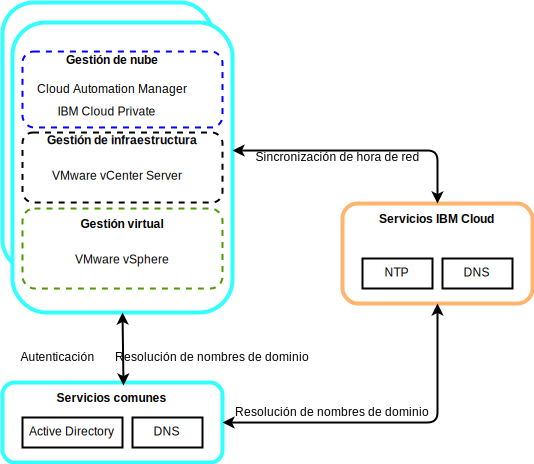
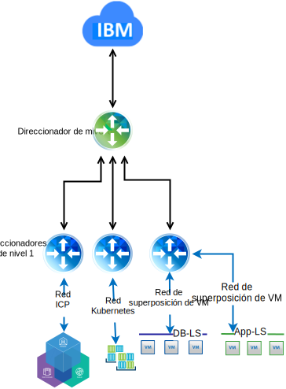

---

copyright:

  years:  2016, 2019

lastupdated: "2019-02-15"

subcollection: vmwaresolutions

---

# Diseño detallado
{: #vcsicp-detail-design}

## Componentes de los servicios comunes
{: #vcsicp-detail-design-common-services}

Los servicios comunes proporcionan los servicios que utilizan otros servicios en la plataforma de gestión de nube. Los servicios comunes incluyen servicios de identidad y acceso, servicios de nombres de dominio, servicios NTP.

Figura 1. Servicios comunes de {{site.data.keyword.icpfull_notm}}

### Servicios de identidad y acceso
{: #vcsicp-detail-design-identity}

Como parte de VMware vCenter Server en la automatización de {{site.data.keyword.cloud}}, se utiliza un Microsoft Active Directory (AD) para la gestión de identidades. Se despliega una sola instancia de servidor virtual (VSI) AD. El vCenter se configura de modo que utilice la autenticación de AD y puede configurar {{site.data.keyword.icpfull_notm}} para la autenticación de LDAP.

###	Servicios de nombres de dominio
{: #vcsicp-detail-design-dns}

El despliegue de vCenter Server utiliza los AD VSI como servidores DNS para la instancia. Todos los componentes desplegados, como vCenter, PSC, NSX y hosts de ESXi, se configuran de modo que apunten a AD como su DNS predeterminado.

###	Servicios NTP
{: #vcsicp-detail-design-ntp}

El despliegue de vCenter Server utiliza los servidores NTP de la infraestructura de {{site.data.keyword.cloud_notm}}. Todos los componentes desplegados se configuran para utilizar estos servidores NTP. El hecho de que todos los componentes del diseño utilicen los mismos servidores NTP resulta crítico para que los certificados y la autenticación de AD funcionen correctamente.

## Redes
{: #vcsicp-detail-design-networking}

### Redes NSX-V
{: #vcsicp-detail-design-nsx-v}

NSX-V se ha diseñado de modo que una sola plataforma de gestor NSX-V esté enlazada a una sola instancia de servidor de vCenter. Proporciona servicios de red a las aplicaciones que se ejecutan dentro de un entorno de vSphere.

Mediante el sistema de red NSX-V que se incluye en el despliegue de VCS, podemos desplegar {{site.data.keyword.icpfull_notm}} en una red de superposición VXLAN.

{{site.data.keyword.icpfull_notm}} se despliega con la pila de red Calico predeterminada para Kubernetes, que proporciona aislamiento de red dentro del clúster.

Figura 2. {{site.data.keyword.icpfull_notm}} con red NSX-V

Para obtener más información, consulte [Guía de redes de vCenter Server](/docs/services/vmwaresolutions/archiref/vcsnsxt?topic=vmware-solutions-vcsnsxt-intro).

### Redes NSX-T
{: #vcsicp-detail-design-nst-t}

NSX-T se ha diseñado de modo que una sola plataforma de red se pueda conectar a cualquier tipo de aplicación, ya sea máquina virtual o basada en contenedor, que se ejecute dentro o fuera de un entorno de vSphere.

{{site.data.keyword.icpfull_notm}} proporciona una opción para sustituir la red Calico por una instancia NSX-T, proporcionando una única ubicación para gestionar la red y la seguridad.

Figura 3. {{site.data.keyword.icpfull_notm}} con red NSX-T

## Enlaces relacionados
{: #vcsicp-detail-design-related}

* [Visión general de vCenter Server on {{site.data.keyword.cloud_notm}} con el paquete híbrido (Hybridity)](/docs/services/vmwaresolutions/archiref/vcs?topic=vmware-solutions-vcs-hybridity-intro)
