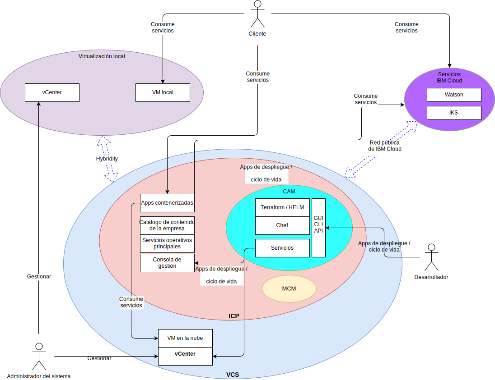

---

copyright:

  years:  2016, 2018

lastupdated: "2018-10-10"

---

# Contexto del sistema

Figura 1. Diagrama del contexto del sistema

Los cuatro componentes principales son los siguientes:

- **Virtualización local**: este componente es un entorno de VMware alojado en las instalaciones del cliente o en una ubicación de terceros y actualmente aloja las VM que ejecutan las aplicaciones que se van a modernizar. Es el entorno de origen para las migraciones de VM y se acopla ligeramente a una instancia de IBM Cloud a través de VMware Hybridity (HCX).
- **vCenter Server**: VMware vCenter Server on IBM Cloud (VCS) es una instancia de IBM Cloud for VMware Services destinada a las VM migradas desde el entorno local. Junto con el entorno virtualizado local, forma un entorno híbrido que permite que las VM se muevan de un sitio al otro.
- **Servicio Kubernetes de IBM Cloud**: IKS aprovecha Kubernetes como solución de orquestación de contenedores. IBM funciona y gestiona el nodo maestro Kubernetes, mientras que los nodos trabajadores se despliegan en la infraestructura gestionada por el cliente. IBM proporciona herramientas de gestión para el despliegue de parches del sistema operativo, las actualizaciones del motor Docker y las nuevas versiones de Kubernetes. IKS proporciona una plataforma aislada y segura para gestionar contenedores que es portátil, extensible y con capacidad de reparación automática en caso de migración tras error.
- **IBM Cloud Private**: ICP es una plataforma de aplicaciones para desarrollar y gestionar aplicaciones contenerizadas. Se trata de un entorno integrado que incluye el orquestador de contenedores Kubernetes, un repositorio de imágenes privadas, una consola de gestión, infraestructuras de supervisión y una interfaz gráfica de usuario, que proporciona una ubicación centralizada desde la que puede desplegar, gestionar, supervisar y escalar aplicaciones.
- **IBM Cloud Automation Manager**: CAM es una plataforma de infraestructura como código (IaC) preparada para la empresa que ofrece un único panel para suministrar cargas de trabajo basadas en VMware junto con cargas de trabajo basadas en Kubernetes. La automatización del suministro de cargas de trabajo, tanto si son máquinas virtuales como contenedores, y los requisitos previos de su infraestructura se habilitan a través de CAM.
- **IBM Multi Cloud Manager**: MCM proporciona visibilidad de usuario, gestión centrada en aplicaciones (política, despliegues, estado, operaciones) y conformidad basada en políticas entre nubes y clústeres. Con MCM, tiene el control sobre los clústeres de Kubernetes.
- **IBM Cloud Services**: IBM Cloud Services es una amplia gama de servicios consumibles disponibles, que incluyen ofertas de analíticas, IA e IoT.

## Actores

Tabla 1. Actores

Actor  | Descripción
--|--
Administrador del sistema | Recurso especializado en VMware vSphere que utiliza vCenter Server para gestionar la virtualización local y la instancia de VCS.
Desarrollador | Recurso especializado en contenedores que utiliza la consola de CAM para crear y gestionar contenedores. Crean los nuevos servicios como parte de la modernización de la aplicación. Mediante CAM, el desarrollador ofrece cargas de trabajo en VCS, ICP o IKS, compone y orquesta los servicios que se crean con máquinas virtuales y contenedores e integra las cadenas de herramientas DevOps y las soluciones ITSM de fase 2.
Cliente | Actor externo que consume los servicios de la empresa. Para Acme Skateboards, el cliente es un skater que quiere comprar productos de skateboard. El cliente requiere acceso seguro a internet para acceder al catálogo.
IBM IKS | Recurso de IBM que gestiona el nodo maestro IKS para el servicio.

## Sistemas

Tabla 2. Sistemas

Actor  | Descripción
--|--
vCenter Server | Interfaz principal que utiliza el administrador del sistema para gestionar tanto las VM locales como las VM de IBM Cloud en la instancia de VCS.
VM locales| Servidores virtualizados que alojan las aplicaciones que se van a migrar a IBM Cloud. Inicialmente se migran como máquinas virtuales y se refactorizan desde VM a contenedores para la modernización de aplicaciones.
VM de IBM Cloud |  Servidores virtualizados que alojan las aplicaciones migradas desde el centro de datos local. En el caso de esta arquitectura de referencia y de Acme Skateboards, una de las VM de IBM Cloud es un servidor de bases de datos, que forma parte de la carga de trabajo con presencia en línea.
Catálogo del contenido de la empresa | Ubicación centralizada desde la que se puede examinar e instalar paquetes en el clúster. El catálogo contiene los paquetes de IBM que se utilizan para crear contenedores, así como para acceder a los diagramas de Helm. Helm es una herramienta para la gestión de diagramas de Kubernetes. Los diagramas son paquetes de recursos de Kubernetes preconfigurados que facilitan la generación de versiones, el empaquetado, el release, el despliegue, la supresión, la actualización e incluso la retrotracción de despliegues de contenedores. Helm es el sistema de gestión de paquetes nativo de Kubernetes y se utiliza para la gestión de aplicaciones dentro de un clúster ICP.
Servicios operativos principales |  ICP incluye una serie de herramientas para recopilar, almacenar y consultar registros y métricas. Estas herramientas proporcionan un almacén centralizado para todos los registros y métricas y ayudan a mejorar el rendimiento y a aumentar la estabilidad cuando se accede y se consultan los registros y las métricas.
Consola de gestión |  La consola de gestión de ICP le permite gestionar, supervisar y resolver problemas de las aplicaciones y del clúster desde una consola de gestión única, centralizada y segura.
Terraform |  Maneja el suministro de recursos de nube y de infraestructura utilizando proveedores como VMware vSphere, IBM Cloud, Microsoft Azure, Amazon Web Services, Google Cloud Platform y OpenStack.
HELM |  Gestor de paquetes para Kubernetes. Los diagramas de Helm se utilizan para definir los recursos de Kubernetes y desplegar aplicaciones.
Chef |  Responsable de la gestión de la configuración y la automatización de conformidad. Chef despliega y configura el middleware y las aplicaciones después de que Terraform haya completado el suministro inicial.
Servicios |  Representa el componente Service Composer, que es donde los administradores crean, componen y diseñan servicios creados a partir de recursos de Kubernetes y una o varias máquinas virtuales.
Aplicaciones contenerizadas |  Aplicaciones que han completado el proceso de modernización de aplicaciones y que ahora se ejecutan como contenedores. En el caso de esta arquitectura de referencia y de Acme Skateboards, una de las aplicaciones contenerizadas es un servidor web, que forma parte de la carga de trabajo con presencia en línea.
Watson |  En el caso de esta arquitectura de referencia y de Acme Skateboards, Watson representa el servicio de IA que se utiliza en la arquitectura "Concept Car".

La migración de aplicaciones, la red y la seguridad suelen ser son los puntos que presentan mayor dificultad en el proceso de modernización de aplicaciones. VMware vCenter Server on IBM Cloud, VMware Hybridity, VMware NSX, IBM Cloud Private e IBM Cloud Kubernetes Service abordan estos retos y le permiten crear aplicaciones moderas resistentes, seguras y potentes.

### Enlaces relacionados

* [VMware vCenter Server on IBM Cloud con el paquete híbrido (Hybridity)](../vcs/vcs-hybridity-intro.html)
