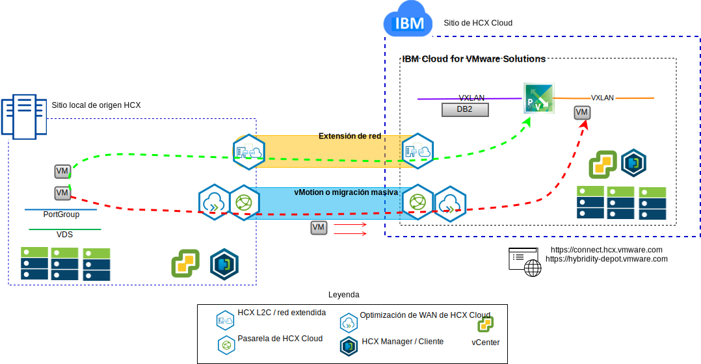
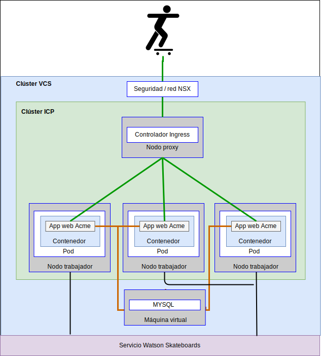

---

copyright:

  years:  2016, 2018

lastupdated: "2018-10-10"

---

# Casos prácticos

## Migración de cargas de trabajo a IBM Cloud
Acme Skateboards desea extender su VMware SDDC local a una instancia de VCS en IBM Cloud. Necesitan mantener su negocio activo y en funcionamiento y reducir al mínimo el tiempo de inactividad. Volver a configurar sus aplicaciones para que se ejecuten en la nube no es la solución óptima.

El servicio VMware Hybridity on IBM Cloud permite crear conexiones sin fisuras entre IBM Cloud y un centro de datos virtualizado de VMware local.

La oferta vCenter Server con el paquete híbrido (Hybridity) de IBM Cloud permite establecer conexiones seguras entre el sitio de origen local y el sitio de destino de IBM Cloud.

Figura 1. Servicios de VMware Hybridity

Esto crea una interconectividad ligeramente acoplada entre un entorno local e IBM Cloud y ofrece prestaciones como las siguientes:
- **Interconectividad sencilla**: se establecen fácilmente conexiones lógicas de red sobre cualquier conexión física, como por ejemplo internet pública, VPN privada o IBM Cloud Direct Link.
- **Extensión de capa 2**: las redes locales se amplían a la nube, incluidas subredes locales y direccionamiento IP.
- **Cifrado**: el tráfico de red se cifra de forma segura entre los sitios iguales (peer).
- **Optimización de red**: selecciona la mejor conexión y gestiona la conexión de forma eficiente de modo que el tráfico se transmite de la forma más rápida posible.
- **Desduplicación de datos**: se puede conseguir una reducción del 50% en el tráfico de red.
- **Direccionamiento inteligente**: cuando se mueve una carga de trabajo, el direccionamiento de proximidad puede cambiar la vía de acceso de red (es decir, la pasarela) para que el tráfico de la red utilice la pasarela del sitio de destino y no lo "devuelva" (hairpin) al sitio de origen.
- **Migración con tiempo de inactividad cero**: una máquina virtual en ejecución se puede mover a la nube (o recuperar de la misma) mediante vMotion.
- **Migración planificada**: se puede replicar el número deseado de máquinas virtuales en el sitio de destino y luego se pueden activar en dicho sitio en el momento planificado para que sustituyan a los sistemas que se ejecutan en el sitio de origen.
- **Migración de políticas de seguridad**: si NSX se utiliza en local, las políticas de seguridad, los cortafuegos, etc., se trasladan junto con la carga de trabajo.

Con esta solución, Acme Skateboards ha migrado correctamente sus cargas de trabajo locales de VMware a IBM Cloud, cumpliendo con los requisitos de tiempo de inactividad bajo y sin tener que volver a configurar las aplicaciones.

## Despliegue de una arquitectura híbrida

Acme Skateboards desea desplegar una arquitectura híbrida en IBM Cloud, consistente en VCS e ICP, para su proceso de modernización de aplicaciones. Los requisitos son ejecutar sus bases de datos en máquinas virtuales y las aplicaciones y los servicios web en contenedores y utilizar un conjunto común de herramientas para la gestión de red y de la seguridad.

Figura 2. Aplicación híbrida de Acme Skateboards

Las soluciones de IBM Cloud for VMware proporcionan automatización para desplegar componentes de tecnología VMware en los centros de datos de IBM Cloud en todo el mundo. La arquitectura consta de una sola región de nube y permite la ampliación a más regiones de nube ubicadas en otra geografía y/o en otro pod de IBM Cloud dentro del mismo centro de datos.

Los productos IBM Cloud Private (ICP) y Cloud Automation Manager (CAM) se despliegan manualmente en la plataforma de virtualización local, lo que permite gestionar la nube desde la ubicación local. Como alternativa, ICP y CAM se ofrecen como extensiones de servicio de un despliegue de VCS nuevo o existente, mediante automatización, lo que permite gestionar la nube desde IBM Cloud.

El diagrama siguiente representa el ICP que se ejecuta sobre una instancia de VCS. NSX-V está configurado con una conmutación/VXLAN dedicada, un DLR y un ESG específicamente diseñado para la red de superposición de ICP, y el direccionamiento se configura a través del ESG para acceder a la red subyacente.

Mediante la automatización de IBM Cloud, Acme Skateboards puede ofrecer una solución híbrida que incluye VMware on IBM Cloud para ejecutar sus VM de base de datos e ICP on VMware en IBM Cloud para ejecutar sus apps y servicios web de cara al cliente en contenedores. NSX les ofrece un conjunto común de herramientas de gestión para red y seguridad en la red subyacente.

Figura 3. VCS con ICP

### Enlaces relacionados

* [VMware vCenter Server on IBM Cloud con el paquete híbrido (Hybridity)](../vcs/vcs-hybridity-intro.html)
