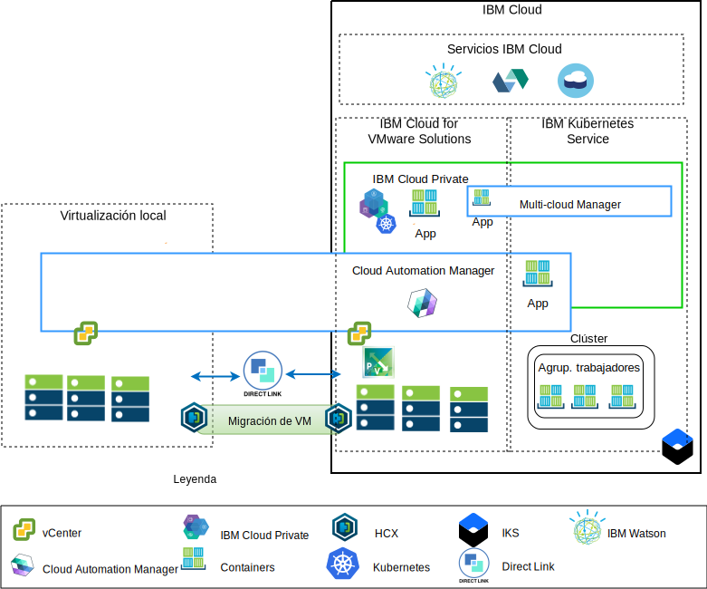

---

copyright:

  years:  2016, 2018

lastupdated: "2018-11-16"

---

# Visión general de la modernización de aplicaciones

En el diagrama siguiente se muestra la arquitectura de referencia de la modernización de aplicaciones que se desplegará en Acme Skateboards y que se describe en profundidad en esta serie de documentos.

Figura 1. Diagrama de visión general de la arquitectura

Esta arquitectura híbrida permite a Acme Skateboards:
- Migrar máquinas virtuales (VM) VMware desde el entorno local a {{site.data.keyword.cloud}} con muy poco o ningún tiempo de inactividad y sin tener que reconfigurar las aplicaciones.
- Iniciar el proceso de modernización de aplicaciones, permitiéndoles centrarse en contenerizar las interfaces web más simples y el middleware al tiempo que permite que bases de datos más complejas permanezcan como máquinas virtuales.
- Utilizar Cloud Automation Manager (CAM) para disponer de una infraestructura como código (IaC) para componer y coordinar servicios en los que intervienen tanto de máquinas virtuales como contenedores para integrarlos en sus cadenas de herramientas de DevOps y en su solución ITSM.

La arquitectura de referencia comprende los siguientes componentes principales:
- **Virtualización local**: la virtualización local es un clúster VMware que actualmente aloja las VM de Acme Skateboards. Estas máquinas virtuales alojan actualmente las aplicaciones que se van a modernizar. Este clúster debe cumplir con los requisitos previos de la arquitectura de la [solución VMware HCX on {{site.data.keyword.cloud_notm}}](https://www.ibm.com/cloud/garage/files/HCX_Architecture_Design.pdf) para poder ejecutar HCX.

HCX amplía las redes locales a {{site.data.keyword.cloud_notm}}, permitiendo a los clientes migrar las VM a la instancia de VMware vCenter Server on {{site.data.keyword.cloud_notm}} que se ejecuta en {{site.data.keyword.cloud_notm}} y viceversa si es necesario.
- **{{site.data.keyword.cloud_notm}} for VMware Solutions**: la instancia de vCenter Server proporciona los componentes fundamentales de VMware, como vSphere, vCenter Server, NSX-V y opciones de almacenamiento que incluyen vSAN o almacenamiento {{site.data.keyword.cloud_notm}} Endurance, necesarios para desplegar automáticamente una solución VMware Software Defined Data Center (SDDC). El clúster VMware es el destino de las máquinas virtuales migradas y de algunas de las aplicaciones modernizadas en los contenedores alojados en ICP. Los componentes principales de vCenter Server son los siguientes:
  - **NSX-V**: NSX-V ofrece la capa de virtualización de red en vCenter Server que proporciona una superposición de red para las VM de Acme Skateboards. NSX-V habilita BYOIP y aísla las redes de carga de trabajo de las redes de {{site.data.keyword.cloud_notm}}. NSX-V está programado por HCX para crear las redes que Acme Skateboards extiende desde el entorno local.
  - **NSX-T**: NSX-T proporciona un conjunto común de herramientas para la gestión de la red y de la seguridad tanto de contenedores como de máquinas virtuales. NSX-T es totalmente compatible con la interfaz de red de contenedor (CNI) de Kubernetes y se integra con la CNI para proporcionar redes de contenedores. NSX-T proporciona la red de superposición que utilizan las aplicaciones modernizadas y sustituye a Calico, que utilizan de forma nativa ICP e IKS.

- **{{site.data.keyword.cloud_notm}} Private**: ICP es una plataforma de aplicaciones para desarrollar y gestionar aplicaciones contenerizadas. ICP es un entorno integrado que incluye el coordinador de contenedores Kubernetes, un repositorio de imágenes privadas, una consola de gestión, infraestructuras de supervisión y una interfaz gráfica de usuario, que proporciona una ubicación centralizada desde la que Acme Skateboards puede desplegar, gestionar, supervisar y escalar aplicaciones. La instancia de vCenter Server aloja los componentes de ICP, los nodos maestros, los nodos trabajadores, etc., que ejecutan como máquinas virtuales. ICP contiene:
- **{{site.data.keyword.cloud_notm}} Automation Manager**: CAM es una plataforma de código como infraestructura (IaC) preparada para la empresa que proporciona un único panel para suministrar cargas de trabajo de VM, locales o en vCenter Server, junto con cargas de trabajo Kubernetes, en ICP o IKS, utilizando plantillas. CAM es una aplicación Docker que se ejecuta sobre ICP y que está estrechamente integrada para la autorización, el control de acceso basado en roles (RBAC) y otras funciones.
    - Las aplicaciones contenerizadas de Acme Skateboards que desean desplegar en este entorno.

- **Servicio IBM Kubernetes**: IKS permite a Acme Skateboards desplegar sus aplicaciones modernizadas en contenedores Docker que se ejecutan en clústeres de Kubernetes. IBM gestiona por completo los nodos maestros, mientras que los nodos trabajadores de la agrupación de nodos trabajadores se despliegan en la misma cuenta de {{site.data.keyword.cloud_notm}} que su instancia de vCenter Server. Los nodos trabajadores pueden ser: nativos, públicos o instancias de servidor virtual dedicado. Calico se instala y se configura automáticamente en IKS. Calico proporciona conectividad de red segura para contenedores y se configura en IKS para utilizar la encapsulación IP en IP para los paquetes que viajan a través de subredes y para utilizar NAT para las conexiones salientes de los contenedores.

- **Direct Link**: {{site.data.keyword.cloud_notm}} Direct Link utiliza el proveedor de WAN de Acme Skateboard para conectar su centro de datos a {{site.data.keyword.cloud_notm}} para ofrecer una conexión de red fiable, segura y de baja latencia. Esta conexión proporciona:
  - Acceso a las aplicaciones alojadas en la nube desde los usuarios de la empresa.
  - Tráfico de VM interno entre las máquinas virtuales locales y las de la nube.
  - Tráfico entre sistemas antiguos del centro de datos local y las VM en la nube.

## Principales ventajas para Acme Skateboards

vCenter Server proporciona los componentes fundamentales que incluyen VMware vSphere, vCenter Server, NSX y opciones de almacenamiento compartido que incluyen vSAN, necesarios para diseñar de forma flexible la VMware Software Defined Data Center (SDDC) que mejor se ajuste a las cargas de trabajo del cliente.

En resumen, las ofertas de {{site.data.keyword.cloud_notm}} for VMware:
* Aceleran la entrega de proyectos de TI a desarrolladores y líneas de negocio, reduciendo el tiempo necesario para la adquisición, la arquitectura, la implementación y el despliegue de recursos de semanas o meses a horas.
* Mejoran la seguridad con servidores nativos dedicados en una nube privada alojada, incluido el despliegue de puntos finales privados en servicios de {{site.data.keyword.cloud_notm}}, como IKS y KMIP.
* Permiten llevar a cabo una gestión y gobierno coherentes de la nube híbrida desplegada, proporcionando acceso administrativo completo a la gestión de virtualización. La gestión aprovecha las herramientas de VMware existentes, los scripts y las inversiones en formación.
* Utilizan la experiencia de VMware a escala global con IBM Professional y Servicios gestionados que abarcan más de 30 {{site.data.keyword.CloudDataCents_notm}} en todo el mundo.

{{site.data.keyword.cloud_notm}} Kubernetes Service (IKS) es una oferta gestionada de Kubernetes que ofrece potentes herramientas de gestión, una experiencia de usuario intuitiva y seguridad y aislamiento integrados para permitir la entrega rápida de aplicaciones durante todo el tiempo que utiliza los servicios de nube, incluidas las prestaciones cognitivas de Watson. IBM es miembro de Cloud Native Computing Foundation (CNCF) Platinum y nuestra oferta cumple con el programa de pruebas de conformidad de Kubernetes de CNCF.

IKS proporciona funciones nativas de Kubernetes, como por ejemplo:

-   La planificación inteligente maximiza el uso de los recursos del clúster subyacentes, al desplegar las apps de modo que se garantiza la coubicación de los pods que utilizan mucha CPU y RAM.
-   Reparación automática para aplicaciones contenerizadas y microservicios, lo que garantiza que estos componentes se vuelven a desplegar automáticamente si algo va mal.
-   Escalado horizontal para permitirle configurar una política de despliegue, que el coordinador utiliza para garantizar que las cargas de trabajo tengan la capacidad necesaria.
-   El descubrimiento de servicios y el equilibrio de carga proporcionan un DNS ligero dentro del clúster de Kubernetes que permite a los servicios registrarse y eliminar la necesidad de codificación estática de los microservicios. El equilibrio de carga distribuye las solicitudes entrantes entre las instancias que se ejecutan en la arquitectura.
-   Los despliegues automatizados y las retrotracciones dan soporte a los equipos que despliegan nuevas características y arreglos de forma controlada. Si algo no funciona, se puede retrotraer automáticamente a la versión correcta anterior conocida de la imagen.
-   Gestión de secretos y de configuración. Los secretos constituyen un objeto dentro de Kubernetes que almacena datos confidenciales como, por ejemplo, una contraseña, una señal o una clave. Estos secretos están cifrados de forma predeterminada y garantizan el control del acceso a estos datos confidenciales.

Los clientes que realicen la transición hacia plataformas de aplicaciones nativas en la nube, como ICP e IKS, se centran en la velocidad y en la innovación y no siempre tienen en mente la seguridad y la red. El hecho de esperar a que los equipos de red o de seguridad suministren servicios como equilibradores de carga, cortafuegos, conmutadores y direccionadores degrada el tiempo de respuesta de las aplicaciones. Esta arquitectura de referencia muestra cómo vCenter Server, ICP e IKS guían a Acme Skateboards en su proceso de modernización de aplicaciones.

### Enlaces relacionados

* [Visión general de vCenter Server on {{site.data.keyword.cloud_notm}} con el paquete híbrido (Hybridity)](../vcs/vcs-hybridity-intro.html)
