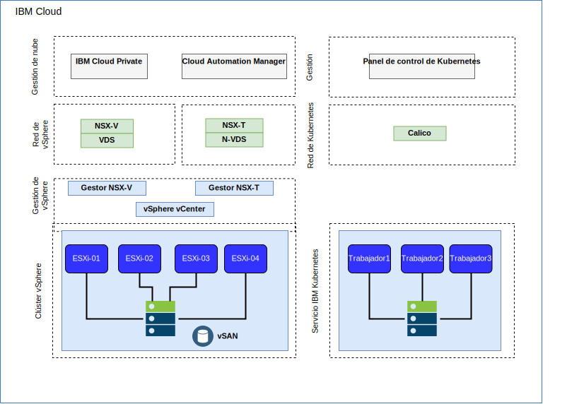
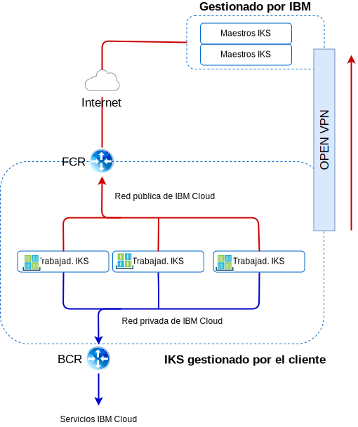

---

copyright:

  years:  2016, 2018

lastupdated: "2018-11-16"

---

# Redes e infraestructura de IBM Cloud

## Direccionamiento y reenvío virtual (VRF)
Las cuentas de {{site.data.keyword.cloud}} también se pueden configurar como cuentas de VRF. Las cuentas VRF proporcionan funciones similares a la expansión de VLAN, que permite el direccionamiento automático entre bloques IP de subred. Todas las cuentas con las conexiones de Direct-Link deben convertirse a, o crearse como, una cuenta de VRF.

## Direct Link
{{site.data.keyword.cloud_notm}} Direct Link Connect ofrece acceso privado a su infraestructura de {{site.data.keyword.cloud_notm}} y a cualquier otra nube enlazada a su proveedor de servicios de red, a través de su {{site.data.keyword.CloudDataCent_notm}}. Esta opción es perfecta para crear conectividad multinube en un entorno único.
Conectamos a los clientes con la red {{site.data.keyword.cloud_notm}} Private, utilizando una topología de ancho de banda compartida. Al igual que sucede con todos los productos de Direct-Link, puede añadir direccionamiento global, que permite el tráfico de red privada a todas las ubicaciones de {{site.data.keyword.cloud_notm}}.

## Redes privadas virtuales

### strongSwan VPN
El servicio strongSwan IPSec VPN ofrece un canal de comunicación seguro de extremo a extremo sobre internet que se basa en la suite de protocolos Internet Protocol Security (IPSec) estándar del sector.

### Hybridity (HCX)
VMware vCenter Server on {{site.data.keyword.cloud_notm}} con el paquete híbrido (Hybridity) permite ampliar fácilmente las redes de centros de datos locales en {{site.data.keyword.cloud_notm}}, lo que permite migrar las máquinas virtuales (VM) de {{site.data.keyword.cloud_notm}} y al mismo sin realizar ninguna conversión ni cambio.

## Estructura física

La infraestructura física necesaria para desplegar un clúster de vCenter Server requiere la siguiente especificación mínima.

Tabla 1. Especificaciones de vCenter Server

  | Despliegue de NFS | Despliegue de VSAN
---|---|---
Número de servidores | 3 | 4
CPU | 28 núcleos 2,2 GHZ | 28 núcleos 2,2 GHZ
Memoria | 384 GB | 384 GB
Almacenamiento|Gestión: 2 TB 2 IOPS, Carga trabajo: 2 TB 4 IOPS|SSD mín: 960 GB(x2)   

Las opciones de despliegue de IKS varían en función de los requisitos del nodo trabajador.

Tabla 2. Especificaciones de IKS

  | máquina virtual | Nativa
--|---|--
Número de servidores | 3 | 3
CPU | 2 – 56 núcleos | 4 – 28 núcleos
Memoria | 4 GB - 242 GB | 32 GB - 512 GB
Almacenamiento | 100 GB |  SATA: 2 TB / SSD: 960 GB

## Estructura virtual

Figura 1. Estructura física de los despliegues IKS e ICP

Dentro de la instancia de vCenter Server, las VMS del cliente se despliegan en NSX Edge Services Gateways (ESG) y Distributed Logical Routers (DLR) dedicados.

El ESG se configura con una SNAT para permitir el tráfico de salida, permitiendo la conectividad a internet para descargar los requisitos previos de ICP y la conectividad con GitHub y Docker, o se puede utilizar un proxy web para proporcionar la conectividad a internet. El ESG se configura para acceder a los servicios DNS y NTP a través de la red privada. La integración con la instancia de IKS está disponible a través de la red de {{site.data.keyword.cloud_notm}} entre la instancia de vCenter Server e IKS.

## Componentes de vCenter Server

Figura 2. Componentes de la plataforma vCenter Server

### Controlador de servicios de la plataforma
El despliegue de vCenter Server utiliza un único controlador externo de servicios de la plataforma (PSC) instalado en una subred portátil en la VLAN privada asociada a las VM de gestión. Su pasarela predeterminada se establece en el direccionador del cliente de fondo (BCR).

### vCenter Server
Al igual que el PSC, vCenter Server se despliega como un dispositivo.
Además, el vCenter se instala en una subred portátil en la VLAN privada que está asociada con las VM de gestión. Su pasarela predeterminada se establece en BCR.

### NSX Manager
NSX Manager se despliega en el clúster inicial de vCenter Server. Además se asigna a NSX Manager una dirección IP desde el bloque de direcciones portátiles privadas, que está destinado a los componentes de gestión.

### Controladores NSX
La automatización de {{site.data.keyword.cloud_notm}} despliega tres controladores NSX dentro del clúster inicial. Se asigna a los controladores direcciones IP desde la subred portátil privada que está destinada para los componentes de gestión.

### NSX ESG / DLR
Se despliegan pares NSX Edge Services Gateway (ESG). En todos los casos, se utiliza un par de pasarela para el tráfico de salida de los componentes de automatización que residen en la red privada. Para vCenter Server e ICP, una segunda pasarela, conocida como el borde gestionado por el cliente, se despliega y se configura con un enlace ascendente a la red pública y una interfaz asignada a la red privada.
El administrador puede configurar los componentes NSX necesarios como, por ejemplo, el direccionador lógico distribuido (DLR), los conmutadores lógicos y los cortafuegos. Para obtener más información sobre los NSX Edges que se despliegan como parte de la solución, consulte la [Guía de red de vCenter Server](../vcsnsxt/vcsnsxt-intro.html).

En la tabla siguiente se resumen las especificaciones de ICP ESG/DLR.

Tabla 3. Especificaciones de ICP ESG

Atributo |  Especificación
--|--
Edge Service Gateway | Dispositivo virtual
Edge tamaño grande | Número de vCPU	2
Memoria	| 1 GB
Disco	| 1000 GB en almacén de datos local

Tabla 4. Especificaciones de ICP DLR

Atributo  |  Especificación
--|--|
Direccionador lógico distribuido |	Dispositivo virtual
Edge tamaño Compacto | Número de vCPU	1
Memoria	| 512 MB
Disco	| 1000 GB en almacén de datos local

## Componentes de IKS

Figura 3. Componentes de IKS

### Kubernetes maestro

El nodo maestro de Kubernetes se encarga de gestionar todos los recursos de cálculo, de red y de almacenamiento del clúster. El nodo maestro de Kubernetes garantiza que las apps y servicios contenerizados se despliegan de forma equitativa en los nodos de trabajador del clúster.

###	Nodo trabajador
Cada nodo trabajador es una máquina física (nativa) o una máquina virtual que se ejecuta en el hardware físico en el entorno de nube. Cuando suministra un nodo trabajador, determina los recursos que están disponibles para los contenedores que están alojados en dicho nodo trabajador. De forma automática, los nodos trabajadores se configuran con un motor de Docker gestionado por IBM, recursos de cálculo independientes, redes y un servicio de volúmenes. Las características integradas de seguridad ofrecen aislamiento, funciones de gestión de recursos y conformidad con la seguridad de los nodos trabajadores.

### Enlaces relacionados

* [Visión general de vCenter Server on {{site.data.keyword.cloud_notm}} con el paquete híbrido (Hybridity)](../vcs/vcs-hybridity-intro.html)
