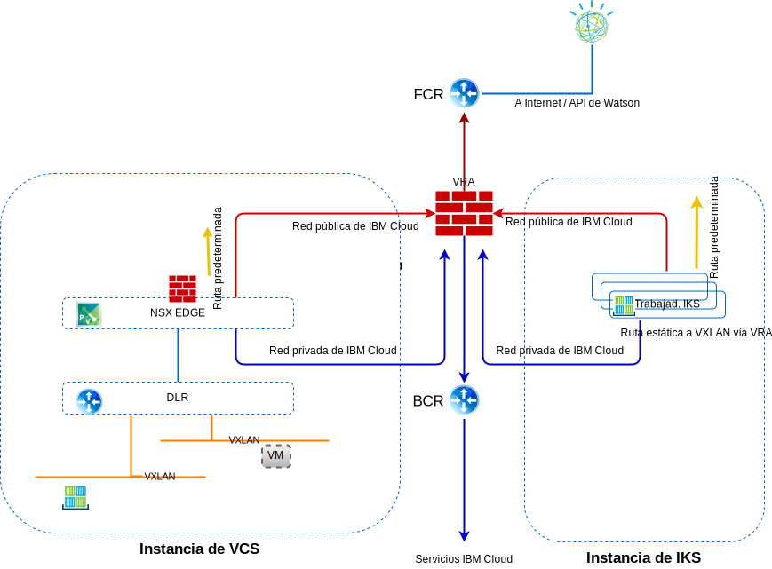

---

copyright:

  years:  2016, 2019

lastupdated: "2019-02-18"

---

# Redes, copia de seguridad, recuperación en caso de error y escalabilidad
{: #vcsiks-overview-network}

Revise la información sobre redes, copia de seguridad, recuperación tras desastre (DR) y consideraciones de escalabilidad.

## Redes
{: #vcsiks-overview-network-networking}

{{site.data.keyword.cloud}} tiene dos redes. La red pública permite acceder a los servidores desde internet y la red privada permite que los servidores se comuniquen entre sí a través de una red troncal de alta velocidad en todos los {{site.data.keyword.CloudDataCents_notm}}.

De forma predeterminada, {{site.data.keyword.containerlong_notm}} configura el clúster con acceso a una VLAN pública y a una VLAN privada.
- Una dirección IP pública para cada nodo trabajador, que proporciona a los nodos trabajadores una interfaz de red pública.
  - Se permite todo el tráfico de red de salida para todos los nodos trabajadores.
  - El tráfico de red de entrada se bloquea, excepto en algunos puertos. Estos puertos están abiertos para que IBM pueda supervisar el tráfico de la red e instalar automáticamente las actualizaciones de seguridad para el nodo maestro Kubernetes.
- Una dirección IP privada para cada nodo trabajador, que proporciona a los nodos trabajadores una interfaz de red privada
- Una conexión OpenVPN automática y segura entre todos los nodos trabajadores y el nodo maestro

Figura 1. Red de vCenter Server e {{site.data.keyword.containerlong_notm}}

### Integración de IBM Cloud Kubernetes Service y vCenter Server
{: #vcsiks-overview-network-iks-vcs-integration}

Actualmente, los siguientes escenarios integran {{site.data.keyword.containerlong_notm}} y VMware vCenter Server en la red de {{site.data.keyword.cloud_notm}}:
- **Direccionamiento de VRA**: este escenario requiere que los nodos trabajadores de {{site.data.keyword.containerlong_notm}} estén desplegados en la misma VLAN que la instancia de vCenter. Esto permite que un ESG se combine como igual de BGP con VRA y permita el direccionamiento entre la red de superposición y la subyacente entre vCenter Server e {{site.data.keyword.containerlong_notm}}. Se necesita una ruta estática en los nodos trabajadores de {{site.data.keyword.containerlong_notm}} para que cada red VXLAN direccione estas solicitudes de nuevo al BCR/VRA para que las direccione correctamente.
- **strongSwan VPN**: en este escenario se utiliza la solución estándar de conectividad entre {{site.data.keyword.containerlong_notm}} y la empresa. Un contenedor strongSwan proporciona una pasarela VPN para el clúster que reenvía paquetes a las redes remotas a través de un túnel de IPSec a la pasarela remota. Esta pasarela remota es un ESG en la instancia de vCenter Server. En las pasarelas, las rutas se configuran enviando todos los rangos de IP de clúster y de servicio al contenedor StrongSwan y todas las direcciones BYOIP de vCenter Server al ESG. Las direcciones IP de destino para las pasarelas son la dirección IP portátil privada del servicio de equilibrador de carga que está asignado al contenedor strongSwan y la dirección IP portátil privada del ESG.

#### VLAN de la red de IBM Cloud Kubernetes Service
{: #vcsiks-overview-network-iks-vlans}

La siguiente información se aplica a las redes VLAN públicas:
- La subred pública primaria determina las direcciones IP públicas que se asignan a los nodos trabajadores durante la creación del clúster. Varios clústeres de la misma VLAN pueden compartir una subred pública primaria.
- La subred pública portátil está enlazada a un solo clúster y proporciona al clúster ocho direcciones IP públicas. Se reservan tres IP para las funciones de red. Una IP la utiliza el servicio ALB Ingress público predeterminado y cuatro IP se utilizan para crear servicios de red de equilibrador de carga públicos.
- Las IP públicas portátiles son direcciones IP permanentes y fijas que se utilizan para acceder a los servicios de equilibrio de carga en internet.

La siguiente información se aplica a las redes VLAN privadas:
- La subred privada primaria determina las direcciones IP privadas que se asignan a los nodos trabajadores durante la creación del clúster. Varios clústeres de la misma VLAN pueden compartir una subred privada primaria.
- La subred privada portátil está enlazada a un solo clúster y proporciona al clúster ocho direcciones IP privadas. Se reservan tres IP para las funciones de red. Una IP la utiliza el servicio ALB Ingress privado predeterminado y cuatro IP se utilizan para crear servicios de red de equilibrador de carga privados.
- Las IP privadas portátiles son direcciones IP permanentes y fijas que se utilizan para acceder a los servicios de equilibrio de carga en internet.

#### Plugin de red Calico
{: #vcsiks-overview-network-calico}

Cada clúster de Kubernetes se configura con un plugin de red llamado Calico.

Las políticas de red predeterminadas se configuran para proteger la interfaz de red pública de cada nodo trabajador en {{site.data.keyword.containerlong_notm}}. Si tiene requisitos de seguridad exclusivos o tiene un clúster multizona con la expansión de VLAN habilitada, puede utilizar Calico y Kubernetes para crear políticas de red para un clúster. Con las políticas de red de Kubernetes, puede especificar el tráfico de red que desea permitir o bloquear a y desde un pod dentro de un clúster. 

Para establecer políticas de red más avanzadas, como por ejemplo para bloquear el tráfico de entrada (ingress) a los servicios de LoadBalancer, utilice políticas de red de Calico.

Las políticas de red de Kubernetes especifican el modo en que los pods se pueden comunicar con otros pods y con puntos finales externos. El tráfico también se puede filtrar según etiquetas de pod y de espacio de nombres. Las políticas de red de Kubernetes se aplican mediante mandatos kubectl o mediante las API de Kubernetes. Cuando se aplican estas políticas, se convierten automáticamente en políticas de red de Calico y Calico impone estas políticas.

Las políticas de red de Calico para Kubernetes son un superconjunto de políticas de red de Kubernetes y se aplican mediante mandatos calicoctl.

Las políticas de Calico añaden las siguientes características:
- Permitir o bloquear el tráfico de red en determinadas interfaces de red, independientemente de la dirección IP de origen o de destino del pod de Kubernetes o de CIDR.
- Permitir o bloquear el tráfico de red para pods entre espacios de nombres.
- Bloquear el tráfico de entrada (ingress) a los servicios de Kubernetes LoadBalancer o NodePort.

Calico impone estas políticas, incluidas las políticas de red de Kubernetes que se convierten automáticamente en políticas de Calico, configurando reglas de iptables de Linux en los nodos trabajadores de Kubernetes. Las reglas iptables sirven como cortafuegos para el nodo trabajador para definir las características que debe cumplir el tráfico de red para que se reenvíe al recurso de destino.

### Flujos de tráfico
{: #vcsiks-overview-network-traffic-flows}

#### De usuario externo en internet a nivel web alojado en un contenedor en IBM Cloud Kubernetes Service
{: #vcsiks-overview-network-web-tier-iks}

1. El usuario externo realiza una solicitud al nivel web utilizando el URL.
2. Se utiliza DNS para determinar la dirección IP. Esta dirección IP es una dirección pública de {{site.data.keyword.cloud_notm}} en una subred portátil que se ha asignado al servicio ALB o Ingress.
3. La red pública reenvía automáticamente la solicitud al nodo trabajador que aloja el servicio ALB o Ingress.
4. El nodo trabajador reenvía la solicitud a la dirección IP del clúster interno y al número de puerto del servicio ALB o Ingress. Solo se puede acceder a esta dirección IP de clúster interno dentro del clúster.
5. Dentro del nodo trabajador, kube-proxy direcciona la solicitud al ALB o al servicio Ingress.
6. Si la aplicación está en el mismo nodo trabajador, se utilizan iptables para determinar qué interfaz interna se utiliza para reenviar la solicitud. Si la app está en otro nodo trabajador, Calico vRouter la dirige al nodo trabajador aplicable, utilizando la encapsulación de tipo IP en IP, solo si el nodo trabajador está en otra subred.

#### De nivel web alojado en un contenedor en IBM Cloud Kubernetes Services a nivel de base de datos alojado en una máquina virtual en vCenter Server
{: #vcsiks-overview-network-web-tier-vm}

Se crean recursos de punto final que detallan las máquinas virtuales (VM) de bases de datos externas que incluyen la dirección IP NAT y el número de puerto de las máquinas virtuales de base de datos mysql, por ejemplo.

- kind: Endpoints
- apiVersion: v1
- metadata:
  - name: mysqldb
- subsets:
  - addresses:
      - ip: 10.x.x.x
  - ports:
      - port: 3306

El recurso de punto final (Endpoint) puede tener varias direcciones listadas, y Kubernetes recorrerá estas direcciones.  

Se utilizan recursos de servicio para crear una IP y un nombre de DNS en kube-dns para los servicios:

- kind: Service
- apiVersion: v1
- metadata:
  - name: mysqldb
- labels:
  - name: mysqldb
- spec:
  - ports:
    - protocol: TCP
    - port: 3306

#### Flujo
{: #vcsiks-overview-network-flow}

1. El nivel web que se ejecuta en un contenedor en {{site.data.keyword.containerlong_notm}} realiza una solicitud a la base de datos que se ejecuta en una VM en la instancia de vCenter Server mediante una llamada a mysqldb. Kubernetes resuelve este nombre en una dirección IP y envía esta solicitud fuera del clúster con una dirección IP de destino de la IP NAT del servidor de bases de datos (10.x/26) y una IP de origen del nodo trabajador (10.x/26).
2. Como la dirección IP de destino no está en la misma subred que el nodo trabajador, se reenvía al BCR de {{site.data.keyword.cloud_notm}}.
3. El BCR direcciona la solicitud y coloca la solicitud en la VLAN **Privada A**, subred de cargas de trabajo del cliente, en la que está conectado customer-nsx-edge.

Este NSX Edge tiene:
- Regla de cortafuegos que permite esta conexión.
- Regla DNAT que cambia la dirección IP de destino de la dirección 10.x a la dirección 192.168 utilizada para el servidor de bases de datos.
4. El ESG la reenvía al DLR.
5. El DLR coloca la solicitud en el VXLAN necesario.
6. La VM de base de datos recibe la solicitud.

## Copia de seguridad y DR
{: #vcsiks-overview-network-backup-dr}

### Copia de seguridad de vCenter Server
{: #vcsiks-overview-network-vcs-backup}

Como parte de {{site.data.keyword.vmwaresolutions_short}}, el software de copia de seguridad de Veeam se puede desplegar de forma opcional en una instancia de servidor virtual de {{site.data.keyword.cloud_notm}} (VSI) que utiliza almacenamiento de resistencia (Endurance) de {{site.data.keyword.cloud_notm}} fuera del clúster VMware. El objetivo de este software es hacer copia de seguridad de los componentes de gestión de la solución.

### Copia de seguridad NSX
{: #vcsiks-overview-network-nsx-backup}

La copia de seguridad adecuada de todos los componentes de NSX es crucial para restaurar el sistema a su estado de trabajo si se produce una anomalía. Realizar una copia de seguridad de las máquinas virtuales NSX no es suficiente. Se debe utilizar la función de copia de seguridad NSX dentro del gestor de NSX para realizar copia de seguridad adecuada. Esta copia de seguridad requiere que se especifique un servidor FTP o SFTP para el repositorio de datos de copia de seguridad NSX. La copia de seguridad de NSX Manager contiene toda la configuración de NSX, incluidos controladores, entidades de conmutación y de direccionamiento lógicos, seguridad, reglas de cortafuegos y todo lo demás que configure dentro de la interfaz de usuario o API de NSX Manager. Se hace copia de seguridad por separado de la base de datos de vCenter y de los elementos relacionados, como los conmutadores virtuales. Se debe hacer una copia de seguridad de la configuración de NSX junto con una copia de seguridad de vCenter.

### Copia de seguridad y DR para el servicio IBM Cloud Kubernetes
{: #vcsiks-overview-network-backup-dr-iks}

Las copias de seguridad de la base de datos etcd se proporcionan al cliente como parte del servicio gestionado; el cliente es el responsable de realizar la copia de seguridad de los datos de las aplicaciones.

## Escalabilidad
{: #vcsiks-overview-network-scalability}

### Escalabilidad de vCenter Server
{: #vcsiks-overview-network-vcs-scalability}

Después del despliegue de los hosts iniciales, el usuario puede escalar la capacidad de cálculo desde dentro del portal de {{site.data.keyword.vmwaresolutions_short}}. Este proceso de escalada del entorno sigue uno de estos tres métodos:
- Adición de nuevos sitios gestionados por distintos vCenter Servers.
- Adición de nuevos clústeres.
- Adición de nuevos hosts a un clúster existente.

#### Despliegues de varios sitios
{: #vcsiks-overview-network-multi-site}

VMware on {{site.data.keyword.cloud_notm}} puede utilizar la presencia del centro de datos a nivel mundial de IBM Cloud y la red troncal integrada para permitir que varios casos de uso entre geografía se desplieguen y funcionen en una fracción del tiempo que se necesitaría para crear dicha infraestructura desde cero.

#### Escalada con nuevo clúster
{: #vcsiks-overview-network-scale-out-new-cluster}

El usuario también puede escalar la capacidad de cálculo creando un nuevo clúster desde dentro de la consola, solicitando los hosts, y los nuevos hosts se añaden automáticamente al nuevo clúster. Esta opción crea otro clúster en el entorno y proporciona a los usuarios la posibilidad de segregar de forma física y lógica la gestión de cargas de trabajo desde las cargas de trabajo de la aplicación, la posibilidad de segregar las cargas de trabajo en función de otras características (por ejemplo, clúster de base de datos de Microsoft SQL) y la posibilidad de desplegar aplicaciones en topologías de alta disponibilidad.

#### Escalada de un clúster existente
{: #vcsiks-overview-network-scale-out-existing-cluster}

El usuario puede escalar un clúster existente solicitando hosts desde dentro de la consola y los nuevos hosts se añaden automáticamente al clúster.
Es posible que los usuarios tengan que ajustar la política de reserva de HA para el clúster en función de sus requisitos de reserva.

### Expansión del servicio IBM Cloud Kubernetes
{: #vcsiks-overview-network-iks-expansion}

Los usuarios pueden suministrar un entorno {{site.data.keyword.containerlong_notm}} a través del portal de {{site.data.keyword.cloud_notm}} para ampliar o utilizar un entorno de contenedor. Los despliegues de aplicaciones en {{site.data.keyword.containerlong_notm}} se pueden realizar a través de:
  - La conexión y los servicios de {{site.data.keyword.containerlong_notm}} se desarrollan en CAM y se publican en el catálogo de {{site.data.keyword.icpfull_notm}}.
  - Futura mejora de Multi-Cloud Manager para gestionar instancias de {{site.data.keyword.containerlong_notm}}.
  - Interfaz de línea de mandatos de Helm.
  - Uso de clústeres multizona para aumentar la alta disponibilidad.

En [Planificación de la configuración del clúster y de los nodos trabajadores](/docs/containers?topic=containers-plan_clusters#plan_clusters) se explican las opciones y el proceso para diseñar una solución que se adapte a sus necesidades.

## Seguridad y conformidad
{: #vcsiks-overview-network-sec-compliance}

Cuando se trata de cumplir con directrices estrictas de la industria, {{site.data.keyword.cloud_notm}} se encarga del trabajo, consiguiendo una conformidad real. En [Conformidad con {{site.data.keyword.cloud_notm}}](https://www.ibm.com/cloud/compliance) encontrará detalles sobre certificados de conformidad específicos, normativas globales, ajustes e infraestructuras para seguridad y privacidad. [Seguridad para {{site.data.keyword.containerlong_notm}}](/docs/containers?topic=containers-security#security) contiene información sobre las características de seguridad de {{site.data.keyword.containerlong_notm}}.

## Enlaces relacionados
{: #vcsiks-overview-network-related}

* [Visión general de vCenter Server on {{site.data.keyword.cloud_notm}} con el paquete híbrido (Hybridity)](/docs/services/vmwaresolutions/archiref/vcs?topic=vmware-solutions-vcs-hybridity-intro)
