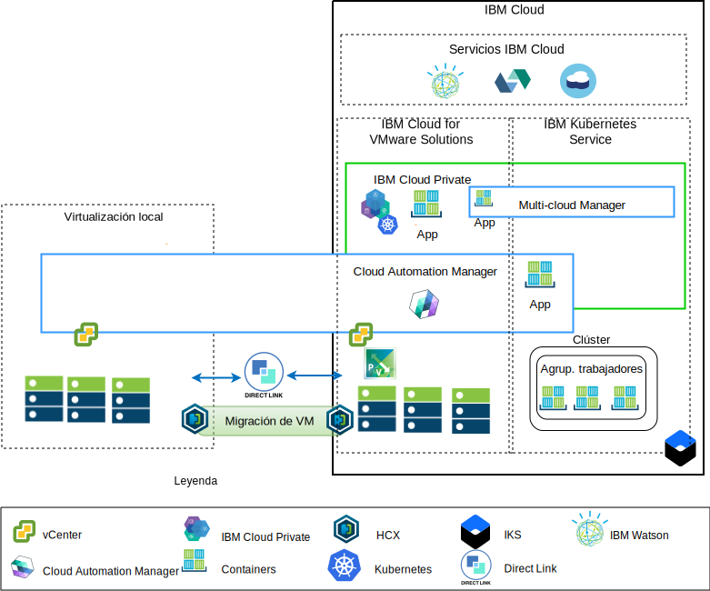

---

copyright:

  years:  2016, 2019

lastupdated: "2019-02-15"

---

# Visión general de la modernización de aplicaciones
{: #vcsnsxt-appmod}

En el diagrama siguiente se muestra la arquitectura de referencia de la modernización de aplicaciones que se desplegará en Acme Skateboards y que se describe en profundidad en esta serie de documentos.

Figura 1. Visión general de la arquitectura

Esta arquitectura híbrida permite a Acme Skateboards:
- Migrar máquinas virtuales (VM) VMware desde el entorno local a {{site.data.keyword.cloud}} con muy poco o ningún tiempo de inactividad y sin tener que reconfigurar las aplicaciones.
-	Iniciar el proceso de modernización de aplicaciones, permitiéndoles centrarse en contenerizar las interfaces web más simples y el middleware al tiempo que permite que bases de datos más complejas permanezcan como máquinas virtuales.
-	Utilizar Cloud Automation Manager (CAM) para disponer de una infraestructura como código (IaC) para componer y coordinar servicios en los que intervienen tanto de máquinas virtuales como contenedores para integrarlos en sus cadenas de herramientas de DevOps y en su solución ITSM.

En lo que respecta a la arquitectura de red, la arquitectura de referencia comprende los siguientes componentes principales:
- **Virtualización local**: un clúster VMware que actualmente aloja las VM de Acme Skateboards. Son estas máquinas virtuales las que actualmente alojan las aplicaciones que se modernizarán. Este clúster se necesita para cumplir los requisitos previos, tal como se indica en el documento [Arquitectura de la solución VMware HCX on {{site.data.keyword.cloud_notm}}](https://www.ibm.com/cloud/garage/files/HCX_Architecture_Design.pdf), para permitir que los clientes migren las VM a la instancia de VMware vCenter Server on {{site.data.keyword.cloud_notm}} que se ejecuta en {{site.data.keyword.cloud_notm}} y viceversa si es necesario.
- **VMware vCenter Server on IBM Cloud**: vCenter Server proporciona los componentes fundamentales de VMware: vSphere, vCenter Server, NSX-V y opciones de almacenamiento que incluyen vSAN o almacenamiento {{site.data.keyword.cloud_notm}} Endurance, necesarios para desplegar automáticamente una solución VMware Software Defined Data Center (SDDC). Este clúster VMware es el destino de las máquinas virtuales migradas y de algunas de las aplicaciones modernizadas en los contenedores alojados en {{site.data.keyword.icpfull_notm}}.

Los componentes clave de la arquitectura son:
- **NSX-V**: NSX-V ofrece la capa de virtualización de red en vCenter Server que proporciona una superposición de red para las VM de Acme Skateboards. NSX-V habilita BYOIP y aísla las redes de carga de trabajo de las redes de {{site.data.keyword.cloud_notm}}. NSX-V está programado por HCX para crear las redes que Acme Skateboards extiende desde el entorno local.
- **{{site.data.keyword.icpfull_notm}}**: {{site.data.keyword.icpfull_notm}} es una plataforma de aplicaciones para desarrollar y gestionar aplicaciones contenerizadas. Es un entorno integrado que incluye el coordinador de contenedores Kubernetes, un repositorio de imágenes privadas, una consola de gestión, infraestructuras de supervisión y una interfaz gráfica de usuario, que proporciona una ubicación centralizada desde la que Acme Skateboards puede desplegar, gestionar, supervisar y escalar aplicaciones. La instancia de vCenter Server aloja los componentes de {{site.data.keyword.icpfull_notm}}, los nodos maestros, los nodos trabajadores, y los ejecuta como máquinas virtuales.
- **IBM Cloud Automation Manager**: CAM es una plataforma de infraestructura como código (IaC) preparada para la empresa que ofrece un único panel para suministrar cargas de trabajo basadas en máquina virtual junto con cargas de trabajo basadas en Kubernetes utilizando plantillas. CAM es una aplicación Docker que se ejecuta en una instalación de {{site.data.keyword.icpfull_notm}} y que está estrechamente integrada para la autorización, RBAC y otras funciones.
- **{{site.data.keyword.containerlong_notm}}**: {{site.data.keyword.containerlong_notm}} permite a Acme Skateboards desplegar sus aplicaciones modernizadas en contenedores Docker que se ejecutan en clústeres Kubernetes. IBM gestiona por completo los nodos maestros, mientras que los nodos trabajadores de la agrupación de nodos trabajadores se despliegan en la misma cuenta de {{site.data.keyword.cloud_notm}} que su instancia de vCenter Server. Los nodos trabajadores pueden ser nativos, públicos o instancias de servidor virtual dedicado. Calico se instala y se configura automáticamente en {{site.data.keyword.containerlong_notm}}. Calico proporciona conectividad de red segura para contenedores y se configura en {{site.data.keyword.containerlong_notm}} para utilizar la encapsulación IP en IP para encapsular los paquetes que viajan a través de subredes. Calico utiliza NAT para las conexiones salientes de los contenedores.
- **Direct Link**: {{site.data.keyword.cloud_notm}} Direct Link utiliza el proveedor de WAN de Acme Skateboard para conectar su centro de datos a {{site.data.keyword.cloud_notm}} a fin de ofrecer una conexión de red fiable, segura y de baja latencia. Esta conexión proporciona:
  - Acceso a las aplicaciones alojadas en la nube desde los usuarios de la empresa.
  - Tráfico de VM interno entre las máquinas virtuales locales y las de la nube.
  - Tráfico entre sistemas antiguos del centro de datos local y las VM en la nube.

## Principales ventajas para Acme Skateboards
{: #vcsnsxt-appmod-benefits}

- Aceleración en la entrega de proyectos de TI a desarrolladores y líneas de negocio, reduciendo el tiempo necesario para la adquisición, la arquitectura, la implementación y el despliegue de recursos de semanas, o incluso meses, a horas. El tiempo de rentabilización de la aplicación desciende si los clientes tienen que esperar hasta que los equipos de red o de seguridad puedan solicitar servicios como equilibradores de carga, cortafuegos, conmutadores y direccionadores.
- Mejora en la seguridad con servidores nativos dedicados en una nube privada alojada, incluido el despliegue de puntos finales privados en servicios de {{site.data.keyword.cloud_notm}}, como {{site.data.keyword.containerlong_notm}} y KMIP.
- Gestión y gobierno coherentes de la nube híbrida desplegada, proporcionando acceso administrativo completo a la gestión de virtualización, conservando las herramientas de VMware existentes, los scripts y las inversiones en formación.
- Experiencia de VMware a escala global con IBM Professional y Servicios gestionados que abarcan más de 30 {{site.data.keyword.CloudDataCents_notm}} en todo el mundo.

Los clientes que realicen la transición hacia plataformas de aplicaciones nativas en la nube, como {{site.data.keyword.icpfull_notm}} e {{site.data.keyword.containerlong_notm}}, se centran en la velocidad y en la innovación y no siempre tienen en mente la seguridad y la red.

Esta arquitectura de referencia muestra cómo VCS, {{site.data.keyword.icpfull_notm}} e {{site.data.keyword.containerlong_notm}} guían a Acme Skateboards de forma segura en su proceso de modernización de aplicaciones.

## Enlaces relacionados
{: #vcsnsxt-appmod-related}

* [Visión general de vCenter Server on {{site.data.keyword.cloud_notm}} con el paquete híbrido (Hybridity)](/docs/services/vmwaresolutions/archiref/vcs?topic=vmware-solutions-vcs-hybridity-intro)
