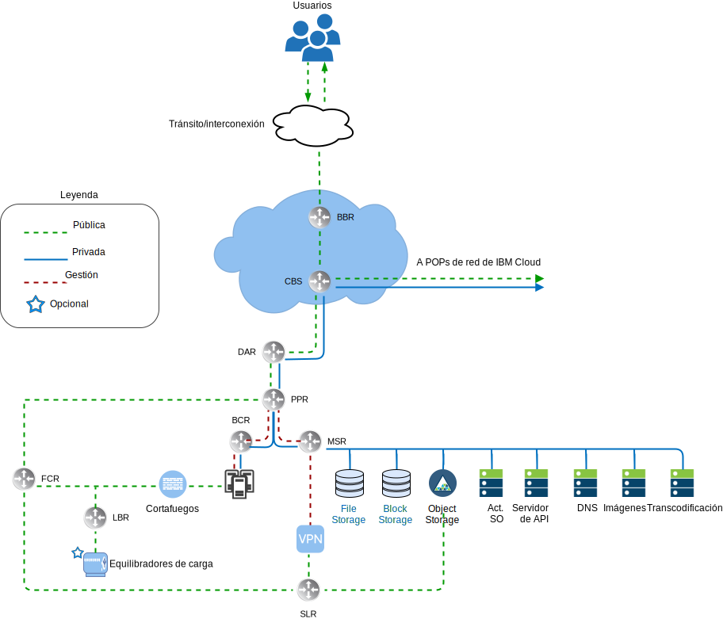
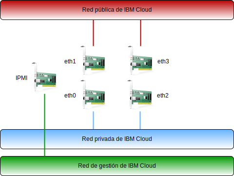

---

copyright:

  years:  2016, 2019

lastupdated: "2019-05-22"

subcollection: vmware-solutions

---

# Visión general de la red de IBM Cloud
{: #vcsnsxt-overview-ic4vnetwork}

{{site.data.keyword.cloud}} gestiona la red física. En la siguiente información se describe la red física que proporciona {{site.data.keyword.cloud_notm}} y las conexiones de host físico (VLAN, MTU) que están asociadas con los hosts físicos descritos anteriormente.

La red física de {{site.data.keyword.cloud_notm}} está separada en tres redes distintas: pública, privada y de gestión.

## Red pública
{: #vcsnsxt-overview-ic4vnetwork-public-net}

{{site.data.keyword.CloudDataCents_notm}} y los puntos de presencia de red (PoP) tienen más de una conexión de 1 Gbps o 10 Gbps con el tránsito de nivel superior y con los proveedores de red de interconexión. El tráfico de red de cualquier parte del mundo se conecta a la red más cercana de PoP, y viaja directamente a través de la red a su centro de datos, minimizando el número de saltos de red y de transferencias entre proveedores. Dentro del centro de datos, se proporciona ancho de banda de red de 1 Gbps o de 10 Gbps a los servidores individuales mediante un par de conmutadores agregados de cliente frontal (FCS). Estos conmutadores agregados están conectados a un par de direccionadores separados (es decir, direccionadores de clientes frontales, FCR) para redes L3. Este diseño de varios niveles permite que la red se escale entre bastidores, filas y pods dentro de un {{site.data.keyword.CloudDataCent_notm}}.

## Red privada
{: #vcsnsxt-overview-ic4vnetwork-private-net}

Todos los {{site.data.keyword.CloudDataCents_notm}} y los PoP están conectados mediante la red troncal privada. Esta red privada está separada de la red pública, y permite la conectividad a servicios en {{site.data.keyword.CloudDataCents_notm}} alrededor del mundo. El traslado de datos entre los centros de datos se realiza utilizando más de una conexión de 10 Gbps o 40 Gbps a la red privada. De forma similar a la red pública, la red privada tiene varios niveles en que los servidores y otros componentes de infraestructura se conectan a los conmutadores de cliente de fondo (BCS) agregados. Estos conmutadores agregados están conectados a un par de direccionadores separados (es decir, direccionadores de clientes de fondo, BCR) para redes L3. La red privada también da soporte a la capacidad de utilizar tramas Jumbo (MTU 9000) para las conexiones de host físicas.

## Red de gestión
{: #vcsnsxt-overview-ic4vnetwork-mgmt-net}

Junto con las redes públicas y privadas, cada servidor de {{site.data.keyword.cloud_notm}} se conecta a una red de gestión fuera de banda. Esta red de gestión, accesible a través de VPN, permite el acceso de IPMI (Intelligent Platform Management Interface) al servidor, independientemente de su CPU, firmware y sistema operativo, para fines de mantenimiento y de administración.

## Bloques de IP primarios y portátiles
{: #vcsnsxt-overview-ic4vnetwork-ip-blocks}

{{site.data.keyword.cloud_notm}} asigna dos tipos de direcciones IP que se van a utilizar en la infraestructura de {{site.data.keyword.cloud_notm}}:
* Las direcciones IP primarias se asignan a los dispositivos, a los servidores nativos y virtuales suministrados por {{site.data.keyword.cloud_notm}}. Los usuarios no deben asignar ninguna dirección IP en estos bloques.
* Las direcciones IP portátiles se proporcionan para que asigne y gestione según sea necesario.

Las direcciones IP primarias o portátiles se pueden convertir en direccionables a cualquier VLAN dentro de la cuenta de cliente si la cuenta está configurada como una cuenta de direccionamiento virtual y reenvío (VRF).

## Direccionamiento virtual y reenvío
{: #vcsnsxt-overview-ic4vnetwork-vrf}

Las cuentas de {{site.data.keyword.cloud_notm}} también se pueden configurar como cuentas de direccionamiento virtual y reenvío (VRF). Una cuenta VRF habilita el direccionamiento global automático entre bloques de IP de subred dentro de la cuenta. Todas las cuentas con las conexiones de Direct Link deben convertirse a, o crearse como, una cuenta de VRF. 

## Conexiones de host físico
{: #vcsnsxt-overview-ic4vnetwork-host-connect}

Cada host físico del diseño tiene dos pares redundantes de conexiones Ethernet de 10 Gbps en cada conmutador Top of Rack (ToR) de {{site.data.keyword.cloud_notm}} (público y privado). Los adaptadores se configuran como conexiones individuales (no enlazadas) para un total de conexiones de 4 conexiones de 10 Gbps. Esto permite que cada conexión de tarjeta de interfaz de red (NIC) funcione de forma independiente de las demás.

## VLAN
{: #vcsnsxt-overview-ic4vnetwork-vlans}

Las ofertas de VMware on {{site.data.keyword.cloud_notm}} están diseñadas con tres VLAN (una pública y dos privadas) asignadas al despliegue. La VLAN pública se asigna a eth1 y eth3 y las conexiones privadas se asignan a eth0 y eth2. Es importante resaltar que la VLAN pública y la primera VLAN privada creadas y asignadas en este diseño no están etiquetadas de forma predeterminada. Posteriormente, la VLAN privada adicional se trunca en los puertos de conmutador físico y se etiqueta dentro de los grupos de puertos de VMware que consumen estas subredes.

Tal como se ha indicado anteriormente, la red privada consta de dos VLAN dentro de este diseño. Se asignan tres subredes a la primera de estas VLAN (aquí designada como VLAN privada A). La primera es un rango de subred de IP privado primario que {{site.data.keyword.cloud_notm}} asigna a los hosts físicos. La segunda subred se utiliza para máquinas virtuales de gestión (por ejemplo, vCenter Server Appliance y Platform Services Controller). La tercera se utiliza para los VTEP (VXLAN Tunnel Endpoints) asignados a cada host mediante NSX Manager.

Junto con la VLAN privada A, existe una segunda VLAN privada (aquí designada como VLAN privada B) para dar soporte a características de VMware como vSAN y vMotion, y para la conectividad con el almacenamiento adjunto de red (NAS). Como tal, la VLAN se divide en dos o tres subredes portátiles. La primera subred se asigna a un grupo de puertos de kernel para el tráfico de vMotion. La subred o subredes restantes se utilizan para el tráfico de almacenamiento y, cuando se utiliza vSAN, una se asigna a los grupos de puertos de kernel utilizados para el tráfico de vSAN. Cuando se utiliza NAS, una se asigna uno a un grupo de puertos dedicado al tráfico NFS. Todas las subredes configuradas como parte de un despliegue automatizado de vCenter Server o Cloud Foundation utilizan rangos gestionados de {{site.data.keyword.cloud_notm}}. Esto es para garantizar que cualquier dirección IP se pueda direccionar a cualquier centro de datos dentro de la cuenta de {{site.data.keyword.cloud_notm}} que se utiliza si se necesita ahora o en el futuro.

Tabla 1. Resumen de VLAN y subred

VLAN 	|Tipo de subred 	|Descripción
---|---|---
Pública 	|Primaria 	|Asignada a hosts físicos para el acceso de red pública. No se utiliza en el despliegue inicial.
Pública	|Portátil 	|Asignado para enlace ascendente y uso de NAT en customer-nsx-esg.
Pública	|Portátil 	|Asignada para uso de NAT de enlace ascendente en mgmt-nsx-esg.
Pública	|Portátil 	|Asignada para uso de NAT de enlace ascendente en hcx-mgmt-esg, si se ha seleccionado el paquete híbrido.
Privada A 	|Primaria 	  |Asignada a hosts físicos asignados por {{site.data.keyword.cloud_notm}}. La utiliza la interfaz de gestión para el tráfico de gestión de vSphere.
Privada A 	|Portátil 	|Asignada a máquinas virtuales que funcionan como componentes de gestión.
Privada A 	|Portátil 	|Asignada a NSX VTEP.
Privada A 	|Portátil 	|Asignada a HCX para uso interno, si se ha seleccionado el paquete híbrido.
Privada A 	|Portátil 	|Asignado para uso de enlace ascendente en el customer-nsx-esg.
Privada A 	|Portátil 	|Asignada a HCX, si se ha seleccionado el paquete híbrido.
Privada B	  |Primaria	  |No se utiliza en el despliegue inicial.
Privada B 	|Portátil 	|Asignada para vSAN si se utiliza.
Privada B 	|Portátil 	|Asignada para NAS si se utiliza.
Privada B 	|Portátil 	|Asignada para vMotion.

Este diseño se implementa con hosts físicos e instancias de sistema virtual (VSI) en las VLAN y se configura para que apunte al direccionador de cliente de "red privada" de fondo (BCR) de {{site.data.keyword.cloud_notm}} como ruta predeterminada. Aunque las instancias de vCenter Server permiten el uso de redes definidas por software, las superposiciones de red creadas
por NSX que incluyan direccionamiento a subredes VLAN no son conocidas por los direccionadores gestionados por
{{site.data.keyword.cloud_notm}}. Es posible que tenga que crear rutas estáticas, reglas de cortafuegos y reglas NAT para gestionar adecuadamente los flujos de red. 

Las conexiones de red privada están configuradas para utilizar tramas jumbo con un tamaño de MTU de 9000, lo que mejora el rendimiento de las grandes transferencias de datos, como el almacenamiento y vMotion. Este es el MTU máximo permitido dentro de VMware y por {{site.data.keyword.cloud_notm}}. Las conexiones de red pública utilizan una MTU Ethernet estándar de 1500. Eso se debe mantener, ya que cualquier cambio puede provocar la fragmentación de paquetes a través de Internet.

## Enlaces relacionados
{: #vcsnsxt-overview-ic4vnetwork-related}

* [Visión general de vCenter Server on {{site.data.keyword.cloud_notm}} con el paquete híbrido (Hybridity)](/docs/services/vmwaresolutions/archiref/vcs?topic=vmware-solutions-vcs-hybridity-intro)
