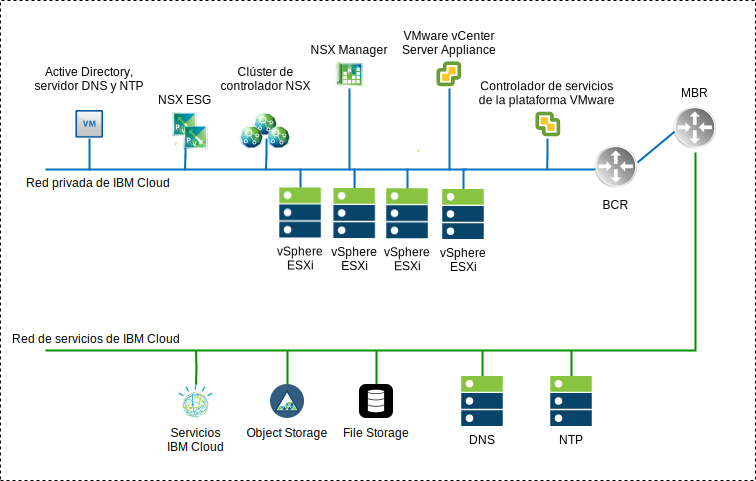
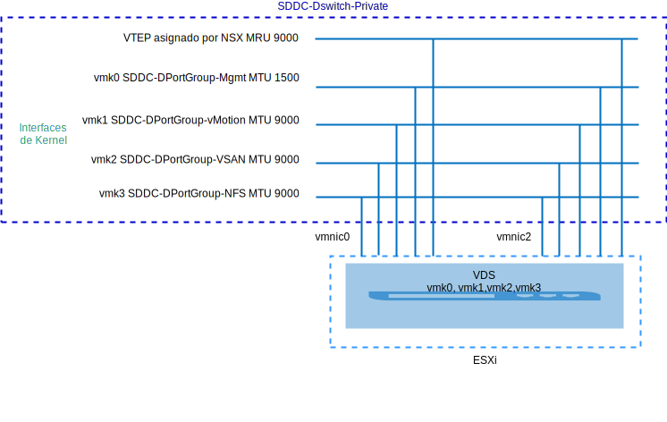
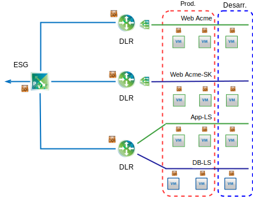

---

copyright:

  years:  2016, 2019

lastupdated: "2019-02-15"

---

# Visión general de NSX-V
{: #vcsnsxt-overview-ic4vnsxv}

La virtualización de red proporciona una superposición de red que existe dentro de la capa virtual. NSX-V proporciona la arquitectura con características tales como el aprovisionamiento rápido, el despliegue, la reconfiguración y la destrucción de las redes virtuales bajo demanda. Este diseño utiliza el conmutador distribuido de vSphere (vDS) y VMware NSX for vSphere para implementar la red virtual.

En este diseño, NSX Manager se despliega en el clúster inicial. Se asigna a NSX Manager una dirección IP respaldada por VLAN desde el bloque de direcciones portátiles privado, que está pensada para los componentes de gestión y que también se configura con los servidores DNS y NTP descritos anteriormente.

Tabla 1. Especificaciones del dispositivo virtual NSX-V Manager

Atributo | Especificación
---|---
NSX Manager | Dispositivo virtual
Número de vCPU | 4
Memoria | 16 GB
Disco | 60 GB en la compartición NFS de gestión
Tipo de disco | Ligero suministrado
Red | **Privada A** portátil diseñada para los componentes de gestión

En la visión general siguiente de la red de NSX-V Manager se muestra la ubicación del NSX Manager en relación con otros componentes de la arquitectura.

Figura 1. Visión general de la red NSX-V Manager

Después del despliegue inicial, la automatización de {{site.data.keyword.cloud}} despliega tres controladores NSX dentro del clúster inicial. Se asigna a los controladores una dirección IP desde la subred portátil **Privada A** está diseñada para los componentes de gestión. Se crean reglas de antiafinidad de VM-VM de modo que los controladores quedan separados entre los hosts del clúster. El clúster inicial se debe desplegar con un mínimo de tres nodos para asegurar la alta disponibilidad para los controladores.

Junto con los controladores, la automatización de {{site.data.keyword.cloud_notm}} prepara los hosts de vSphere desplegados con NSX VIBS, que permiten utilizar una red virtualizada mediante los VTEP (VXLAN Tunnel Endpoints). A los VTEP se les asignan direcciones IP del rango de direcciones IP portátiles **Privada A** especificada para los VTEP. El tráfico de VXLAN reside en la VLAN no etiquetada y se asigna al conmutador distribuido virtual privado (vDS). Posteriormente, se asigna una agrupación de ID de segmento y se añaden los hosts del clúster a la zona de transporte. Solo se utiliza la difusión única (unicast) en la zona de transporte ya que el snooping de IGMP no está configurado en {{site.data.keyword.cloud_notm}}.

Luego se despliegan pares NSX Edge Services Gateway (ESG). Para cualquier despliegue, se utiliza un par de pasarela para el tráfico de salida de los componentes de automatización que residen en la red privada. Las instancias de VMware vCenter Server on {{site.data.keyword.cloud_notm}} incluyen una segunda pasarela, conocida como el borde gestionado por el cliente, que se despliega y se configura con un enlace ascendente a la red pública y una interfaz asignada a la red privada. El administrador puede configurar los componentes NSX necesarios como, por ejemplo, direccionadores lógicos distribuidos (DLR), conmutadores lógicos y cortafuegos.

## Diseño de conmutadores distribuidos
{: #vcsnsxt-overview-ic4vnsxv-distributed-switch}

El diseño utiliza un número mínimo de conmutadores distribuidos virtuales (vDS). Los hosts del clúster están conectados a redes públicas y privadas. Se configuran con dos conmutadores distribuidos virtuales. El uso de dos conmutadores sigue el enfoque de separación de red física de las redes públicas y privadas que se implementan en {{site.data.keyword.cloud_notm}}.

Se configuran un total de dos conmutadores distribuidos. El primero es para la conectividad de red pública (SDDC-Dswitch-Public) y el segundo es para la conectividad de red privada (SDDC-Dswitch-Private).
Es necesario separar los distintos tipos de tráfico para reducir la contención y la latencia. También se necesitan redes separadas para la seguridad de acceso. Las VLAN se utilizan para segmentar funciones de red física. Este diseño utiliza tres VLAN. Dos son para el tráfico de red privada y una para el tráfico de red pública.

Tabla 2. Correlación de tráfico de VLAN

VLAN |Designación |Tipo de tráfico
---|---|---
VLAN1 | Pública | Disponible para acceso a Internet
VLAN2 | Privada A | Gestión de ESXi, gestión, VXLAN (VTEP)
VLAN3 | Privada B | vSAN, NFS, vMotion

El tráfico procedente de las cargas de trabajo se transmite en los conmutadores lógicos NSX. El clúster de vSphere utiliza dos conmutadores distribuidos de vSphere (vDS) para el clúster convergente.

Tabla 3. Conmutadores distribuidos de clúster convergente

Nombre del conmutador distribuido de vSphere |Función |Control de E/S de red |Modalidad de equilibrio de carga |Puertos NIC físicos |MTU
---|---|---|---|---|---
SDDC-Dswitch-Private | Gestión de ESXi SAN Virtual vSphere vMotion VXLAN Tunnel Endpoint (VTEP) NFS | Habilitado | Ruta basada en la migración tras error explícita (vSAN, vMotion). Puerto virtual de origen (todo lo demás) | 2 | 9.000 (tramas Jumbo)
SDDC-Dswitch-Public | Tráfico de gestión externa (norte-sur) | Habilitado |Ruta basada en el puerto virtual de origen | 2 | 1.500 (valor predeterminado)

Tabla 4. Valores de grupo de puertos de conmutador distribuido y de migración tras error

Parámetro | Valor
---|---
Equilibrio de carga | Ruta basada en el puerto virtual de origen \*
Detección de migración tras error | Solo estado de enlace
Conmutadores de notificación | Habilitado
Restablecimiento | Habilitado
Orden de migración tras error | Enlaces ascendentes activos: Uplink1, Uplink2 \*

El grupo de puertos de vSAN utiliza la migración tras error explícita con activo o en espera, porque no da soporte al equilibrio de carga del tráfico de almacenamiento vSAN.
{:note}

Figura 2. Correlación de grupo de puertos de interfaz de kernel de VM del clúster

Tabla 5. Grupos de puertos de conmutador virtual del clúster, VLAN y política de agrupación

Conmutador distribuido de vSphere	|Nombre de grupo de puertos	|Agrupación	|Enlaces ascendentes	|ID de VLAN
---|---|---|---|---
SDDC-Dswitch-Private	|SDDC-DPortGroup-Mgmt	|Puerto virtual de origen	|Activo: 0, 1	|VLAN1
SDDC-Dswitch-Private	|SDDC-DPortGroup-vMotion	|Puerto virtual de origen	|Activo: 0, 1	|VLAN2
SDDC-Dswitch-Private	|SDDC-DPortGroup-VSAN	|Migración tras error explícita	|Activo: 0 En espera: 1	|VLAN2
SDDC-Dswitch-Private	|SDDC-DPortGroup-NFS	|Puerto virtual de origen	|Activo: 0, 1	|VLAN2
SDDC-Dswitch-Private	|Generado automáticamente por NSX	|Puerto virtual de origen	|Activo: 0, 1	|VLAN1
SDDC-Dswitch-Public	  |SDDC-DPortGroup-External	|Puerto virtual de origen	|Activo: 0, 1	|VLAN3

## NSX-V
{: #vcsnsxt-overview-ic4vnsxv-nsx-v}

Este diseño especifica la configuración de los componentes de NSX, pero no aplica ninguna configuración de componente de superposición de red. El cliente diseña la superposición de red según sus necesidades.

Se configuran los siguientes componentes:
-	Los servidores de gestión y los controladores se instalan e integran en la interfaz de usuario web de vCenter.
-	Los agentes de ESXi están instalados y las direcciones IP de VTEP están configuradas por host ESXi.
-	Configuración de VTEP, configuración de controlador y configuración de VXLAN (zona de transporte).
-	Dispositivos de NSX Edge Services Gateway (ESG) para que los utilicen los componentes de gestión.
-	Solo para vCenter Server, dispositivos NSX Edge Services Gateway (ESG) para uso del cliente.

Lo que NO se configura:
-	Direccionadores distribuidos virtuales.
-	Microsegmentación.
-	Las VXLAN.
-	Gestión de NSX enlazada con otras estancias de VMware.

### Seguridad de NSX-V
{: #vcsnsxt-overview-ic4vnsxv-nsx-v-security}

NSX for vSphere permite a las organizaciones dividir el centro de datos en distintos segmentos de seguridad, hasta el nivel de carga de trabajo individual independiente del lugar en el que se ejecuta la carga de trabajo. Los equipos de TI pueden definir políticas para cada carga de trabajo en función de la aplicación y del contexto de usuario, lo que garantiza respuestas inmediatas frente a las amenazas dentro del centro de datos y aplicación de políticas a nivel de aplicación.

Estos son algunos de los principales componentes de NSX:
-	El cortafuegos con estado distribuido de NSX está incluido en el kernel del hipervisor y ofrece hasta 20 Gbps de capacidad de cortafuegos por host de hipervisor. Ofrece capacidad de cortafuegos norte a sur mediante NSX Edge.
-	NSX permite la creación de grupos de seguridad dinámicos y políticas asociadas en más que simplemente dirección IP y MAC. Estas políticas incluyen objetos y etiquetas de vCenter, tipo de sistema operativo e información de aplicación de capa 7 para habilitar la microsegmentación basada en el contexto de la aplicación.
-	La política basada en identidad que utiliza información de inicio a partir de la integración de sesión de VM, Active Directory y Mobile Device Management permite una seguridad basada en el usuario, que incluye seguridad a nivel de sesión en entornos de escritorio remotos y virtuales.
- El gestor de reglas de aplicación y la supervisión de puntos finales permiten la visualización del flujo de tráfico de red de extremo a extremo hasta la capa 7, lo que permite a los equipos de la aplicación identificar puntos finales dentro del centro de datos y entre centros de datos y responder mediante la creación de reglas de seguridad adecuadas.
- Soporte para la integración de gestión, plano de control y plano de datos con proveedores de terceros, como cortafuegos de próxima generación, IDS/IPS, antivirus sin agente, conmutación, seguridad avanzada y más.

En el siguiente diagrama se muestra cómo puede implementar algunas de las características de microsegmentación de NSX-V mediante la creación de grupos de seguridad. En este ejemplo, producción y desarrollo son los grupos de seguridad y las reglas de seguridad se asignan en función de estos grupos.

Figura 3. Seguridad de NSX-V

## Enlaces relacionados
{: #vcsnsxt-overview-ic4vnsxv-related}

* [Visión general de vCenter Server on {{site.data.keyword.cloud_notm}} con el paquete híbrido (Hybridity)](/docs/services/vmwaresolutions/archiref/vcs?topic=vmware-solutions-vcs-hybridity-intro)
