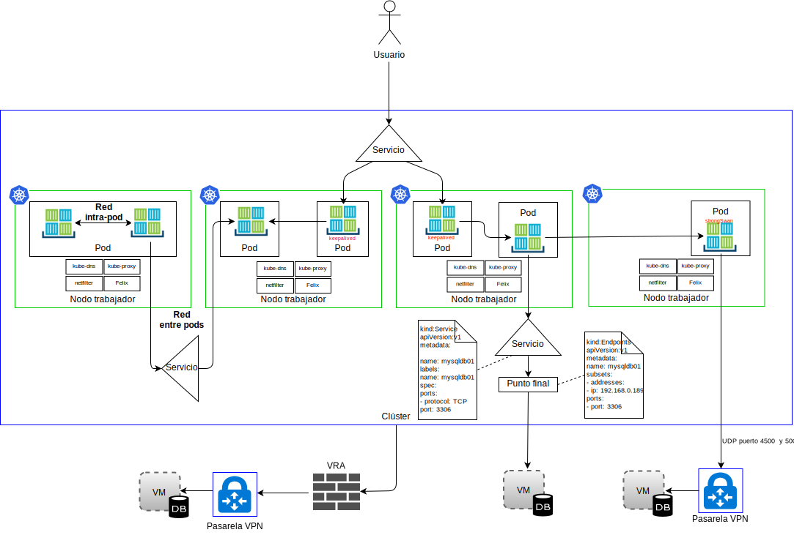
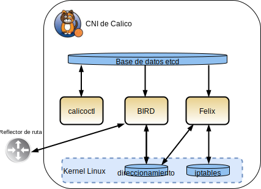

---

copyright:

  years:  2016, 2019

lastupdated: "2019-02-15"

subcollection: vmwaresolutions

---

# Servicio IBM Cloud Kubernetes
{: #vcsnsxt-overview-iks}

## Visión general del servicio IBM Cloud Kubernetes
{: #vcsnsxt-overview-iks-ovw}

{{site.data.keyword.containerlong_notm}} proporciona una plataforma aislada y segura para gestionar contenedores. Esta plataforma es portátil, ampliable y se repara automáticamente en caso de migración tras error.

La arquitectura comprende los siguientes componentes principales:
-	**Cuenta de {{site.data.keyword.cloud}}**: se despliegan nodos trabajadores en una cuenta de {{site.data.keyword.cloud_notm}}. El nodo maestro se despliega en una cuenta de nube central gestionada por IBM.
-	**Clúster**: un clúster de Kubernetes consta de uno o varios nodos trabajadores.
-	**Nodos trabajadores**: un nodo trabajador es una instancia de servidor nativo o virtual alojada en una cuenta de IBM. Cuando suministra un nodo trabajador, determina los recursos que están disponibles para los contenedores que están alojados en dicho nodo trabajador. Los nodos trabajadores incluyen un motor de Docker gestionado por IBM, recursos de cálculo independientes, redes y un servicio de volumen de almacenamiento.
-	**Nodo maestro**: los nodos trabajadores están gestionados por un nodo maestro de Kubernetes que controla y supervisa de forma centralizada todos los recursos de Kubernetes del clúster. Este nodo maestro está gestionado por IBM.

Estos son los conceptos que incluye {{site.data.keyword.containerlong_notm}}:
-	**Servicio**: un servicio es un recurso de Kubernetes que agrupa un conjunto de pods y que ofrece conectividad de red a dichos pods sin mostrar la dirección IP privada real de cada pod. Puede utilizar un servicio para hacer que la app esté disponible en el clúster o en internet público.
-	**Despliegue**: un despliegue es un recurso de Kubernetes en el que puede especificar información sobre otros recursos o funciones necesarios para ejecutar la app, como por ejemplo servicios, almacenamiento persistente o anotaciones. Puede documentar un despliegue en un archivo YAML de configuración y luego aplicarlo al clúster. El nodo maestro de Kubernetes configura los recursos y despliega los contenedores en pods en los nodos trabajadores con capacidad disponible. Defina estrategias para la app, incluido el número de pods que desea añadir durante una actualización continuada y el número de pods que pueden no estar habilitados al mismo tiempo. Cuando lleva a cabo una actualización continuada, el despliegue comprueba si la actualización funciona y detiene la implantación cuando se detectan anomalías.
-	**Pod**: cada app de un clúster se despliega, se ejecuta y se gestiona mediante un recurso de Kubernetes que se denomina pod. Los pods representan pequeñas unidades desplegables de un clúster de Kubernetes y se utilizan para agrupar contenedores que se deben tratar como una sola unidad. En la mayoría de los casos, cada contenedor se despliega en su propio pod. Una aplicación puede requerir que un contenedor y otros contenedores ayudantes se desplieguen en un pod de modo que dichos contenedores se puedan direccionar utilizando la misma dirección IP privada.
-	**Aplicación**: una app puede ser una app completa o un componente de una app. Puede desplegar componentes de una app en pods o nodos trabajadores independientes.

Kubernetes no impone una solución de red concreta.

El modelo de red de Kubernetes establece tres requisitos fundamentales:
* Los contenedores se pueden comunicar con todos los demás contenedores sin NAT
* Los nodos se pueden comunicar con todos los contenedores (y viceversa) sin NAT
* La IP que ve un contenedor es la misma IP que ven los otros.

### Espacios de nombres
{: #vcsnsxt-overview-iks-namespaces}

Los espacios de nombres son un aspecto fundamental de la red de contenedores. Los espacios de nombres son una característica del kernel de Linux que divide los recursos del kernel de modo que un conjunto de procesos ve un conjunto de recursos mientras que otro conjunto de procesos ve un conjunto de recursos diferente. Los recursos incluyen puntos de montaje, processID, pila de red, IPC e ID de usuario. Cada espacio de nombres tiene un conjunto privado de direcciones IP, su propia tabla de direccionamiento, un listado de sockets, una tabla de seguimiento de conexiones, un cortafuegos y otros recursos relacionados con la red.

### Interfaz de red de contenedor
{: #vcsnsxt-overview-iks-container-network-interfaces}

Kubernetes utiliza la interfaz de red de contenedor (CNI) como solución de red orientada a plugin. Consta de una especificación y de bibliotecas para escribir plugins para configurar interfaces de red en contenedores Linux. La especificación CNI es ligera, ya que solo se ocupa de la conectividad de red de los contenedores y de la recogida de basura de recursos una vez que se suprimen los contenedores.

Hay dos definiciones principales en el contexto de CNI en Kubernetes:
- **Pod**: sinónimo de espacio de nombres de red de Linux. La unidad de planificación en Kubernetes es un pod que es un conjunto muy acoplado de uno o más contenedores que siempre están colocalizados (están planificados en un nodo como una unidad). Un pod no se puede extender sobre más de un nodo trabajador.
- **Red**: un grupo de entidades direccionables de forma exclusiva que se pueden comunicar entre sí. Estas entidades pueden ser un contenedor individual, una máquina o algún otro dispositivo de red como, por ejemplo, un direccionador.

Para que el CNI añada un contenedor a una red, el tiempo de ejecución del contenedor debe crear primero un espacio de nombres de red nuevo para el contenedor y, a continuación, iniciar uno o más de los plugins definidos. La configuración de red está en formato JSON e incluye campos obligatorios, como el nombre y el tipo, y campos específicos del tipo de plugin. Se espera que un plugin de CNI asigne una dirección IP a la interfaz y configure las rutas de red relevantes para el mismo. {{site.data.keyword.containerlong_notm}} utiliza Calico como plugin de red para CNI. Calico asigna a cada carga de trabajo una dirección IP. En {{site.data.keyword.containerlong_notm}}, Calico utiliza un túnel de tipo IP-en-IP de modo que las direcciones IP de red de contenedor quedan ocultas en la red de {{site.data.keyword.cloud_notm}}.

Desde la perspectiva del tráfico de red, diferenciamos entre cuatro tipos en {{site.data.keyword.containerlong_notm}}, tal como se muestra en el diagrama siguiente.

Figura 1. Tipos de tráfico de red de contenedor 

- **Red intra-pod**: también conocida como comunicación de contenedor a contenedor. Todos los contenedores de un pod comparten un espacio de nombres de red, la misma dirección IP y se ven entre sí en localhost. El tráfico correspondiente a cada app se diferencia por un número de puerto diferente. El desarrollador debe asegurarse de que los contenedores de un pod no entren en conflicto entre sí con los puertos utilizados. Dentro de un pod, existe lo que se llama contenedor de infraestructura. Es el primer contenedor que inicia kubelet, y adquiere la IP del pod y configura el espacio de nombres de red. A continuación, todos los demás contenedores del pod se unen a la red del contenedor de infraestructura y al espacio de nombres de IPC. El contenedor tiene la modalidad de puente de red que está habilitada y todos los demás contenedores del pod se unen a este espacio de nombres a través de la modalidad de contenedor. Si cae el contenedor de infraestructura, kubelet desactiva todos los contenedores del pod y luego los vuelve a suministrar, normalmente con una nueva dirección IP. En este documento no proporcionaremos más detalles sobre este flujo de tráfico.

- **Red entre pods**: también conocida como comunicación de “pod-a-pod”. Hay tres tipos de tráfico este-oeste:
  - Los pods se pueden comunicar directamente con otros pods de la misma subred. En {{site.data.keyword.containerlong_notm}}, cada pod tiene una dirección IP que se asigna desde un rango proporcionado por {{site.data.keyword.containerlong_notm}}. A cada nodo trabajador se le asigna una subred durante el suministro. La comunicación de pod a pod sin proxies, túneles ni NAT se produce con los pods de la misma subred y host.
  - Los pods se pueden comunicar directamente con otros pods de distintas subredes. La encapsulación de tipo IP-en-IP se configura automáticamente en {{site.data.keyword.containerlong_notm}} para encapsular solo los paquetes que se transfieren a través de subredes. Esta encapsulación oculta el espacio de direcciones de red del pod en la red de {{site.data.keyword.cloud_notm}}. La encapsulación utiliza la dirección IP de la subred privada primaria de {{site.data.keyword.cloud_notm}}.
  - Los pods pueden utilizar servicios para comunicarse con otros pods, lo que se conoce como comunicación entre pod y servicio. Sin embargo, los pods que pueden comunicarse directamente con otros por los dos puntos anteriores son perecederos. Nacen y, cuando mueren, no resucitan. Los conjuntos de réplicas crean y destruyen pods de forma dinámica, como por ejemplo cuando se escalan hacia arriba o hacia abajo. Aunque cada pod obtiene su propia dirección IP, no se puede confiar en que estas direcciones IP sean estables a lo largo del tiempo. Generalmente los desarrolladores utilizan una construcción de servicio para la comunicación, en la que se utiliza una dirección IP virtual estable que se puede descubrir a través de DNS.

- **Ingress**: se refiere al direccionamiento del tráfico procedente de usuarios o apps externos a pods. Un servicio proporciona una dirección IP virtual estable (vIP) para un conjunto de pods. Aunque los pods son efímeros, los servicios permiten a los clientes descubrir y conectar de forma fiable con los contenedores que se ejecutan en los pods utilizando la vIP. Esta vIP no es una dirección IP real que está conectada a una interfaz de red. Su finalidad es puramente actuar como el punto final estable para reenviar el tráfico a uno o varios pods. El acceso a un pod desde fuera del clúster resulta algo más desafiante. Kubernetes tiene como objetivo proporcionar un equilibrio de carga altamente disponible y de alto rendimiento para los servicios.
Hay tres opciones para el tráfico norte-sur en {{site.data.keyword.containerlong_notm}}:

  - **NodePort**: el servicio NodePort se considera adecuado para las pruebas o si necesita acceso público o privado solo durante un breve periodo de tiempo. Un servicio NodePort abre un puerto en un nodo trabajador sobre la dirección IP privada y pública del nodo trabajador. Debe utilizar una política de red preDNAT de Calico si desea bloquear el tráfico público o privado. Las direcciones IP públicas y privadas del nodo trabajador no son permanentes.
  - **LoadBalancer**: las direcciones IP públicas y privadas portátiles que están asignadas al equilibrador de carga son permanentes y no cambian cuando se vuelve a crear un nodo trabajador en el clúster. Puede personalizar el equilibrador de carga exponiendo cualquier puerto que necesite la app. Un servicio de equilibrador de carga con una dirección IP privada portátil sigue teniendo un puerto de nodo público abierto en cada nodo trabajador. Debe utilizar una política de red preDNAT de Calico para bloquear los puertos de nodo público en el mismo.
  - **Servicios Ingress**: el ALB utiliza un punto de entrada público o privado seguro y único para direccionar las solicitudes entrantes a sus apps. El ALB escucha si hay solicitudes de servicio HTTP o HTTPS, TCP o UDP. Reenvía las solicitudes a través de los pods de aplicación basándose en las reglas que ha definido en el recurso Ingress. Cuando se crea un clúster, se crea automáticamente un equilibrador de carga de aplicación (ALB) de Ingress privado y uno público. Puesto que el ALB público está habilitado, y el ALB privado no está disponible de forma predeterminada, debe inhabilitar el ALB público y habilitar el ALB privado.

- **Egress**: hace referencia a la llamada a recursos externos fuera de los pods, como por ejemplo a las API o al consumo de recursos desde las VM. Opciones de Egress:
    - Definir un recurso de servicio para un sistema que se ejecute fuera del clúster. Se crea un recurso de punto final que detalla el sistema externo; la dirección IP y el número de puerto. El recurso de punto final puede tener varias direcciones listadas, y Kubernetes recorrerá estas direcciones como hace entre las pods que se ejecutan dentro del clúster. A continuación, se utiliza un recurso de servicio para crear una IP de clúster y un nombre de DNS en kube-dns para el servicio.
    - Utilizar stongSwan IPSec VPN que puede conectar con aplicaciones externas al clúster. Mediante el uso de un diagrama de Helm, se despliega y se configura un servicio strngSwan IPSec VPN dentro de un pod de Kubernetes. Cuando se establece la conectividad VPN, se configuran automáticamente rutas en todos los nodos trabajadores del clúster. Estas rutas permiten la conectividad bidireccional a través del túnel VPN entre los pods de cualquier nodo trabajador y el sistema remoto. Si el pod falla, el clúster reinicia el pod; sin embargo, es posible que experimente un breve tiempo de inactividad mientras se inicia el nuevo pod y se restablece la conexión VPN. Se utiliza una dirección IP pública o privada portátil para el servicio strongSwan VPN. El valor local.subnet puede utilizar la subred de pod del clúster, la subred de servicio del clúster o la subred portátil pública o privada. Mediante el valor localSubnetNAT se pueden volver a correlacionar las subredes del clúster. De forma alternativa, las direcciones IP del clúster se pueden ocultar detrás de una única dirección IP estableciendo enableSingleSourceIP en true. Para volver a correlacionar las subredes de la red remota, utilice el valor remoteSubnetNAT.
    - Se puede desplegar un dispositivo de direccionador virtual de {{site.data.keyword.cloud_notm}} como una pasarela VPN para conectar de forma segura a una red externa. El tráfico de red público o privado se puede direccionar a través de VRA. El VRA crea un túnel IPSec cifrado en la pasarela VPN remota.

## Componentes del servicio IBM Cloud Kubernetes
{: #vcsnsxt-overview-iks-components}

Los nodos trabajadores están gestionados por un nodo maestro de Kubernetes que controla y supervisa de forma centralizada todos los recursos de Kubernetes del clúster. Cuando un desarrollador despliega los recursos para un contenedor, el nodo maestro decide el nodo de trabajador en el que desplegar dichos recursos, teniendo en cuenta los requisitos de despliegue y la capacidad disponible en el clúster. Los nodos maestro y trabajadores se comunican entre sí a través de certificados TLS seguros y una conexión openVPN a través de la red pública de {{site.data.keyword.cloud_notm}}. Los desarrolladores acceden a kube-apiserver, alojado en el nodo maestro a través de internet.

El kubelet del nodo trabajador examina el kube-apiserver en el nodo maestro en busca de actualizaciones e informa del estado. El kubelet es un pod que se ejecuta en cada nodo trabajador y que se encarga de supervisar el estado de los pods que se ejecutan en el nodo trabajador y de examinar si hay sucesos que envía el servidor de API de Kubernetes. En función de los sucesos, el kubelet crea o elimina pods, emite pruebas de actividad y de preparación e informa sobre el estado de los pods al servidor de API de Kubernetes.

Desde una perspectiva de red, se despliegan los componentes siguientes en el nodo trabajador:

-	**openvpn-client**: el cliente OpenVPN trabaja con el servidor OpenVPN para conectar de forma segura el nodo maestro al trabajador. Este componente trabaja en el espacio de nombres kube-system.
-	**Nodo Calico**: el nodo Calico es un contenedor que agrupa los distintos componentes necesarios para los contenedores de red con Calico. Este componente trabaja en el espacio de nombres kube-system.
-	**Controlador de políticas de Calico**: el controlador de políticas Calico observa el tráfico de red de entrada y salida para ver si cumple con las políticas de red establecidas. Si el tráfico no está permitido en el clúster, el acceso al clúster se bloquea. El controlador de políticas de Calico también se utiliza para crear y establecer políticas de red para un clúster. Este componente trabaja en el espacio de nombres kube-system.
-	**CNI de Calico**: la interfaz de red de contenedor (CNI) de Calico gestiona la conectividad de red de los contenedores y elimina los recursos asignados cuando se suprime un contenedor.
-	**IPAM de Calico**: IPAM de Calico gestiona la asignación de direcciones IP para los contenedores.
-	**Proxy de kube**: el proxy de red de Kubernetes es un daemon que se ejecuta en cada nodo trabajador y que reenvía o equilibra la carga del tráfico de red TCP y UDP para los servicios que se ejecutan en el clúster. Este componente trabaja en el espacio de nombres kube-system.
-	**DNS de kube**: el DNS de Kubernetes planifica un pod y servicio DNS en el clúster. Los contenedores utilizan automáticamente la IP del servicio DNS para resolver los nombres de DNS en sus búsquedas de otros pods y servicios. Este componente trabaja en el espacio de nombres kube-system.
-	**ALB de Ingress**: Ingress es un servicio de Kubernetes que puede utilizar para equilibrar las cargas de trabajo de tráfico de red en el clúster reenviando solicitudes públicas o privadas a varias apps del clúster. Para exponer sus apps sobre la red pública o privada, debe crear un recurso Ingress para registrar sus apps con el equilibrador de carga de aplicación (ALP) de Ingress. Luego se puede acceder a varias apps utilizando un único URL o una dirección IP. Este componente trabaja en el espacio de nombres ibm-system.
-	**Equilibrador de carga**: un equilibrador de carga es un servicio de Kubernetes que se puede utilizar para equilibrar las cargas de trabajo de tráfico de red en el clúster reenviando solicitudes públicas o privadas a una app. Este componente trabaja en el espacio de nombres ibm-system.

### Calico
{: #vcsnsxt-overview-iks-calico}

{{site.data.keyword.containerlong_notm}} utiliza Calico como proveedor de red. Calico utiliza un enfoque de capa 3 en lugar de redes de superposición. Mediante los plugins de CNI, Calico se integra con Kubernetes para proporcionar una red para los usuarios que utiliza una red IP pura combinada con el Protocolo de pasarela para la distribución de rutas.

Calico proporciona una solución de entramado L3 y, en lugar de un vSwitch, Calico utiliza una función de vRouter en cada nodo de cálculo. El vRouter aprovecha la función de reenvío de L3 existente del kernel de Linux. Calico conecta cada carga de trabajo a través del vRouter directamente a la red de la infraestructura. La función vRouter utiliza BGP para anunciar las rutas a los pods alojados en cada nodo trabajador. Cada vRouter anuncia todos los puntos finales a los que está conectado a todos los otros vRouters que utilizan BGP.

En Calico, los paquetes IP destinados o procedentes de un pod se direccionan y se colocan tras un cortafuegos mediante la tabla de direccionamiento de Linux y la infraestructura de iptables en el nodo trabajador.

-	Para una carga de trabajo que está enviando paquetes, Calico garantiza que el nodo trabajador siempre se devuelve como la dirección MAC de salto siguiente, independientemente del direccionamiento que pueda configurar la propia carga de trabajo.
-	Para los paquetes destinados a una carga de trabajo, el último salto de IP es el del nodo trabajador de la carga de trabajo de destino en la propia carga de trabajo.

Figura 2. CNI de Calico

En el diagrama anterior se muestran los siguientes componentes de Calico:
-	**calicoctl**: interfaz de línea de mandatos.
-	**plugin CNI**
-	**almacén de claves/valores**: contiene la política de Calico y el estado de la configuración de red. Calico utiliza etcd para proporcionar la comunicación entre los componentes y como un almacén de datos coherente, lo que garantiza que Calico siempre puede crear una red precisa. El componente etcd se distribuye en todo el despliegue. Se divide en dos grupos de máquinas: el clúster principal y los proxies.
-	**calico/nodo**: un contenedor de “ayuda” que aúna los distintos componentes necesarios para el funcionamiento de la red:
 -	**Felix**: el agente de Calico principal que se ejecuta en cada máquina que alberga puntos finales. Es el responsable de programas las rutas y las ACL, y cualquier otra cosa que se necesite en el host, a fin de proporcionar la conectividad deseada para los puntos finales de dicho host.
 - **BIRD**: BIRD es un cliente BGP de código abierto que se utiliza para intercambiar información de direccionamiento entre hosts. Cuando Felix inserta rutas en el FIB del kernel de Linux, el cliente BGP las selecciona y las distribuye a los otros nodos del despliegue. Esto garantiza que el tráfico se direcciona de forma eficiente en el despliegue.
 - **Confd**: el motor de plantillas confd supervisa el almacén de datos etcd para detectar cualquier cambio en la configuración de BGP y en alguna configuración predeterminada de nivel superior global como, por ejemplo, números de AS, niveles de registro e información de IPAM. Luego genera de forma dinámica archivos de configuración de BIRD basados en los datos de etcd, que se desencadenan automáticamente a partir de actualizaciones de los datos. Cuando cambia el archivo de configuración, confd desencadena BIRD para que cargue los nuevos archivos.

Como la red {{site.data.keyword.cloud_notm}} Private solo reenvía los esquemas de direcciones IP de {{site.data.keyword.cloud_notm}}, Calico debe utilizar la encapsulación IP-en-IP del tráfico entre cargas de trabajo en {{site.data.keyword.containerlong_notm}} para ocultar las direcciones IP de red de pod. {{site.data.keyword.containerlong_notm}} utiliza la modalidad de subred cruzada IP-en-IP.

### Calico en el servicio IBM Cloud Kubernetes
{: #vcsnsxt-overview-iks-calico-iks}

Calico se instala y se configura automáticamente en {{site.data.keyword.containerlong_notm}}. Se crean políticas predeterminadas para proteger el clúster de Kubernetes, con la opción de crear sus propias políticas para proteger servicios específicos. La encapsulación de tipo IP-en-IP se configura automáticamente para encapsular solo los paquetes que se transfieren a través de subredes y utiliza NAT para las conexiones de salida procedentes de los contenedores. El tráfico entre la carga de trabajo y WAN también se habilita automáticamente en {{site.data.keyword.containerlong_notm}}, de modo que no es necesaria ninguna configuración adicional en Calico.

#### Escalabilidad de red con Calico
{: #vcsnsxt-overview-iks-net-scalability-calico}

Calico se basa en una arquitectura distribuida con capacidad de escalado que ofrece la posibilidad de pasar de un simple portátil de un desarrollador a grandes despliegues de empresa, y utiliza un plano de datos Linux estándar para ofrecer rendimiento nativo para cargas de trabajo virtuales.

#### Seguridad con Calico
{: #vcsnsxt-overview-iks-sec-calico}

Calico utiliza un conjunto de políticas que controlan cada componente del sistema; estas políticas se pueden configurar de modo que permitan que los servicios y las instancias de contenedor se comuniquen entre sí solo cuando sea necesario. Utiliza direcciones IP para identificar instancias de contenedor y crea políticas basadas en estas direcciones. La integración de Kubernetes con Calico conoce la infraestructura y puede escalar las políticas de seguridad en función de los cambios en la infraestructura.

#### Integración con Calico
{: #vcsnsxt-overview-iks-integration-calico}

Calico proporciona una solución de red altamente escalable y una solución de política de red para conectar pods de Kubernetes que se basa en los mismos principios de red de IP que internet. Se puede desplegar sin encapsulación ni superposiciones para proporcionar una red de centros de datos de alto rendimiento y altamente escalable. Calico proporciona una política de seguridad de red ajustada para los pods de Kubernetes a mediante su cortafuegos distribuido. Calico también se puede ejecutar en la modalidad de imposición de políticas junto con otras soluciones de red como Flannel, también conocido como canal, o redes GCE nativas.

## Red del servicio IBM Cloud Kubernetes
{: #vcsnsxt-overview-iks-networking}

De forma predeterminada, {{site.data.keyword.containerlong_notm}} configura el clúster con acceso a una VLAN pública y a una VLAN privada con los siguientes componentes.
- Una dirección IP pública para cada nodo trabajador, que proporciona a los nodos trabajadores una interfaz de red pública. De forma predeterminada:
  -	Se permite todo el tráfico de red de salida para todos los nodos trabajadores.
  -	El tráfico de red de entrada se bloquea, excepto en algunos puertos. Estos puertos están abiertos para que IBM pueda supervisar el tráfico de la red e instalar automáticamente las actualizaciones de seguridad para el nodo maestro Kubernetes.
-	Una dirección IP privada para cada nodo trabajador, que proporciona a los nodos trabajadores una interfaz de red privada.
-	Una conexión OpenVPN automática y segura entre todos los nodos trabajadores y el nodo maestro.

La primera vez que se crea un clúster en una zona, se suministran automáticamente una VLAN pública y una VLAN privada en dicha zona en la cuenta de la infraestructura de {{site.data.keyword.cloud_notm}}. Para cada clúster que se crea posteriormente en dicha zona, puede reutilizar la misma VLAN pública y privada, ya que varios clústeres pueden compartir las VLAN.

Los nodos de trabajo se pueden conectar tanto a una VLAN pública como a la VLAN privada, o solo a la VLAN privada. Si desea conectar los nodos trabajadores solo a una VLAN privada, puede utilizar el ID de una VLAN privada existente o puede crear una VLAN privada y utilizar el ID durante la creación del clúster.

Las subredes IP para los nodos trabajadores y los pods también se suministran automáticamente en las VLAN. Las subredes proporcionan conectividad con los componentes del clúster, asignándoles direcciones IP. Las subredes siguientes se suministran automáticamente en las VLAN públicas y privadas predeterminadas:
-	**Subredes VLAN públicas:**
    - La subred pública primaria determina las direcciones IP públicas que se asignan a los nodos trabajadores durante la creación del clúster. Varios clústeres de la misma VLAN pueden compartir una subred pública primaria.
    - La subred pública portátil está enlazada a un solo clúster y proporciona al clúster 8 direcciones IP públicas. Se reservan 3 IP para las funciones de red. 1 IP la utiliza el servicio ALB Ingress público predeterminado y 4 IP se pueden utilizar para crear servicios de red de equilibrador de carga públicos. Las IP públicas portátiles son permanentes, direcciones IP fijas que se pueden utilizar para acceder a los servicios de equilibrador de carga a través de Internet.
-	**Subredes VLAN privadas:**
    - La subred privada primaria determina las direcciones IP privadas que se asignan a los nodos trabajadores durante la creación del clúster. Varios clústeres de la misma VLAN pueden compartir una subred privada primaria.
    - La subred privada portátil está enlazada a un solo clúster y proporciona al clúster 8 direcciones IP privadas. Se reservan 3 IP para las funciones de red. 1 IP la utiliza el servicio ALB Ingress privado predeterminado y 4 IP se pueden utilizar para crear servicios de red de equilibrador de carga privados. Las IP privadas portátiles son permanentes, direcciones IP fijas que se pueden utilizar para acceder a los servicios de equilibrador de carga a través de Internet.

## Enlaces relacionados
{: #vcsnsxt-overview-iks-links}

* [Visión general de vCenter Server on {{site.data.keyword.cloud_notm}} con el paquete híbrido (Hybridity)](/docs/services/vmwaresolutions/archiref/vcs?topic=vmware-solutions-vcs-hybridity-intro)
