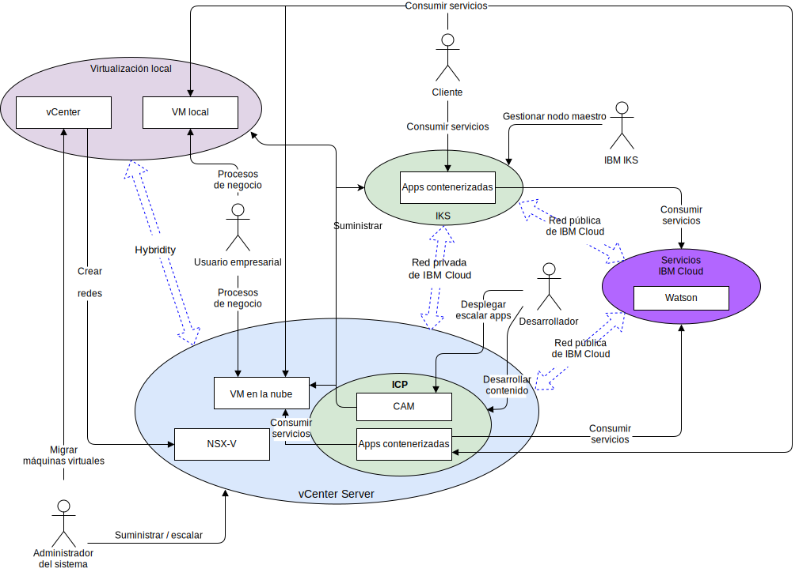

---

copyright:

  years:  2016, 2019

lastupdated: "2019-03-13"

subcollection: vmware-solutions

---

# Contexto del sistema
{: #vcsnsxt-systemcontext}

El diagrama de contexto de sistema define los elementos principales de un sistema, el límite del sistema, las entidades que interactúan con el mismo, junto con las interacciones. Se trata de un diagrama general que proporciona al lector una vista inicial del sistema.

Figura 1. Contexto del sistema

Los cuatro componentes principales, desde una perspectiva de red, son los siguientes:
- **Virtualización local**: un entorno VMware alojado en el entorno local del cliente o en un tercero y que actualmente aloja las máquinas virtuales (VM) que ejecutan las aplicaciones que se van a modernizar. Es el entorno de origen para las migraciones de VM y se acopla ligeramente a una instancia de {{site.data.keyword.cloud}} mediante VMware HCX.
- **vCenter Server**: una instancia de {{site.data.keyword.vmwaresolutions_short}} destinada a las VM migradas desde el entorno local. Junto con la virtualización local, forma un entorno híbrido que permite que las VM se muevan de un sitio al otro.
- **{{site.data.keyword.containerlong_notm}}**: utiliza Kubernetes como solución de coordinación de contenedores. IBM funciona y gestiona el nodo maestro Kubernetes, mientras que los nodos trabajadores se despliegan en la infraestructura gestionada por el cliente. IBM proporciona herramientas de gestión para el despliegue de parches del sistema operativo, las actualizaciones del motor Docker y las nuevas versiones de Kubernetes. {{site.data.keyword.containerlong_notm}} proporciona una plataforma aislada y segura para gestionar contenedores que es portátil, extensible y con capacidad de reparación automática si se produce una migración tras error.
- **IBM Cloud Private**: una plataforma de aplicaciones para desarrollar y gestionar aplicaciones contenerizadas. Se trata de un entorno integrado que incluye el coordinador de contenedores Kubernetes, un repositorio de imágenes privadas, una consola de gestión, infraestructuras de supervisión y una interfaz gráfica de usuario, que proporciona una ubicación centralizada desde la que puede desplegar, gestionar, supervisar y escalar aplicaciones.
- **IBM Cloud Services**: una amplia gama de servicios disponibles desde {{site.data.keyword.cloud_notm}} que son consumibles. Las opciones de servicio incluyen análisis, IA e IoT como ejemplos.

## Actores
{: #vcsnsxt-systemcontext-actors}

El diagrama del contexto del sistema identifica los siguientes actores.

Tabla 1. Actores

Actor  |  Descripción
---|---
Administrador del sistema |Los administradores del sistema son los recursos de VMware de empresa que utilizan vCenter y el plugin HCX. Identifican los candidatos a la migración, amplían las redes, migran las VM y gestionan NSX-V. Utilizan la consola de {{site.data.keyword.cloud_notm}} para suministrar instancias de VMware vCenter Server en instancias de {{site.data.keyword.cloud_notm}} y para escalar la capacidad.
Desarrollador	| Los desarrolladores son los recursos expertos en contenedores de la empresa que utilizan las consolas de {{site.data.keyword.containerlong_notm}}, {{site.data.keyword.icpfull_notm}} y CAM y las API para crear y gestionar contenedores. Crean los nuevos servicios como parte de la modernización de la aplicación.
Usuario de empresa | Este recurso de empresa requiere acceso de red a las aplicaciones para llevar a cabo procesos de empresa, como por ejemplo la actualización de contenido.
Cliente | El cliente es un actor externo que quiere consumir servicios de la empresa. Para Acme Skateboards, es un skater que quiere comprar productos de skating. El cliente requiere acceso seguro a Internet para acceder al catálogo.
{{site.data.keyword.containerlong_notm}} | Se trata de un recurso de IBM que gestiona el nodo maestro {{site.data.keyword.containerlong_notm}} del servicio.

## Sistemas
{: #vcsnsxt-systemcontext-systems}

El diagrama del contexto del sistema identifica los siguientes sistemas.

Tabla 2. Sistemas

Actor | Descripción
---|---
vCenter | vCenter es la interfaz primaria que utiliza el administrador del sistema para gestionar las VM locales y para acceder al plugin HCX para ampliar las redes y migrar las VM. Con vCenter Server con el paquete híbrido (Hybridity), el administrador del sistema puede integrar fácilmente redes vSphere locales en instancias de vCenter Server que se ejecutan en {{site.data.keyword.cloud_notm}}. La red híbrida amplía las redes locales a {{site.data.keyword.cloud_notm}}, lo que permite a los clientes migrar sus aplicaciones a una instancia de vCenter Server que se ejecuta en {{site.data.keyword.cloud_notm}} y de nuevo al entorno local si es necesario. Para obtener más detalles sobre vCenter Server con Hybridity Bundle, consulte
[Arquitectura de la solución VMware HCX on {{site.data.keyword.cloud_notm}}](/docs/services/vmwaresolutions/services?topic=vmware-solutions-hcx-archi-intro#hcx-archi-intro).
VM locales | Las VM locales alojan las aplicaciones que se migran a la nube. Inicialmente, se migran como VM y luego mediante el proceso de modernización de aplicaciones migradas desde las VM a los contenedores.
VM en la nube | Las VM en la nube alojan las aplicaciones que se han migrado desde el entorno local. Se comunican con aplicaciones locales a través de la red L2 ampliada. En el caso de esta arquitectura de referencia y en este ejemplo de Acme Skateboards, una de las VM de la nube es un servidor de bases de datos, que forma parte de la carga de trabajo con presencia en línea.
NSX-V | NSX-V en vCenter Server proporciona la red de superposición definida por software que gestiona el administrador del sistema. La red de superposición es el destino de las redes ampliadas HCX, ya que maneja el tráfico procedente de las VM para {{site.data.keyword.icpfull_notm}}. NSX-V proporciona la arquitectura de referencia con características como, por ejemplo, el despliegue, la reconfiguración y la destrucción de redes virtuales bajo demanda y servicios de microsegmentación dentro de VMware utilizando los conmutadores distribuidos de vSphere (vDS). Para obtener más información, consulte [Visión general de NSX-V](/docs/services/vmwaresolutions/archiref/vcsnsxt?topic=vmware-solutions-vcsnsxt-overview-ic4vnsxv).
CAM | {{site.data.keyword.cloud_notm}} Automation Manager (CAM) se ejecuta en {{site.data.keyword.icpfull_notm}} y proporciona un único panel para suministrar cargas de trabajo basadas en VM junto con cargas de trabajo basadas en Kubernetes utilizando plantillas. CAM permite al desarrollador:   - Suministrar cargas de trabajo en vCenter Server, {{site.data.keyword.icpfull_notm}} o {{site.data.keyword.containerlong_notm}}.  - Componer y coordinar servicios que procedentes tanto de VM como de contenedores.   - Integrar sus cadenas de herramientas de DevOps y la solución ITSM del segundo día.
Aplicaciones contenerizadas | Las apps que han pasado por el proceso de modernización de aplicaciones y que ahora se ejecutan como contenedores. En el caso de esta arquitectura de referencia y en este ejemplo de Acme Skateboards, una de las apps contenerizadas es un servidor web que forma parte de la carga de trabajo con presencia en línea.
Watson | En el caso de esta arquitectura de referencia y en este ejemplo de Acme Skateboards, Watson representa el servicio de IA que se utiliza en la arquitectura "Concept Car".

## Enlaces relacionados
{: #vcsnsxt-systemcontext-related}

* [Visión general de vCenter Server on {{site.data.keyword.cloud_notm}} con el paquete híbrido (Hybridity)](/docs/services/vmwaresolutions/archiref/vcs?topic=vmware-solutions-vcs-hybridity-intro)
