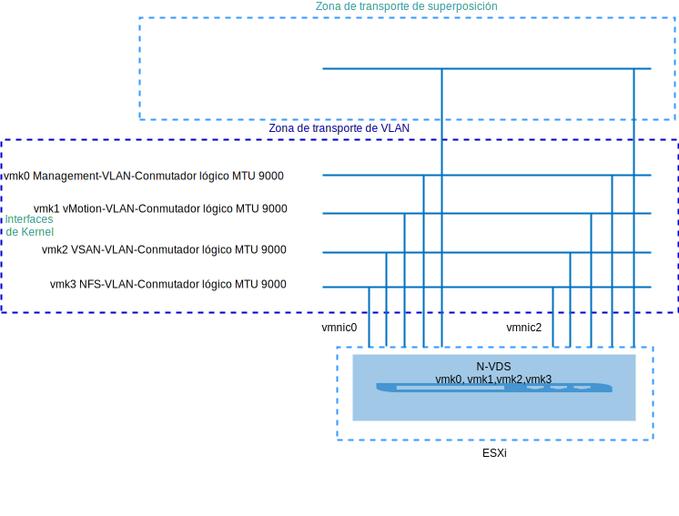
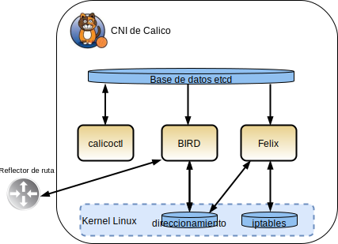
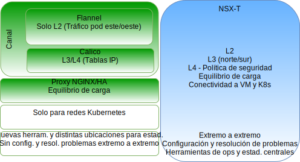
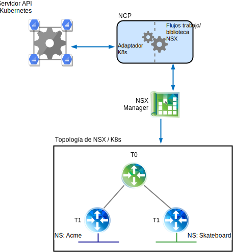
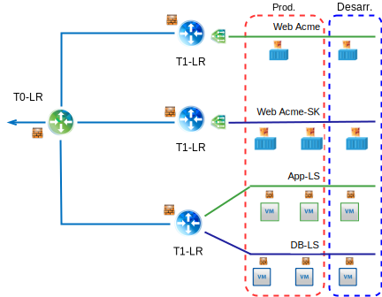
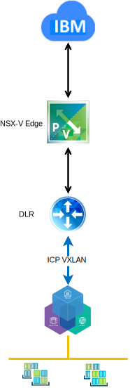
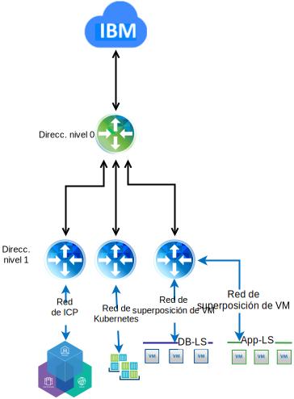

---

copyright:

  years:  2016, 2019

lastupdated: "2019-05-09"

subcollection: vmware-solutions

---

# Presentación técnica de VMware NSX-T on VMware vCenter Server on IBM Cloud
{: #vcsnsxt-techpreview}

## Visión general de NSX–T
{: #vcsnsxt-techpreview-nsx-t-ovw}

VMware NSX-T está diseñado para ofrecer entornos de aplicaciones y arquitecturas que tienen puntos finales y pilas de tecnologías heterogéneos. Junto con vSphere, estos entornos pueden incluir otros hipervisores, KVM, contenedores y servidores nativos. NSX-T permite a los equipos de TI y de desarrollo elegir las tecnologías que mejor se adaptan a sus aplicaciones. NSX-T también está diseñado para la gestión, las operaciones y el consumo por parte de las organizaciones de desarrollo, además de las organizaciones de TI.

En este diseño, la infraestructura de gestión de NSX-T se despliega en el clúster de vCenter Server inicial o se despliega en un clúster existente.

Se asigna a NSX-T Manager una dirección IP del bloque de direcciones portátiles privadas que está destinado a los componentes de gestión y configurado con los servidores DNS y NTP comunes.

Se despliega y se utiliza un clúster adicional como nodos de transporte de hipervisor, junto con el almacenamiento vSAN o NFS que se utiliza como almacén de datos de las cargas de trabajo. En la Tabla 1 se resumen los requisitos de un entorno de tamaño medio.

Tabla 1. Especificaciones de componentes de NSX-T

Recursos	|NSX-T Manager	|Controlador x 3	|Extremo x 2	|Extremo nativo*
---|---|---|---|---
Tamaño mediano	|Dispositivo virtual	|Dispositivo virtual	|Dispositivo virtual	|Servidor físico*
Número de vCPU	|4	|4	|4	|8
Memoria	|16 GB	|16 GB	|8 GB	|32 GB
Disco	|140 GB de vSAN o la compartición de NFS de gestión.	|120 GB de vSAN o la compartición de NFS de gestión.	|120 GB de vSAN o la compartición de NFS de gestión.	|200 GB
Tipo de disco	|Ligero suministrado	|Ligero suministrado	|Ligero suministrado	|Físico
Red	|Privada A portátil diseñada para los componentes de gestión.	|Privada A portátil diseñada para los componentes de gestión.	|Privada A portátil diseñada para los componentes de gestión.	|Privada A portátil diseñada para los componentes de gestión.

\* **Nota**: consulte la lista de compatibilidad de hardware para ver requisitos específicos.

### Configuración inicial
{: #vcsnsxt-techpreview-init-config}

Despliegue NSX-T Manager, un clúster controlador que consta de tres controladores y un clúster de extremo dentro del clúster de vCenter Server inicial. Asigne direcciones IP a todos los componentes desde la subred portátil **Privada A**.

Cree reglas de antiafinidad de VM-VM de modo que los controladores queden separados entre los hosts del clúster. El clúster inicial se despliega con un mínimo de tres nodos para asegurar la alta disponibilidad para los controladores.

Despliegue dos hosts vSphere más para NSX-T Manager e instale en ellos el software NSX-T (VIB). Cree los perfiles de host y de enlace ascendente y el perfil de NIOC y defina la agrupación de IP que se utiliza para la comunicación entre puntos finales del túnel. Para obtener más información, consulte la tabla de definiciones de perfil de enlace ascendente y la tabla de definiciones de perfil NIOC.

Las direcciones IP definidas en las agrupaciones son del rango de direcciones IP portátiles de la red **Privada A**. Se crean zonas de transporte de VLAN y de superposición, y se configuran los dos hosts ESXi adicionales como nodos de transporte para ambas zonas. Actualmente, se asignan los perfiles de enlace ascendente equivalentes. Cree un conmutador N-VDS en los hosts ESXi y asígnelo a uplink1 y uplink2.

En ese momento, se necesitan dos VLAN adicionales para acomodar las políticas de agrupación, migración tras error y enlace ascendente para la migración de puertos vmkernel desde el grupo de puertos vDS a los conmutadores VLAN lógicos NSX-T. Los conmutadores VLAN lógicos se crean con los ID de VLAN adecuados y los puertos vmkernel se migran.

NSX-T crea vmk10, que se utiliza para la interfaz de encapsulación, y vmk50, que se utiliza para el tránsito interno de Tier0 y para las subredes de tránsito interno Tier0-Tier1 en los hosts ESXi. De forma predeterminada, se utiliza la subred 169.254.0.0/28 para el tránsito interno de Tier0 y la subred 100.64.0.0/16 para el tránsito Tier0-Tier1.

Tabla 2. Definición de perfiles de enlace ascendente (uplink)

Perfil de uplink	|Especificación
---|---
LAG	|Ninguna definida actualmente.
Agrupación	|Migración tras error (Failover): Activa = Uplink1 = vmnic0, En espera= Uplink2 = vmnic2
VLAN de transporte	|0
MTU	|9000

Tabla 3. Definición de perfiles de NIOC

Tipo de tráfico/Nombre de tráfico	|Límite (%)	|Comparticiones	|Reserva (%)
---|---|---|---
Tráfico de gestión	|Ilimitado	|20	|0
Tráfico de máquina virtual	|Ilimitado	|30	|0
Tráfico tolerante a errores	|Ilimitado	|50	|0
Tráfico de réplica de vSphere	|Ilimitado	|50	|0
Tráfico de iSCSI	|Ilimitado	|50	|0
Tráfico de seguridad de protección de datos de vSphere	|Ilimitado	|50	|0
Tráfico de vMotion	|Ilimitado	|50	|0
Tráfico de NFS	|Ilimitado	|100	|0
Tráfico de vSAN	|Ilimitado	|100	|0

## NSX-T
{: #vcsnsxt-techpreview-nsx-t}

Este diseño especifica la configuración de los componentes de NSX-T, la VLAN y las zonas de transporte de superposición, pero no aplica ninguna configuración de componente de red de superposición. El diseño de la superposición de red según sus necesidades depende de usted.

Se configura lo siguiente:
-	Los servidores de gestión y los controladores se instalan.
-	Los agentes ESXi se instalan y se configura una agrupación de direcciones IP del punto final de túnel para los nodos de transporte.
-	Los nodos de transporte se configuran para las zonas de transporte de VLAN y de superposición.
-	N-VDS se crea en los nodos de transporte de ESXi.
-	Los puertos de VMkernel se migran desde VSS/VDS a N-VDS.
-	Direccionador de nivel 0 para que lo utilicen los componentes de gestión.

Lo que NO se configura:
-	Conmutadores lógicos de superposición.
-	Microsegmentación.
-	Gestión de NSX enlazada con otras instancias de VMware.

### vCenter Server con NSX-V y NSX-T
{: #vcsnsxt-techpreview-vcs-nsx-v-nsx-t}

El clúster de vCenter Server original contiene todos los componentes de gestión para NSX-V y NSX-T, junto con los dispositivos del servidor de vCenter. Los hosts de este clúster están preparados para NSX-V, tal como se describe en el apartado [Visión general de NSX-V](/docs/services/vmwaresolutions/archiref/vcsnsxt?topic=vmware-solutions-vcsnsxt-overview-ic4vnsxv). Los hosts del segundo clúster están preparados para NSX-T y configurados como nodos de transporte. Esta configuración proporciona a los clientes la posibilidad de migrar de NSX-V a NSX-T si así lo deciden.

### NSX-T frente a NSX-V
{: #vcsnsxt-techpreview-nsx-t-vs-nsx-v}

En la siguiente información se explica la principal diferencia entre los productos SDN de VMware, NSX-V y NSX-T. Ambas soluciones proporcionan microsegmentación dentro de un entorno de VMware, pero NSX-T va un poco más allá, tal como se describe en las siguientes secciones.

Para ver las diferencias detalladas en su arquitectura, consulte la [Guía de diseño de referencia de VMware NSX-T](https://communities.vmware.com/servlet/JiveServlet/download/37591-3-195840/VMware%20NSX-T%20Reference%20Design%20Guide.pdf) (descarga de PDF).

#### NSX for vSphere
{: #vcsnsxt-techpreview-nsx-vsphere}

NSX-V está pensado solo para despliegues de vSphere y se ha diseñado para que un único NSX-V Manager se enlace a una única instancia de VMware vCenter Server. Básicamente, si necesita virtualización de red dentro del entorno de VMware, NSX-V es la solución adecuada.

Características de NSX-V:
-	Se centra en VMware.
-	Diseñado para SDN dentro de vSphere (un solo panel para la virtualización de red en la interfaz de usuario de vSphere).
-	Utiliza el protocolo de encapsulación de VXLAN (admitido por la mayoría de los proveedores de terceros).
-	Los NIC físicos no son propiedad de NSX-V; se asignan a los conmutadores distribuidos virtuales (vDS) SDDC-Dswitch-Private y SDDC-Dswitch-Public.
-	Diferencias terminológicas: Distributed Logical Router (DLR) para el tráfico este-oeste y Edge Service Gateway (ESG) para el tráfico norte-sur.

#### NSX Transformers
{: #vcsnsxt-techpreview-nsx-transformers}

NSX-T es una solución autónoma para entornos vCenter y vSphere, pero también da soporte a KVM, a la nube pública y a contenedores y se puede integrar en infraestructuras como {{site.data.keyword.containerlong_notm}} e {{site.data.keyword.icpfull_notm}}, Redhat OpenShift, Pivotal y otras. NSX-T le proporciona la capacidad de gestionar el SDN entre varios hipervisores, contenedores y nubes.

Características de NSX-T
-	Producto autónomo. No se necesita vCenter.
-	Soporte de varios hipervisores
    - Los controladores se pueden desplegar en KVM o ESXi.
    - Los extremos se pueden desplegar como virtuales o como nativos.
-	Integración de contenedor (plug-in de NSX-T CNI).
-	Soporte de OpenSwitch (OvS).
- Direccionamiento optimizado de varios niveles:
    - Anuncio de rutas en el direccionador de nivel 1.
    - Redistribución de rutas en el direccionador de nivel 0.
-	Utiliza el protocolo de encapsulación Geneve.
-	Los NIC físicos son propiedad del nodo de transporte NSX-T y se asignan a N-VDS.
-	Diferencias terminológicas: direccionador lógico de nivel 1 para el tráfico este-oeste y direccionador lógico de nivel 0 para el tráfico norte-sur.

## Calico
{: #vcsnsxt-techpreview-calico}

Calico se basa en una arquitectura distribuida con capacidad de escalado que ofrece la posibilidad de pasar de un simple portátil de un desarrollador a grandes despliegues de empresa, y utiliza un plano de datos Linux estándar para ofrecer rendimiento nativo para cargas de trabajo virtuales. Calico se compone de varios componentes independientes:
-	Felix, un daemon que se ejecuta en cada nodo que aloja un punto final, un contenedor o una máquina virtual. Felix es el responsable de la gestión de la interfaz, la programación de ruta y acl, el direccionamiento al punto final, la validación del tráfico entre puntos finales y la creación de informes de estado, básicamente del estado de la red para el host que gestiona.
- Plugin Orchestrator, que enlaza el plugin de coordinador a Calico, en este caso los plugins de Kubernetes, proporciona la conversión de API de Kubernetes a Calico y suministra comentarios de Calico a Kubernetes sobre configuraciones de red fallidas de puntos finales.
-	etcd, proporciona la comunicación entre los componentes y se almacena en un almacén de datos coherente, lo que garantiza que Calico siempre puede crear una red precisa.
-	BIRD, proporciona funciones de cliente BGP en cada nodo que también aloja Felix. Cuando Felix inserta una ruta en el kernel de Linux, el cliente BGP elige las rutas y las distribuye a otros nodos del despliegue. En el caso de entornos de gran tamaño, también se despliega un reflector de ruta BGP, que actúa como punto central para que se conecten los clientes BGP. Esto evita que cada cliente tenga que hablar con todos los demás clientes y distribuir las rutas a los otros nodos del despliegue.

### NSX-T y Calico
{: #vcsnsxt-techpreview-nsx-t-calico}

#### Detalles del componente NSX-T
{: #vcsnsxt-techpreview-nsx-t-comp-details}

La arquitectura NSX-T tiene separación integrada del plano de datos, el plano de control y el plano de gestión. Esta separación ofrece varias ventajas, que incluyen escalabilidad, rendimiento, resiliencia y heterogeneidad. Entre las principales características de la arquitectura destacan las siguientes:
-	Plano de gestión: el plano de gestión NSX-T se ha diseñado desde la base con tecnología avanzada de agrupación en clústeres, que permite que la plataforma procese solicitudes de API simultáneas a gran escala.
-	Plano de control: el plano de control de NSX-T realiza un seguimiento de la red virtual en tiempo real y del estado de seguridad del sistema. El plano de control de NSX-T divide el plano de control en un plano de control de clúster central (CCP) y un plano de control local (LCP). Esto simplifica significativamente el trabajo del CCP y permite a la plataforma ampliar y escalar para puntos finales heterogéneos.
-	Plano de datos: el plano de datos de NSX-T incorpora un conmutador de host (en lugar de confiar en el vSwitch), que lo desacopla del gestor de cálculo y normaliza la conectividad de red. Todas las operaciones de creación, lectura, actualización y supresión (CRUD) se realizan mediante NSX-T Manager.

#### Diferencias entre Calico y NSX
{: #vcsnsxt-techpreview-diff-calico-nsx}

Calico es un proyecto de código abierto de Tigera y principalmente es el equipo de Tigera el que realiza el mantenimiento. Se suministra como un CNI que ofrece redes y seguridad para sistemas de coordinación como Kubernetes, que utilizan tanto {{site.data.keyword.containerlong_notm}} como {{site.data.keyword.icpfull_notm}}.

Calico crea y gestiona una red plana de capa 3, asignando a cada carga de trabajo una dirección IP totalmente direccionable. Las cargas de trabajo se pueden comunicar sin la encapsulación de IP ni la conversión de direcciones de red ofrecer rendimiento en el entorno nativo, facilitar la resolución de problemas y mejorar la interoperatividad. En entornos que requieren una superposición, Calico utiliza túneles de tipo IP-en-IP o puede trabajar con otras redes de superposición, como Flannel. Existe un proyecto de código abierto llamado Canel, que constituye una labor de esfuerzo para proporcionar la instalación de Calico y Flannel al mismo tiempo y proporcionar la conexión de red de VXLAN instantánea, a la vez que le permite aprovechar el aislamiento de políticas con políticas de Calico.

Calico se compone de varios componentes interdependientes que proporcionan comunicación de punto final, seguridad, direccionamiento e integración de plugins con Kubernetes. Todo esto se realiza desde la línea de mandatos y con un archivo de configuración, lo que dificulta el suministro de políticas de red y de seguridad coherentes en un entorno híbrido. Para obtener más información sobre los componentes de Calico, consulte la documentación del [proyecto Calico](https://www.projectcalico.org/).

NSX-T es una solución autónoma para entornos vCenter y vSphere, y también da soporte a KVM, a la nube pública y a contenedores y se puede integrar en infraestructuras como {{site.data.keyword.containerlong_notm}} e {{site.data.keyword.icpfull_notm}}, Redhat OpenShift, Pivotal y otras. Esto le proporciona la capacidad de gestionar el SDN entre varios hipervisores, contenedores y la nube. NSX-T funciona en las capas 2, 3 y 4 y proporciona funciones en cada capa.

NSX-T permite la gestión de políticas de red y de seguridad a través de un entorno de VM y contenedor en una interfaz web fácil de entender.

## NSX-T y Kubernetes
{: #vcsnsxt-techpreview-nsx-t-kube}

El componente principal que proporciona la integración entre Kubernetes y el gestor de NSX es el plugin NSX Container (NCP). El NCP se ejecuta como contenedor dentro de un pod de Kubernetes y supervisa y observa los cambios en objetos relevantes en el servidor de API de Kubernetes, como espacios de nombres y pods. Los desarrolladores ejecutan tareas en el lado de Kubernetes y NCP ve dichos cambios y reacciona creando los objetos NSX relacionados, como conmutadores lógicos, direccionadores lógicos y objetos de cortafuegos, utilizando una recopilación de llamadas de API destinadas al gestor de NSX.

En el siguiente ejemplo se suministran dos espacios de nombres de Kubernetes, Acme y Skateboards; para cada espacio de nombres tenemos un conmutador lógico dedicado, un direccionador de capa 1 y un segmento IP que lo conecta a un direccionador lógico T0.

### Gestor de políticas de seguridad de NSX
{: #vcsnsxt-techpreview-nsx-sec-policy-manager}

Además de proporcionar virtualización de red, NSX-T también sirve como plataforma de seguridad avanzada, que proporciona un amplio conjunto de características para agilizar el despliegue de soluciones de seguridad. En la siguiente información se describen las funciones de microsegmentación que se pueden aplicar a través de varias plataformas.

Entre los conceptos clave para el análisis se incluyen:
-	Cortafuegos distribuido de NSX-T, que proporciona protección con estado de la carga de trabajo a nivel de vNIC. La imposición de DFW se produce en el kernel del hipervisor, lo que ayuda en la microsegmentación.
-	Modelo de políticas de seguridad uniforme para el despliegue local y en la nube, con soporte de multihipervisor (es decir, ESXi y KVM) y de varias cargas de trabajo, con un nivel de granularidad que llega hasta los atributos de VM y de contenedor.
-	Gestión de cálculo agnóstica, con soporte de hipervisores gestionados por distintos gestores de cálculo, al tiempo que permite aplicar cualquier política de microsegmentación definida a través de hipervisores que abarcan varios entornos de vCenter.
-	El cortafuegos NSX-T Edge sirve como servicio de cortafuegos centralizado con estado para el tráfico de N-S. El cortafuegos de extremo se implementa por direccionador lógico y recibe soporte tanto en la capa 0 como en la capa 1. El cortafuegos de extremo es independiente de NSX-T DFW desde la perspectiva de la configuración e imposición de políticas.
-	Agrupación dinámica de objetos en construcciones lógicas llamadas NSGroups, en función de diversos criterios que incluyen etiqueta, nombre de máquina virtual, subred y conmutador lógico.
-	El ámbito de la imposición de políticas puede ser selectivo, con granularidad de nivel de aplicación o de carga de trabajo.
-	Distributed Network Encryption (DNE) proporciona confidencialidad e integridad de los datos que fluyen por la red.
-	El mecanismo de descubrimiento de IP identifica de forma dinámica direccionamientos de cargas de trabajo.
-	SpoofGuard bloquea la suplantación de IP a nivel de vNIC.
-	La seguridad del conmutador proporciona control de tormentas y protección frente al tráfico no autorizado.

### Diferencias entre NSX–T y NSX-V
{: #vcsnsxt-techpreview-diff-nsx-t-nsx-v}

NSX for vSphere (NSX-V) está pensado solo para despliegues de vSphere y se ha diseñado para que un único gestor de NSX-V se enlace a una única instancia de VMware vCenter Server. Básicamente, si necesita virtualización de red dentro del entorno de VMware, NSX-V es probablemente la solución adecuada.

NSX Transformers (NSX-T) es una solución autónoma que puede dar soporte a más de un entorno vCenters y vSphere, que también da soporte a KVM, a la nube pública y a contenedores y que se puede integrar en infraestructuras como {{site.data.keyword.containerlong_notm}} e {{site.data.keyword.icpfull_notm}}, Redhat OpenShift, Pivotal y otras. Esto le proporciona la capacidad de gestionar el SDN entre más de un hipervisor, contenedor y nube con un conjunto común de herramientas.

#### Escalabilidad de red con NSX-V
{: #vcsnsxt-techpreview-net-scalability-nsx-v}

VMware NSX-V está diseñado para ofrecer entornos de aplicaciones y arquitecturas que tienen miles de puntos finales y pilas de tecnologías, lo que le permite abarcar desde un solo clúster vSphere con tres hosts hasta un despliegue entre vCenters con más de mil hosts y miles de máquinas virtuales.

#### Escalabilidad de red con NSX-T
{: #vcsnsxt-techpreview-net-scalability-nsx-t}

VMware NSX-T está diseñado para ofrecer entornos de aplicaciones y arquitecturas que tienen puntos finales y pilas de tecnologías heterogéneos, lo que le abarcar cualquier sitio, cualquier nube o cualquier dispositivo de punto final. Esto permite que se pueda escalar desde un pequeño centro de datos hasta a un entorno de varias nubes.

#### Seguridad con NSX-V
{: #vcsnsxt-techpreview-sec-nsx-v}

VMware NSX-V le permite establecer políticas de seguridad definidas de forma coherente en todo el entorno, independientemente del tipo de aplicación o de dónde se despliegue dentro de la infraestructura de VMware. A medida que se despliegan nuevas cargas de trabajo, heredan automáticamente las políticas de seguridad y se quedan con esas cargas de trabajo a lo largo de su ciclo de vida, sin importar dónde se suministren o a dónde se trasladen. NSX desacopla la política de seguridad de los atributos de red estáticos como, por ejemplo, la dirección IP, el puerto y el protocolo, y permite definir políticas basadas en una comprensión contextual de la aplicación y de la infraestructura. NSX también permite insertar servicios de seguridad avanzados de terceros en un determinado microsegmento, en lugar de direccionar todo el tráfico a través de un dispositivo físico o virtual. De este modo, se pueden insertar servicios de seguridad avanzados en los lugares adecuados y en el momento adecuado, maximizando la eficiencia del tráfico de la red al tiempo que aumenta la eficacia de los propios servicios de seguridad.

#### Seguridad con NSX-T
{: #vcsnsxt-techpreview-sec-nsx-t}

VMware NSX-T proporciona las mismas funciones que NSX-V en un entorno de VMware vSphere. NSX-T ofrece una seguridad de microsegmentación coherente y escalable para la aplicación que se ejecuta en entornos de nube privados y públicos, como {{site.data.keyword.cloud}} Private e {{site.data.keyword.containerlong_notm}}, junto con otras ofertas de nube.

#### Integración con NSX-V
{: #vcsnsxt-techpreview-integration-nsx-v}

Para la integración de NSX-V con Kubernetes, la automatización de {{site.data.keyword.cloud_notm}} instala {{site.data.keyword.icpfull_notm}} en una instancia de vCenter Server. Se crean un conmutador dedicado/VXLAN, DLR y ESG específicamente para la red de Kubernetes. La red de superposición del día 1 para {{site.data.keyword.icpfull_notm}} es una subred de 192.168.20.0/24 con direccionamiento configurado a través del ESG para acceder a la red subyacente.

#### Integración con NSX-T
{: #vcsnsxt-techpreview-integration-nsx-t}

La integración de NSX-T con Kubernetes se realiza mediante el plugin de contenedor NSX-T (NCP). NCP se ejecuta en cada nodo de Kubernetes y se comunica con NSX Manager y con el plano de control de Kubernetes. El plugin NSX-T crea automáticamente una topología lógica para el clúster de Kubernetes, crea redes lógicas independientes para cada espacio de nombres, conecta pods de Kubernetes a redes lógicas y asigna direcciones IP y MAC.

El cortafuegos distribuido de NSX-T permite la creación de políticas de red, que se implementan para el clúster de Kubernetes. Da soporte a políticas de entrada y de salida, etiquetas y políticas de coincidencia de expresión y tiene prestaciones de equilibrador de carga, que se pueden aplicar a la infraestructura de Kubernetes.

## Enlaces relacionados
{: #vcsnsxt-techpreview-related}

* [Guía de diseño de consulta de VMware NSX-T](https://communities.vmware.com/servlet/JiveServlet/download/37591-3-195840/VMware%20NSX-T%20Reference%20Design%20Guide.pdf) (descarga de PDF)
* [Ruta a Cloud NSX-T](https://www.routetocloud.com/category/nsx-t/)
* [Contenedores VMware y red de contenedores para los ingenieros de redes](https://www.vmware.com/content/dam/digitalmarketing/vmware/en/pdf/products/nsx/vmware-containers-and-container-networking-whitepaper.pdf)
