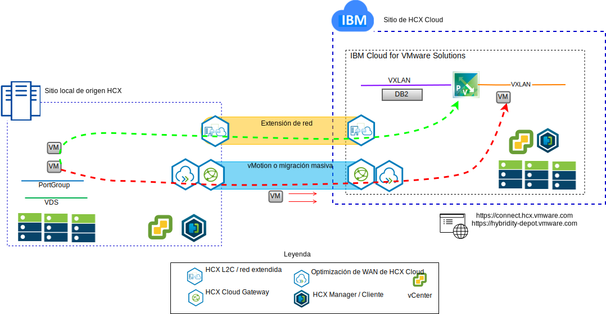
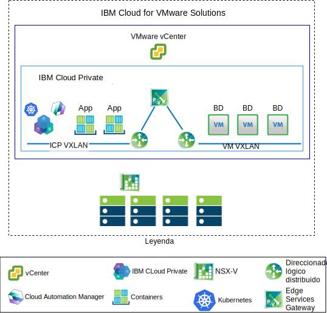

---

copyright:

  years:  2016, 2019

lastupdated: "2018-01-14"

---

# Casos prácticos

## Migración de cargas de trabajo de VMware a IBM Cloud

Acme Skateboards desea extender su instancia local de VMware SDDC a una instancia de VMware vCenter Server on {{site.data.keyword.cloud}}. Necesitan mantener su negocio activo y en funcionamiento y minimizar el tiempo de inactividad. Volver a configurar sus aplicaciones para que se ejecuten en la nube no es la solución óptima.

VMware vCenter Server on {{site.data.keyword.cloud_notm}} con el paquete híbrido (Hybridity) permite crear una conexión sencilla entre instancias de vCenter Server y el centro de datos local virtualizado
de VMware.

Los componentes de VMware HCX, que se despliegan como máquinas virtuales (VM) en el sitio de destino de vCenter Server, permiten establecer una conexión con los componentes de
VMware HCX instalados en el sitio local de origen homólogo.

Figura 1. Servicio VMware Hybrid Cloud Extension

La interconectividad ligeramente acoplada entre un entorno local e {{site.data.keyword.cloud_notm}} y ofrece prestaciones como las siguientes:
- **Interconectividad sencilla**: las conexiones de red lógicas se establecen fácilmente sobre cualquier conexión física, como internet pública, VPN privada o enlace directo.
- **Extensión de capa 2**: las redes locales se amplían a la nube, incluidas subredes locales y direccionamiento IP.
- **Cifrado**: el tráfico de red se cifra de forma segura entre los dos lados.
- **red optimizada**: selecciona la mejor conexión y gestiona la conexión de forma eficiente de modo que el tráfico se transmite de la forma más rápida posible.
- **Desduplicación de datos**: se puede conseguir una reducción del 50% en el tráfico de red.
- **Direccionamiento inteligente**: cuando se mueve una carga de trabajo, el direccionamiento de proximidad puede cambiar la vía de acceso de red (es decir, la pasarela) para que el tráfico de la red utilice la pasarela del sitio de destino y no lo "devuelva" (hairpin) al sitio de origen.
- **Migración con tiempo de inactividad cero**: un sistema en ejecución se puede mover a la nube (o recuperar de la misma) mediante vMotion.
- **Migración planificada**: se puede replicar el número deseado de VM en el sitio de destino y luego se pueden activar en dicho sitio en el momento planificado para que sustituyan a los sistemas que se ejecutan en el sitio de origen.
- **Migración de políticas de seguridad**: si NSX se utiliza en local, las políticas de seguridad, los cortafuegos, etc., se trasladan junto con la carga de trabajo.

## Despliegue de una arquitectura híbrida

Acme Skateboards desea desplegar una arquitectura híbrida en {{site.data.keyword.cloud_notm}}, consistente en vCenter Server con paquete híbrido (Hybridity) e {{site.data.keyword.icpfull_notm}}, para su proceso de modernización de aplicaciones. Los requisitos son ejecutar sus bases de datos en VM y las apps y las interfaces web en contenedores y utilizar un conjunto común de herramientas para la gestión de red y de la seguridad.

{{site.data.keyword.vmwaresolutions_short}} proporciona la automatización para desplegar componentes de tecnología VMware en {{site.data.keyword.CloudDataCents_notm}} en todo el mundo. La arquitectura consta de una sola región de nube y permite la ampliación a más regiones de nube ubicadas en otra geografía o en otro pod de {{site.data.keyword.cloud_notm}} dentro del mismo centro de datos.

Los productos {{site.data.keyword.icpfull_notm}} y Cloud Automation Manager (CAM) se pueden desplegar manualmente en la plataforma de virtualización local, lo que permite gestionar la nube desde la ubicación local. Como alternativa, {{site.data.keyword.icpfull_notm}} y CAM se ofrecen como extensiones de servicio de un despliegue de vCenter Server nuevo o existente, lo que permite gestionar la nube desde {{site.data.keyword.cloud_notm}}.

El diagrama siguiente representa {{site.data.keyword.icpfull_notm}} que se ejecuta en una instancia de vCenter Server. NSX-V está configurado con una conmutación/VXLAN dedicada, un direccionador lógico distribuido (DLR) y una Edge Services Gateway (ESG) específicamente diseñada para la red de superposición de {{site.data.keyword.icpfull_notm}}. El direccionamiento se configura a través del ESG para acceder a la red subyacente.

Mediante la automatización de {{site.data.keyword.cloud_notm}}, Acme Skateboards puede suministrar una solución híbrida que abarque vCenter Server para ejecutar sus VM de base de datos e {{site.data.keyword.icpfull_notm}} on vCenter Server para ejecutar sus aplicaciones y servicios web frontales en contenedores. NSX les ofrece un conjunto común de herramientas de gestión para red y seguridad en la red subyacente.

Para obtener más información sobre NSX-V, consulte [Visión general de NSX-V](vcsnsxt-overview-ic4vnsxv.html). Para obtener más información sobre las ofertas vCenter e {{site.data.keyword.icpfull_notm}}, consulte [vCenter Server e {{site.data.keyword.cloud_notm}} Private](../vcsicp/vcsicp-intro.html).

Figura 2. vCenter Server con {{site.data.keyword.icpfull_notm}}

Esto crea una interconectividad ligeramente acoplada entre un entorno local e {{site.data.keyword.cloud_notm}} y ofrece prestaciones como las siguientes:
-	**Interconectividad sencilla**: se establecen fácilmente conexiones de red lógicas sobre cualquier conexión física, como por ejemplo internet pública, VPN privada o enlace directo.
-	**Extensión de capa 2**: las redes locales se amplían a la nube, incluidas subredes locales y direccionamiento IP.
-	**Cifrado**: el tráfico de red se cifra de forma segura entre los dos lados.
-	**red optimizada**: selecciona la mejor conexión y gestiona la conexión de forma eficiente de modo que el tráfico se transmite de la forma más rápida posible.
-	**Desduplicación de datos**: se puede conseguir una reducción del 50% en el tráfico de red.
-	**Direccionamiento inteligente**: cuando se mueve una carga de trabajo, el direccionamiento de proximidad puede cambiar la vía de acceso de red (es decir, la pasarela) para que el tráfico de la red utilice la pasarela del sitio de destino y no lo "devuelva" (hairpin) al sitio de origen.
-	**Migración con tiempo de inactividad cero**: un sistema en ejecución se puede mover a la nube (o recuperar de la misma) mediante vMotion.
-	**Migración planificada**: se puede replicar el número deseado de VM en el sitio de destino y luego se pueden activar en dicho sitio en el momento planificado para que sustituyan a los sistemas que se ejecutan en el sitio de origen.
-	**Migración de políticas de seguridad**: si NSX se utiliza en local, las políticas de seguridad, los cortafuegos, etc., se trasladan junto con la carga de trabajo.

Con esta solución, Acme Skateboards ha podido migrar correctamente sus cargas de trabajo locales de VMware a {{site.data.keyword.cloud_notm}}, cumpliendo con los requisitos de tiempo de inactividad bajo y sin tener que volver a configurar las aplicaciones. Para obtener más información sobre vCenter Server con el paquete híbrido (Hybridity), consulte [Arquitectura de la solución VMware HCX on {{site.data.keyword.cloud_notm}}](https://www.ibm.com/cloud/garage/files/HCX_Architecture_Design.pdf).

### Enlaces relacionados

* [Visión general de vCenter Server on {{site.data.keyword.cloud_notm}} con el paquete híbrido (Hybridity)](../vcs/vcs-hybridity-intro.html)
