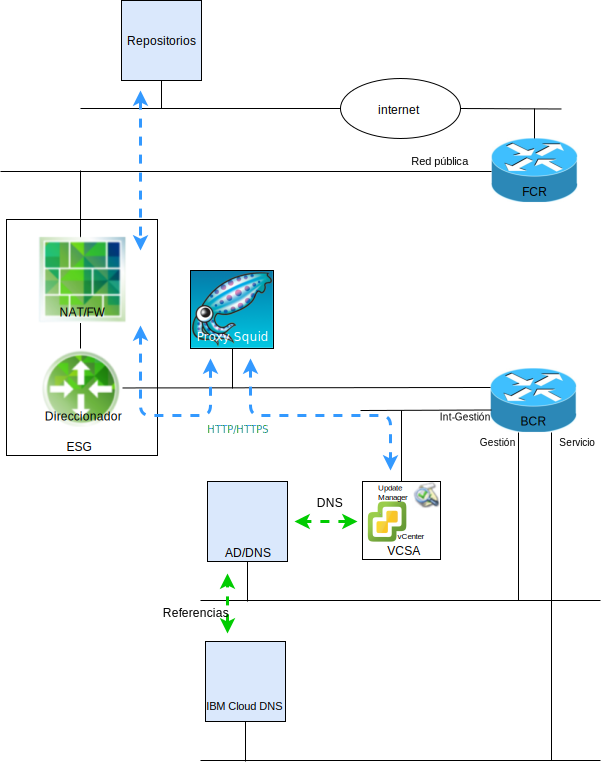

---

copyright:

  years:  2016, 2018

lastupdated: "2018-10-05"

---

# Introducción a VMware Update Manager

La finalidad de este documento es proporcionarle, como administrador del sistema de la instancia de IBM Cloud for VMware Solutions vCenter Server, instrucciones sobre cómo configurar VMware Update Manager (VUM) para mantener la moneda del entorno de vCenter Server.

VUM permite la gestión centralizada y automatizada de parches y versiones para VMware vSphere y le permite realizar las siguientes tareas en el entorno VCS:
* Actualizar y aplicar un parche a los hosts ESXi de vSphere.
* Instalar y actualizar software de terceros en los hosts.
* Actualizar el hardware de la máquina virtual, las herramientas de VMware y los dispositivos virtuales.

Tenga en cuenta que en este documento también se describen los procesos para mantener los siguientes componentes de la instancia de VCS:
* vCenter Server Appliance
* NSX
* vSAN

Este documento describe la implementación de un servidor proxy, basado en CentOS y en Squid, para habilitar VUM para acceder a los repositorios de VMware. Cuando VUM solicita un recurso desde el servidor de actualización en VMware, la solicitud se envía primero al servidor proxy y, a continuación, el servidor proxy envía la solicitud al servidor de actualizaciones a través de la Pasarela de servicios externos (ESG). Una vez que el servidor proxy ha obtenido el recurso, este lo envía a VUM.

Actualmente, VCS despliega vSphere 6.5, lo que significa que VUM ahora está integrado en vCenter Server Appliance (VCSA), y como el componente de cliente VUM es un plug-in que se ejecuta en el cliente web de vSphere, se habilita automáticamente después del despliegue de VCSA. Sin embargo, VUM no tendrá acceso a Internet para acceder a los repositorios de VMware.

Esta configuración documentada utiliza el modelo de despliegue VUM "all-in-one" conectado a Internet que utiliza la red pública de IBM Cloud para proporcionar acceso a Internet para descargar actualizaciones y parches.

Los clientes que requieren el uso de conexiones de Internet alternativas deben investigar el servicio de descargas de VMware vSphere Update Manager (UMDS), que queda fuera del ámbito de esta publicación.

Mientras que VUM se puede configurar para importar actualizaciones desde un repositorio compartido o importar parches y extensiones manualmente desde un archivo .zip, estos temas no se tratan en este documento.

Por lo tanto, tenga en cuenta que en vSphere 6.5 ya no se admite el registro de VUM en un VCSA durante la instalación del servidor VUM en una máquina Windows distinta. No puede desplegar VUM en una VM dentro del entorno VCS.

Este documento está organizado en las secciones siguientes:
* [Visión general de VUM](vum-overview.html): Esta sección describe el proceso VUM e introduce términos clave necesarios para comprender las operaciones y la interfaz de usuario de la herramienta
* **Instalación, configuración y uso**: en esta sección se describen los pasos necesarios para que VUM funcione en una instancia de VCS:
  - [Configuración inicial](vum-init-config.html): una tarea que se realiza una sola vez para:
      - Configurar la red NSX para permitir que el servidor proxy acceda a Internet
      - Instalar y configurar un servidor proxy para proporcionar acceso a Internet para VUM
      - Que la configuración inicial de VUM utilice el servidor proxy
  - [Recopilar metadatos](vum-metadata.html): VUM descarga metadatos sobre las actualizaciones, parches o extensiones mediante un proceso automático predefinido que puede modificar. VUM se pone en contacto con VMware en intervalos configurables regulares o con fuentes de terceros para recopilar los últimos metadatos sobre actualizaciones, parches o extensiones disponibles
  - [Crear líneas base y adjuntar objetos de inventario](vum-baselines.html): utilice las líneas base predefinidas y los grupos de línea base o cree uno personalizado. Las líneas base y los grupos de línea base se adjuntan a los objetos de inventario
  - [Exploración y revisión ](vum-scanning.html): se escanean los objetos de inventario y se revisan los resultados para determinar cómo cumplen con las líneas base y los grupos de línea base. Los resultados de la exploración se pueden filtrar por búsqueda de texto, selección de grupos, selección de línea base y selección de estado de conformidad
  - [Transferencia y corrección](vum-staging.html): los parches y las extensiones se pueden transferir opcionalmente en etapas antes de la corrección para asegurarse de que se descarguen en el host. Durante la corrección, VUM aplica parches, extensiones y actualizaciones al objeto de inventario

En este documento se da por supuesto que ha desplegado una instancia de VCS primaria o un número de instancias de VCS primarias separadas. Si tiene las instancias de VCS primarias y secundarias desplegadas y, por lo tanto, está utilizando el inicio de sesión único (SSO), consulte [vCenters enlazados con SSO ](vum-updating-vcsa.html).

Si ha desplegado un VCS mediante vSAN, consulte primero [Actualización de clústeres vSAN](vum-updating-vsan.html).

Si desea actualizar la automatización de gestión de infraestructura de IBM Cloud, utilice IBM Cloud para la consola de soluciones VMware.

La [consola de IBM Cloud for VMware Solutions](https://console.bluemix.net/infrastructure/vmware-solutions/console) le permite llevar a cabo las siguientes acciones:
*	Actualizar licencias por ejemplo, actualizar NSX Base a otra versión
*	Iniciar actualizaciones en la plataforma VCS, por ejemplo, pasar a la versión 2.5
*	Ver el estado de las actualizaciones
*	Ver las actualizaciones instaladas

Este recurso solo habilita la actualización automatizada de los componentes de gestión de las instancias de VCS. Las actualizaciones de producto de VMware deben aplicarse siguiendo los procedimientos que se detallan en este documento.

### Enlaces relacionados

* [VMware HCX on IBM Cloud Solution](https://www.ibm.com/cloud/garage/files/HCX_Architecture_Design.pdf)
* [VMware Solutions on IBM Cloud Digital Technical Engagement](https://ibm-dte.mybluemix.net/ibm-vmware) (demos)
