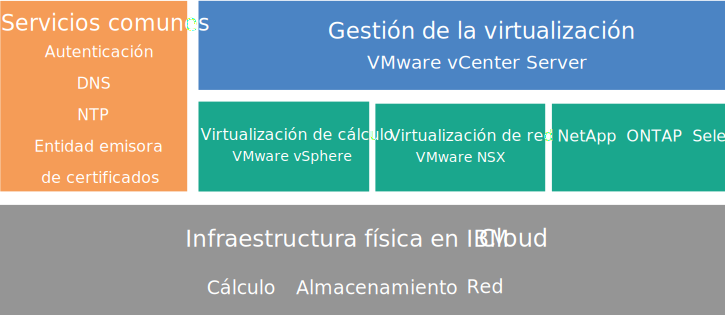

---

copyright:

  years:  2016, 2019

lastupdated: "2019-01-14"

---

{:tip: .tip}
{:note: .note}
{:important: .important}

# Visión general de NetApp ONTAP Select

Revise la arquitectura y los componentes de NetApp ONTAP Select en el despliegue de {{site.data.keyword.cloud}}.

## Arquitectura de NetApp ONTAP Select

La oferta NetApp ONTAP Select on {{site.data.keyword.cloud_notm}} complementa el despliegue de vCenter Server al ofrecer servicios de virtualización del almacenamiento.

El gráfico siguiente ilustra la arquitectura general del despliegue de NetApp ONTAP Select on vCenter Server.

Figura 1. Arquitectura general de NetApp ONTAP Select on {{site.data.keyword.cloud_notm}}

### Infraestructura física

Esta capa proporciona la infraestructura física (recursos de cálculo, de red y de almacenamiento) que utilizará la infraestructura virtual.

### Infraestructura de virtualización (cálculo, red y NetApp ONTAP Select)

Esta capa virtualiza la infraestructura física mediante los siguientes productos de VMware y el producto NetApp ONTAP Select:
* VMware vSphere virtualiza los recursos de cálculo físicos
* VMware NSX es la plataforma de virtualización de red que proporciona los componentes lógicos de red y las redes virtuales.
* NetApp ONTAP Select on {{site.data.keyword.cloud_notm}} despliega un clúster de ONTAP Select, que consta de cuatro VM para los cuatro hosts.

El gráfico siguiente ilustra los componentes del despliegue de NetApp ONTAP Select.

Figura 2. Componentes de NetApp ONTAP Select

### Gestión de la virtualización

La capa de gestión de virtualización consta de los componentes siguientes:

* Dispositivo virtual de vCenter Server
* NSX Manager
* Dos NSX Edge Services Gateways (ESG)
* Tres NSX Controllers
* vCenter Server Appliance (vCSA) con Platform Services Controller (PSC) incorporado
* Instancia de servidor virtual IBM CloudDriver (VSI)

NetApp ONTAP Select se ejecuta en un clúster de VMware y virtualiza el almacenamiento local en los hosts. NetApp ONTAP Select se despliega en el modelo dedicado, donde no se espera que otras cargas de trabajo compartan el clúster con el mismo. Como resultado, la configuración de hardware de la oferta NetApp ONTAP Select on {{site.data.keyword.cloud_notm}} se dimensiona teniendo en cuenta únicamente los requisitos de NetApp ONTAP Select.

## Especificaciones técnicas para instancias de NetApp ONTAP Select

En la instancia de NetApp ONTAP Select se incluyen los siguientes componentes.

La disponibilidad y los precios de las configuraciones estandarizadas pueden variar en función del {{site.data.keyword.CloudDataCent_notm}} seleccionado para el despliegue.
{:note}

### Almacenamiento

* Elija entre **Alto rendimiento (Medio)**, **Alto rendimiento (Grande)** y **Alta capacidad**
* RAID 5 con repuesto en caliente
* Dos unidades SATA de 1-TB ESXi OS – RAID 1
* Almacén de datos de gestión – 500 GB para las VM de gestión

### Configuraciones preestablecidas

Se proporcionan cuatro {{site.data.keyword.cloud_notm}} {{site.data.keyword.baremetal_short}} con las siguientes opciones de configuración:
* **Alto rendimiento (Medio)**: Licencia Premium / Dual Intel Xeon E5-2650 v4 (24 núcleos en total, 2,2 GHz) / 128 GB de RAM / Capacidad por nodo de 22 unidades SSD de 1,9 TB / Capacidad efectiva de un clúster de 4 nodos – 59 TB
* **Alto rendimiento (Grande)**: Licencia Premium / Dual Intel Xeon E5-2650 v4 (24 núcleos en total, 2,2 GHz) / 128 GB de RAM / Capacidad por nodo de 22 unidades SSD de 3,8 TB / Capacidad efectiva de un clúster de 4 nodos – 118 TB
* **Alta capacidad** – Licencia Estándar / Dual Intel Xeon E5-2650 v4 (24 núcleos en total, 2,2 GHz) / 64 GB de RAM / Capacidad por nodo de treinta y cuatro unidades SATA de 4 TB / Capacidad efectiva de un clúster de 4 nodos – 190 TB

Las unidades SSD (disco de estado sólido, Solid-State Disk) de 3,8 TB reciben soporte cuando estén disponibles a nivel general en un centro de datos.
{:note}

### Hardware

* Tres opciones de disco y RAM: **Alto rendimiento (Medio)**, **Alto rendimiento (Grande)** y **Alta capacidad**
* Dos unidades SATA de 1 TB ESXi OS
* Un controlador de disco RAID
* VMware Server Virtualization 6.5

### Redes

* Enlaces ascendentes de red pública y privada de 10 Gbps
* Tres VLAN (LAN virtuales): una VLAN pública y dos VLAN privadas
* Una VMware NSX Edge Services Gateway segura

### Instancias de servidor virtual

Dos VSI (instancias de servidor virtual):
* Una VSI para los servicios Microsoft Active Directory (AD) y Sistema de nombres de dominio (DNS).
* Una VSI para IBM CloudBuilder, que se cierra una vez completado el despliegue de la instancia.

### Licencias y tarifas

*  Cuatro licencias de Premium o Standard Edition NetApp ONTAP Select (suministradas por el usuario)
*  VMware vSphere 6.5 Enterprise Plus Edition
*  VMware vCenter Server 6.5
*  VMware NSX Service Providers Edition (Base, Advanced o Enterprise) 6.4
*  Cuota de soporte y servicios (una licencia por nodo)

Solo debe gestionar los componentes de {{site.data.keyword.vmwaresolutions_short}} que se crean en la cuenta de {{site.data.keyword.cloud_notm}} desde la consola de {{site.data.keyword.vmwaresolutions_short}}, no a través del {{site.data.keyword.slportal}} ni por ningún otro medio fuera de la consola. Si cambia estos componentes fuera de la consola de {{site.data.keyword.vmwaresolutions_short}}, los cambios no se sincronizan con la consola.
{:important}

**ATENCIÓN:** el hecho de gestionar los componentes de {{site.data.keyword.vmwaresolutions_short}} (que se instalaron en la cuenta de {{site.data.keyword.cloud_notm}} al solicitar la instancia) desde fuera de la consola de {{site.data.keyword.vmwaresolutions_short}} podría hacer que el entorno quedara inestable. Estas actividades de gestión incluyen:
*  Añadir, modificar, devolver, eliminar o apagar componentes
*  Ampliar o reducir la capacidad de la instancia mediante la adición o eliminación de servidores ESXi
*  Rearrancar servicios

   Las excepciones a estas actividades incluyen la gestión de comparticiones del archivo de almacenamiento compartido desde el {{site.data.keyword.slportal}}. Estas actividades incluyen: solicitar, suprimir (lo que puede afectar los almacenes de datos si están montados), autorizar y montar comparticiones del archivo de almacenamiento compartido.

## Consideraciones sobre cortafuegos

Si utiliza cortafuegos, debe configurar reglas para todas las comunicaciones desde la Instancia de servidor virtual (VSI) de {{site.data.keyword.IBM}} CloudDriver y las máquinas virtuales (VM) de SDDC Manager. Estas reglas deben permitir que todos los protocolos se comuniquen en las direcciones IP `10.0.0.0/8` y `161.26.0.0/16`. Los ejemplos de estos cortafuegos son NSX Distributed Firewalls (DFW) o cortafuegos Vyatta.

### Enlaces relacionados

* [Planificación de instancias de NetApp ONTAP Select](np_planning.html)
* [Solicitud de instancias de NetApp ONTAP Select](np_orderinginstances.html)
* [Visión general de vCenter Server](../vcenter/vc_vcenterserveroverview.html)
* [Centro de documentación de NetApp ONTAP](http://docs.netapp.com/ontap-9/index.jsp?topic=%2Fcom.netapp.doc.exp-clus-peer%2Fhome.html){:new_window}
