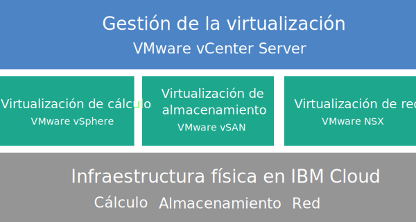

---

copyright:

  years:  2016, 2019

lastupdated: "2019-02-14"

---

{:tip: .tip}
{:note: .note}
{:important: .important}

# Visión general de Cloud Foundation
{: #sd_cloudfoundationoverview}

Cuando solicita VMware Cloud Foundation on {{site.data.keyword.cloud}}, se despliega automáticamente un entorno VMware completo. El despliegue básico consta de cuatro {{site.data.keyword.cloud_notm}} {{site.data.keyword.baremetal_short}} con la pila de VMware Cloud Foundation preinstalada y configurada para proporcionar una plataforma unificada de centro de datos definido por software (SDDC). Cloud Foundation integra de forma nativa VMware vSphere, VMware NSX, VMware Virtual SAN y su arquitectura se basa en diseños validados por VMware.

## Arquitectura de Cloud Foundation
{: #sd_cloudfoundationoverview-archi}

En el gráfico siguiente se muestra la arquitectura general y los componentes del despliegue de Cloud Foundation.

Figura 1. Arquitectura de Cloud Foundation

### Infraestructura física
{: #sd_cloudfoundationoverview-physical-infras}

Esta capa proporciona la infraestructura física (recursos de cálculo, de almacenamiento y de red) que utilizará la infraestructura virtual.

### Infraestructura de virtualización (cálculo, almacenamiento y red)
{: #sd_cloudfoundationoverview-virtualization-infras}

Esta capa virtualiza la infraestructura física mediante diversos productos de VMware:
* VMware vSphere virtualiza los recursos físicos de cálculo.
* VMware Virtual SAN (vSAN) proporciona almacenamiento compartido definido por software basado en el almacenamiento de los servidores físicos.
* VMware NSX es la plataforma de virtualización de red que proporciona los componentes lógicos de red y las redes virtuales.

### Gestión de la virtualización
{: #sd_cloudfoundationoverview-virtualization-mgmt}

Esta capa consta de vCenter Server, que representa la capa de gestión del entorno virtualizado. Se pueden utilizar las herramientas y scripts compatibles con la API de vSphere con las que está familiarizado para gestionar el entorno VMware alojado por IBM.

En la consola de {{site.data.keyword.vmwaresolutions_short}}, puede expandir y contraer la capacidad de las instancias utilizando la función de adición y eliminación de un servidor ESXi. También están disponibles funciones de gestión de ciclo de vida, como la aplicación de actualizaciones y la actualización de componentes de VMware en el entorno alojado.

Para obtener más información sobre la arquitectura, consulte [Visión general de la solución](/docs/services/vmwaresolutions/archiref/solution?topic=vmware-solutions-solution_overview).

## Especificaciones técnicas para instancias de Cloud Foundation
{: #technical-specifications-for-cloud-foundation-instances}

Se incluyen los siguientes componentes en la instancia de Cloud Foundation.

Los cargos en los que se incurre en concepto de hardware, sistema de red, máquinas virtuales y almacenamiento pueden variar en función del {{site.data.keyword.CloudDataCent_notm}} seleccionado para el despliegue.
{:note}

### Servidor nativo
{: #sd_cloudfoundationoverview-bare-metal}

Puede solicitar {{site.data.keyword.cloud_notm}} {{site.data.keyword.baremetal_short}} con una de las siguientes configuraciones:
*  **Skylake**: servidores de generación Intel Skylake de 2 CPU (Intel Xeon serie 4100/5100/6100) con el modelo de CPU y el tamaño de RAM que seleccione.   
*  **Broadwell**: servidores de generación Intel Broadwell de 2 CPU (Intel Xeon serie E5-2600/E7-4800) con el modelo de CPU y el tamaño de RAM que seleccione.

Si tiene pensado utilizar almacenamiento vSAN, la configuración necesita cuatro {{site.data.keyword.baremetal_short}}.
{:note}

### Redes
{: #sd_cloudfoundationoverview-networking}

Se solicitan los siguientes componentes del sistema de redes:
* Enlaces ascendentes de red pública y privada de 10 Gbps
* Tres VLAN (LAN virtuales): una VLAN pública y dos VLAN privadas
* Edge Services Gateway (ESG) de NSX de VMware de servicios de gestión segura para el tráfico de gestión de HTTPS saliente, desplegado por IBM como parte de la topología del sistema de redes de gestión. Las máquinas virtuales de gestión de IBM utilizan esta ESG para comunicarse con componentes externos específicos de gestión de IBM que están relacionados con la automatización. Para obtener más información, consulte [¿Representa NSX Edge de servicios de gestión un riesgo para la seguridad?](/docs/services/vmwaresolutions/vmonic?topic=vmware-solutions-faq#does-the-management-services-nsx-edge-pose-a-security-risk-)

  El usuario no puede acceder ni utilizar esta ESG. Si lo modifica, es posible que no pueda gestionar la instancia de Cloud Foundation desde la consola de {{site.data.keyword.vmwaresolutions_short}}. Además, el uso de un cortafuegos o la inhabilitación de las comunicaciones de ESG a los componentes de gestión externa de IBM hará que {{site.data.keyword.vmwaresolutions_short}} se convierta en inutilizable.
  {:important}

* La característica EVC (Enhanced vMotion Compatibility) se habilita automáticamente si tiene un clúster existente con servidores ESXi que reciben soporte de la versión actual de VMware vSphere. EVC proporciona compatibilidad con vMotion para todos los servidores ESXi de un clúster, ya que se asegura de que todos los servidores ESXi del clúster expongan el mismo conjunto de características de CPU a las máquinas virtuales. Mediante EVC, las máquinas virtuales pueden migrar entre los servidores ESXi del clúster, aunque las CPU reales de los servidores ESXi sean diferentes.

### Instancias de servidor virtual
{: #sd_cloudfoundationoverview-vsi}

Se solicitan las siguientes VSI (instancias de servidor virtual):
* Una VSI para los servicios Microsoft Active Directory (AD) y Sistema de nombres de dominio (DNS). El VSI es necesario para el soporte de configuración de varios sitios. Esta especificación de VSI es la siguiente: Windows 2012 R2 (8 GB de RAM / 2 núcleos de CPU / 100 GB de disco / enlaces ascendentes duales privados de 1 Gbps).
* Una VSI para IBM CloudBuilder, que se cierra una vez completado el despliegue de la instancia.
* (Si se solicita Veeam on {{site.data.keyword.cloud_notm}}) Se solicita una VSI para el servicio de copia de seguridad de Veeam.

### Almacenamiento
{: #sd_cloudfoundationoverview-storage}

Se solicita el siguiente almacenamiento, en función de la configuración de {{site.data.keyword.baremetal_short}} que seleccione:
* Dos discos de arranque SATA de 1-TB
* Dos discos de memoria caché SSD (Disco de estado sólido) de 960 GB
* Un controlador de disco RAID
* Solo para las configuraciones **Skylake** y **Broadwell**, puede definir el número de unidades de disco y el tipo y la capacidad de los discos según sus requisitos. Además, tiene la opción de Intel Optane de alto rendimiento, que proporciona dos bahías de disco de capacidad adicional para un total de 10 discos de capacidad. La opción de Intel Optane de alto rendimiento depende del modelo de CPU.

### Licencias (proporcionadas por IBM o BYOL) y cuotas
{: #sd_cloudfoundationoverview-license-and-fee}

* Cuatro VMware vSphere Enterprise Plus 6.5u1
* Cuatro VMware vCenter Server 6.5
* Cuatro VMware NSX Enterprise 6.3
* Cuatro VMware vSAN Advanced o Enterprise 6.6
* Cuatro licencias de SDDC Manager (solo proporcionado por IBM)
* Cuatro cuotas de soporte y servicios

## Especificaciones técnicas para nodos de expansión de Cloud Foundation
{: #sd_cloudfoundationoverview-expansion-node-specs}

Cada nodo de expansión de Cloud Foundation desplegará e incurrirá en cargos por los siguientes componentes en su cuenta de {{site.data.keyword.cloud_notm}}.

### Hardware para nodos de expansión
{: #sd_cloudfoundationoverview-expansion-node-hardware}

Un servidor nativo {{site.data.keyword.cloud_notm}} con la configuración que se presenta en [Especificaciones técnicas para instancias de Cloud Foundation](/docs/services/vmwaresolutions/sddc?topic=vmware-solutions-sd_cloudfoundationoverview#technical-specifications-for-cloud-foundation-instances).

### Licencias y tarifas correspondientes a nodos de expansión
{: #sd_cloudfoundationoverview-expansion-node-license-and-fee}

* Un VMware vSphere Enterprise Plus 6.5u1
* Un VMware vCenter Server 6.5
* Un VMware NSX Enterprise 6.3
* Un VMware vSAN Advanced o Enterprise 6.6
* Una licencia de SDDC Manager
* Una cuota de soporte y servicios

Solo debe gestionar los componentes de {{site.data.keyword.vmwaresolutions_short}} que se crean en la cuenta de {{site.data.keyword.cloud_notm}} desde la consola de {{site.data.keyword.vmwaresolutions_short}}, no a través del {{site.data.keyword.slportal}} ni por ningún otro medio fuera de la consola. Si cambia estos componentes fuera de la consola de {{site.data.keyword.vmwaresolutions_short}}, los cambios no se sincronizan con la consola.
{:important}

**ATENCIÓN:** el hecho de gestionar los componentes de {{site.data.keyword.vmwaresolutions_short}}, que se instalaron en la cuenta de {{site.data.keyword.cloud_notm}} al solicitar la instancia, desde fuera de la consola de {{site.data.keyword.vmwaresolutions_short}} podría hacer que el entorno quedara inestable. Estas actividades de gestión incluyen:
*  Añadir, modificar, devolver o eliminar componentes
*  Ampliar o reducir la capacidad de la instancia mediante la adición o eliminación de servidores ESXi
*  Apagar componentes
*  Rearrancar servicios

   Las excepciones a estas actividades incluyen la gestión de comparticiones del archivo de almacenamiento compartido desde el {{site.data.keyword.slportal}}. Estas actividades incluyen: solicitar, suprimir (lo que puede afectar los almacenes de datos si están montados), autorizar y montar comparticiones del archivo de almacenamiento compartido.

## Enlaces relacionados
{: #sd_cloudfoundationoverview-related}

* [Lista de materiales de software de Cloud Foundation](/docs/services/vmwaresolutions/sddc?topic=vmware-solutions-sd_bom)
* [Planificación de instancias de Cloud Foundation](/docs/services/vmwaresolutions/sddc?topic=vmware-solutions-sd_planning)
* [Pedido de instancias de Cloud Foundation](/docs/services/vmwaresolutions/sddc?topic=vmware-solutions-sd_orderinginstance)
* [Centro de documentación de VMware vSphere](https://pubs.vmware.com/vsphere-60/index.jsp){:new_window}
* [Centro de documentación de VMware NSX 6](https://pubs.vmware.com/NSX-6/index.jsp){:new_window}
* [Preguntas más frecuentes (FAQ) de compatibilidad de CPU y EVC](https://kb.vmware.com/s/article/1005764)
