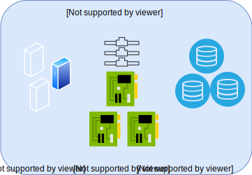

---

copyright:

  years:  2019

lastupdated: "2019-08-06"

keywords: vmware solutions shared, get started shared, tech specs shared

subcollection: vmware-solutions

---

{:external: target="_blank" .external}
{:tip: .tip}
{:note: .note}
{:important: .important}

# Visión general de IBM Cloud for VMware Solutions Shared
{: #shared_overview}

{{site.data.keyword.vmwaresolutions_full}} Shared se proporciona como una oferta experimental.
{:note}

Con los centros de datos virtuales de VMware, puede migrar o desplegar las cargas de trabajo de VMware de forma rápida y sencilla en la nube encima de la infraestructura VMware gestionada profesionalmente. IBM proporciona una plataforma de computación en la nube de VMware bajo demanda de autoservicio con vCloud Director que se ejecuta en {{site.data.keyword.cloud_notm}}. Esta oferta de pago según uso de infraestructura como servicio (IaaS) permite a los usuarios consumir vCPU, almacenamiento, vRAM, red e IP específicos, según sea necesario.

{{site.data.keyword.vmwaresolutions_short}} tiene tres tipos de servicio de suscripción de "infraestructura como servicio" (IaaS):
- Centro de datos virtual reservado multiarrendatario
- Centro de datos virtual de pago según uso multiarrendatario
- Centro de datos virtual dedicado de un solo arrendatario

Los clientes gestionan el ciclo de vida de los centros de datos virtuales mediante utilizando la oferta de {{site.data.keyword.vmwaresolutions_short}}. Se da soporte a las funciones siguientes, ya sea por la interfaz de usuario web o la API pública:
- Creación del Centro de datos virtual
- Elasticidad del Centro de datos virtual
- Supresión del Centro de datos virtual
- Adición y eliminación de servicios VMware
- Licencias de Windows bajo demanda
- Licencias de Red Hat bajo demanda

Las tres ofertas de Centro de datos virtual de {{site.data.keyword.cloud_notm}} vienen de forma estándar con cinco direcciones IP públicas en una pasarela NSX Edge Service con un ingreso ilimitado a través de la red pública.

Los centros de datos virtuales incurren en cargos por los componentes siguientes:
- Asignaciones de almacenamiento con precios por niveles basados en el rendimiento del almacenamiento
- Uso de CPU virtual
- Uso de memoria virtual
- Salida a red pública
- Licencias de sistema operativo comerciales utilizadas
- Servicios de VMware opcionales

## Arquitectura de IBM Cloud for VMware Solutions Shared
{: #shared_overview-archi}

En el gráfico siguiente se muestra la arquitectura general y los componentes del despliegue de {{site.data.keyword.vmwaresolutions_short}} Shared.

### VMware vCloud Director
{: #shared_overview-vcloud-dir}

Esta capa representa la interfaz de gestión. VMware® vCloud Director proporciona acceso basado en roles a un portal de arrendatario basado en web que permite a los miembros de una organización interaccionar con los recursos de la organización para crear y trabajar con aplicaciones virtuales (vApps) y máquinas virtuales (VM).

### Organización
{: #shared_overview-org}

Una organización es una unidad de administración para una colección de usuarios, grupos y recursos de computación. Los usuarios se autentican en el nivel de organización, proporcionando las credenciales establecidas por un administrador de la organización a crear o importar el usuario. Los administradores de las organizaciones gestionan los usuarios, los grupos y los catálogos de la organización.

### Usuarios y políticas
{: #shared_overview-users-policies}

Una organización puede contener un número arbitrario de usuarios y grupos. Los usuarios los puede crear localmente el administrador de la organización o se pueden importar desde un servicio de directorio como, por ejemplo, LDAP. Los permisos dentro de una organización se controlan mediante la asignación de derechos y roles a los usuarios y grupos.

### Catálogos
{: #shared_overview-cat}

Las organizaciones pueden utilizar catálogos para almacenar plantillas y archivos multimedia de las vApp. Los miembros de una organización que tienen acceso a un catálogo pueden utilizar las plantillas y archivos multimedia de las vApp del catálogo para crear sus propias vApps. Los administradores de las organizaciones pueden copiar elementos de los catálogos públicos al catálogo de la organización.

### Centros de datos virtuales
{: #shared_overview-vc}

Un centro de datos virtual de una organización proporciona recursos a una organización. Los centros de datos virtuales proporcionan un entorno donde se pueden almacenar, desplegar y gestionar los sistemas virtuales. También proporcionan almacenamiento para los soportes de CD y DVD virtuales. Una organización puede tener varios centros de datos virtuales.

## Especificaciones técnicas de IBM Cloud for VMware Solutions Shared
{: #shared_overview-specs}

En {{site.data.keyword.cloud_notm}} se incluyen los siguientes componentes:

### Cálculo
{: #shared_overview-specs-comp}

El procesamiento de cálculo se asigna a los centros de datos virtuales en incrementos de CPU virtuales (vCPU). Cada incremento de vCPU representa un núcleo de 2,0 GHz. La memoria de cálculo se asigna en incrementos de GB.

### Redes
{: #shared_overview-specs-net}

De forma predeterminada, todos los centros de datos virtuales vienen configurados con una pasarela de extremo con cinco direcciones IP públicas y una dirección IP de servicio privada. La pasarela de extremo es configurable por el cliente y se puede personalizar.

Las direcciones públicas se pueden utilizar para las vApps de cara al público para el tráfico de Internet público de entrada o de salida.

La dirección de servicio se puede utilizar para acceder a los servicios de infraestructura de IBM Cloud en la red privada interna de IBM Cloud, incluyendo los servicios siguientes:
- NTP
- Licencias y actualizaciones del sistema operativo Windows
- Licencias y actualizaciones del sistema operativo Red Hat
- Cloud Object Storage

### Almacenamiento
{: #shared_overview-specs-storage}

Al crear o desplegar las vApps o las VM, se selecciona una política de almacenamiento. Hay cuatro niveles de almacenamiento disponibles diferentes, en función del rendimiento de almacenamiento necesario:

- NFS Platinum: el nivel de almacenamiento con un rendimiento máximo de 10 IOPS/GB, el rendimiento más alto
- NFS Gold: nivel de almacenamiento con un rendimiento máximo de 4 IOPS/GB
- NFS Silver: nivel de almacenamiento con un rendimiento máximo de 2 IOPS/GB
- NFS Bronze: nivel de almacenamiento con un rendimiento máximo de 0.25 IOPS/GB

## Enlaces relacionados
{: #shared_overview-related}

* [Solicitud de Shared bajo demanda](/docs/services/vmwaresolutions/services?topic=vmware-solutions-shared_ordering_ondemand)
* [Solicitud de Shared reservado](/docs/services/vmwaresolutions/services?topic=vmware-solutions-shared_ordering_reserved)
* [Gestión de {{site.data.keyword.cloud_notm}} for VMware Solutions Shared](/docs/services/vmwaresolutions/services?topic=vmware-solutions-shared_managing)
* [VMware vCloud Director](https://docs.vmware.com/en/vCloud-Director/9.7/com.vmware.vcloud.tenantportal.doc/GUID-74C9E10D-9197-43B0-B469-126FFBCB5121.html){:external}
