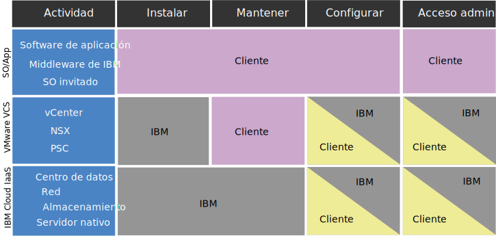

---

copyright:

  years:  2016, 2019

lastupdated: "2019-05-02"

subcollection: vmware-solutions

---

{:tip: .tip}
{:note: .note}
{:important: .important}

# Información de conformidad para instancias de vCenter Server
{: #vc_compl_info}

Revise la información siguiente para obtener detalles sobre la conformidad de las instancias de VMware vCenter Server.

La oferta VMware vCenter Server on {{site.data.keyword.cloud_notm}} con NSX-T no está soportada para clientes HIPAA.
{:important}

## Responsabilidad del cliente y de IBM en relación a vCenter Server on IBM Cloud
{: #vc_compl_info-responsibility}

En el diagrama siguiente encontrará información sobre las responsabilidades del cliente (usted) y de IBM en relación a las actividades de conformidad.

## Restricciones en datos de estado
{: #vc_compl_info-health-data-restrictions}

Las condiciones de esta sección se aplican todo el portafolio de {{site.data.keyword.vmwaresolutions_full}}.

### HIPAA
{: #vc_compl_info-hipaa}

A pesar de la información de la hoja de datos para este Servicio de nube sobre la Ley de Portabilidad y Responsabilidad de la Información Sanitaria de 1996 ("HIPAA") y el uso permitido de datos y de información sanitaria como tipos de datos personales y/o categorías especiales de datos personales (de forma colectiva, "datos sanitarios") con este Servicio de nube, el uso de los datos sanitarios con este Servicio de nube está sujeto a las siguientes limitaciones y condiciones:

{{site.data.keyword.vmwaresolutions_short}}

Solo las ofertas que se listan más arriba se pueden suministrar para implementar los controles de reglas de privacidad y seguridad de HIPAA para su uso con datos sanitarios si el Cliente notifica a IBM por adelantado que el Cliente utilizará datos sanitarios con el Servicio de nube e IBM confirma por escrito que el Servicio de nube se suministrará para el uso de datos sanitarios. En consecuencia, es posible que el servicio nube no se pueda utilizar para la transmisión, almacenamiento u otro uso de datos sanitarios protegidos bajo HIPAA a menos que (i) el Cliente proporcione a IBM dicha notificación; (ii) IBM y el Cliente hayan entrado en un Acuerdo Asociado de Negocios aplicable; y (iii) IBM proporcione al Cliente una confirmación expresa por escrito de que el Servicio de nube se puede utilizar con datos sanitarios. En ningún caso se podrá utilizar el Servicio de nube para procesar PHI como centro de información sanitario en el contexto de HIPAA.

En el caso de que se produzca una anomalía del sistema, un proveedor de servicios de terceros puede solicitar artefactos de depuración del cliente (registros, volcados de memoria principal, etc.). El cliente es el único responsable de recopilar y transmitir estos artefactos al proveedor de terceros. El equipo de soporte de IBM puede ayudar proporcionando enlaces a la documentación o proporcionando orientación a través de sesiones de compartición de pantalla. Sin embargo, el cliente es el responsable de la limpieza de los datos de cualquier PHI y de asegurarse de que están cifrados correctamente antes de su transmisión. También es responsabilidad del cliente evaluar si requieren que se ejecute un BAA con el proveedor de terceros antes de enviar datos.

## Información personal y datos regulados
{: #vc_compl_info-personal-info-and-regulated-data}

Este Servicio de nube no ha sido diseñado para cumplir ningún requisito de seguridad específico para el contenido regulado, como información personal o información personal confidencial. El cliente es el responsable de determinar si este Servicio de nube satisface las necesidades de los Clientes en relación con el tipo de contenido que utiliza el Cliente con el Servicio de nube.

## Política para acceder a instancias de clientes
{: #vc_compl_info-policy-for-access-client-inst}

Los entornos VMware vCenter Server, que se suministran como {{site.data.keyword.vmwaresolutions_short}}, proporcionan una capa de plataforma de gestión de VMware para que nuestros clientes gestionen las funciones de virtualización. A lo largo del ciclo de vida de los productos y servicios de IBM Cloud for VMware, es posible que se requiera el servicio de soporte de IBM para garantizar su éxito. Generalmente, la intervención del equipo de soporte de IBM es el resultado de una solicitud del cliente (es decir, una incidencia de soporte). Sin embargo, en raras ocasiones, el servicio de soporte de IBM puede ayudar de forma proactiva y sin una incidencia de soporte escrita por el cliente para evitar problemas futuros. Este acceso se realiza a través de la red de soporte interna de IBM Cloud y se documenta a través de una incidencia de soporte abierta por el servicio de soporte de IBM y supervisada continuamente por IBM Cloud SOC. En ningún momento el servicio de soporte de IBM modificará la configuración de la instancia sin el consentimiento previo del cliente. El acceso se realiza a los componentes de gestión de VMware y/o a los componentes de gestión de IBM Cloud y nunca a las máquinas virtuales ni a las aplicaciones del cliente.

## Soporte proactivo
{: #vc_compl_info-proactive-support}

### Soporte proactivo para el suministro inicial
{: #vc_compl_info-proactive-support-for-initial-provision}

* Durante el pedido inicial y el suministro de una instancia o servicio, el soporte de IBM puede acceder a las instancias del cliente y a la información sin notificación previa del cliente para asegurarse de que los pedidos se han cumplido correctamente.
* El soporte de IBM supervisa de forma activa las operaciones del ciclo de vida de las instancias como, por ejemplo, la adición de nuevos hosts, además de los procesos de pedido, suministro e instalación.
* Para solucionar los problemas que se hayan producido o que pueden surgir en el futuro, el soporte de IBM puede emprender varias acciones, entre ellas revisar los detalles del pedido del cliente, reiniciar trabajos de automatización, realizar operaciones de recarga de sistema operativo o abrir incidencias de IBM Cloud utilizando el nombre de usuario y la clave de API del cliente de IBM Cloud.

### Soporte proactivo para operaciones de estado estable
{: #vc_compl_info-proactive-support-for-steady-state-operations}

* En raras ocasiones, el servicio de soporte de IBM puede requerir acceso a instancias de cliente durante operaciones de estado estable para resolver de forma proactiva un problema de una instancia o para verificar el funcionamiento de los servicios o componentes suministrados.
* Este acceso se realiza a través de la red de soporte interno de IBM Cloud. En ningún momento el servicio de soporte de IBM modificará la configuración de la instancia sin el consentimiento previo del cliente.
* El acceso se realiza a los componentes de gestión de VMware y/o a los componentes de gestión de IBM Cloud y nunca a las máquinas virtuales ni a las aplicaciones del cliente.

### Incidencias de soporte
{: #vc_compl_info-support-tickets}

* IBM no supervisa de forma activa los entornos de vCenter Server, y el servicio de soporte de IBM no entrará en la capa de gestión de VMware en operaciones normales sin una incidencia de soporte escrita por el cliente.
* Cuando un cliente abre una incidencia de soporte para un problema de una instancia, un servicio o un suministro, la incidencia se asigna rápidamente al equipo de soporte e IBM adecuado, el cual será el principal responsable de solucionar el problema.
* Debido al nivel de especialización que se necesita para ofrecer una experiencia técnica superior a nivel de equipo, a veces es necesario implicar a más de un equipo de soporte en la resolución de un problema de software concreto. Esto se gestiona fácilmente, ya que nuestros equipos de soporte trabajan en red y como uno solo para resolver los problemas que puedan surgir.
* Para investigar el problema, es posible que IBM necesite acceder a la información del sistema relacionada con el problema o puede que sea necesario reproducir la anomalía para obtener información adicional.
* Una incidencia de soporte generada por el cliente sirve como acuse de recibo de que el equipo de soporte de IBM puede acceder a la capa de gestión de VMware para su investigación, depuración y selección. Si es necesario interrumpir el mantenimiento o realizar cambios en el entorno, el equipo de soporte de IBM solicitará confirmación documentada adicional del cliente mediante incidencias como parte de nuestro proceso de gestión de cambios.
* Para obtener más información sobre las incidencias de soporte, consulte [Guía de soporte de IBM](https://www-01.ibm.com/support/docview.wss?uid=ibm10733923) y [Cómo ponerse en contacto con el equipo de soporte de IBM](/docs/services/vmwaresolutions/vmonic?topic=vmware-solutions-trbl_support).

## Responsabilidades del cliente
{: #vc_compl_info-client-responsibilities}

* Si bien recomendamos a los clientes que tomen medidas para hacer que sus entornos sean más seguros, cabe señalar que algunas prácticas pueden tener efectos negativos sobre la eficacia de IBM Cloud for VMware.
* Los clientes son responsables de los cortafuegos que creen y de las limitaciones resultantes impuestos en las comunicaciones entre componentes de IBM Cloud for VMware. Estos cortafuegos también pueden obstaculizar la capacidad de soporte de IBM para acceder a las instancias del cliente y resolver problemas.
* Los clientes son totalmente responsables de cifrar los datos en su sistema.
* Tras el despliegue inicial, la automatización de la oferta y la cuenta del cliente son independientes. El cliente puede, y de hecho es lo recomendable, cambiar todas las contraseñas que proporcione IBM en el portal.
* El acceso a vCenter y las credenciales se crean durante los despliegues iniciales y se proporcionan al cliente. Como parte del requisito de nuestra oferta, el servicio de soporte de IBM debe conservar acceso completo a la capa de gestión para proporcionar gestión del ciclo de vida, así como soporte a nuestros clientes.
* Si las credenciales, como por ejemplo las contraseñas, se modifican en cualquier momento, es posible que el servicio de soporte de IBM no pueda ayudar al cliente a recuperar las credenciales perdidas u olvidadas o incluso a resolver problemas de los entornos de cliente.
* Para obtener más información sobre la importancia de este problema y sobre problemas relacionados, consulte [Consideraciones sobre el cambio de contraseñas para componentes de NSX](/docs/services/vmwaresolutions/vcenter?topic=vmware-solutions-vc_networkingonvcenterserver#vc_networkingonvcenterserver-change-nsx-component-password-considerations) y [Consideraciones sobre el cambio de artefactos de vCenter Server](/docs/services/vmwaresolutions/vcenter?topic=vmware-solutions-vcenter_chg_impact).

### Comunicación y resolución de problemas
{: #vc_compl_info-communication-troubleshooting}

* IBM no garantiza que nuestros productos estén libres de defectos, sin embargo nos esforzamos por arreglarlos para que funcionen de acuerdo con su diseño. Los clientes juegan un papel importante en este esfuerzo.
* Aunque el servicio de soporte de IBM está disponible para proporcionar ayuda durante todo el ciclo de vida del producto, el soporte puede estar limitado por la información y el acceso proporcionados por el cliente.
* El cliente es responsable de proporcionar documentación completa en el momento en que se produce un error y de responder a tiempo al servicio de soporte de IBM cuando se necesita más información.
* Los clientes también son responsables de seguir las directrices establecidas en este documento para otorgar el consentimiento a un soporte proactivo.
* Si se rechaza el consentimiento o no se cumplen las directrices proporcionadas, el cliente asume la responsabilidad de un posible retraso en la resolución de problemas ocasionado por los retrasos en la comunicación entre el cliente y el equipo de soporte.
* El cliente debe estar preparado para llevar a cabo una resolución técnica adicional que, de lo contrario, realizaría el servicio de soporte de IBM. IBM proporcionará la documentación y la ayuda adecuadas cuando sea necesario.

### Medidas de seguridad
{: #vc_compl_info-security-measures}

* Gestión del servicio de nube: el cliente es responsable de gestionar la administración, el funcionamiento, el mantenimiento y la seguridad de las aplicaciones, incluido el middleware subyacente.
* Integridad y disponibilidad del servicio: IBM reenviará al Cliente todas las notificaciones de intrusión en la red detectadas para este servicio en la nube. Es responsabilidad del Cliente determinar el impacto de cada notificación notificada. Se notificará al Cliente en caso de anomalías del hardware. La supervisión y la respuesta ante anomalías del sistema operativo o del software son
responsabilidad del Cliente, que debe ponerse en contacto con el soporte de IBM según corresponda.
* Registro de actividad: el Cliente es responsable del registro de la actividad del SO y del sistema y de la base de datos y de las aplicaciones, según sea necesario.
* Cifrado: el Cliente es responsable de configurar y gestionar todo el cifrado (tanto para datos en reposo como para datos en tránsito), según sea necesario.
* Continuidad del negocio y recuperación en caso de error: el Cliente es responsable de configurar y gestionar todos los procesos de continuidad del negocio y de recuperación en caso de error, según sea necesario.

### Servicios de terceros
{: #vc_compl_info-third-party-services}

* Algunas de nuestras ofertas de IBM incluyen software o código de terceros. Este código se incluye para su comodidad, pero no se considera parte del programa de IBM.
* La licencia de estos programas que no son de IBM viene proporcionada directamente por sus proveedores. El cliente acepta utilizar los programas que no son de IBM bajo los términos y condiciones del proveedor. Estos se proporcionan en el acuerdo de licencia de IBM adjunto a la oferta de IBM en el momento de la compra.
* IBM realiza pruebas para asegurarse de que los productos de terceros funcionarán con los programas de IBM y lo harán adecuadamente.
* El servicio soporte de software de IBM diagnosticará los problemas de los clientes aplicando su conocimiento sobre cómo funcionan las ofertas de IBM con el software de terceros. Una vez que se haya llegado a la conclusión de que el programa de IBM funciona correctamente, pero el problema se sigue produciendo, IBM redirigirá al cliente al proveedor de terceros para que realice un diagnóstico más amplio.
* Encontrará más información sobre las responsabilidades del cliente en relación a software o código de terceros en el [Guía de soporte de IBM](https://www-01.ibm.com/support/docview.wss?uid=ibm10733923).

## Consentimiento para acceder a entornos del cliente
{: #vc_compl_info-consent-to-access-client-environment}

* El servicio soporte de IBM necesita acceso a las instancias del cliente para garantizar un suministro y un mantenimiento adecuados. Los clientes son responsables de controlar y proporcionar el acceso necesario.
* Una incidencia de soporte escrita por el cliente sirve como acuse de recibo y consentimiento para que el servicio soporte de IBM accede a una instancia del cliente para abordar las cuestiones que se describen en dicha incidencia de soporte.
* Los clientes son responsables de seguir las directrices establecidas en este documento para otorgar el consentimiento a un soporte proactivo. Si se rechaza el consentimiento o no se cumplen las directrices proporcionadas, el cliente asume la responsabilidad de los retrasos en la determinación y resolución de problemas ocasionados por los retrasos en la comunicación entre el cliente y el equipo de soporte y de una posible resolución técnica del problema adicional.

## Suministro inicial
{: #vc_compl_info-initial-provision}

* En el momento del suministro y el pedido iniciales, el cliente se presentará con este documento.
* Al enviar el pedido, el cliente acepta estos términos y, por lo tanto, otorga el consentimiento al servicio de soporte de IBM para acceder a sus instancias en cualquier momento sin notificación previa, para resolver rápidamente problemas relacionados con el entorno o para evitar futuros fallos.
* Este consentimiento se aplica a todas las instancias que se están solicitando actualmente durante todo su ciclo de vida. Las instancias y los componentes de las instancias suministrados en el futuro pueden requerir consentimiento adicional.

## Operaciones de estado estable
{: #vc_compl_info-steady-state-operations}

Si el cliente no ha otorgado el consentimiento para un soporte proactivo para una instancia durante el suministro y el pedido iniciales, debe incluir el consentimiento explícito en cualquier futura incidencia de servicio, si lo desea. Las declaraciones de consentimiento deben seguir las directrices establecidas o se considerarán nulas.

## Enlaces relacionados
{: #vc_compl_info-related}

* [Visión general de vCenter Server](/docs/services/vmwaresolutions/vcenter?topic=vmware-solutions-vc_vcenterserveroverview)
* [Cómo ponerse en contacto con el equipo de soporte de IBM](/docs/services/vmwaresolutions/vmonic?topic=vmware-solutions-trbl_support)
