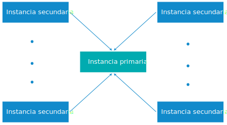

---

copyright:

  years:  2016, 2019

lastupdated: "2019-01-14"

---

{:tip: .tip}
{:note: .note}
{:important: .important}

# Configuración de varios sitios para instancias de vCenter Server on IBM Cloud

{{site.data.keyword.vmwaresolutions_full}} permite desplegar instancias en diferentes ubicaciones y conseguir que se activen y se ejecuten en un breve periodo de tiempo.

* La configuración de varios sitios para instancias de vCenter Server solo recibe soporte para instancias de la V2.0 y posteriores.
* No puede establecer enlaces entre instancias de VMware Cloud Foundation y VMware vCenter Server en una configuración de varios sitios.
{:note}

## Componentes de un despliegue de varios sitios

Un despliegue de varios sitios consta de los siguientes componentes.

* **Instancia primaria**: la instancia primaria de VMware vCenter Server tiene la siguiente configuración:
  *  Dominio raíz Microsoft Active Directory (AD) y DNS (Sistema de nombres de dominio)
  *  Subdominio de vCenter Server
  *  Dominio SSO (inicio de sesión único)
  *  Nombre del sitio SSO
* **Instancia o instancias secundarias**: una o varias instancias secundarias de vCenter Server, enlazadas a la instancia primaria, con la configuración siguiente:
   *  Nombre del sitio SSO
   *  Subdominio DNS enlazado al dominio raíz en la instancia primaria
   *  Réplica de DNS y AD configurada entre las máquinas virtuales AD en las instancias primaria y secundarias.
   *  vCenter Server Appliance (vCSA) con Platform Services Controller (PSC) incorporado desplegado y configurado
   *  VMware vCenter en las instancias secundarias se configura con la modalidad de enlace mejorada con el vCenter en la instancia primaria.

## Despliegue de varios sitios de vCenter Server

La característica de configuración de varios sitios utiliza una topología de estrella ("hub and spoke") con un sitio primario y un máximo de siete sitios secundarios. Se da soporte a una sola capa de sitios, es decir, no puede configurar otros sitios enlazados a otros sitios secundarios. Puede tener un total de 128 servidores ESXi en una configuración de varios sitios entre todas las instancias.

Si la configuración requiere un despliegue de varios sitios con más de 128 servidores ESXi, póngase en contacto con el equipo de soporte de IBM para obtener ayuda. Para obtener más información, consulte [Cómo ponerse en contacto con el equipo de soporte de IBM](../vmonic/trbl_support.html).
{:note}

En el siguiente gráfico se muestra una visión general del despliegue de varios sitios de vCenter Server.

Figura 1. Despliegue de varios sitios de vCenter Server

El modelo contiene las siguientes capas:

* **Instancia primaria**: en una configuración de varios sitios, para desplegar la primera instancia debe definir dicha instancia como primaria durante el proceso de pedido de la instancia.
* **Instancias secundarias**: en una configuración de varios sitios, debe definir las instancias que están conectadas a la instancia primaria como instancias secundarias durante el proceso de pedido.

Las instancias secundarias se asignan a una instancia primara de una en una. No puede asignar varias instancias secundarias a una instancia primaria al mismo tiempo. Para hacerlo, debe volver a pasar por el proceso de pedido y seleccionar la instancia primaria definida anteriormente como una instancia primaria para la instancia secundaria. Debe repetir el proceso para todas las instancias secundarias que desee crear.

Puede tener un máximo de 8 (1 primaria y 7 secundarias) instancias desplegadas en una configuración de varios sitios.

La supresión de instancias de vCenter Server que forman parte de una configuración de varios sitios requiere una planificación especial. Para obtener más información, consulte [Supresión de instancias de vCenter Server en una configuración de varios sitios](vc_deletinginstance_multi.html).
{:note}

### Enlaces relacionados

* [Asignación del rol primario a NSX Manager](https://pubs.vmware.com/NSX-62/topic/com.vmware.nsx-cross-vcenter-install.doc/GUID-44E8AE16-BA3F-4DD9-B582-FC1E137E6CFC.html){:new_window}
* [Configuración de NSX Managers secundarios](https://pubs.vmware.com/NSX-62/topic/com.vmware.nsx-cross-vcenter-install.doc/GUID-9E48BC57-15E3-49C7-8BC5-F94ED8918BBE.html){:new_window}
* [AD Trusts reciben soporte con SSO (inicio de sesión único) de vCenter](https://kb.vmware.com/kb/2064250){:new_window}
* [Conexión segura de cargas de trabajo privadas de VMware en {{site.data.keyword.cloud_notm}}](https://www.ibm.com/developerworks/library/se-securely-connect-private-vmware-workloads-ibm-cloud/index.html){:new_window}
