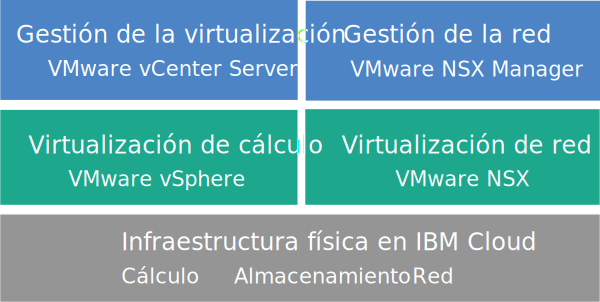

---

copyright:

  years:  2016, 2019

lastupdated: "2019-04-25"

subcollection: vmware-solutions

---

{:tip: .tip}
{:note: .note}
{:important: .important}

# Visión general de vCenter Server con NSX-T
{: #vc_nsx-t_overview}

VMware vCenter Server con NSX-T on {{site.data.keyword.cloud}} es una nube privada alojada que ofrece las funciones de VMware vSphere como un servicio. El entorno VMware se crea sobre un mínimo de tres {{site.data.keyword.cloud_notm}} {{site.data.keyword.baremetal_short}}, ofrece almacenamiento compartido conectado a la red y opciones de almacenamiento dedicado definido por software, e incluye funciones automáticas de despliegue y configuración de un cortafuegos lógico fácil de gestionar respaldado por VMware NSX-T.

En muchos casos, todo el entorno se puede suministrar en menos de un día, y la capacidad de cálculo de la infraestructura de servidores nativos se puede aumentar y reducir de forma rápida y elástica según las necesidades.

Después del despliegue, puede aumentar el almacenamiento compartido solicitando más comparticiones de archivos NFS
(Network File System) desde el {{site.data.keyword.slportal}} y conectándolas manualmente a todos los servidores ESXi de un clúster.

VMware vSAN también está disponible como opción de almacenamiento dedicado. Para aumentar la capacidad de almacenamiento basado en vSAN de un clúster vSAN, puede añadir más servidores ESXi después del despliegue.

Las instancias de vCenter Server con NSX-T son sólo para pruebas de concepto (POC) o para pruebas de recinto de pruebas. No ejecute cargas de trabajo de producción en este entorno. Las funciones de gestión, como la solicitud de servicios complementarios y la aplicación de actualizaciones, no reciben soporte.
{:important}

## Arquitectura de vCenter Server con NSX-T
{: #vc_nsx-t_overview-archi}

En el gráfico siguiente se muestra la arquitectura general y los componentes del despliegue de tres nodos de vCenter Server con NSX-T.

Figura 1. Arquitectura general de vCenter Server con NSX-T para un clúster de tres nodos

### Infraestructura física
{: #vc_nsx-t_overview-physical-infras}

Esta capa proporciona la infraestructura física (recursos de cálculo, de almacenamiento y de red) que utilizará la infraestructura virtual.

### Infraestructura de virtualización (cálculo y red)
{: #vc_nsx-t_overview-virtualization-infras}

Esta capa virtualiza la infraestructura física mediante diversos productos de VMware:
* VMware vSphere virtualiza los recursos físicos de cálculo.
* VMware NSX-T es la plataforma de virtualización de red que proporciona los componentes lógicos de red y las redes virtuales.

### Gestión de la virtualización
{: #vc_nsx-t_overview-virtualization-mgmt}

Esta capa consta de vCenter Server Appliance (vCSA) con Platform Services Controller (PSC) incorporado, tres nodos NSX, tres NSX Edge Services Gateways (ESG) y la instancia de servidor virtual (VSI) de IBM CloudDriver. La VSI de CloudDriver se despliega a petición según sea necesario para determinadas operaciones, como por ejemplo, añadir hosts al entorno.

La oferta básica se despliega con un dispositivo vCenter Server cuyo tamaño se ajusta para dar soporte a un entorno con un máximo de 400 hosts y hasta 4000 máquinas virtuales. Se pueden utilizar las mismas herramientas y scripts compatibles con la API de vSphere para gestionar el entorno VMware alojado por IBM.

En total, la oferta básica necesita 38 vCPU y 128 GB de vRAM que se reservan para la capa de gestión de virtualización. El resto de la capacidad de host para sus VM depende de varios factores, como la tasa de sobresuscripción, el dimensionamiento de máquina virtual (VM) y los requisitos de rendimiento de la carga de trabajo.

Para obtener más información sobre la arquitectura, consulte [Referencia de arquitectura de {{site.data.keyword.vmwaresolutions_short}}](/docs/services/vmwaresolutions/archiref/solution?topic=vmware-solutions-solution_overview).

## Especificaciones técnicas para las instancias de vCenter Server con NSX-T
{: #vc_nsx-t_overview-specs}

Se incluyen los siguientes componentes en la instancia de vCenter Server con NSX-T.

La disponibilidad y los precios de las configuraciones estandarizadas de hardware pueden variar en función del {{site.data.keyword.CloudDataCent_notm}} seleccionado para el despliegue.
{:note}

### Servidor nativo
{: #vc_nsx-t_overview-bare-metal}

Puede solicitar tres o más {{site.data.keyword.baremetal_short}} con una de las siguientes configuraciones:
* **Skylake**: servidores de generación Intel Skylake de 2 CPU (Intel Xeon serie 4100/5100/6100) con el modelo de CPU y el tamaño de RAM que seleccione.  
* **Broadwell**: servidores de generación Intel Broadwell de 4 CPU (Intel Xeon serie E7-4800) con el modelo de CPU y el tamaño de RAM que seleccione.

Si tiene pensado utilizar almacenamiento vSAN, la configuración necesita un mínimo de cuatro {{site.data.keyword.baremetal_short}}.
{:note}

### Redes
{: #vc_nsx-t_overview-networking}

Se solicitan los siguientes componentes del sistema de redes:
*  Enlaces ascendentes de red pública y privada de 10 Gbps
*  Tres VLAN (LAN virtuales): una VLAN pública y dos VLAN privadas
* Una red superpuesta con un direccionador T1 y T0 para una potencial comunicación este-oeste entre cargas de trabajo locales conectadas a redes de la capa 2 (L2). Se despliega como una topología de direccionamiento de ejemplo, que puede modificar o eliminar o a la que puede añadir componentes.
*  Tres VMware NSX-T Edge Services Gateways:
  * Un VMware NSX ESG de servicios de gestión segura para el tráfico de gestión de HTTPS saliente, desplegado por IBM como parte de la topología del sistema de redes de gestión. Las VM de gestión de IBM utilizan esta ESG para comunicarse con componentes externos específicos de gestión de IBM que están relacionados con la automatización. Para obtener más información, consulte [Configuración de la red para que utilice la ESG NSX gestionada por el cliente con las VM](/docs/services/vmwaresolutions/vcenter?topic=vmware-solutions-vc_esg_config).
  * Dos VMware NSX ESG seguras gestionadas por el cliente para el tráfico de salida y de entrada de carga de trabajo HTTPS. IBM despliega esta pasarela como plantilla que puede modificar para proporcionar acceso VPN o acceso público. Para obtener más información, consulte [¿Representa NSX Edge gestionado por el cliente un riesgo para la seguridad?](/docs/services/vmwaresolutions?topic=vmware-solutions-faq#faq-customer-nsx)

  Este ESG se denomina **mgmt-nsx-edge0**. No puede acceder al ESG ni tampoco utilizarlo. Si lo modifica, es posible que no pueda gestionar la instancia de vCenter Server desde la consola de {{site.data.keyword.vmwaresolutions_short}}. Además, el uso de un cortafuegos o la inhabilitación de las comunicaciones de ESG a los componentes de gestión externa de IBM hará que {{site.data.keyword.vmwaresolutions_short}} quede inutilizable.
  {:important}

### Instancias de servidor virtual
{: #vc_nsx-t_overview-vsi}

Se solicitan las siguientes instancias de servidor virtual (VSI):
* Una VSI para IBM CloudBuilder, que se cierra una vez completado el despliegue de la instancia.
* Puede elegir desplegar un único Microsoft Windows Server VSI for Microsoft Active Directory (AD) o dos VM Microsoft Windows de alta disponibilidad en el clúster de gestión para ayudar a mejorar la seguridad y la solidez.

### Almacenamiento
{: #vc_nsx-t_overview-storage}

Durante el despliegue inicial, puede elegir entre las opciones de almacenamiento vSAN y NFS.

Después del despliegue, puede añadir comparticiones de almacenamiento NFS a un clúster NFS o vSAN existente. Para obtener más información, consulte la sección *Adición de almacenamiento NFS a instancias de vCenter Server* en [Expansión y contracción de la capacidad de las instancias de vCenter Server](/docs/services/vmwaresolutions/vcenter?topic=vmware-solutions-vc_addingremovingservers).
{:note}

#### Almacenamiento vSAN
{: #vc_nsx-t_overview-vsan-storage}

La opción vSAN ofrece configuraciones personalizadas, con diversas opciones para el tipo de disco, el tamaño y la cantidad:
* Cantidad de discos: 2, 4, 6 u 8
* Disco de almacenamiento: SSD SED de 960 GB, SSD SED de 1,9 TB o SSD SED de 3,8 TB.

  Además, también se solicitan dos discos de memoria caché de 960 GB por host.

  Las unidades SSD (disco de estado sólido) de 3,8 TB recibirán soporte cuando estén disponibles a nivel general en un centro de datos.
  {:note}
* Opción de Intel Optane de alto rendimiento, que proporciona dos bahías de disco de capacidad adicional para un total de 12 discos de capacidad. Esta opción depende del modelo de CPU.

#### Almacenamiento NFS
{: #vc_nsx-t_overview-nfs-storage}

La opción NFS ofrece almacenamiento a nivel de archivo compartido personalizado para cargas de trabajo con distintas opciones de tamaño y de rendimiento:
* Tamaño: de 20 GB a 24 TB
* Rendimiento: 0,25, 2, 4 o 10 IOPS/GB
* Configuración individual de comparticiones de archivos

  El nivel de rendimiento de 10 IOPS/GB está limitado a una capacidad máxima de 4 TB por compartición de archivo.
  {:note}

Si selecciona la opción NFS, se solicita una compartición de archivos de 2 TB y de 4 IOPS/GB para los componentes de gestión.

### Licencias (proporcionadas por IBM o BYOL) y cuotas
{: #vc_nsx-t_overview-license-and-fee}

* VMware vSphere Enterprise Plus 6.7u1
* VMware vCenter Server 6.5
* VMware NSX Service Providers Edition (Base, Advanced o Enterprise) 6.4 (solo proporcionado por IBM)
* (Para clústeres vSAN) VMware vSAN Advanced o Enterprise 6.6
* Cuota de soporte y servicios (una licencia por nodo)

## Especificaciones técnicas para los nodos de expansión de vCenter Server con NSX-T
{: #vc_nsx-t_overview-expansion-node-specs}

Cada nodo de expansión de vCenter Server con NSX-T desplegará e incurrirá en cargos por los siguientes componentes en su cuenta de {{site.data.keyword.cloud_notm}}.

### Hardware para nodos de expansión
{: #vc_nsx-t_overview-expansion-node-hardware}

Un servidor nativo con la configuración presentada en [Especificaciones técnicas para instancias de vCenter Server con NSX-T](/docs/services/vmwaresolutions?topic=vmware-solutions-vc_nsx-t_overview#vc_nsx-t_overview-specs).

### Licencias y tarifas correspondientes a nodos de expansión
{: #vc_nsx-t_overview-expansion-node-license-and-fee}

* Un VMware vSphere Enterprise Plus 6.7u1
* Un VMware NSX Service Providers Edition (Base, Advanced o Enterprise) 6.4
* Una cuota de soporte y servicios
* (Para clústeres vSAN) VMware vSAN Advanced o Enterprise 6.6

Solo debe gestionar los componentes de {{site.data.keyword.vmwaresolutions_short}} que se crean en la cuenta de {{site.data.keyword.cloud_notm}} desde la consola de {{site.data.keyword.vmwaresolutions_short}}, no a través del {{site.data.keyword.slportal}} ni por ningún otro medio fuera de la consola. Si cambia estos componentes fuera de la consola de {{site.data.keyword.vmwaresolutions_short}}, los cambios no se sincronizan con la consola.
El hecho de gestionar los componentes de {{site.data.keyword.vmwaresolutions_short}}, que se instalaron en la cuenta de {{site.data.keyword.cloud_notm}} al solicitar la instancia, desde fuera de la consola de {{site.data.keyword.vmwaresolutions_short}} podría hacer que el entorno quedara inestable. Estas actividades de gestión incluyen:
*  Añadir, modificar, devolver o eliminar componentes
*  Ampliar o reducir la capacidad de la instancia mediante la adición o eliminación de servidores ESXi
*  Apagar componentes
*  Reinicio de servicios
Las Excepciones de servicios de reinicio de estas actividades incluyen la gestión de comparticiones de archivos de almacenamiento compartido desde el {{site.data.keyword.slportal}}. Estas actividades incluyen: solicitar, suprimir (lo que puede afectar los almacenes de datos si están montados), autorizar y montar comparticiones del archivo de almacenamiento compartido.
   {:important}

## Enlaces relacionados
{: #vc_nsx-t_overview-related}

* [Lista de materiales de software de vCenter Server](/docs/services/vmwaresolutions/vcenter?topic=vmware-solutions-vc_bom)
* [Planificación de instancias de vCenter Server](/docs/services/vmwaresolutions/vcenter?topic=vmware-solutions-vc_planning)
* [Solicitud de instancias de vCenter Server con NSX-T](/docs/services/vmwaresolutions/vcenter?topic=vmware-solutions-vc_nsx-t_orderinginstance)
* [Almacenamiento adjunto para vCenter Server](/docs/services/vmwaresolutions/services?topic=vmware-solutions-storage-benefits#storage-benefits)
* [Ampliación de la capacidad de compartición de archivos](/docs/infrastructure/FileStorage?topic=FileStorage-expandCapacity#expandCapacity)
