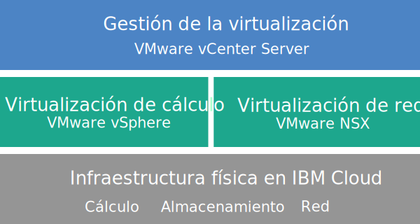

---

copyright:

  years:  2016, 2018

lastupdated: "2018-10-29"

---

{:tip: .tip}
{:note: .note}
{:important: .important}

# Visión general de vCenter Server

VMware vCenter Server on {{site.data.keyword.cloud}} es una nube privada alojada que ofrece las funciones de VMware vSphere como un servicio. El entorno VMware se crea sobre un mínimo de dos (aunque se recomiendan tres) {{site.data.keyword.cloud_notm}} {{site.data.keyword.baremetal_short}}, ofrece almacenamiento compartido conectado a la red y opciones de almacenamiento dedicado definido por software, e incluye funciones automáticas de despliegue y configuración de un cortafuegos lógico fácil de gestionar respaldado por VMware NSX.

En muchos casos, todo el entorno se puede suministrar en menos de un día, y la capacidad de cálculo de la infraestructura de servidores nativos se puede aumentar y reducir de forma rápida y elástica según las necesidades.

Después del despliegue, puede aumentar el almacenamiento compartido solicitando más comparticiones de archivos NFS (sistema de archivos de red, Network File System) desde el {{site.data.keyword.slportal}} y conectándolas manualmente a todos los servidores ESXi de un clúster. Si necesita almacenamiento dedicado, se ofrece [NetApp ONTAP Select on {{site.data.keyword.cloud_notm}}](../netapp/np_netappoverview.html) tanto en las configuraciones de alto rendimiento (todo SSD) como en las de alta capacidad (todo SATA).

VMware vSAN también está disponible como opción de almacenamiento dedicado. Para aumentar la capacidad de almacenamiento basado en vSAN de un clúster vSAN, puede añadir más servidores ESXi después del despliegue.

Si ha adquirido licencias de VMware proporcionadas por IBM, puede actualizar la edición VMware NSX Base a la edición Advanced o to Enterprise y puede adquirir componentes adicionales de VMware, como por ejemplo VMware vRealize Operations.

Puede añadir servicios gestionados por IBM si desea descargar las operaciones cotidianas y el mantenimiento de la virtualización, el sistema operativo invitado o las capas de aplicaciones. El equipo de {{site.data.keyword.cloud_notm}} Professional Services también está disponible para ayudarle a acelerar la implantación en la nube con servicios de migración, implementación, planificación e incorporación.

## Arquitectura de vCenter Server

En el gráfico siguiente se muestra la arquitectura general y los componentes del despliegue de vCenter Server de tres nodos.

Figura 1. Arquitectura general de vCenter Server para un clúster de tres nodos

### Infraestructura física

Esta capa proporciona la infraestructura física (recursos de cálculo, de almacenamiento y de red) que utilizará la infraestructura virtual.

### Infraestructura de virtualización (cálculo y red)

Esta capa virtualiza la infraestructura física mediante diversos productos de VMware:
* VMware vSphere virtualiza los recursos físicos de cálculo.
* VMware NSX es la plataforma de virtualización de red que proporciona los componentes lógicos de red y las redes virtuales.

### Gestión de la virtualización

Esta capa consta de vCenter Server Appliance (vCSA), NSX Manager, dos NSX ESG, tres controladores NSX, el dispositivo virtual Platform Services Controller (PSC) y la Instancia de servidor virtual (VSI) de IBM CloudDriver. La VSI de CloudDriver se despliega a petición según sea necesario para determinadas operaciones, como por ejemplo, añadir hosts al entorno.

La oferta básica se despliega con un dispositivo vCenter Server cuyo tamaño se ajusta para dar soporte a un entorno con un máximo de 400 hosts y hasta 4000 máquinas virtuales. Se pueden utilizar las mismas herramientas y scripts compatibles con la API de vSphere para gestionar el entorno VMware alojado por IBM.

En total, la oferta básica necesita 38 vCPU y 67 GB de vRAM que se reservan para la capa de gestión de virtualización. El resto de la capacidad de host para sus VM depende de varios factores, como la tasa de sobresuscripción, el dimensionamiento de VM y los requisitos de rendimiento de la carga de trabajo.

Para obtener más información sobre la arquitectura, consulte [Referencia de arquitectura de {{site.data.keyword.vmwaresolutions_short}}](../archiref/solution/solution_overview.html).

## Especificaciones técnicas para instancias de vCenter Server

Se incluyen los siguientes componentes en la instancia de vCenter Server.

La disponibilidad y los precios de las configuraciones estandarizadas de hardware pueden variar en función del {{site.data.keyword.CloudDataCent_notm}} seleccionado para el despliegue.
{:note}

### Servidor nativo

Puede solicitar tres o más {{site.data.keyword.baremetal_short}} con una de las siguientes configuraciones:
* **Skylake** o **Broadwell**: {{site.data.keyword.baremetal_short}} con el modelo de CPU y el tamaño de RAM seleccionados.  
  * 2-CPU Intel Skylake generation (Intel Xeon 4100/5100/6100 series)
  * 2-CPU Intel Broadwell generation (Intel Xeon E5-2600 v4 series)

     Si tiene pensado utilizar almacenamiento vSAN, la configuración necesita cuatro {{site.data.keyword.baremetal_short}}.
     {:note}
* **Certificado por SAP**: {{site.data.keyword.baremetal_short}} con el modelo de CPU seleccionado.
  * Procesador Dual Intel Xeon Gold 6140 / 36 núcleos en total, 2,3 GHz / 192 GB de RAM
  * Procesador Dual Intel Xeon Gold 6140 / 36 núcleos en total, 2,3 GHz / 384 GB de RAM
  * Procesador Dual Intel Xeon Gold 6140 / 36 núcleos en total, 2,3 GHz / 768 GB de RAM
* **Preconfigurado**: 2-CPU Intel Broadwell generation (Intel Xeon E5-2600 v4 series)
  * **Pequeño** (Dual Intel Xeon E5-2620 v4 / 16 núcleos en total, 2,1 GHz / 128 GB de RAM / 2 discos)
  * **Medio** (Dual Intel Xeon E5-2650 v4 / 24 núcleos en total, 2,2 GHz / 256 GB de RAM / 2 discos)
  * **Grande** (Dual Intel Xeon E5-2690 v4 / 28 núcleos en total, 2,6 GHz / 512 GB de RAM / 2 discos).

### Redes

Se solicitan los siguientes componentes del sistema de redes:
*  Enlaces ascendentes de red pública y privada de 10 Gbps
*  Tres VLAN (LAN virtuales): una VLAN pública y dos VLAN privadas
*  Se despliega una VXLAN (LAN extensible virtual) con DLR (direccionador lógico distribuido) para una potencial comunicación este-oeste entre cargas de trabajo locales conectadas a redes de la capa 2 (L2). La VXLAN se despliega como una topología de direccionamiento de ejemplo, que puede modificar o eliminar o a la que puede añadir componentes. También puede añadir zonas de seguridad adjuntando VXLAN adicionales a las nuevas interfaces lógicas del DLR.
*  Dos VMware NSX Edge Services Gateways:
  * Una Edge Services Gateway (ESG) de NSX de VMware de servicios de gestión segura para el tráfico de gestión de HTTPS saliente, desplegado por IBM como parte de la topología del sistema de redes de gestión. Las máquinas virtuales de gestión de IBM utilizan esta ESG para comunicarse con componentes externos específicos de gestión de IBM que están relacionados con la automatización. Para obtener más información, consulte [Configuración de la red para que utilice la ESG gestionada por el cliente](../vcenter/vc_esg_config.html#configuring-your-network-to-use-the-customer-managed-nsx-esg-with-your-vms).

    Este ESG se denomina **mgmt-nsx-edge**, no puede acceder al mismo ni puede utilizarlo. Si lo modifica, es posible que no pueda gestionar la instancia de vCenter Server desde la consola de {{site.data.keyword.vmwaresolutions_short}}. Además, el uso de un cortafuegos o la inhabilitación de las comunicaciones de ESG a los componentes de gestión externa de IBM hará que {{site.data.keyword.vmwaresolutions_short}} quede inutilizable.
    {:important}
  * Una Edge Services Gateway de NSX de VMware segura gestionada por el cliente para el tráfico de salida y de entrada de carga de trabajo HTTPS. IBM despliega esta pasarela como plantilla que puede modificar para proporcionar acceso VPN o acceso público. Para obtener más información, consulte [¿Representa NSX Edge gestionado por el cliente un riesgo para la seguridad?](../vmonic/faq.html#does-the-customer-managed-nsx-edge-pose-a-security-risk-)

### Instancias de servidor virtual

Se solicitan las siguientes instancias de servidor virtual (VSI):
* Una VSI para IBM CloudBuilder, que se cierra una vez completado el despliegue de la instancia.
* (Para instancias de V2.2 y posteriores) Puede elegir desplegar un único Microsoft Windows Server VSI for Microsoft Active Directory (AD) o dos VM Microsoft Windows de alta disponibilidad en el clúster de gestión para ayudar a mejorar la seguridad y la solidez.
* (Para instancias de V1.9 a V2.1) Se despliega y se puede consultar una VSI de Microsoft Windows Server para Microsoft Active Directory (AD). La VSI funciona como el DNS para la instancia en la que se han registrado los hosts y las máquinas virtuales.
* (Para instancias de la V1.8 y anteriores) Una VSI para la copia de seguridad basada en instantánea de los componentes de gestión, que sigue en ejecución después de que finalice el despliegue de la instancia.

### Almacenamiento

Durante el despliegue inicial, puede elegir entre las opciones de almacenamiento vSAN y NFS.

#### Almacenamiento vSAN

La opción vSAN ofrece configuraciones personalizadas, con diversas opciones para el tipo de disco, el tamaño y la cantidad:
* Cantidad de discos: 2, 4, 6 u 8
* Disco de almacenamiento: SSD SED de 960 GB, SSD SED de 1,9 TB o SSD SED de 3,8 TB.

  Además, también se solicitan dos discos de memoria caché de 960 GB por host.

  Las unidades SSD (disco de estado sólido) de 3,8 TB recibirán soporte cuando estén disponibles a nivel general en un centro de datos.
  {:note}
* Opción de Intel Optane de alto rendimiento, que proporciona dos bahías de disco de capacidad adicional para un total de 10 discos de capacidad. Esta opción depende del modelo de CPU.

#### Almacenamiento NFS

La opción NFS ofrece almacenamiento a nivel de archivo compartido personalizado para cargas de trabajo con distintas opciones de tamaño y de rendimiento:
* Tamaño: 1, 2, 4, 8 o 12 TB
* Rendimiento: 2, 4 o 10 IOPS/GB.
* Configuración individual de comparticiones de archivos.

Si selecciona la opción NFS, se solicita una compartición de archivos de 2 TB y de 4 IOPS/GB para los componentes de gestión.

### Licencias (proporcionadas por IBM o BYOL) y cuotas

* VMware vSphere Enterprise Plus 6.5u1
* VMware vCenter Server 6.5
* VMware NSX Service Providers Edition (Base, Advanced o Enterprise) 6.4
* (Para clústeres vSAN) VMware vSAN Advanced o Enterprise 6.6
* Cuota de soporte y servicios (una licencia por nodo)

## Especificaciones técnicas para nodos de expansión de vCenter Server

Cada nodo de expansión de vCenter Server desplegará e incurrirá en cargos por los siguientes componentes en su cuenta de {{site.data.keyword.cloud_notm}}.

### Hardware para nodos de expansión

Un servidor nativo con la configuración presentada en [Especificaciones técnicas para instancias de vCenter Server](vc_vcenterserveroverview.html#technical-specifications-for-vcenter-server-instances).

### Licencias y tarifas correspondientes a nodos de expansión

* Un VMware vSphere Enterprise Plus 6.5u1
* Un VMware NSX Service Providers Edition (Base, Advanced o Enterprise) 6.4
* Una cuota de soporte y servicios
* (Para clústeres vSAN) VMware vSAN Advanced o Enterprise 6.6

Solo debe gestionar los componentes de {{site.data.keyword.vmwaresolutions_short}} que se crean en la cuenta de {{site.data.keyword.cloud_notm}} desde la consola de {{site.data.keyword.vmwaresolutions_short}}, no a través del {{site.data.keyword.slportal}} ni por ningún otro medio fuera de la consola. Si cambia estos componentes fuera de la consola de {{site.data.keyword.vmwaresolutions_short}}, los cambios no se sincronizan con la consola.
El hecho de gestionar los componentes de {{site.data.keyword.vmwaresolutions_short}}, que se instalaron en la cuenta de {{site.data.keyword.cloud_notm}} al solicitar la instancia, desde fuera de la consola de {{site.data.keyword.vmwaresolutions_short}} podría hacer que el entorno quedara inestable. Estas actividades de gestión incluyen:
*  Añadir, modificar, devolver o eliminar componentes
*  Ampliar o reducir la capacidad de la instancia mediante la adición o eliminación de servidores ESXi
*  Apagar componentes
*  Reinicio de servicios
Las Excepciones de servicios de reinicio de estas actividades incluyen la gestión de comparticiones de archivos de almacenamiento compartido desde el {{site.data.keyword.slportal}}. Estas actividades incluyen: solicitar, suprimir (lo que puede afectar los almacenes de datos si están montados), autorizar y montar comparticiones del archivo de almacenamiento compartido.
   {:important}

### Enlaces relacionados

* [Lista de materiales de software de vCenter Server](vc_bom.html)
* [Planificación de instancias de vCenter Server](vc_planning.html)
* [Pedido de instancias de vCenter Server](vc_orderinginstance.html)
* [Almacenamiento en bloque y de archivos de {{site.data.keyword.cloud_notm}}](https://www.ibm.com/cloud/garage/content/architecture/virtualizationArchitecture/shared-storage){:new_window}
