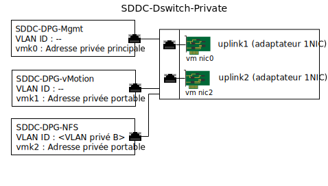

---

copyright:

  years:  2016, 2019

lastupdated: "2019-02-13"

subcollection: vmware-solutions

---

{:tip: .tip}
{:note: .note}
{:important: .important}

# Gestion d'infrastructure de stockage connecté
{: #storage-infra-mgmt}

La gestion d'infrastructure fait référence aux composants VMware qui gèrent l'infrastructure vSphere ESXi.

Pour plus d'informations sur les composants, voir Figure 2. Présentation du réseau NSX Manager dans [Conception de l'infrastructure virtuelle](/docs/services/vmwaresolutions/archiref/solution?topic=vmware-solutions-design_virtualinfrastructure).

## Conception de la mise en réseau virtuelle
{: #storage-infra-mgmt-visual-net-design}

La virtualisation de réseau qui est utilisée dans cette conception utilise le commutateur vDS (vSphere Distributed Switch) existant qui est associé au réseau privé et qui est spécifié dans la rubrique [Architecture {{site.data.keyword.vmwaresolutions_full}}](/docs/services/vmwaresolutions/archiref/solution?topic=vmware-solutions-solution_overview).

## Commutateur vDS (vSphere Distributed Switch)
{: #storage-infra-mgmt-vsphere-ds}

Un autre réseau local virtuel est créé dans la solution vCenter Server et utilisé pour connecter le point de montage NFS aux hôtes ESXi du cluster existant. Dans la mesure où la solution vCenter Server comporte un commutateur vDS (vSphere Distributed Switch) associé au réseau privé, un autre groupe de ports est créé et balisé avec le numéro du réseau local virtuel supplémentaire car ce dernier n'est pas natif.

Le tableau suivant contient les paramètres par défaut du nouveau groupe de ports :

Ne modifiez pas ces paramètres par défaut.
{:important}

Tableau 1. Récapitulatif du groupe de ports NFS

| Nom de groupe de ports | SDDC-DPG-NFS |
|:--------------- |:------------ |
| Liaison de port | Statique |
| Type de VLAN | Réseau local virtuel privé B |
| Equilibrage de charge | Route basée sur le port virtuel d'origine |
| Liaisons montantes actives | Uplink1 et uplink2 |

Outre le groupe de ports vDS créé pour le trafic de stockage NFS, un port VMkernel est créé sur chaque hôte vSphere ESXi durant le déploiement et affecté au groupe de ports SDDC-DPG-NFS. Le port VMkernel se voit également affecter une adresse IP provenant du sous-réseau portable privé qui est associé au réseau local virtuel de stockage connecté, autrement dit, le réseau local virtuel privé B et la MTU 9000 pour la prise en charge des trames jumbo.

Figure 1. Groupes de ports et liaisons montantes vDS privés

### Routage statique d'hôte vSphere
{: #storage-infra-mgmt-vsphere-routing}

Bien que le commutateur vDS soit configuré avec un nouveau groupe de ports et qu'un port VMkernel soit affecté au groupe de ports, la solution crée une route statique sur chaque hôte vSphere ESXi du déploiement de sorte que la totalité du trafic NFS traverse le réseau local virtuel et le sous-réseau pour NFS. La route statique est créée dans `/etc/rc.local.d/local.sh`, par conséquent, elle est conservée à chaque redémarrage de l'hôte.

## Liens connexes
{: #storage-infra-mgmt-related}

* [Présentation de la solution](/docs/services/vmwaresolutions/archiref/solution?topic=vmware-solutions-solution_overview)
