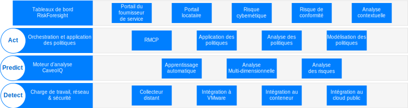
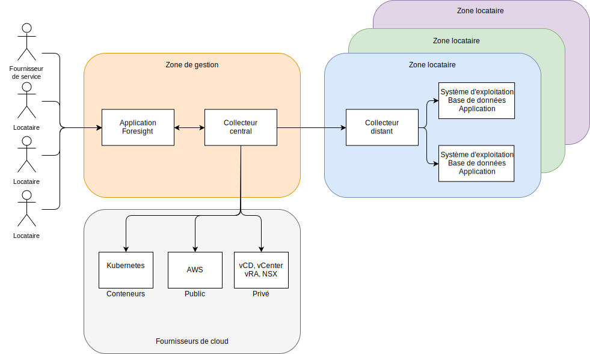

---

copyright:

  years:  2016, 2019

lastupdated: "2019-05-06"

subcollection: vmware-solutions

---

# Présentation de l'architecture de Caveonix RiskForesight
{: #caveonix-arch}

Le diagramme suivant représente l'architecture de Caveonix RiskForesight.

L'architecture de Caveonix RiskForesight comporte quatre couches :
-	Detect - Le module Detect est entièrement intégré dans la pile VMware et dans de nombreux clouds publics. Grâce aux plug-in, RiskForesight utilise vCenter et NSX Manager comme référentiels d'actifs et recueille des détails sur les machines virtuelles, les réseaux et les flux réseau. Les collecteurs distants analysent les charges de travail, les systèmes d'exploitation et les applications pour permettre une vue globale de la conformité et des vulnérabilités.
-	Predict - Le module Predict utilise l'analyse pour identifier les actifs à risque et les mesures d'atténuation à l'aide de modèles de réduction des risques afin d'améliorer la posture de risque.
-	Act - Le module Act met en oeuvre les mesures d'atténuation fondées sur l'établissement des priorités et les mesures de protection automatisées afin d'assurer une protection proactive de la charge de travail contre les risques liés aux cybermenaces.
    - RMCP – Le plan de contrôle de la gestion des risques (RMCP) fournit une protection continue et proactive des charges de travail, en surveillant la pile complète dans les centres de données de cloud privés, publics et gérés.
    - Gestionnaire de politiques - Actuellement, il prend en charge trois types de tâches d'apprentissage automatique par organisation : Caveo Logs, Caveo Network, Caveo Scan. En se basant sur les anomalies trouvées dans les données, l'utilisateur peut configurer des stratégies pour prendre des mesures en fonction des conditions définies par l'utilisateur ; sélectionner le type de tâche et configurer les conditions booléennes pour le score de l'anomalie et définir une mesure si les conditions sont remplies. Par exemple :
        - Si le score d'anomalie du travail "Caveo Logs" est > 90, alors mettre en quarantaine l'actif et envoyer une notification au canal Slack.
        - Si le score d'anomalie du travail "Caveo Network" est > 95, alors mettre en quarantaine l'actif et envoyer une notification par courrier électronique ainsi qu'une notification sur l'interface utilisateur.
- Tableaux de bord - Les tableaux de bord, grâce à un accès basé sur les rôles, permettent à un fournisseur de service, tel qu'un service informatique, d'allouer des actifs informatiques aux locataires ou aux unités opérationnelles. Les unités opérationnelles affectent ensuite ces actifs informatiques aux applications. Ces applications correspondent aux services commerciaux et informatiques, font l'objet d'une évaluation de l'impact commercial et sont soumises à un régime de conformité tel que le : NIST, NESA, PCI, ISO et HIPAA. Ces applications sont ensuite soumises à un certain nombre d'analyses telles que les vulnérabilités, les flux NSX, les logiciels et les données des journaux pour accroître la visibilité sur ce qui est en cours d'exécution, ainsi que sur les risques cybernétiques et de conformité associés à l'application. En parcourant ces tableaux de bord, les utilisateurs de conformité et de sécurité peuvent voir une liste d'actions prioritaires pour atténuer et activer les mesures d'application automatisables dans les modules Predict et Act. RiskForesight fournit à la fois un tableau de bord unifié pour identifier les actifs dans le cloud hybride et une carte de densité des risques cybernétiques, des risques de configuration de la conformité, des principales tendances, et des mesures de sécurité des opérations. Il permet aux utilisateurs de déterminer rapidement la nature et l'emplacement des risques et de définir les mesures à prendre à l'aide d'un outil de visualisation intuitif et puissant. Ces tableaux de bord offrent :
  - Une visualisation priorisée du risque cybernétique et des risques de conformité dans un cloud hybride grâce aux vues Detect, Predict et Act du tableau de bord.
  - La possibilité pour un utilisateur d'interagir visuellement avec les données pour identifier rapidement les actifs à risque, en fonction des priorités de risque.
  - Des graphiques, des métriques et des filtres faciles à utiliser pour mieux comprendre les risques identifiés.
  - Une exploration interactive pour approfondir les informations sur les flux de données d'application, les vulnérabilités ou les problèmes de configuration entre les sites, les organisations, les applications et les actifs.
  - La possibilité pour l'utilisateur de développer une connaissance complète de la pile opérationnelle qui comprend l'infrastructure, la plateforme, l'application et les données.
  - La capacité de visualiser et d'appliquer des stratégies de segmentation des réseaux, des machines virtuelles ou des applications dans le cloud hybride.

## Zones
{: #caveonix-arch-zones}

Caveonix RiskForesight utilise un concept de zones :

-	Zone Gestion ou fournisseur de service - La zone de gestion ou de fournisseur de service inclut les composants suivants :
    - Application RiskForesight - Cette application contient plusieurs composants et fait l'objet d'une description détaillée dans la section Composants de l'application.
    - Collecteur central – Le collecteur central collecte les informations des zones Fournisseurs de cloud et Locataires.
- Zone Fournisseurs de cloud - Cette zone fournit l'infrastructure sur laquelle les applications sont hébergées :
    - Privé – Plateformes VMware on {{site.data.keyword.cloud}} et de l'infrastructure VMware sur site. Ces plateformes sont intégrées dans RiskForesight via : vCenter, NSX Manager, VMware Cloud Director (vCD) ou vRealize Automation (vRA).
    - Public – Actuellement, le seul fournisseur de cloud public pris en charge est AWS. {{site.data.keyword.cloud_notm}} sera bientôt disponible.
    - Conteneurs - Actuellement, seul le service AWS Elastic Kubernetes Service (EKS) est pris en charge. {{site.data.keyword.cloud_notm}} Private et {{site.data.keyword.cloud_notm}} Kubernetes Services seront bientôt disponibles. 
-	Zone Locataire ou environnement client – Ces zones sont utilisées pour séparer les locataires, les clients et les unités commerciales. Des charges de travail existent dans ces zones et par conséquent un collecteur distant est requis. Pour un déploiement minimum, vous avez besoin d'un collecteur distant mais pour un déploiement général vous avez besoin d'un collecteur distant par locataire/client/unité commerciale.

## Liens connexes
{: #caveonix-arch-related}

*   [VMware vCenter Server on {{site.data.keyword.cloud_notm}} with Hybridity Bundle](/docs/services/vmwaresolutions/archiref/vcs?topic=vmware-solutions-vcs-hybridity-intro)
*   [Conception détaillée de Caveonix](/docs/services/vmwaresolutions/archiref/caveonix?topic=vmware-solutions-caveonix-detailed)
