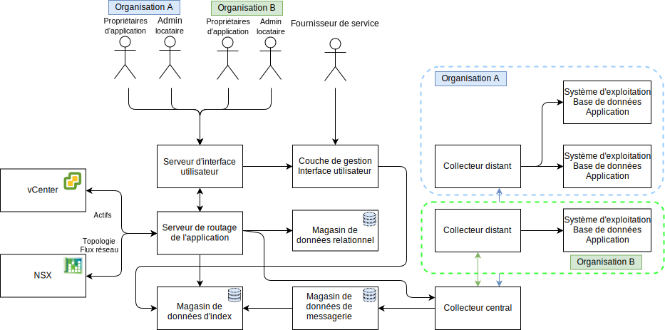

---

copyright:

  years:  2016, 2019

lastupdated: "2019-05-06"

subcollection: vmware-solutions

---

# Conception détaillée
{: #caveonix-detailed}

Le diagramme et les descriptions suivantes fournissent des informations sur les composants de l'application de RiskForesight.

-	Interface graphique - Interface Web que vous pouvez utiliser pour accéder à l'application RiskForesight.
-	Collecteur central - Collecte les différents types de contenus de données qui proviennent des plug-in et les met à disposition dans le magasin de messagerie. RiskForesight prend en charge les types de contenus suivants :
    - Analyses
    - Journaux
    - Netflow
    - Logiciel
    - Métadonnées de charge de travail
- Routeur central - Gère tous les points de contact d'intégration avec la couche Orchestration de VMware. Tous les plug-in de RiskForesight doivent communiquer avec le routeur central pour être autorisé à communiquer avec l'écosystème RiskForesight.
-	Serveur d'API - Il s'agit du logiciel intermédiaire de noeud final REST qui connecte l'interface utilisateur et les magasins de données de backend. Il valide également les demandes d'accès des utilisateurs et gère le contrôle d'accès basé sur les rôles.
-	Collecteur de données vCenter - Le plug-in extrait les caractéristiques de machine virtuelle de vCenter. Le plug-in générique utilise les API VMware pour se connecter à vCenter et extrait les informations relatives à la charge de travail. Une fois que les informations sont disponibles, le plug-in conditionne le contenu et l'envoie au collecteur central.
-	Collecteur de données vCD - Le plug-in extrait les caractéristiques de machine virtuelle de VMware vCloud Director. Le plug-in générique utilise les API VMware pour se connecter à VMware vCloud Director et extrait les informations relatives à la charge de travail. Une fois que les informations sont disponibles, le plug-in conditionne le contenu et l'envoie au collecteur central.
-	Collecteur de données réseau vCD - Le plug-in extrait les données Netflow de VMware vCD. Le plug-in générique utilise les API VMware pour se connecter à VMware NSX et extrait le réseau, le pare-feu, les règles de sécurité et les groupes de sécurité. Une fois que les informations sont disponibles, le plug-in conditionne le contenu et l'envoie au collecteur central.
-	Collecteur de données réseau - Plug-in qui extrait les détails Netflow de VMware vCenter. Le plug-in générique utilise les API VMware pour se connecter à VMware NSX et extrait les informations sur le réseau, le pare-feu, les règles de sécurité et les groupes de sécurité. Une fois que les informations sont disponibles, le plug-in conditionne le contenu et l'envoie au collecteur central.
-	Collecteur distant - Réside dans l'environnement locataire ou dans un autre emplacement où il a un accès réseau aux machines virtuelles locataires. Il gère toutes les analyses de conformité et de risques cybernétiques.
-	Magasin de données relationnel - Il maintient les types de métadonnées suivants :
    - Fournisseur de service de cloud
    - Locataire
    - Actifs
    - Résultats d'analyse
    - Logiciel
    - Jeu de données agrégés chaque jour ou chaque semaine
- Magasin de données de messagerie - RiskForesight utilise une file d'attente de messagerie persistante pour éviter toute perte de données et décharger la contre-pression sur les composants.
- Magasin de données d'index - Il indexe et stocke les données brutes entrantes de chaque locataire pour effectuer des analyses supplémentaires afin de prendre en charge la fonction multi-locataires.
- Plug-in – Ils résident dans le serveur de routage d'application et incluent la configuration et l'intégration avec les composants VMware pour synchroniser toutes les machines virtuelles avec les informations de leurs locataires.

Le tableau suivant montre les ports et les protocoles requis pour chaque composant.

Tableau 1. Ports et protocoles

|Composant	|Protocole / Ports|
|---|---|
|Interface utilisateur|443|
|API|443, 1337|
|RiskForesight|8082, 8083, 8084|
|Collecteur central (cluster)|8080|
|Collecteur distant|8081|
|Magasin de données relationnel principal ou secondaire|5432|
|Cluster de magasin de données de messagerie|9092|
|Noeuds maître du magasin de données d'index|9200, 9300, 5601, 443|

Le diagramme suivant montre la topologie du réseau avec le sous-réseau privé portable Caveonix qui est associé au VLAN privé A. Vous êtes responsable de la gestion de l'espace d'adresse IP de ce sous-réseau afin de pouvoir passer manuellement du modèle "tout-en-un" au modèle de déploiement entièrement distribué, en passant par le modèle partiellement distribué si nécessaire.

Le tableau ci-dessous décrit le sous-réseau IP et les affectations du réseau local virtuel (VLAN).

Tableau 2. Réseau local virtuel et sous-réseau

|VLAN 	|Type de sous-réseau 	|Description|
|---|---|---|
|Public 	|Principal 	|Affecté à des hôtes physiques pour l'accès au réseau public. Non utilisé lors du déploiement initial.|
|Public	|Portable 	|Affecté à l'utilisation des liaisons montantes et de la conversion NAT sur customer-nsx-esg.|
|Public	|Portable 	|Affecté à l'utilisation des liaisons montantes et de la conversion NAT sur mgmt-nsx-esg.|
|Public	|Portable 	|Affecté à l'utilisation des liaisons montantes et de la conversion NAT sur hcx-mgmt-esg, si Hybridity bundle est sélectionné.|
|Privé A 	|Principal 	|Affecté aux hôtes physiques affectés par {{site.data.keyword.cloud}}. Utilisé par l'interface de gestion pour le trafic de gestion vSphere.|
|Privé A 	|Portable 	|Affectés à des machines virtuelles qui fonctionnent en tant que composants de gestion.|
|Privé A 	|Portable 	|Affecté aux VTEP NSX.|
|Privé A 	|Portable 	|Affecté à HCX pour un usage interne, si Hybridity bundle est sélectionné.|
|Privé A 	|Portable 	|Affecté à l'utilisation des liaisons montantes sur customer-nsx-esg.|
|Privé A 	|Portable 	|Affecté à HCX si Hybridity bundle est sélectionné.|
|Privé A 	|Portable 	|Affecté aux dispositifs de réplication virtuelle Zerto si l'option Zerto est sélectionnée.|
|Privé A 	|Portable 	|Affecté à Caveonix RiskForesight, si l'option Caveonix est sélectionnée.|
|Privé B	|Principal	|Non utilisé lors du déploiement initial.|
|Privé B 	|Portable 	|Affecté au réseau de stockage virtuel, si utilisé.|
|Privé B 	|Portable 	|Affecté au stockage sur réseau, si utilisé.|
|Privé B 	|Portable 	|Affecté pour vMotion.|

## Liens connexes
{: #caveonix-detailed-related}

* [VMware vCenter Server on {{site.data.keyword.cloud_notm}} with Hybridity Bundle](/docs/services/vmwaresolutions/archiref/vcs?topic=vmware-solutions-vcs-hybridity-intro)
