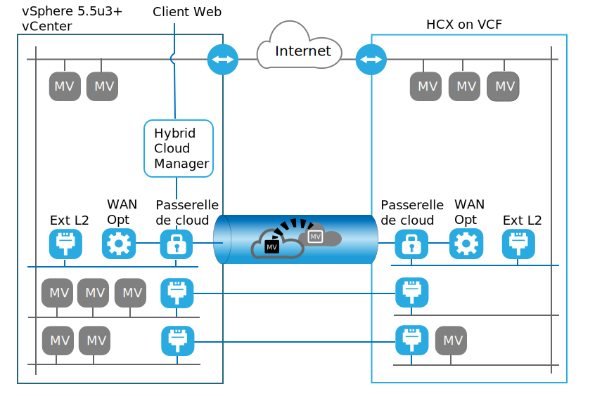

---

copyright:

  years:  2016, 2019

lastupdated: "2019-05-06"

subcollection: vmware-solutions

---
# Présentation de VMware HCX on IBM Cloud
{: #hcx-archi-intro}

Le service VMware HCX on IBM Cloud permet de créer une connexion ininterrompue entre des instances IBM Cloud for VMware Solutions et un centre de données virtuel VMware local.

IBM Cloud for VMware Solutions inclut des déploiements rapides et entièrement automatisés de VMware vCenter Server on IBM Cloud (VCS) dans IBM Cloud. Ces offres complètent l'infrastructure sur site et permettent aux charges de travail existantes et futures de s'exécuter dans IBM Cloud sans conversion et à l'aide des mêmes outils, compétences, et processus que ceux utilisés sur site. Pour plus d'informations, voir [Virtualization for extending virtualized private cloud](https://www.ibm.com/cloud/garage/architectures/virtualizationArchitecture).

Le service VMware HCX on IBM Cloud permet d'exploiter cette hybridité, en mélangeant les instances de VCS avec des centres de données virtuels locaux existants, et en permettant la création d'extensions réseau ininterrompues et la migration bidirectionnelle de charges de travail.

Les composants VMware HCX on IBM Cloud qui sont déployés en tant que machines virtuelles sur le site cible IBM Cloud VMware permettent l'établissement d'une connexion avec des composants VMware HCX on IBM Cloud installés sur le site source local homologue.

Cette connexion crée une interconnectivité à couplage lâche entre le site local et IBM Cloud et active des fonctions telles que :
* Interconnectivité simple – Des connexions de réseau logique sont facilement établies sur n'importe quelle connexion physique, y compris l'Internet public, le VPN privé ou Direct Link.
* Extension de couche 2 - Les réseaux locaux sont étendus au cloud. Ils incluent les sous-réseaux locaux et l'adressage IP.
* Chiffrement – Le trafic réseau est chiffré entre les deux sites.
* Réseau optimisé – Sélectionne la meilleure connexion et achemine efficacement la connexion de sorte que le trafic réseau soit déplacé le plus rapidement possible.
* Dédoublonnage de données – Jusqu'à 50 % de réduction de trafic réseau peut être réalisé Routage intelligent – Lorsqu'une charge de travail est déplacée, le routage de proximité peut modifier le chemin réseau (c'est-à-dire la passerelle) de sorte que le trafic réseau utilise la passerelle de site cible et ne dessine pas une "courbe en épingle à cheveux" vers le site d'origine.
* Migration sans interruption – Un système en cours d'exécution peut être déplacé vers et depuis le cloud à l'aide de vMotion.
* Migration planifiée – N'importe quel nombre de machines virtuelles peut être répliqué vers le site de destination, puis activé sur ce site à une heure précise afin de remplacer les systèmes qui s'exécutent sur le site d'origine.
* Migration de règles de sécurité – Si NSX est utilisé sur site, toutes les règles de sécurité ou tous les pare-feux sont déplacés en même temps que la charge de travail.

## Liens connexes
{: #hcx-archi-intro-related}

* [Virtualization for extending virtualized private cloud](https://www.ibm.com/cloud/garage/architectures/virtualizationArchitecture)
