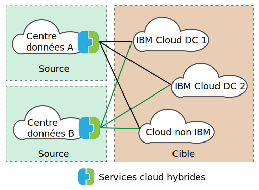

---

copyright:

  years:  2016, 2019

lastupdated: "2019-05-06"

subcollection: vmware-solutions

---
# Présentation de VMware HCX on IBM Cloud
{: #hcx-archi-overview}

VMware HCX on IBM Cloud s'intègre en toute transparence aux réseaux vSphere® vCenter™ locaux dans les déploiements IBM Cloud for VMware Solutions. La mise en réseau hybride s'étend aux réseaux vSphere vCenter locaux dans IBM Cloud, en prenant en charge la mobilité de machine virtuelle bidirectionnelle.

HCX détient les processus de chiffrement et déchiffrement source et destination, en garantissant une sécurité cohérente et en permettant l'admission de flux de travaux hybrides comme la migration de machine virtuelle et l'extension de réseau.

Cette offre crée un réseau WAN optimisé, défini par les logiciels pour l'augmentation des performances de réseau étendu, avec des performances proches de celles de la vitesse d'un réseau local. HCX permet également la migration de la charge de travail bidirectionnelle et de la politique de sécurité VMware NSX® vers IBM Cloud. HCX s'intègre à vSphere vCenter et est géré depuis le client Web vSphere.

## Extension de réseau de couche 2
{: #hcx-archi-overview-layer-2-net}

HCX permet à un site existant en local vSphere d'étendre en toute sécurité un réseau depuis son site vCenter local vers un centre de données IBM Cloud qui exécute VMware vCenter Server. Cette fonction est activée par les éléments suivants :
* HCX fournit un dispositif qui est appelé Concentrateur de couche 2 (L2C).
* Les réseaux étendus se relient aux dispositifs de serveur de périphérie IBM Cloud NSX déployés dans VMware vCenter Server.
* Il est possible de déployer plusieurs concentrateurs de couche 2 pour atteindre l'évolutivité et un débit accru depuis le site vCenter local.
* Les machines virtuelles qui sont migrées via la passerelle cloud et sur la couche 2 étendue peuvent conserver leurs adresses IP et MAC.

## Migration de machine virtuelle
{: #hcx-archi-overview-vm-mig}

HCX fournit trois méthodes de déplacement des machines virtuelles : migration avec peu d'interruption, migration vSphere vMotion et migration à froid.

### Migration avec peu d'interruption
{: #hcx-archi-overview-low-downtime-mig}

La migration avec peu d'interruption repose sur la réplication vSphere, qui est une technologie distribuée mise en oeuvre dans l'hyperviseur VMware ESX®/ESXi®. Le déploiement HCX local crée une réplique d'une machine virtuelle réelle dans IBM Cloud, et effectue un basculement pour mettre hors tension la machine virtuelle source et mettre sous tension la machine virtuelle migrée.

Le chemin de migration est toujours via la passerelle cloud. Le transport peut être Internet, un réseau étendu de couche 2, ou une ligne de connexion directe.

Une machine virtuelle peut être migrée plusieurs fois dans les deux sens.

### Migration vMotion
{: #hcx-archi-overview-vmotion-mig}

Les machines virtuelles réelles peuvent être transférées avec la migration vMotion au sein d'un réseau qui est étendu à IBM Cloud. La migration vMotion est également appelée migration sans interruption ou vMotion entre clouds.

### Migration à froid
{: #hcx-archi-overview-cold-mig}

Avec la migration à froid, vous pouvez transférer une machine virtuelle hors tension vers IBM Cloud via un réseau étendu qui est créée à l'aide du concentrateur de couche 2.

### Fonctions de migration communes
{: #hcx-archi-overview-cold-mig-features}

D'autres fonctions disponibles sur les trois types de migration incluent l'optimisation de réseau WAN définie par les logiciels qui accroît le débit et la vitesse de migration. En outre, il est possible de planifier la migration afin qu'elle ait lieu à une heure spécifique et conserver son nom d'hôte et/ou son nom de machine virtuelle.

## Fonctions réseau
{: #hcx-archi-overview-net-features}

Les fonctions de mise en réseau suivantes sont intégrées à la passerelle cloud et aux concentrateurs de couche 2.

### Intelligent Flow Routing
{: #hcx-archi-overview-intel-flow-routing}

Cette fonction sélectionne automatiquement les meilleurs connexions d'après le chemin Internet, par un envahissement efficace de la connexion entière de sorte que les charges de travail soient déplacées aussi vite que possible. Lorsque des flux plus importants, comme la sauvegarde ou la réplication, entraînent un conflit d'UC, des flux plus petits sont routés vers des UC moins occupées, ce qui améliore les performances d'un trafic interactif.

### Routage de proximité
{: #hcx-archi-overview-prox-routing}

Le routage de proximité garantit que l'acheminement entre les machines virtuelles qui sont connectées aux réseaux étendus et routés, à la fois en local et dans le cloud, est symétrique. Cette fonction nécessite des services réseau avancés avec un routage dynamique configuré entre le site client local et le cloud.

Lorsque des utilisateurs étendent leurs réseaux au cloud, la connectivité de couche 2 est étendue sur les réseaux IBM Cloud. Toutefois, sans optimisation de route, les demandes de communication de couche 3 doivent retourner vers l'origine du réseau local pour être routées. Ce trajet retour est appelé _tromboning_ ou _hairpinning_.

Le trajet de type Tromboning est inefficace car les paquets doivent transiter entre l'origine du réseau et le cloud, même lorsque les machines virtuelles source et destination résident dans le cloud.

En plus de cette inefficacité, si le chemin d'acheminement inclut des pare-feux sans état, ou d'autre équipements en ligne qui doivent voir les deux côtés de la connexion, la communication peut échouer. une défaille de communication de machine virtuelle (sans optimisation de route) se produit lorsque le chemin d'entrée qui quitte le cloud peut être le réseau de couche 2 étendu ou le réseau routé de l'organisation. Le réseau local ne connaît pas le "raccourci" du réseau étendu. Ce problème est appelé routage asymétrique. La solution est d'activer le routage de proximité de sorte que le réseau local puisse apprendre les routes depuis IBM Cloud.

La passerelle cloud gère un inventaire des machines virtuelles dans le cloud. Elle comprend également l'état de la machine virtuelle, qui peut être l'un des suivants :
* Machine virtuelle transférée vers IBM Cloud avec vMotion (migration sans interruption).
* Machine virtuelle migrée vers le cloud à l'aide de la réplication basée sur un hôte (Migration avec peu d'interruption).
* Machine virtuelle créée dans le cloud (sur un réseau étendu).

### Sécurité
{: #hcx-archi-overview-sec}

La passerelle cloud offre un déchargement AES-GCM avec IKEv2, compatible Suite B, AES-NI et un contrôle d'admission basé sur les flux. HCX détient également les processus de chiffrement et déchiffrement source et destination, en garantissant une sécurité et une administration cohérentes pour les flux de travaux hybrides comme la migration de machine virtuelle et l'extension de réseau. Les politiques de sécurité qui sont définies et affectées à une machine virtuelle locale peuvent être migrées avec la machine virtuelle dans IBM Cloud.

La migration de politique est uniquement disponible dans les conditions suivantes :
* Le centre de données local doit exécuter NSX 6.2.2 ou supérieur.
* Dans vSphere, la politique de sécurité est une section NSX unique qui peut contenir un grand nombre de règles.
* L'une peut nommer un ensemble d'adresses IP ou d'adresses MAC qui participeront à la politique. Le nom de l'ensemble de règles MAC ou IP ne peut pas dépasser 218 caractères.
* Les règles prises en charge indiquent des adresses IP de couche 3 ou des ensembles d'adresses IP, ou encore des adresses Mac de couche 2 ou des ensembles d'adresses MAC comme source ou destination.

## Composants de HCX
{: #hcx-archi-overview-comp-hcx}

Le service VMware HCX on IBM Cloud déploie quatre dispositifs virtuels qui sont installés et configurés à la fois sur le centre de données local et la cible IBM Cloud. Cette section décrit chacun des quatre dispositifs virtuels requis. Il peut arriver que des unités de périphérie soient nécessaires selon la conception de l'implémentation.

### HCX Manager
{: #hcx-archi-overview-hcx-man}

Le dispositif virtuel HCX Manager est une extension du vCenter local. Il est déployé en tant que machine virtuelle et sa structure de fichier contient les autres dispositifs virtuels de service hybride. HCX Manager supervise le déploiement et la configuration de la passerelle cloud, des concentrateurs de couche 2 et du dispositif virtuel d'optimisation de réseau WAN à la fois en local et au sein d'IBM Cloud.

### Passerelle de cloud hybride
{: #hcx-archi-overview-hcg}

La passerelle de cloud hybride gère un canal sécurisé entre le site vSphere local et IBM Cloud. HCX utilise un chiffrement renforcé pour amorcer une connexion entre sites à IBM Cloud.

Le canal sécurisé entre vSphere et IBM Cloud évite les problèmes de sécurité "middle mile" de mise en réseau. La passerelle cloud incorpore également la technologie de réplication vSphere pour effectuer une migration bidirectionnelle.

### Optimisation du réseau WAN
{: #hcx-archi-overview-wan-opt}

Le dispositif d'optimisation du réseau WAN est le composant qui effectue un conditionnement de réseau WAN pour réduire les effets de latence. Il incorpore également la correction d'erreur en aval (Forward Error Correction) pour annuler les scénarios de perte de paquet, et le dédoublonnage de modèles de trafic redondant. Ensemble, tout cela réduit l'utilisation de bande passante et garantit la meilleure utilisation de la capacité réseau disponible pour l'expédition du transfert de données vers et depuis IBM Cloud.

Il est important de noter que la migration de machine virtuelle repose sur la combinaison dd'une passerelle cloud et d'un dispositif d'optimisation du réseau WAN pour atteindre une mobilité sans égale entre vSphere en local et IBM Cloud. De plus, l'extension de couche 2 bénéficie d'une optimisation de réseau WAN lorsque le chemin de données est routé via la passerelle cloud.

### Concentrateurs de couche 2
{: #hcx-archi-overview-layer-2-conc}

Les dispositifs de concentrateurs de couche 2 (L2C) permettent l'extension d'un réseau de couche 2 depuis le centre de données vSphere local vers IBM Cloud. Les concentrateurs de couche 2 sont dotés de deux interfaces :
* Interface de jonction interne - Gère le trafic de machine virtuelle en local pour les réseaux étendus à l'aide d'un mappage de pont de traduction vers un réseau étendu correspondant dans IBM Cloud.
* Interface de liaison montante - HCX utilise cette interface pour envoyer le trafic de superposition encapsulé vers et depuis IBM Cloud. Les données d'application transitent via cette interface.

## Architecture de déploiement - Connexion à IBM Cloud à l'aide de l'Internet public
{: #hcx-archi-overview-connect-pub-internet}

Cette section décrit la disposition des composants HCX au sein d'IBM et avec le client local. Dans une telle conception, l'architecture indique un modèle "hub-and-spoke" qui existe entre l'environnement source et IBM Cloud. Par conséquent, le site source fait office de concentrateur avec des connexions vers différents environnements IBM Cloud, comme illustré dans la figure ci-après.

La source peut être placée au sein de l'environnement IBM Cloud également ; les spokes sont toujours des déploiements en cloud au sein de cette concevoir, comme illustré dans la figure ci-après.

### Présentation de l'utilisation
{: #hcx-archi-overview-usage-ovw}

Les tâches suivantes sont effectuées depuis le client Web vSphere :
* Déployer les dispositifs virtuels HCX, puis configurer les composants de réseau WAN définis par les logiciels.
* Etendre les réseaux VLAN et VXLAN en local du site vCenter en local vers le cloud (IBM Cloud).
* Migrer les charges de travail vers et depuis le cloud.

### Dépendances de la conception de base
{: #hcx-archi-overview-base-design}

Avant que les composants soient décrits plus en détail, il est impératif de comprendre le déploiement de base qui est nécessaire dans le cadre de cette conception.
* L'environnement source doit contenir une implémentation vSphere qui est gérée par un serveur vCenter. Les versions 5.5U3e ou 6.0U2 et supérieures de vCenter, avec ESXi version 5.5 ou supérieure, sont nécessaires pour les Services cloud hybrides.
* Si NSX est utilisé, version 6.2.2 ou supérieure. NSX est requis pour la migration de politique.
* Si une migration vMotion entre clouds est prévue, les mêmes restrictions d'affinité s'appliquent entre les clouds comme c'est le cas en local.
* L'environnement source doit disposer d'une méthode pour se connecter aux environnements de cloud. Cela inclut un accès à l'Internet public ou des connexions privées à l'aide d'une liaison directe IBM Cloud. Les connexions, autres que l'Internet public, aux autres fournisseurs de cloud, ne seront pas présentées.
* Les machines virtuelles et les réseaux de l'environnement source à migrer ou a étendre doivent se trouver sur des groupes de ports au sein d'un commutateur distribué virtuel ou d'un commutateur distribué virtuel Cisco Nexus 1000v.
* IBM Cloud doit contenir au moins une instance d'un déploiement VMware vCenter Server.
* Les ressources doivent être suffisantes pour les dispositifs virtuels.
* Les réseaux doivent autoriser les dispositifs à communiquer avec à la fois des dispositifs virtuels locaux et distants, et d'autres machines virtuelles.
* L'annexe A (Port Access Requirements) répertorie les ports qui doivent être ouverts de manière à permettre l'installation de dispositifs virtuels Services cloud hybrides.
* Un compte de service vSphere avec le rôle système de Administrator vCenter Server.
* Espace disque suffisant pour l'installation des Services cloud hybrides et des dispositifs de service associés.
* Nombre d'adresses IP suffisant pour les machines virtuelles en local mises à disposition durant l'installation.
* Si le serveur SSO est distant, l'URL du vCenter, du serveur SSO externe, ou le contrôleur PSC (Platform Services Controller) qui exécute le service de recherche externe doivent être identifiés. Lorsque le service HCX est enregistré auprès de vCenter, cette URL doit être fournie.

## Liens connexes
{: #hcx-archi-overview-related}

* [Présentation de VMware HCX on IBM Cloud](/docs/services/vmwaresolutions/archiref/hcx-archi?topic=vmware-solutions-hcx-archi-intro)
