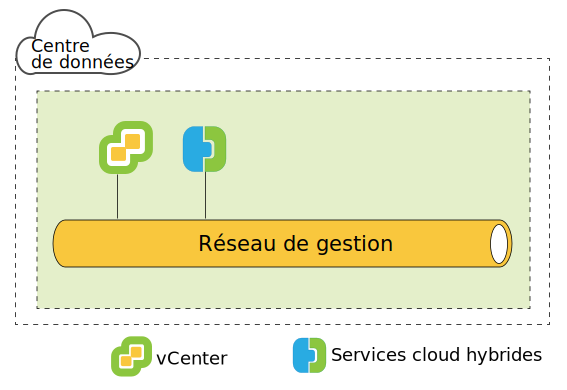
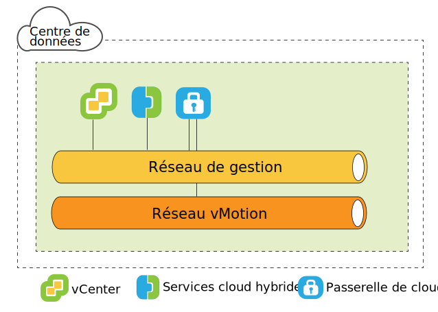
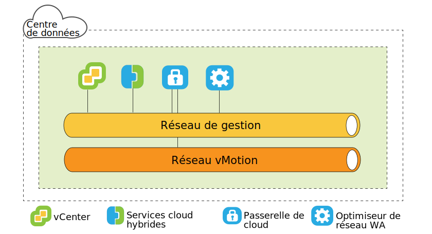
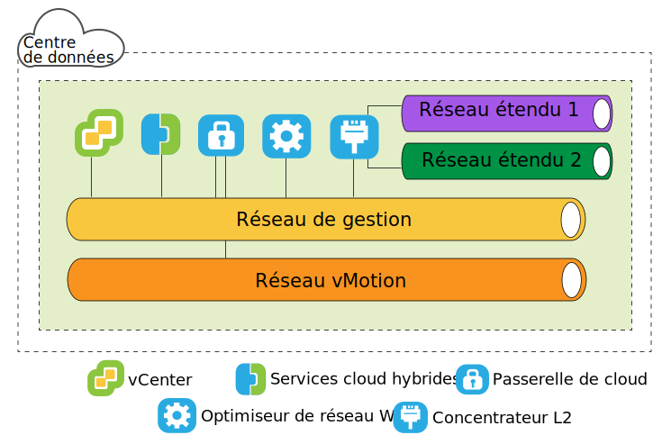
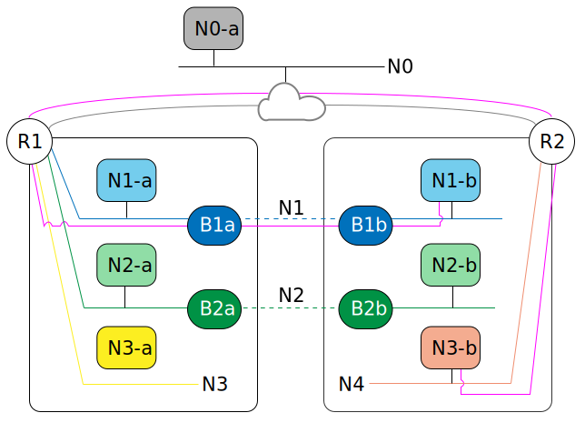

---

copyright:

  years:  2016, 2019

lastupdated: "2019-05-06"

subcollection: vmware-solutions

---

{:tip: .tip}
{:note: .note}
{:important: .important}

# Architecture côté source de VMware HCX on IBM Cloud
{: #hcx-archi-source}

Cette section décrit l'architecture de chaque composant HCX déployé dans l'environnement source.

## Présentation de HCX
{: #hcx-archi-source-intro-hcx}

La technologie HCX s'intègre en toute transparence aux réseaux vSphere vCenter dans la plateforme IBM Cloud VCS. La mise en réseau hybride s'étend aux réseaux vSphere vCenter locaux dans IBM Cloud, en prenant en charge la mobilité de machine virtuelle bidirectionnelle.

Cette introduction récapitule les tâches qui peuvent être accomplies et les fonctions qui prennent en charge et améliorent la migration et l'extension réseau.

* HCX détient les processus de chiffrement et déchiffrement source et destination, en garantissant une sécurité cohérente et en permettant l'admission de flux de travaux hybrides comme la migration de machine virtuelle et l'extension de réseau.
* HCX crée un réseau WAN optimisé, défini par les logiciels pour l'augmentation des performances de réseau étendu, avec des performances proches de celles de la vitesse d'un réseau local.
* HCX permet également la migration de la charge de travail bidirectionnelle et de la politique de sécurité VMware NSX® vers les services IBM Cloud.
* HCX s'intègre à vSphere vCenter et est géré depuis le client vSphere Web Client.

## Extension de réseau de couche 2
{: #hcx-archi-source-layer-2-ext}

* Extension sécurisée d'un réseau d'un site vCenter vers IBM Cloud.
* HCX fournit le concentrateur de couche 2 à débit élevé (HT L2C).
* Liaison des réseaux étendus aux unités périphériques IBM Cloud NSX
* Plusieurs concentrateurs de couche 2 standard peuvent être déployés pour atteindre l'évolutivité et un débit accru .
* Les machines virtuelles qui sont migrées via la passerelle cloud et sur la couche 2 étendue peuvent conserver leurs adresses IP et MAC.

## Méthodes de migration des machines virtuelles
{: #hcx-archi-source-vm-mig-methods}

### Migration avec peu d'interruption
{: #hcx-archi-source-low-downtime-mig}

La migration avec peu d'interruption repose sur la réplication vSphere, qui est une technologie distribuée mise en oeuvre dans l'hyperviseur VMware ESX/ESXi/ESXi. HCX crée une réplique d'une machine virtuelle réelle dans IBM Cloud, et effectue un basculement pour mettre hors tension la machine virtuelle source et mettre sous tension la machine virtuelle migrée.
* Le chemin de migration est toujours via la passerelle cloud. Le transport peut être Internet, un réseau étendu de couche 2, ou une ligne de connexion directe.
* Une machine virtuelle peut être migrée plusieurs fois dans les deux sens.

### Migration vMotion
{: #hcx-archi-source-vmotion-mig}

La migration vMotion utilise vMotion pour transférer une machine virtuelle réelle sur un réseau étendu ver IBM Cloud. La migration vMotion est également appelée migration sans interruption ou vMotion entre clouds.

### Migration à froid
{: #hcx-archi-source-cold-mig}

Transférez un machine virtuelle hors tension vers IBM Cloud sur un réseau étendu.

### Fonctions communes
{: #hcx-archi-source-common-feat}

* L'optimisation en option du réseau WAN définie par logiciel, si elle est installée, accroît le débit et la vitesse de migration.
* Il est possible de planifier la migration afin qu'elle ait lieu à une heure spécifique.
* Une machine virtuelle migrée peut conserver son nom d'hôte et/ou son nom de machine virtuelle.

## Fonctions réseau
{: #hcx-archi-source-net-feat}

Les fonctions de mise en réseau suivantes sont intégrées à la passerelle cloud et aux concentrateurs de couche 2.

* Routage de flux intelligent - Cette fonction sélectionne automatiquement les meilleures connexions d'après le chemin Internet, par un envahissement efficace de la connexion entière afin que les charges de travail soient déplacées aussi vite que possible. Lorsque des flux plus importants, comme la sauvegarde ou la réplication, entraînent un conflit d'UC, des flux plus petits sont routés vers des UC moins occupées, ce qui améliore les performances d'un trafic interactif.
* Routage de proximité - Cette fonction garantit que l'acheminement entre les machines virtuelles qui sont connectées aux réseaux étendus et routés, à la fois en local et dans le cloud, est symétrique.
* Sécurité - La passerelle cloud offre un déchargement AES-GCM avec IKEv2 compatible Suite B, AES-NI et un contrôle d'admission basé sur les flux. HCX détient les processus de chiffrement et déchiffrement source et destination, en garantissant une sécurité cohérente et en permettant l'admission de flux de travaux hybrides comme la migration de machine virtuelle et l'extension de réseau.
  Une politique de sécurité qui est définie sur le site vCenter local et affectée à une machine virtuelle locale peut être migrée avec la machine virtuelle.

## Présentation de HCX
{: #hcx-archi-source-understand-hcx}

HCX prend en charge une relation plusieurs-à-plusieurs entre sites vCenter locaux et IBM Cloud. vCenter Server en mode lié est pris en charge. Cette rubrique fournit une présentation générale de la façon dont l'installateur interagit avec le centre de données sur site et IBM Cloud.

Durant l'installation, le dispositif virtuel HCX Manager est importé et configuré en tant que plug-in pour le site vCenter local. Ce plug-in est ensuite utilisé pour configurer le déploiement du service de réseau WAN défini par les logiciels. La configuration automatisée met à disposition chaque dispositif de service hybride en tant que machine virtuelle dans le vCenter local, puis déploie une machine virtuelle correspondante dans IBM Cloud.

Pour qu'un déploiement réussisse :
* Les ressources doivent être suffisantes pour les dispositifs virtuels
* Le réseau doit autoriser les dispositifs à communiquer avec à la fois des dispositifs virtuels locaux et distants, et d'autres machines virtuelles.

## Présentation du déploiement
{: #hcx-archi-source-deployment-ovw}

La machine virtuelle HCX Manager est installée en premier, puis elle gère l'installation des autres dispositifs de machine virtuelle de service en local et dans le cloud.

Voici un récapitulatif des tâches d'installation de base :
1. Obtenir le fichier OVA du dispositif virtuel Hybrid Cloud Enterprise.
2. Depuis le client vSphere Web Client, installer le dispositif virtuel de service HCX Manager sur le site vCenter local qui se connecte à IBM Cloud.
3. Depuis le client vSphere Web Client, enregistrer un noeud final IBM Cloud avec le plug-in HCX. L'enregistrement établit la relation un-à-un entre l'instance HCX locale et l'instance HCX dans IBM Cloud.
4. Installer et configurer les dispositifs virtuels de service.
5. Pour chaque dispositif installé en local, l'installateur met à disposition un dispositif virtuel de service correspondant dans l'IBM Cloud cible.
6. A l'issue de l'installation, HCX Manager contrôle à la fois les dispositifs virtuels de service locaux et distants. Dans IBM Cloud, HCX gère les composants de réseau WAN réseau définis par les logiciels et mis à disposition en tant que service.

### Remarques relatives aux performances des composants de déploiement
{: #hcx-archi-source-perf-consid}

La planification d'architecture inclut les machines virtuelles à migrer, les réseaux utilisés pour le trafic de machine virtuelle, ainsi que les réseaux à étendre. Cette rubrique récapitule certaines valeurs maximum et minimum pour les composants de déploiement.
* vSphere vCenter. Le dispositif HCX Manager doit être installé sur le site vCenter qui nécessite des services hybrides. Il peut y avoir un seul déploiement HCX par vCenter. Cette restriction s'applique aux mode lié ; le dispositif de gestion HXC est uniquement installé dans le vCenter principal. HCX prend en charge jusqu'à cinq vCenters en mode lié.
* Enregistrements de cloud. Le nombre maximal de noeuds finaux du cloud est de dix. Pour trouver le nombre de noeuds finaux, les Services cloud hybrides suivent les connexions vCenter au cloud.

### Nombre maximum de migrations et d'extensions réseau
{: #hcx-archi-source-max-mig-net-extension}

* Nombre maximum de tâches simultanées de migration avec peu d'interruption : 15
* Nombre maximum de tâches simultanées d'extension L2C : 1
* Nombre maximum de tâches simultanées de migration vMotion : 1

### HCX Management Enterprise
{: #hcx-archi-source-hcxme}

Le fichier OVA de HCX Management Enterprise est déployé dans l'environnement source et enregistré en tant que plug-in pour le vCenter Server qui gère l'infrastructure vSphere source. Ce plug-in est ensuite utilisé pour configurer la migration et les services réseau requis pour permettre une migration entre clouds et une extension de réseau L2.

Il peut y avoir un seul déploiement HCX par vCenter. Cette restriction s'applique au mode lié : le dispositif HCX Manager est uniquement installé dans le vCenter principal. HCX Manager prend en charge jusqu'à cinq vCenters en mode lié.
{:note}

### Dispositifs virtuels HCX
{: #hcx-archi-source-hcxva}

Le module d'installation est un fichier OVA contenant le plug-in Services cloud hybrides. Le dispositif de gestion
des services est installé et configuré, puis utilisé pour configurer les machines virtuelles du dispositif de service.
* HCX Manager
* Passerelle de cloud hybride
* Concentrateurs de couche 2
* Optimiseurs de réseau WAN

### HCX Manager
{: #hcx-archi-source-hcxm}

Le plug-in HCX Manager est déployé en local seulement. Il gère les dispositifs virtuels de service pour le réseau SD-WAN. Le dispositif virtuel HCX Manager est une extension du vCenter source et il est déployé en tant que machine virtuelle. La structure de fichier de ce dispositif contient tous les dispositifs virtuels du service hybride. HCX Manager supervise le déploiement et la configuration de la passerelle cloud, des concentrateurs de couche 2 et du dispositif virtuel d'optimisation de réseau WAN à la fois en local et dans le cloud.

Le dispositif virtuel peut être installé dans le cadre d'une mise à disposition de type "thin" ou "thick" pour le disque dur. Par défaut, les disques durs pour les dispositifs virtuels de service font l'objet d'une mise à disposition de type "thin" (dynamique).

Une fois la configuration et le déploiement du service et du dispositif virtuel effectués, connectez-vous à cette machine virtuelle pour utiliser le portail de gestion des Services cloud hybrides.

### HCX Cloud Gateway
{: #hcx-archi-source-hcg}

La passerelle HCX Cloud Gateway établit et gère un canal sécurisé entre vSphere et IBM Cloud.

HCX utilise un chiffrement renforcé pour amorcer une connexion entre sites à IBM Cloud. Le canal sécurisé entre vSphere et IBM Cloud garantit des services multilocation pour les protocoles vSphere qui ne sont pas sensibles aux services, et il permet d'éviter les problèmes de sécurité "middle mile" de mise en réseau.

La passerelle cloud incorpore également la technologie de réplication vSphere pour effectuer une migration bidirectionnelle.

### Optimiseur de réseau WAN
{: #hcx-archi-source-wan-opt}

HCX fournit également une optimisation de réseau WAN définie par les logiciels. Le dispositif d'optimisation du réseau WAN est un composant hautement recommandé qui effectue un conditionnement de réseau WAN pour réduire les effets de latence. Il incorpore également la correction d'erreur en aval (Forward Error Correction) pour annuler les scénarios de perte de paquet, et le dédoublonnage de modèles de trafic redondant. Ensemble, tout cela réduit l'utilisation de bande passante et garantit la meilleure utilisation de la capacité réseau disponible pour l'expédition du transfert de données vers et depuis IBM Cloud.

La migration de machine virtuelle repose sur la combinaison dd'une passerelle cloud et d'un dispositif d'optimisation du réseau WAN pour atteindre une mobilité sans égale entre vSphere en local et IBM Cloud.

### Concentrateur de couche 2
{: #hcx-archi-source-layer-2-conc}

Le service d'extension réseau est assuré par le concentrateur de couche 2 (L2C). Il étend un réseau de couche 2 depuis le centre de données vSphere local vers IBM Cloud et permet une migration transparente entre le centre de données et le cloud. Le concentrateur de couche 2 est obligatoire pour étendre le réseau local à IBM.

Le appliance de concentrateur de couche 2 est doté de deux interfaces :
* Interface de jonction interne : Gère le trafic de machine virtuelle en local pour les réseaux étendus à l'aide d'un mappage de pont de traduction vers un réseau étendu correspondant dans IBM Cloud.
* Interface de liaison montante : HCX utilise cette interface pour envoyer le trafic de superposition encapsulé vers et depuis IBM Cloud. Les données d'application transitent via cette interface.

### Migration uniquement
{: #hcx-archi-source-mig-only}

La configuration minimale pour effectuer une migration requiert seulement les dispositifs HCX Manager et Passerelle cloud. Il est possible de migrer des machines virtuelles sans extension réseau. Dans ce cas, la machine virtuelle obtient une nouvelle adresse IP à l'aide du service de personnalisation invité après la migration.

Pour étendre un réseau et gérer l'adresse IP d'origine, il est nécessaire de configurer un commutateur virtuel distribué réparti dans le vSphere vCenter local.

L'optimisation de réseau WAN permet d'accroître la vitesse dans les situations décrites. La configuration de la passerelle cloud pour l'utilisation d'un ligne grande vitesse (une connexion directe, par exemple) permet d'accroître la vitesse en fournissant une bande passante supérieure pour le trafic optimisé du réseau WAN.

La migration des machines virtuelles sur des réseaux étendus dans IBM Cloud présente un avantage car elle réduit les temps d'indisponibilité et la configuration ne change pas sur la machine virtuelle. Cette dernière peut conserver les adresses IP, les adresses MAC, les noms d'ordinateur et les noms de machine virtuelle. La conservation de ces propriétés simplifie grandement la migration vers IBM Cloud et permet des retours faciles vers le centre de données local. La fonction d'extension réseau nécessite un commutateur distribué vSphere, lequel est fourni avec vSphere Enterprise Plus Edition.

### Exigences liées aux adresses IP
{: #hcx-archi-source-ip-req}

Pour déployer HCX, le nombre correct d'adresses IP doit être disponible à la fois en local et dans l'IBM Cloud cible.

* Adresse vMotion
  La gestion d'un réseau distinct pour vMotion est une pratique courante dans le centre de données local. La passerelle cloud doit avoir accès au réseau vMotion. Si ce n'est pas le cas, une adresse IP supplémentaire est nécessaire pour communiquer avec le réseau vMotion.

* Local
  * Une adresse IP pour le dispositif HCX Manager.
  * Une pour chaque passerelle cloud ; ajoutez-en une autre s'il y a un réseau vMotion distinct.
  * Une pour chaque concentrateur de couche 2 standard

* IBM Cloud
  * Deux adresses IP par dispositif HCX Manager connecté à IBM Cloud. Les adresses peuvent être utilisées pour la connexion à Internet ou à une ou plusieurs lignes de connexion directes.
  * Ajoutez-en une autre s'il y a un réseau vMotion distinct.

### Fonction de routage de proximité
{: #hcx-archi-source-prox-routing-feat}

Le routage de proximité est une fonction réseau qui peut être activée lorsque la passerelle cloud est configurée.

Le routage de proximité garantit que l'acheminement entre les machines virtuelles qui sont connectées aux réseaux étendus et routés, à la fois en local et dans le cloud, est symétrique. Cette fonction nécessite un routage dynamique.

Lorsque des utilisateurs étendent leurs réseaux au cloud, la connectivité de couche 2 est étendue sur IBM Cloud. Toutefois, sans optimisation de route, les demandes de communication de couche 3 doivent retourner vers l'origine du réseau local pour être routées. Ce trajet retour est appelé "tromboning" ou "hairpinning".

Le trajet de type Tromboning est inefficace car les paquets doivent transiter entre l'origine du réseau et le cloud, même lorsque les machines virtuelles source et destination résident dans le cloud. En plus de cette inefficacité, si le chemin d'acheminement inclut des pare-feux sans état, ou d'autre équipements en ligne qui doivent voir les deux côtés de la connexion, la communication peut échouer. Une défaillance de communication de machine virtuelle (sans optimisation de route) se produit lorsque le chemin d'entrée qui quitte le cloud peut être le réseau de couche 2 étendu ou via la passerelle de périphérie VCS NSX. Le réseau local ne connaît pas le "raccourci" du réseau étendu. Ce problème est appelé routage asymétrique. La solution est d'activer le routage de proximité de sorte que le réseau local puisse apprendre les routes depuis IBM Cloud.

Pour éviter le "tromboning", HCX utilise la gestion de route intelligente pour choisir les routes appropriées à l'état de la machine virtuelle. La passerelle cloud gère un inventaire des machines virtuelles dans le cloud. Elle comprend également l'état de la machine virtuelle, qui peut être l'un des suivants :
* Machine virtuelle transférée vers le cloud avec vMotion (migration sans interruption).
* Machine virtuelle migrée vers le cloud à l'aide de la réplication basée sur un hôte (migration avec peu d'interruption).
* Machine virtuelle créée dans le cloud (sur un réseau étendu).

### Routage asymétrique avec solution de routage de proximité
{: #hcx-archi-source-asymm-routing}

Dans le diagramme, les composants `N*a` sur la gauche résident dans le centre de données local et le composant `N*b` sur la droite réside dans le cloud.

R1 est la passerelle par défaut pour N1-b ; par conséquent, N1-b doit revenir à R1 pour router le trafic via R2. Pour éviter un routage asymétrique, HCX injecte des routes hôtes au sein de la surcouche NSX du déploiement d'IBM Cloud VCS. Si la machine virtuelle venait d'être créée dans le cloud, ou si elle a été déplacée dans le cadre d'une migration avec peu d'interruption, la route hôte est injectée immédiatement.

Si la machine virtuelle a été transférée à l'aide de vMotion, la route n'est pas injectée jusqu'au redémarrage de la machine virtuelle. Cette attente jusqu'après le redémarrage garantit que les unités sans état locales continuent de servir la session existante jusqu'au redémarrage de la machine virtuelle. Après le redémarrage, les informations de routage sont cohérentes aussi bien en local que dans le cloud.

En d'autres termes, R1 peut utiliser le routage pour atteindre une machine virtuelle spécifique via R2, au lieu d'utiliser le réseau étendu connecté en local. R2 détient intégralement le chemin d'accès pour que les autres réseaux accèdent aux machines virtuelles avec le routage de proximité activé.

### Conservation de l'adresse MAC
{: #hcx-archi-source-mac-addr-ret}

* L'option de conservation de l'adresse MAC est une case à cocher dans l'assistant de migration. Elle est visible uniquement pour la migration basée sur la réplication.
* Par défaut, l'option **Retain MAC** est activée si la machine virtuelle source est dans un réseau étendu, et désactivée si le réseau n'est pas étendu. Si l'adresse MAC n'est pas conservée, la machine virtuelle obtient une nouvelle adresse une fois la migration terminée. La décision de conserver une adresse MAC ou d'en acquérir une nouvelle peut avoir un impact sur le processus de migration et sur le flux du trafic réseau post-migration.
* La conservation de l'adresse MAC est obligatoire pour les raisons suivantes :
  * Licences basées sur l'adresse MAC : Certains logiciels associent la licence à l'adresse MAC de la machine virtuelle. Si l'adresse MAC d'une machine virtuelle est modifiée, la licence est invalidée.
  * Ordre NIC Linux : Dans Linux, si l'adresse MAC est modifiée sur une machine virtuelle, le numéro d'unité Ethernet NIC peut changer après un redémarrage. Une modification de ce numéro d'unité peut altérer l'ordre de présentation NIC au sein du système d'exploitation, ce qui a pour conséquence d'interrompre les applications ou les scripts qui dépendent de l'ordre NIC.
  * Moins d'interruption si le réseau est étendu : Si la machine virtuelle est migrée sur un réseau étendu, l'activation de l'option **Retain MAC** permet de réduire les interruptions car le réseau n'a pas à apprendre une nouvelle adresse MAC.
  * La case à cocher est activée sur la page de sélection du réseau de destination durant l'opération de migration.

### Migration de la politique de sécurité
{: #hcx-archi-source-sec-policy-mig}

La fonction de migration de politique permet de déplacer des règles de pare-feu distribué NSX d'un site vCenter local vers un cloud compatible VCS HCX. La migration de politique est possible lors de l'utilisation d'une migration avec peu d'interruption ou d'une migration vMotion pour le déplacement d'une machine virtuelle sur un réseau étendu avec le concentrateur de couche 2 à haut débit.
* Le centre de données local doit exécuter NSX 6.2.2 ou supérieur.
* Dans vSphere, la politique de sécurité est une section NSX unique qui peut contenir un grand nombre de règles. Il ne peut y avoir qu'une section (politique) par CDV Org.
* Un ensemble d'adresses IP ou d'adresses MAC peut être identifié pour participer à la politique. Le nom de l'ensemble de règles MAC ou IP ne peut pas dépasser 218 caractères.
* Toutes les règles d'une section doivent avoir un nom unique. Vous ne devez pas laisser un nom de règle à blanc.
Les règles prises en charge indiquent des adresses IP ou ensembles d'adresses IP de couche 3, ou des adresses Mac ou des ensembles d'adresses Mac de couche 2, comme source ou destination.

Les règles qui spécifient des groupes de sécurité ou des groupes d'applications pour la source ou la destination ne sont pas migrées.
{:note}

Toute modification apportée à la règle migrée est propagée à toutes les machines virtuelles qui utilisent la politique.

## Liens connexes
{: #hcx-archi-source-related}

* [Installation et configuration sur la source](/docs/services/vmwaresolutions/archiref/hcx-archi?topic=vmware-solutions-hcx-archi-install-cfg-src)
