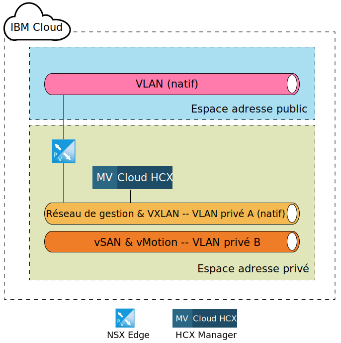
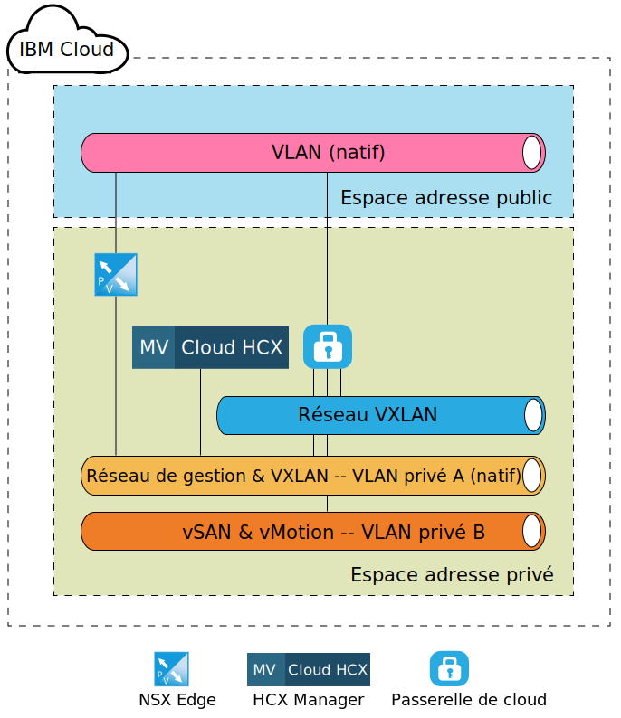
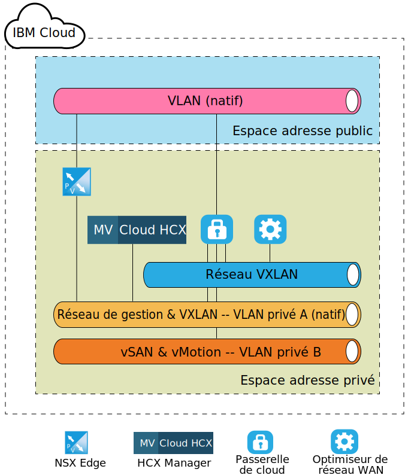
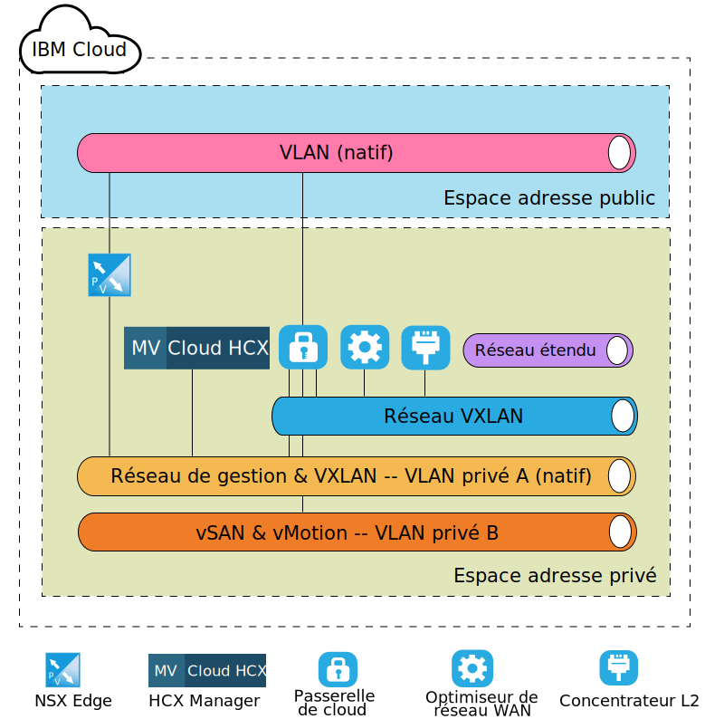

---

copyright:

  years:  2016, 2019

lastupdated: "2019-04-02"

subcollection: vmware-solutions

---
# Architecture cible de niveau composant VMware HCX on IBM Cloud
{: #hcx-archi-target}

Cette section décrit l'architecture de chaque composant HCX qui est déployé au sein de l'environnement IBM Cloud. Le modèle de déploiement spoke (cible) au sein d'IBM Cloud est présenté.

## NSX Edge
{: #hcx-archi-target-nsx-edge}

Le premier composant qui est configuré au sein d'IBM Cloud est une paire de machines virtuelles NSX Edge. Il est important de noter que tous les déploiements de solutions IBM Cloud for VMware installent et configurent une unité de périphérie pour une communication sortante IBM CloudDriver. Toutefois, alors que cet ESG pourrait être réutilisé pour des communications Hybrid Cloud Services, il est conseillé de déployer une nouvelle paire.

Les machines virtuelles NSX Edge sont configurées en tant que paire active/passive d'unités NSX Edge X-Large. Ces unités permettent de se connecter à l'environnement IBM Cloud VMware au moyen d'une connexion Internet publique. L'unité NSX Edge X-Large a été choisie pour l'environnement interne car elle est adaptée aux environnements comportant un équilibreur de charge avec des millions de sessions simultanées qui ne requièrent pas nécessairement un haut débit. Dans le cadre du processus de configuration, l'unité NSX Edge est connectée au réseau VLAN public IBM Cloud et au réseau VLAN privé IBM désigné pour l'infrastructure de gestion.

Tableau 1. Déploiement NSX Edge

| Composant | Configuration |
|-----------|---------------|
| UC       | 6 vCPU        |
| RAM       | 8 Go          |
| Disque      | VMDK 4,5 Go résidant sur stockage partagé avec permutation de 4 Go |

Les unités NSX Edges étant configurées en tant qu'unités actives/passives dans le déploiement interne ou dédié, des règles anti-affinité de vSphere Distributed Resource Scheduler (DRS) doivent être créées par l'utilisateur afin de garantir que NSX Edges ne s'exécute pas sur le même hôte que son dispositif homologue respectif.

Tableau 2. Règles anti-affinité NSX Edge

| Zone     | Valeur         |
|-----------|---------------|
| Nom      | Passerelle externe NSX Edge |
| Type      | Machines virtuelles distinctes |
| Membres   | NSX Edge 1 |
|           | NSX Edge 2 |

En plus des dispositifs NSX Edge déployés au sein d'IBM Cloud, le dispositif virtuel HCX Manager est déployé si le service VMware HCX on IBM Cloud est commandé. A l'issue du déploiement de ce dispositif, NSX Edge est activé pour l'utilisation de l'équilibrage de charge et il est configuré avec des profils d'application qui utilisent un certificat pour la connexion entrante depuis la source. NSX Edge est également configuré avec des pools d'équilibrage de charge pour pointer sur les dispositifs HCX Manager, vCenter et PSC. En outre, un serveur virtuel est créé avec une adresse IP virtuelle sur l'interface publique avec des règles qui connectent les pools aux adresses IP virtuelles. Un exemple de configuration de serveur virtuel et de configuration de pool sur NSX Edge est illustré dans les tableaux ci-après.

Tableau 3. Configuration d'adresse IP virtuelle pour NSX Edge - Serveurs virtuels

| Zone     | Valeur         |
|-----------|---------------|
| ID serveur virtuel | virtualServer-1 |
| Nom | HCX-VIP |
| Description | LB-VIP |
| Pool par défaut | pool-1 |
| Adresse IP | 254 |
| Protocole | https |
| Port | 443 |

Tableau 4. Configuration d'adresse IP virtuelle pour NSX Edge - Détails de serveur virtuel

| Zone     | Valeur         |
|-----------|---------------|
| Description | LB-VIP |
| Limite de connexion | 0 |
| Etat d'insertion de service | Désactivé |
| Profil d'application | applicationProfile-1 |
| Limite de débit de connexion | 0 |
| Etat d'accélération | Désactivé |
| Etat du profil de service |  |

Tableau 5. Configuration d'adresse IP virtuelle pour NSX Edge - Règle

| Zone     | Valeur         |
|-----------|---------------|
| ID règle | applicationRule-1 |
| Nom | appRule1 |
| Script | acl isHibridity url_beg /hibridity     acl isWebSso url_beg /websso     acl isVCenter url_beg /vsphere-client     use_backend nspPool001 if isHybridity     use_backend vcPool001 if isVCenter     use_backend ssoPool001 if isWebSso |

Tableau 6. Configuration de pool pour NSX Edge - Récapitulatif de pool

| ID pool | Nom       | Algorithme   | ID moniteur |
|---------|------------|-------------|------------|
| pool-1  | nspPool001 | ROUND-ROBIN |            |
| pool-3  | ssoPool001 | ROUND-ROBIN |            |
| pool-2  | vcPool001  | ROUND-ROBIN |            |

Tableau 7. Configuration de pool pour NSX Edge - Détails de pool

| Zone           | Valeur     |
|-----------------|-----------|
| Description     |           |
| Transparent     | Désactivé  |
| Nom            | HCX-CLOUD |
| Poids          | 1         |
| Port moniteur    | 8443      |
| Nbre max connexions | 0         |
| Nbre min connexions | 0         |

## HCX Manager
{: #hcx-archi-target-hcxm}

Le composant HCX Manager est le premier dispositif qui est déployé une fois les dispositifs NSX Edge configurés sur la cible. Ce dispositif est utilisé comme interface principale dans l'environnement de cloud pour les composants source, et il fournit une interface utilisateur de réseau abstraite qui peut être utilisée pour ajouter, éditer et supprimer des réseaux ainsi que pour concevoir et configurer le routage sans utilisation directe de NSX. Suite à l'intégration de vCenter et NSX, une adresse IP portable est affectée au dispositif HCX Manager sur le réseau VLAN de gestion.

De plus, il est configuré pour un accès à vCenter et NSX avec un utilisateur spécifique. Il est important de noter que l'adresse IP de HCX Manager est la même que celle utilisée dans NSX Edge pour l'équilibrage de charge.

Une fois le composant de cloud HCX Manager déployé et configuré, les composants source créent une connexion à HCX Manager via les adresses IP virtuelles configurées dans NSX ESG. Une fois cette connexion effectuée, les dispositifs de passerelle cloud et d'optimiseur de réseau WAN sont déployés au sein d'IBM Cloud.

Figure 1. Cible - Dispositif des Services cloud hybrides

## Passerelle cloud
{: #hcx-archi-target-cloud-gateway}

Un dispositif virtuel est déployé dès qu'une connexion est établie entre la source et le cloud cible. Ce dispositif est la passerelle cloud (CGW) et il est utilisé pour gérer un canal sécurisé entre l'environnement vSphere qui est désigné comme source et IBM Cloud. La spécification de dimensionnement du dispositif CGW qui est déployé au sein d'IBM Cloud est répertoriée dans le Tableau 3 Déploiement de passerelle cloud.

Tableau 8. Déploiement de passerelle cloud

| Composant | Configuration |
|-----------|---------------|
| UC       | 8 UC virtuelles        |
| RAM       | 3 Go          |
| Disque      | VMDK 2,0 Go résidant sur stockage partagé |

Cette passerelle cloud est déployée et configurée pour résider sur le réseau VLAN de gestion (sous-réseau portable privé) ainsi que le réseau VLAN vMotion (sous-réseau portable privé) d'IBM Cloud pour le déploiement de solutions VMware. En outre, une autre interface est configurée sur le réseau VLAN public (portable public) pour les connexions qui sont effectuées sur le réseau Internet public. L'accès public n'est pas obligatoire s'il y a une connexion privée (connexion privée en place). La dernière connexion qui est associée à la passerelle cloud est un commutateur logique qui est créé et configuré sur appariement de site.

Ce commutateur logique est un réseau privé, non routable, qui est utilisé en tant que canal de communication entre la passerelle cloud et l'optimiseur de réseau WAN présenté à la section 4.1.4 Réseau WAN (TBD).

La figure ci-après illustre un diagramme de composants de haut niveau du dispositif de passerelle cloud et les connexions affectées.

Figure 2. Déploiement de passerelle cloud

## Optimiseur de réseau WAN
{: #hcx-archi-target-wan-opt}

Le second composant qui est déployé est le dispositif d'optimisation de réseau WAN. Ce dispositif d'optimisation du réseau WAN est optionnel et il effectue un conditionnement de réseau WAN pour réduire les effets de latence. Il incorpore également la correction d'erreur en aval (Forward Error Correction) pour annuler les scénarios de perte de paquet, et le dédoublonnage de modèles de trafic redondant.

Ensemble, tout cela réduit l'utilisation de bande passante et garantit la meilleure utilisation de la capacité réseau disponible pour l'expédition du transfert de données vers et depuis IBM Cloud. L'optimiseur de réseau WAN utilise beaucoup de ressources de disque et il requiert un nombre suffisant d'IOPS pour fonctionner correctement. Par conséquent, l'optimiseur de réseau WAN réside sur le stockage vSAN s'il est présent, ou sur le stockage Endurance avec 2 000 IOPS. La spécification de dimensionnement pour le dispositif d'optimisation de réseau WAN est indiquée dans le tableau ci-après.

Table 9. Dimensionnement de dispositif de l'optimiseur de réseau WAN

| Composant | Configuration |
|-----------|---------------|
| UC       | 8 UC virtuelles        |
| RAM       | 14 Go          |
| Disque      | VMDK 30 Go + VMDK 70 Go résidant sur le stockage partagé |

A la différence de la passerelle cloud, le dispositif d'optimisation de réseau WAN est uniquement relié à un commutateur logique pour permettre la communication entre lui-même et la passerelle cloud. Ce dispositif est obligatoire si l'optimisation de réseau WAN est utilisée au sein de l'environnement source. Consultez la figure ci-après pour une vue de la disposition réseau.

Figure 3. Déploiement de l'optimiseur de réseau WAN

## Concentrateur de couche 2
{: #hcx-archi-target-layer-2-conc}

Le troisième composant est appelé concentrateur de couche 2 (L2C) et il fait partie des services d'extension réseau. Le concentrateur L2C est la machine virtuelle qui permet l'extension de réseaux de centre de données locaux vers IBM Cloud. Il étend les réseaux VLAN et/ou VXLAN locaux. Chaque concentrateur L2C peut étendre jusqu'à 4096 réseaux VLAN. Lorsqu'il est appairé avec son partenaire local, chaque concentrateur L2C peut fournir jusqu'à 1 Gbps par “flux” et jusqu'à 4 Gbps par VLAN (ou VXLAN). Le déploiement de dispositifs L2C supplémentaires est possible si davantage de débit réseau est nécessaire.

Dans le cadre de cette conception, le dispositif L2C est déployé de sorte qu'un client peut étendre plusieurs réseaux VLAN et VLXAN dans IBM Cloud sur le réseau Internet public ou via le réseau privé par l'intermédiaire d'une liaison directe. La spécification de dimensionnement du dispositif L2C sur IBM Cloud est répertoriée dans le tableau ci-après.

Tableau 10. Dimensionnement de dispositif HT L2C

| Composant | Configuration |
|-----------|---------------|
| UC       | 8 UC virtuelles        |
| RAM       | 38 Go          |
| Disque      | VMDK 2 Go sur stockage partagé |

Le dispositif L2C est déployé sur le réseau VLAN de gestion ainsi que le réseau VLAN public. L'interface publique est utilisée pour le trafic de l'application qui a lié la source du réseau étendu. D'autres connexions, comme les réseaux étendus, sont créées et reliées au dispositif L2C après que l'administrateur source a démarré l'extension réseau dans IBM Cloud. Des exemples de ces réseaux et connexions sont illustrés dans la figure ci-après.

Figure 4. Déploiement de concentrateur L2

## Liens connexes
{: #hcx-archi-target-related}

* [Installation et configuration sur la source](/docs/services/vmwaresolutions/archiref/hcx-archi?topic=vmware-solutions-hcx-archi-source)
