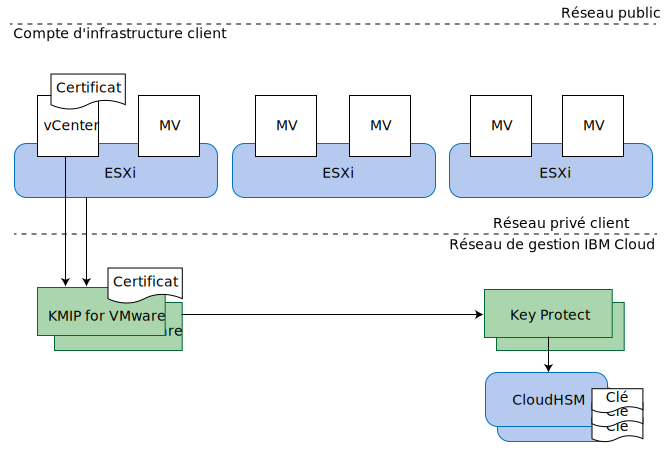

---

copyright:

  years:  2016, 2019

lastupdated: "2019-02-15"

---

{:tip: .tip}
{:note: .note}
{:important: .important}

# Conception KMIP for VMware
{: #kmip-design}

KMIP for VMware on {{site.data.keyword.cloud}} fournit un service de gestion de clés compatible avec le chiffrement VMware vSAN et le chiffrement VMware vSphere, à l'aide d'[IBM Key Protect](/docs/services/key-protect?topic=key-protect-getting-started-tutorial) pour le stockage de clé racine et de clé de données.

## Options de chiffrement de stockage
{: #kmip-design-storage-options}

KMIP for VMware est compatible avec le chiffrement VMware vSAN et le chiffrement vSphere. Ces deux solutions sont implémentées dans la couche d'hyperviseur mais elles fournissent des fonctions légèrement différentes. Evaluez leurs fonctions en fonction de vos exigences.

### Chiffrement VMware vSAN
{: #kmip-design-vsan-encrypt}

Le chiffrement VMware vSAN s'applique uniquement aux magasins de données vSAN. Avec cette solution, VMware vCenter et vos hôtes VMware ESXi se connectent à un serveur de gestion principal comme KMIP for VMware pour l'obtention des clés de chiffrement. Ces clés permettent de protéger les unités de disque individuelles utilisées pour votre magasin de données vSAN, y compris les disques cache et de capacité. Le chiffrement vSAN est implémenté de manière à préserver les avantages de la compression et du dédoublonnage vSAN.

Comme le chiffrement vSAN opère au niveau du magasin de données, son principal objectif est d'éviter l'exposition des données en cas de perte des unités de disque physique. Par ailleurs, le chiffrement vSAN est entièrement compatible avec toutes les technologies de sauvegarde et de réplication des machines virtuelles, par exemple la réplication vSphere, cross-vCenter vMotion, VMware HCX, Zerto, Veeam et IBM Spectrum Protect Plus.

**Remarques** :
* Le chiffrement vSAN ne chiffre pas les communications de la réplication vSAN d'hôte à hôte au sein de votre cluster.
* Le chiffrement vSAN ne s'applique pas aux autres solutions de stockage comme le stockage par fichier et par blocs {{site.data.keyword.cloud_notm}} Endurance.
* Le chiffrement vSAN requiert la licence vSAN Enterprise.
* Le diagnostic d'intégrité vSAN peut générer des avertissement périodiques indiquant l'impossibilité de se connecter au cluster KMS depuis un ou plusieurs de vos hôtes vSphere. Ces avertissements se produisent parce que le diagnostic d'intégrité vSAN dépasse le délai d'attente trop rapidement. Vous pouvez ignorer ces avertissements.

### Chiffrement vSphere
{: #kmip-design-vsphere-encrypt}

Le chiffrement VMware vSphere s'applique à tous les types de stockage VMware, y compris le stockage vSAN et le stockage par fichier et par blocs {{site.data.keyword.cloud_notm}} Endurance.

Avec cette solution, vCenter Server et vos hôtes ESXi se connectent à un serveur de gestion principal comme KMIP for VMware pour l'obtention des clés de chiffrement. Ces clés permettent de protéger les disques de machine virtuelle individuels, conformément à vos règles de stockage de machine virtuelle.

Le chiffrement vSphere opère au niveau du disque de machine virtuelle. Il permet donc d'éviter l'exposition des données en cas de perte des unités de disque physique ou des disques de machine virtuelle. De nombreuses technologies de sauvegarde et de réplication ne peuvent pas sauvegarder ou répliquer de manière efficace car les données fournies sont chiffrées.

Par conséquent, le chiffrement vSphere n'est pas compatible avec la réplication vSphere, cross-vCenter vMotion, VMware HCX, Zerto ou IBM Spectrum Protect Plus. Toutefois, lorsqu'elles sont correctement configurées, la sauvegarde et la réplication Veeam sont compatibles avec le chiffrement vSphere.

### Autres considérations
{: #kmip-design-considerations}

Lorsqu'un type de chiffrement quel qu'il soit est activé dans votre cluster vSphere, VMware crée une clé supplémentaire pour chiffrer vos clichés de processus core ESXi, car ces clichés peuvent contenir des données sensibles, notamment des données d'identification de gestion de clé, des clés de chiffrement ou des données déchiffrées. Vous devez vous familiariser avec [vSphere Virtual Machine Encryption and Core Dumps](https://docs.vmware.com/en/VMware-vSphere/6.5/com.vmware.vsphere.security.doc/GUID-63728E8B-810D-418B-B1AA-6A0A2F92AABE.html).

Lorsque KMIP for VMware est utilisé avec le chiffrement vSAN ou le chiffrement vSphere, il existe plusieurs couches de protection par clé.

Si vous envisagez d'effectuer une rotation des clés, passez en revue les informations suivantes sur les niveaux de rotation possibles :
* Votre clé racine de client (CRK) protège toutes les clés VMware. La rotation des clés peut être effectuée dans l'instance IBM Key Protect qui est associée à votre instance KMIP for VMware.
* KMIP for VMware utilise votre clé CRK pour protéger les clés qu'il génère et distribue à VMware. VMware considère qu'il s'agit de "clés de chiffrement de clé" (KEK).
  * Si vous utilisez le chiffrement vSphere, vous pouvez effectuer une rotation des clés à l'aide de la commande PowerShell **Set-VMEncryptionKey**.
  * Si vous utilisez le chiffrement vSAN, vous pouvez effectuer une rotation des clés dans l'interface utilisateur vSAN.
* VMware utilise ces clés KEK pour protéger les clés réellement utilisées pour chiffrer les unités de disque et les disques de machine virtuelle. Vous pouvez effectuer une rotation de ces clés à l'aide d'appels VMware et d'un changement de clé "profond". Cette opération chiffre de nouveau toutes vos données chiffrées, elle peut donc durer un certain temps.
  * Si vous utilisez le chiffrement vSphere, vous pouvez effectuer un changement de clé "profond" à l'aide de la commande PowerShell **Set-VMEncryptionKey**.
  * Si vous utilisez le chiffrement vSAN, vous pouvez effectuer un changement de clé profond dans l'interface utilisateur vSAN.

## KMIP for VMware
{: #kmip-design-kmip-for-vmware}

Le chiffrement VMware vSAN et le chiffrement vSphere sont compatibles avec de nombreux serveurs de gestion de clés. KMIP for VMware fournit un service de gestion de clés géré par IBM qui utilise IBM Key Protect pour vous donner le contrôle total sur vos clés. D'autres services {{site.data.keyword.cloud_notm}} tels que Cloud Object Storage s'intègrent également à Key Protect, ce qui en fait votre point de contrôle central pour la gestion de clés dans {{site.data.keyword.cloud_notm}}.

### Clés au sein de clés
{: #kmip-design-keys}

Les systèmes de gestion de clés utilisent couramment une technique connue sous le nom de *chiffrement d'enveloppe* pour l'encapsulation ou la protection des clés à l'aide d'autres clés. Ces clés sont appelées *clés racine* ou *clés de chiffrement de clé* (KEK). Pour accéder à une clé, vous devez déchiffrer ou désencapsuler la clé à l'aide de sa clé racine correspondante. Détruire la clé racine est un moyen efficace d'invalider toutes les clés qu'elle a protégées. Ces clés doivent être stockées à proximité de la clé racine. Le contrôle d'accès à la clé racine est important.

{{site.data.keyword.cloud_notm}} Key Protect fournit ce service en utilisant une *clé racine de client* (CRK). Key Protect stocke les clés CRK exclusivement sur du matériel {{site.data.keyword.cloud_notm}} CloudHSM à partir duquel elles ne peuvent pas être extraites. Ces clés CRK sont ensuite utilisées pour encapsuler d'autres clés de chiffrement telles que celles générées par KMIP for VMware pour votre instance VMware.

VMware implémente ce même concept pour ses clés. KMIP for VMware fournit une clé à VMware sur demande, puis VMware à son tour utilise cette clé en tant que clé KEK pour encapsuler ou chiffrer les clés finales qui sont utilisées pour chiffrer vos unités de disque vSAN ou vos disques de machine virtuelle. Ces clés finales sont appelées clés de chiffrement de données (DEK).

Nous obtenons au final la chaîne de chiffrement suivante :
* Clé racine de client (CRK) stockée en permanence dans IBM Key Protect.
* Clé de chiffrement de clé (KEK) générée par KMIP for VMware et fournie à vCenter Server et aux hôtes ESXi dans votre instance.
* Clé de chiffrement de données (DEK) générée par VMware et stockée avec le disque vSAN ou le disque de machine virtuelle.

KMIP for VMware stocke la forme encapsulée des clés KEK au sein d'IBM Key Protect. Bien que les clés KEK soient protégées de manière cryptographique par la clé CRK et qu'il ne soit pas nécessaire de les stocker dans un module HSM, si vous les stockez dans IBM Key Protect, leur présence est visible et vous pouvez les supprimer si vous devez révoquer des clés individuelles.

### Authentification et autorisation
{: #kmip-design-authentication}

Votre solution de chiffrement de stockage comporte trois composants : votre cluster VMware, votre instance KMIP for VMware et votre instance Key Protect.

VMware vCenter et ESXi s'authentifient auprès de votre instance KMIP for VMware à l'aide de certificats que vous installez ou générez dans VMware vCenter lors de la création d'une connexion KMS (serveur de gestion des clés). Vous installez le certificat public dans KMIP for VMware afin d'identifier le ou les clients vCenter qui sont autorisés à se connecter. Chaque client est autorisé sur toutes les clés stockées dans cette instance KMIP for VMware.

Votre instance KMIP for VMware est autorisée sur votre instance Key Protect à l'aide d'un ID de service IAM (Identity and Access Management) {{site.data.keyword.cloud_notm}} auquel a été accordé le droit d'accès à votre instance Key Protect. Cet ID de service doit avoir au minimum un accès plate-forme Viewer et service Manager à votre instance Key Protect. KMIP for VMware utilise la clé racine de client (CRK) de votre choix dans l'instance Key Protect, et il stocke toutes les clés KEK générées pour le compte de VMware, au format encapsulé, dans l'instance Key Protect.

### Topologie
{: #kmip-design-topology}

Figure 1. Composants de KMIP for VMware on {{site.data.keyword.cloud_notm}}

KMIP for VMware est disponible dans un certain nombre de régions IBM Cloud multi&ndash;zone (MZR). Pour obtenir la liste complète, voir la section [Commande de KMIP for VMware](/docs/services/vmwaresolutions/services?topic=vmware-solutions-kmip_standalone_ordering).

Au sein de chaque région MZR, KMIP for VMware fournit deux noeuds finaux de service sur le réseau IBM Cloud Private pour la haute disponibilité. Configurez ces deux noeuds finaux dans votre configuration KMS vCenter en tant que cluster KMS. Pour obtenir la liste des noeuds finaux dans chaque zone MZR et les signatures de certificat de serveur KMIP, voir la section [Documentation relative au service VMware](/docs/services/vmwaresolutions/services?topic=vmware-solutions-kmip_standalone_ordering).

KMIP for VMware se connecte également à IBM Cloud Key Protect à l'aide du réseau IBM Cloud Private au lieu de l'Internet public.

Pour accéder à KMIP for VMware sur le réseau privé, votre compte d'infrastructure IBM Cloud doit être activé pour le réacheminement et le routage virtuels (VRF, Virtual Routing and Forwarding) et les routes du noeud final de service IBM Cloud doivent être ajoutées aux routes VRF de votre compte. Pour plus d'informations, voir la section relative à l'[activation de votre compte pour les noeuds finaux de service](/docs/services/service-endpoint?topic=services/service-endpoint-getting-started#cs_cli_install_steps).

## Liens connexes
{: #kmip-design-related}

* [Présentation de la solution](/docs/services/vmwaresolutions/archiref/kmip?topic=vmware-solutions-kmip-overview)
* [Implémentation et gestion](/docs/services/vmwaresolutions/archiref/kmip?topic=vmware-solutions-kmip-implementation)
* [IBM Key Protect](/docs/services/key-protect?topic=key-protect-getting-started-tutorial)
