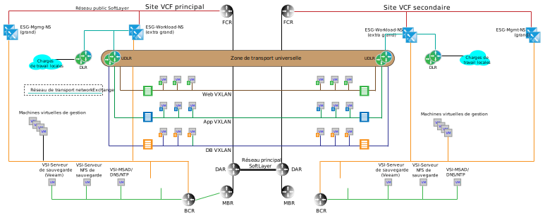

---

copyright:

  years:  2016, 2019

lastupdated: "2019-02-15"

---

# Architecture multisite
{: #nsx-multi_site}

Un facteur clé de différentiation entre {{site.data.keyword.cloud}} et d'autres offres de cloud est la capacité de mettre à disposition une capacité de calcul dédiée au niveau mondial automatiquement pour connecter l'infrastructure à la demande au réseau situé dans votre compte {{site.data.keyword.cloud_notm}} privé. Les fonctionnalités SDN (Software Defined Networking) de VMware vCenter Server et VMware Cloud Foundation associées à {{site.data.keyword.cloud_notm}} fournissent une architecture globale granulaire pouvant être réalisée en quelques jours. Les sections suivantes décrivent un exemple d'architecture multisite de ce que l'on peut obtenir avec les fonctionnalités prêtes à l'emploi de vCenter Server ou Cloud Foundation.

## Environnement Cross-vCenter NSX
{: #nsx-multi_site-cross-env}

La fonctionnalité cross-vCenter NSX permet d'effectuer une liaison dans des relations principales et secondaires pouvant aller jusqu'à neuf instances de NSX Manager : une principale et huit secondaires. Alors qu'il n'est pas nécessaire que les serveurs vCenter Server soient reliés en mode ELM (Enhanced Linked Mode) pour que cross-vCenter NSX soit opérationnel, ce mode offre les avantages suivants :

* La création de relations principales et secondaires en utilisant les données d'identification SSO (Single Sign-On)
* La configuration de l'automatisation de vCenter Server et Cloud Foundation pour la résolution de nom DNS pour tous les sites qui sont reliés ensemble
* La gestion à partir d'un point unique sur tous les sites pour NSX et les fonctions normales de vCenter

## Exemple de topologie multisite
{: #nsx-multi_site-example}

L'exemple suivant ajoute une zone de transport universelle NSX aux topologies de gestion et de charge de travail de base traitées dans les sections précédentes, en plus des caractéristiques suivantes :

* La zone de transport universelle s'étend sur deux centres de données {{site.data.keyword.CloudDataCents_notm}} ou PODS dans un centre de données {{site.data.keyword.CloudDataCent_notm}}.
* Une fois la zone de transport ajoutée, plusieurs réseaux VXLAN sont ajoutés avec un routeur UDR (Universal Distributed Router) pour couvrir les nouveaux réseaux VXLAN.
* Vous devez configurer des liaisons montantes sur les passerelles ESG des charges de travail sur les deux sites. Cette configuration permet aux machines virtuelles (VM) du site local de transiter via la passerelle ESG locale.
* Pour le trafic entrant, un équilibreur de charge global est requis. Voir les offres d'équilibrage de charge global d'{{site.data.keyword.cloud_notm}} pour répondre à cette exigence.
* Cet exemple nécessite VMware NSX Enterprise Edition.

Figure 1. Topologie multisite

## Liens connexes
{: #nsx-multi_site-related}

* [Networking services on {{site.data.keyword.cloud_notm}}](/docs/services/vmwaresolutions/archiref/nsx?topic=vmware-solutions-nsx-networking_services)
