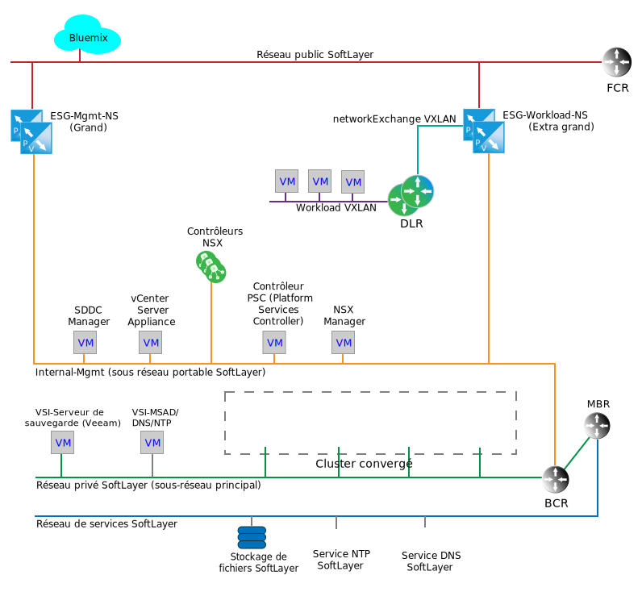
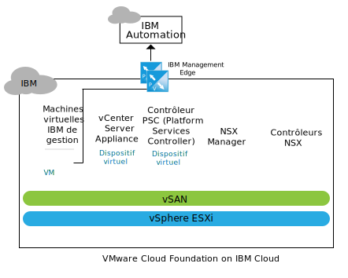
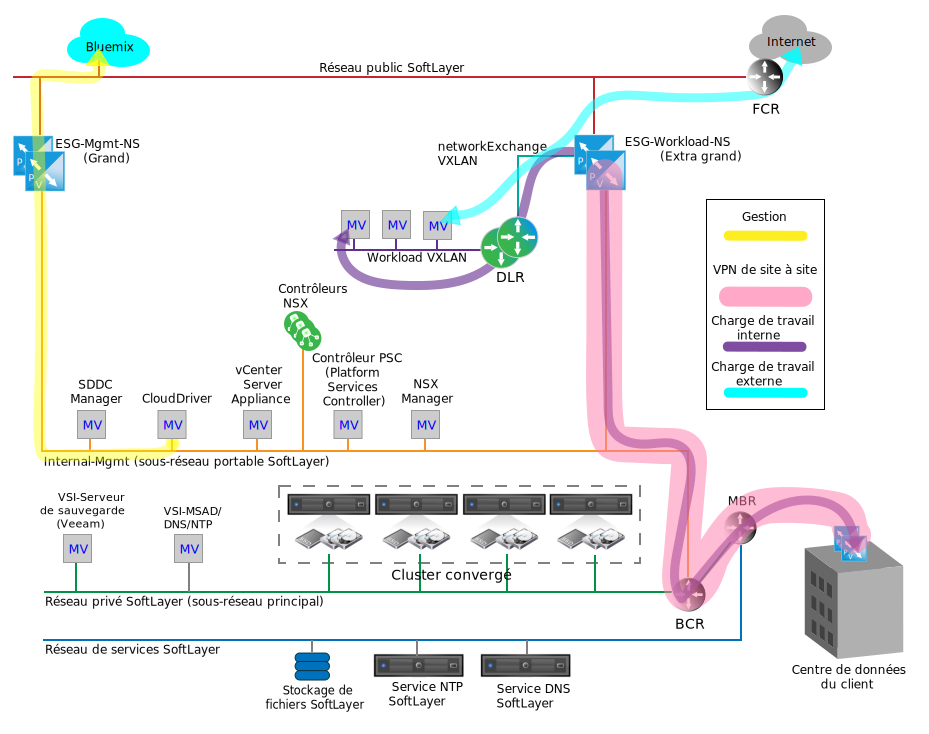

---

copyright:

  years:  2016, 2019

lastupdated: "2019-02-18"

---

{:tip: .tip}
{:note: .note}
{:important: .important}

# Networking services on IBM Cloud
{: #nsx-networking_services}

Networking services on {{site.data.keyword.cloud}} est constitué de deux paires de passerelles VMware NSX Edge Services Gateway (ESG) pour la communication entre {{site.data.keyword.cloud_notm}} et l'Internet public ou le réseau local du client via un réseau privé virtuel (VPN). Ces passerelles ESG sont distinctes pour prendre en charge la fonction de gestion {{site.data.keyword.cloud_notm}} interne et le trafic sortant, ainsi que le trafic entrant sur le réseau associé au client.

Le graphique suivant représente un diagramme réseau simplifié qui illustre la paire de passerelles ESG de gestion (Mgmt) et la paire de passerelles ESG de charge de travail (Workload). Il présente également un routeur logique distribué (DLR) NSX et un réseau VXLAN de charge de travail (Workload VXLAN). Ces composants sont conçus comme point d'arrivée des charges de travail du client sans nécessiter les connaissances spécifiques pour les configurer dans NSX. Un routeur DLR est employé en principe pour acheminer le trafic entre VMware Cloud Foundation ou VMware vCenter Server et le trafic est-ouest, entre les réseaux de couche 2 (L2) distincts au sein de l'instance. Ce comportement est différent de celui d'une passerelle ESG qui fonctionne pour faciliter le trafic réseau nord-sud entrant et sortant de l'instance Cloud Foundation ou vCenter Server.

Figure 1. Services de mise en réseau de cloud sur Cloud Foundation

Alors qu'une seule passerelle ESG peut suffire pour le trafic de gestion et de charge de travail du client, la séparation du trafic de gestion et du trafic du client est une décision en matière de conception prise pour empêcher une erreur de configuration accidentelle de la passerelle ESG de gestion.

Une configuration incorrecte ou la désactivation de la passerelle ESG de gestion n'empêche pas l'instance Cloud Foundation ou vCenter Server de fonctionner, mais elle désactive toutes les fonctions de gestion du portail.
{:note}

## IBM Management Services NSX Edge
{: #nsx-networking_services-mgmt-serv-nsx-edge}

La passerelle IBM Management ESG est un cluster NSX Edge dédié uniquement au trafic réseau de gestion d'{{site.data.keyword.cloud_notm}}. Elle n'est pas conçue pour la circulation du trafic d'un composant non déployé et géré par la fonction d'automatisation de Cloud Foundation ou vCenter Server.

La passerelle ESG de gestion fournit un chemin de communication entre des machines virtuelles (VM) de services complémentaires résidant dans des instances de Cloud Foundation ou vCenter Server et l'infrastructure IBM Automation dans {{site.data.keyword.cloud_notm}} comme illustré pour Cloud Foundation dans le graphique suivant.

Figure 2. Communications Management Edge sur Cloud Foundation

En raison de la communication légère entre certaines machines virtuelles de services complémentaires et leurs systèmes de décompte et de licence correspondants, les passerelles NSX ESG sont dimensionnées dans une configuration de grande taille au sein d'une paire à haute disponibilité (HA) active et passive et déployées sur le pool de ressources de gestion du cluster Cloud Foundation convergé ou du cluster vCenter Server. Le tableau suivant présente un récapitulatif de déploiement des passerelles IBM Management NSX ESG.

Tableau 1. Spécifications des passerelles IBM Management NSX ESG

| IBM management NSX Edge | vCPU | Mémoire | Taille du disque | Emplacement de stockage |
|:----------------------- |:---- |:------ |:--------- |:---------------- |
| IBM Management NSX ESG 1 | 2 | 1 Go | 1 Go | Magasin de données vSAN (Cloud Foundation) ; stockage en réseau partagé pour la gestion (vCenter Server) |
| IBM Management NSX ESG 2 | 2 | 1 Go | 1 Go | Magasin de données vSAN (Cloud Foundation) ; stockage en réseau partagé pour la gestion (vCenter Server) |

### Services de gestion
{: #nsx-networking_services-mgmt-services}

Accès sortant requis pour les services suivants :

* Zerto Virtual Manager. Si ce service est installé, Zerto on {{site.data.keyword.cloud_notm}} nécessite un accès sortant vers Internet pour l'activation des licences et la génération des rapports d'utilisation.
* Veeam Backup and Replication. Si ce service est installé, Veeam on {{site.data.keyword.cloud_notm}} nécessite un accès sortant vers Internet pour le téléchargement des mises à jour d produit et des licences?
* FortiGate Virtual Appliance on {{site.data.keyword.cloud_notm}} nécessite un accès sortant vers Internet pour l'activation et le contrôle des licences.
* F5 on {{site.data.keyword.cloud_notm}} nécessite un accès sortant vers Internet pour l'activation des licences.

### Interfaces Edge
{: #nsx-networking_services-edge-interfaces}

La configuration des interfaces ESG définit quels sont les réseaux L2 auxquels la passerelle ESG a accès. Pour la gestion du cycle de vie de Cloud Foundation et vCenter Server, il est nécessaire que des machines virtuelles spécifiques placées sur le VLAN de gestion soient autorisées à atteindre le VLAN public. Les interfaces suivantes sont définies lors du déploiement :

Tableau 2. Configuration des interfaces NSX ESG

| Interface | Type d'interface | Connectée à | Description |
|:--------- |:-------------- |:------------ |:----------- |
| Liaison montante publique | Liaison montante | **SDDC-DportGroup-External** | Interface Internet publique |
| Liaison montante privée | Liaison montante | **SDDC-DportGroup-Mgmt** | Interface de réseau privé interne |
| Interne | Interne | VXLAN Workload HA | Interface interne utilisée pour le signal de pulsation de la paire de passerelles ESG HA ; groupe de ports sur **SDDC-Dswitch-Private** |

### Sous-réseaux
{: #nsx-networking_services-subnets}

Les sous-réseaux suivants sont utilisés pour la passerelle Management ESG :

Tableau 3. Configuration IP de NSX ESX

| Interface | Type d'interface | Type de sous-réseau IP v4 | Plage | Description |
|:--------- |:-------------- |:----------------- |:----- |:----------- |
| Liaison montante publique | Liaison montante | Public portable {{site.data.keyword.cloud_notm}} | /30 – affiche une adresse IP pouvant être affectée | Interface Internet publique |
| Liaison montante privée | Liaison montante | Privé portable {{site.data.keyword.cloud_notm}} (gestion existante) | /26 – affiche 61 adresses IP pouvant être affectées | Interface de réseau privé interne |
| Interne | Interne | Liaison locale | 169.254.0.0/16 | Interface interne utilisée pour la communication de la paire de passerelles ESG HA |

### Définitions de la conversion d'adresses réseau (NAT)
{: #nsx-networking_services-nat-definitions}

La conversion d'adresses réseau (NAT) est employée sur la passerelle Management ESG afin d'autoriser la circulation du trafic réseau d'un espace d'adresses IP à un autre. En principe, cette conversion est effectuée pour conserver des adresses IP routables Internet ou dissimuler des adresses IP internes aux adresses publiques par mesure de sécurité. La conversion NAT est également utilisée pour permettre la redirection des ports TCP (Transmission Control Protocol) et UDP (User Datagram Protocol). Le trafic de gestion est toujours initié à partir d'une instance Cloud Foundation et vCenter Server, ce qui nécessite qu'une conversion NAT source (SNAT) uniquement soit définie sur la passerelle ESG de gestion. Une conversion SNAT individuelle n'est pas créée pour chaque machine virtuelle interne hébergeant un service nécessitant de sortir de l'instance.

Tableau 4. Configuration de la conversion NAT pour NSX ESG

| Appliquée à l'interface | Plage d'adresses IP source | Adresse IP source convertie |
|:-------------------- |:--------------- |:-------------------- |
| Liaison montante publique | Adresses IP individuelles sur la plage d'adresses IP /26 portables de gestion | Public portable {{site.data.keyword.cloud_notm}} |

### Routage
{: #nsx-networking_services-routing}

Comme les services au sein des machines virtuelles devant passer par la passerelle ESG de gestion peuvent aussi avoir besoin d'accéder aux services {{site.data.keyword.cloud_notm}} au sein du réseau privé {{site.data.keyword.cloud_notm}} du client, la configuration décrite ci-dessous est nécessaire pour établir cette communication.

Alors qu'il est difficile de prédire la plage d'adresses IP de destination nécessaire comme destination pour les connexions Internet, tout service déployé et géré par {{site.data.keyword.cloud_notm}} pointe vers la passerelle Management ESG comme passerelle par défaut. Une route statique est obligatoire pour forcer le trafic via le routeur BCR {{site.data.keyword.cloud_notm}} pour les services qui nécessitent des connexions aux réseaux externes.

Les configurations suivantes sont recommandées pour les services utilisant la passerelle Management ESG pour sortir d'une instance Cloud Foundation ou vCenter Server :
* La passerelle par défaut est une passerelle ESG de gestion.
* Une route statique est obligatoire pour les destinations {{site.data.keyword.cloud_notm}} internes.

S'il y a besoin du service ou de la machine virtuelle pour accéder à la passerelle ESG du client, des routes statiques doivent être conservées au sein du service individuel ou de la machine virtuelle et pointer vers cette passerelle.

Aucun protocole de routage automatique n'est actuellement configuré pour la passerelle Management ESG.

### Définitions de réseaux VXLAN
{: #nsx-networking_services-vlan-definitions}

La paire à haute disponibilité de gestion nécessite un réseau pour la connexion des interfaces internes pouvant utiliser un commutateur vSwitch, un groupe de ports ou un réseau VXLAN existant. Pour cette conception, un réseau VXLAN dédié est créé pour la communication de signaux de pulsation haute disponibilité de la paire HA de passerelles Management ESG.

Tableau 5. Définition de réseau VXLAN NSX ESG

| Définition de réseau NSX ESG | Zone de transport | Type |
|:------------------------- |:-------------- |:---- |
| Mgmt HA | transport-1 | global |

### Règles de pare-feu
{: #nsx-networking_services-firewall-rules}

Par défaut, la passerelle Management ESG est configurée pour refuser tout trafic.

**Refuser :** supprimer tout trafic sans réponse lorsque ce trafic n'est pas autorisé par un jeu de règles ou une règle précédente (avec un ordre plus élevé) à passer par le pare-feu. La génération automatique de règle est sélectionnée pour permettre le contrôle du trafic vers la paire de passerelles ESG.

Les règles de pare-feu suivantes sont définies, en plus des règles générées automatiquement :

Tableau 6. Configuration de pare-feu NSX ESG

| Service | Source | Destination | Protocole | Action |
|:------- |:------ |:----------- |:-------- |:------ |
| Zerto on {{site.data.keyword.cloud_notm}} | Machine virtuelle de gestion Zerto | Tout | Port 443 | Autoriser |
| Veeam on {{site.data.keyword.cloud_notm}} | Machine virtuelle Veeam Backup and Replication | Tout | Port 443 | Autoriser |
| FortiGate Virtual Appliance on {{site.data.keyword.cloud_notm}} | Machines virtuelles de service | Tout | Port 443 | Autoriser |
| F5 on {{site.data.keyword.cloud_notm}} | Machines virtuelles de service | Tout | Port 443 | Autoriser |
| Tout | Tout | Tout | Tout | Refuser |

## IBM Workload NSX Edge
{: #nsx-networking_services-wkld-nsx-edge}

la passerelle IBM Workload ESG fait partie d'une topologie simple conçue pour la communication des charges de travail sur le réseau. La section suivante décrit le plan de conception pour savoir où connecter les charges de travail à un réseau au sein d'une instance Cloud Foundation ou vCenter Server. Il s'agit du point de départ pour la connexion de réseaux locaux et d'espace d'adresses IP à une instance Cloud Foundation ou vCenter Server particulière et constitue la base d'une véritable architecture de cloud hybride.

Un réseau client connecté à la fois à des réseaux {{site.data.keyword.cloud_notm}} publics et privés permet l'accès des charges de travail au trafic entrant et sortant sur Internet, mais permet également la création d'un VPN de site à site à partir de réseaux {{site.data.keyword.cloud_notm}} publics ou privés. Cela contribue à diminuer considérablement la rentabilité en ce qui concerne la connexion aux réseaux locaux car il peut s'écouler des mois pour activer un réseau étendu (WAN) dédié en raison des exigences des clients en matière de sécurité. Cependant, une fois qu'un lien dédié est instauré, le VPN peut être inversé pour passer à travers ce lien sans affecter le réseau dissocié dans le tunnel VPN ou dans l'instance Cloud Foundation ou vCenter Server. Une fois cette opération effectuée, l'interface publique de la passerelle Workload ESG peut être supprimée par mesure de sécurité, si nécessaire.

La topologie présentée dans la figure suivante est constituée des composants NSX suivants :
* Dispositif NSX Edge (ESG)
* Routeur logique distribué (DLR)
* VXLAN (L2 sur L3)

Figure 3. Diagramme d'un exemple de trafic réseau

### Interfaces Edge pour IBM Workload NSX Edge
{: #nsx-networking_services-edge-interfaces-workload}

A l'instar de la passerelle Management ESG, la configuration des interfaces ESG définit quels sont les réseaux de type L2 auxquels la passerelle ESG a accès. Une partie du plan de conception d'une topologie de charge de travail consiste à obtenir une superposition de réseaux SDN (Software-Defined Networking) afin d'isoler les charges de travail de l'espace d'adresses {{site.data.keyword.cloud_notm}} sous-jacent. Cette conception constitue la base d'une conception BYOIP. Par conséquent, les interfaces suivantes sont définies lors du déploiement :

Tableau 7. Configuration d'une interface Workload Edge

| Interface | Type d'interface | Connectée à | Description |
|:--------- |:-------------- |:------------ |:----------- |
| Liaison montante publique | Liaison montante | SDDC-DportGroup-External | Interface Internet publique |
| Liaison montante privée | Liaison montante | SDDC-DportGroup-Mgmt | Interface de réseau privé interne |
| Liaison montante de transit | Liaison montante | Workload-Transit | Réseau VXLAN de transit entre la passerelle Workload ESG et le routeur Workload DLR |
| Interne | Interne | VXLAN Workload HA | Interface interne utilisée pour le signal de pulsation de la paire de passerelles ESG HA |

Dans cette conception, un routeur DLR est employé pour le routage est-ouest potentiel entre les réseaux L2 connectés pour les charges de travail locales. Cette topologie étant conçue comme un exemple simple, un seul réseau L2 destiné aux charges de travail est présenté. Pour ajouter des zones de sécurité supplémentaires, ajoutez d'autres réseaux VXLAN connectés aux nouvelles interfaces sur le routeur DLR. Le tableau suivant présente les interfaces DLR à configurer :

Tableau 8. Interfaces DLR

| Interface | Type d'interface | Connectée à | Description |
|:--------- |:-------------- |:------------ |:----------- |
| Liaison montante de transit | Liaison montante | Workload-Transit | Réseau VXLAN de transit entre la passerelle Workload ESG et le routeur Workload DLR |
| Liaison montante de charge de travail | Liaison montante | Workload | Réseau VXLAN pour les connexions des charges de travail |
| Interne | Interne | VXLAN Workload HA | Interface interne utilisée pour le signal de pulsation de la paire de passerelles ESG HA |

### Sous-réseaux pour IBM Workload NSX Edge
{: #nsx-networking_services-subnets-workload}

Les sous-réseaux suivants sont utilisés pour la passerelle Workload ESG :

Tableau 9. Configuration du routeur DLR et de l'adresse IP de la passerelle Workload ESG

| Interface | Type d'interface | Type de sous-réseau IP v4 | Plage | Description |
|:--------- |:-------------- |:----------------- |:----- |:----------- |
| Liaison montante publique (ESG) | Liaison montante | Public portable {{site.data.keyword.cloud_notm}} | /30 – affiche une adresse IP pouvant être affectée | Interface Internet publique (le client peut commander davantage d'adresses IP séparément) |
| Liaison montante privée (ESG) | Liaison montante | Privé portable {{site.data.keyword.cloud_notm}} (gestion existante) | /26 – affiche 61 adresses IP pouvant être affectées | Interface de réseau privé interne |
| Interne (ESG et DLR) | Interne | Liaison locale | 169.254.0.0/16 | Interface interne utilisée pour la communication de la paire de passerelles ESG HA |
| Liaison montante de transit (ESG et DLR) | Liaison montante | Affecté par le client | A définir | Connexion au réseau de transport pour ESG à DLR |
| Charge de travail (DLR) | Liaison montante | Affecté par le client | A définir | Sous-réseau de charge de travail |

### Définitions de conversion NAT pour IBM Workload NSX Edge
{: #nsx-networking_services-nat-definitions-nsx-edge}

La conversion NAT est employée sur la passerelle Workload ESG afin d'autoriser la circulation du trafic réseau d'un espace d'adresses IP à un autre. Pour la passerelle Workload ESG, la conversion NAT est nécessaire pour permettre la communication vers les destinations Internet, mais aussi pour communiquer avec n'importe quelles plages d'adresses IP sourcées {{site.data.keyword.cloud_notm}}. Pour cette conception, le trafic des charges de travail est autorisé pour la sortie sur Internet, mais pas pour la gestion ou tout autre réseau {{site.data.keyword.cloud_notm}}. Ainsi, seule une conversion SNAT doit être définie sur la passerelle Workload ESG. L'ensemble du sous-réseau portable Workload est configuré pour passer par la conversion SNAT.

Alors qu'il est possible d'utiliser la conversion NAT pour autoriser la communication des charges de travail sur plusieurs instances Cloud Foundation ou vCenter Server, il n'est pas possible de l'utiliser lorsque plusieurs charges de travail doivent être connectées sur plusieurs instances. Pour consulter des exemples d'utilisation des fonctions avancées de NSX pour créer un réseau de transport de superposition L2 sur des instances Cloud Foundation ou vCenter Server, voir [Architecture multisite](/docs/services/vmwaresolutions/archiref/nsx?topic=vmware-solutions-nsx-multi_site).

Tableau 10. Règles NAT de passerelle Workload ESG

| Appliquée à l'interface | Plage d'adresses IP source | Adresse IP source convertie | Conversion NAT activée ou désactivée |
|:-------------------- |:--------------- |:-------------------- |:----------------------- |
| Liaison montante publique (Workload ESG) | Définie par le client | IP publique portable {{site.data.keyword.cloud_notm}} | Définie par le client (désactivée par défaut) |

### Routage pour IBM Workload NSX Edge
{: #nsx-networking_services-routing-wkld}

Dans cette conception, la seule condition requise pour les charges de travail qui passent par le routeur DLR pour atteindre la passerelle Workload ESG est d'accéder à Internet. la passerelle Workload ESG doit comprendre le chemin vers le réseau Workload VXLAN et tout réseau Workload VXLAN/sous-réseaux à venir créés derrière le routeur DLR. Alors que cet objectif peut être atteint en utilisant des routes statiques sur la passerelle ESG, la topologie des charges de travail a pour but de correspondre à une conception de pratique recommandée démontrée. Par conséquent, le protocole OSPF (Open Shortest Path First) est configuré entre la passerelle Workload ESG et le routeur DLR en aval.

Pour plus d'informations sur la configuration, voir [Configurer le protocole OSPF](https://pubs.vmware.com/NSX-6/index.jsp?topic=%2Fcom.vmware.nsx.admin.doc%2FGUID-6E985577-3629-42FE-AC22-C4B56EFA8C9B.html).

Tableau 11. Routage dynamique

| Zone | Type OSPF | Adresse IP de l'interface OSPF | Authentification OSPF |
|:---- |:--------- |:----------------- |:------------------- |
| 51 | stub | Affectez une adresse IP pour chaque routeur DLR et passerelle ESG sur le réseau RFC1918 de transport | Aucune |

### Règles de pare-feu pour IBM Workload NSX Edge
{: #nsx-networking_services-firewall-wkld}

Par défaut, la passerelle Workload ESG est configurée pour refuser tout trafic.

**Refuser :** supprimer tout trafic sans réponse lorsque ce trafic n'est pas autorisé par un jeu de règles ou une règle précédente (avec un ordre plus élevé) à passer par le pare-feu. La génération automatique de règle est sélectionnée pour permettre le contrôle du trafic vers la paire de passerelles ESG.

Les règles de pare-feu suivantes sont définies, en plus des règles générées automatiquement :

Tableau 12. Règles de pare-feu de passerelle Workload ESG

| Service | Source | Destination | Protocole | Action |
|:------- |:------ |:----------- |:-------- |:------ |
| Workloads | Sous-réseau de charge de travail | Tout | Tout | Autoriser |
| Tout | Tout | Tout | Tout | Refuser |

### Définitions de réseau VXLAN pour IBM Workload NSX Edge
{: #nsx-networking_services-vxlan-definitions}

Les paires à haute disponibilité (HA) de passerelles ESG et routeur DLR de la topologie des charges de travail nécessitent des segments L2 (VXLAN) pour la connexion des interfaces internes, le transport des données entre les deux, et pour les charges de travail.

Tableau 13. Interfaces internes de passerelle Workload ESG

| Nom du réseau VXLAN | Zone de transport Cloud Foundation ou vCenter Server | Type |
|:---------- |:------------------------------------------------- |:---- |
| Workload HA | transit-1 | Global |
| Workload transit | transit-1 | Global |
| Workload | transit-1 | Global |

### Paramètres ESG DLR pour IBM Workload NSX Edge
{: #nsx-networking_services-esg-dlr-sett}

Par défaut, la journalisation est activée pour tous les nouveaux dispositifs NSX Edge. Le niveau de journalisation par défaut est NOTICE.

## Liens connexes
{: #nsx-networking_services-related}

* [Conception de NSX Edge Services Gateway (ESG)](/docs/services/vmwaresolutions/archiref/nsx?topic=vmware-solutions-nsx_design)
* [Architecture multisite](/docs/services/vmwaresolutions/archiref/nsx?topic=vmware-solutions-nsx-multi_site)
