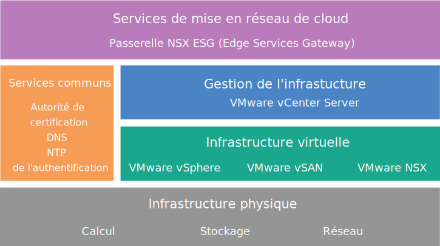

---

copyright:

  years:  2016, 2018

lastupdated: "2018-10-25"

---

{:tip: .tip}
{:note: .note}
{:important: .important}

# Conception de NSX Edge Services Gateway (ESG)

La solution NSX Edge Services Gateway (ESG) sur {{site.data.keyword.cloud}} offre une technologie VMware déployée dans {{site.data.keyword.CloudDataCents_notm}} au niveau mondial. {{site.data.keyword.vmwaresolutions_short}} fournit deux architectures de cette solution, associées à la passerelle NSX ESG.

## Conception de l'architecture interne

L'architecture interne spécifie le déploiement des composants NSX Edge nécessaires dans un pool de ressources soit dans un cluster convergé VMware Cloud Foundation ou dans un cluster VMware vCenter Server.

VMware vSAN est facultatif dans la figure suivante.
{:note}

Figure 1. Services de mise en réseau de cloud sur {{site.data.keyword.cloud_notm}}

## Conception de l'architecture dédiée

L'architecture dédiée déploie les composants NSX Edge nécessaires dans un cluster vSphere à deux noeuds distincts dédié à l'utilisation de NSX Edge, fournissant l'interaction essentielle avec l'infrastructure réseau physique. L'architecture dédiée comprend les caractéristiques et les fonctions suivantes :

* Fournit une connectivité avec accès ou non aux réseaux physiques. Par exemple, le routage de trafic nord-sud L3 sur les dispositifs virtuels NSX Edge.
* Permet la communication avec les dispositifs physiques connectés aux réseaux locaux virtuels (VLAN) dans les réseaux physiques via un pontage NSX L2 et héberge la machine virtuelle (VM) du routage avec le routeur DLR (Distributed Logical Routeur).
* Peut avoir des services logiques ou physiques centralisés. Par exemple, un pare-feu, des équilibreurs de charge, des composants de surveillance de réseau privé virtuel (VPN) et des machines virtuelles Log Insight.
* Des contrôleurs NSX peuvent être hébergés sur un cluster Edge lorsqu'un vCenter dédié est utilisé pour gérer les ressources Edge et les ressources de calcul.
* Les ressources de cluster Edge ont une exigence d'anti-affinité afin de protéger la configuration de secours active ou de maintenir la disponibilité de la bande passante en cas de panne.

## Plages d'adresses IP d'IBM Cloud Private et plages d'adresses IP BYO (Bring Your Own)

La plage d'adresses IP privées RFC1918 réserve spécifiquement l'utilisation des plages de réseau à l'usage interne de l'organisation mais jamais à une utilisation sur Internet. L'infrastructure réseau physique d'{{site.data.keyword.cloud_notm}} utilise un espace d'adressage privé RFC1918 spécifique, 10.x.x.x/8, sur tous les sites dans le monde entier. Ces plages d'adresses IP ne chevauchent pas les comptes des clients ou n'interfèrent pas dans un compte client {{site.data.keyword.cloud_notm}}. Dans un compte client, tout espace d'adressage IP privé {{site.data.keyword.cloud_notm}} alloué, peut, avec la fonction Spanning VLAN, effectuer un routage vers n'importe quel autre espace d'adressage IP privé {{site.data.keyword.cloud_notm}} dans n'importe quel centre de données {{site.data.keyword.CloudDataCents_notm}}.

Alors que cela facilite la configuration d'une infrastructure connectée au niveau mondial dans votre compte, l'espace d'adressage IP fixe peut s'avérer problématique lorsque vous voulez étendre votre centre de données dans {{site.data.keyword.cloud_notm}} via le routage lorsque vous utilisez le même espace d'adressage privé qu'{{site.data.keyword.cloud_notm}}. La solution consiste à utiliser NSX pour créer une topologie de superposition sur l'infrastructure Cloud Foundation ou vCenter Server, en isolant votre espace d'adressage BYOIP (Bring Your Own IP) de toute interaction avec l'espace d'adressage privé affecté d'{{site.data.keyword.cloud_notm}}. NSX est en mesure de fournir un VPN L2 pour couvrir l'espace d'adressage BYOIP interne dans le tunnel sur plusieurs espaces d'adressage IP externes pouvant éventuellement se chevaucher.

### Liens connexes

* [Présentation de la solution](../solution/solution_overview.html)
