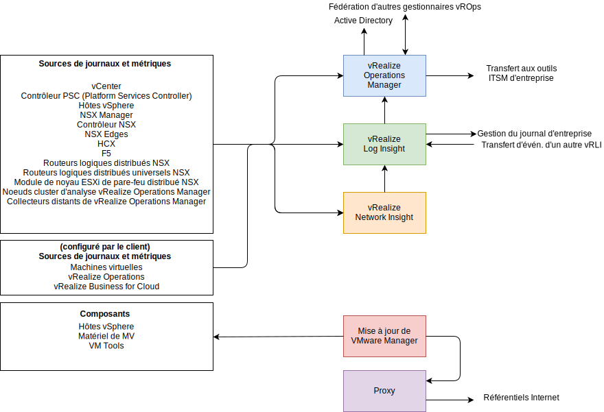
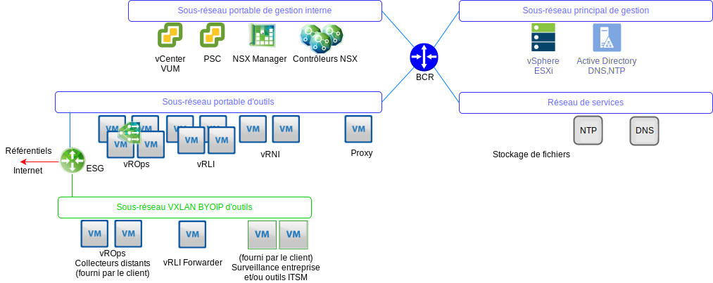

---

copyright:

  years:  2016, 2019

lastupdated: "2019-06-03"

---

# Vue d'ensemble de l'architecture de gestion des opérations
{: #opsmgmt-arch}
L'architecture des produits de la couche de gestion des opérations permet une surveillance centralisée avec les données de journalisation de {{site.data.keyword.vmwaresolutions_full}}. La couche de gestion des opérations surveille en temps réel l'infrastructure physique, l'infrastructure virtuelle et, en option, les charges de travail de calcul du client.

Les principales informations recueillies sont les suivantes :
* Données topologiques, telles que les objets de calcul, de mise en réseau et de stockage physiques et virtuels.
* Données de surveillance, telles que :
  * Métriques - données structurées telles que la performance et la capacité
  * Journaux - données non structurées telles que les événements système

## Flux de gestion des opérations
{: #opsmgmt-arch-flows}

Le diagramme suivant montre comment interagissent et s'intègrent les différents outils de gestion des opérations.

La gestion des opérations de {{site.data.keyword.vmwaresolutions_short}} se compose des étapes suivantes :
* Surveillance - vRealize Operations Manager (vROps) suit et analyse le fonctionnement de plusieurs objets dans l'architecture {{site.data.keyword.vmwaresolutions_short}} à l'aide d'algorithmes d'analyse. Ces algorithmes aident vROps à apprendre et à prédire le comportement de ces objets. Les administrateurs système accèdent à ces informations à l'aide de vues, de rapports et de tableaux de bord.

  Lorsqu'il y a un problème dans l'environnement, vROps génère des alertes. Il existe trois types d'alertes :
    * Les alertes de santé indiquent les problèmes qui affectent la santé de l'environnement et qui nécessitent une attention immédiate.
    * Les alertes de risque indiquent les problèmes qui ne sont pas des menaces immédiates mais qui doivent être réglés dans un avenir proche.
    * Les alertes d'efficacité offrent des informations qui permettent d'améliorer les performances ou de récupérer des ressources.

  Les alertes vROps sont des événements qui se produisent sur les objets surveillés lorsque l'analyse des données indique des écarts par rapport aux valeurs métriques normales, ou lorsqu'un problème survient avec l'un des composants surveillés. Les alertes vROps sont associées à l'une des catégories suivantes :
    * Critique - il faut agir immédiatement.
    * Immédiat - il faut agir dès que possible.
    * Avertissement - doit être vérifié à l'occasion.

* Journalisation - vRealize Log Insight (vRLI) permet une gestion et une analyse des journaux en temps réel grâce à un regroupement intelligent basé sur l'apprentissage machine, une recherche haute performance et un dépannage des objets physiques et virtuels dans l'architecture {{site.data.keyword.vmwaresolutions_short}}. vRLI collecte des données à partir d’hôtes vSphere à l’aide du protocole `syslog`. Il collecte également des événements, des tâches et des données d'alarme pour d'autres produits VMware, tels que vCenter Server. Il s'intègre à vRops pour envoyer des événements de notification et permettre le lancement en contexte. Les autres objets de l'architecture {{site.data.keyword.vmwaresolutions_short}} capables d'envoyer des données `syslog` sont dirigés vers vRLI. En option, le client peut configurer n'importe quel système capable d'envoyer des données syslog pour transmettre ces données à vRLI.

* Santé du réseau - vRealize Network Insight est un outil d'analyse qui permet de réaliser des actions de manière proactive :
  * Surveillance de la santé du réseau et des performances.
  * Dépannage de bout en bout.
  * Analyse et visibilité de 360°.
  * Gestion de la conformité basée sur la micro-segmentation.

* Correction et mise à niveau - vSphere Update Manager (VUM) fournit une gestion centralisée et automatisée des correctifs et des versions pour les hôtes VMware vSphere et les machines virtuelles (pas les systèmes d'exploitation et les applications).

## Mise en réseau de la gestion des opérations
{: #opsmgmt-arch-network}

Le diagramme suivant montre la vue d'ensemble du réseau. 

* Un sous-réseau portable privé est fourni pour mettre à disposition un espace d'adresses IP {{site.data.keyword.cloud_notm}} qui est utilisé pour la mise à disposition initiale des machines virtuelles des outils. Après la mise à disposition, il appartient au client de gérer l'espace d'adresses IP pour l'extension des outils. Les machines virtuelles de ce sous-réseau doivent avoir accès aux composants hébergés dans les sous-réseaux Gestion et Gestion interne.
* Le sous-réseau VXLAN d'outils est utilisé pour mettre à disposition l'espace d'adresses IP BYOIP qui est utilisé pour la mise à disposition initiale des machines virtuelles des outils mais il appartient ensuite au client de gérer l'espace d'adresses IP pour la mise à l'échelle des outils. Les machines virtuelles de ce sous-réseau doivent avoir accès aux composants hébergés dans les sous-réseaux de superposition. La passerelle ESG permet la conversion des adresses réseau entre {{site.data.keyword.cloud_notm}} et les espaces d'adresses BYOIP.
* Les collecteurs distants de vROps sont déployés par le client s'il souhaite utiliser vROps pour surveiller ses machines virtuelles de calcul.
* Les réexpéditeurs vRLI transmettent les messages de journal des composants superposés au cluster vRLI. Le client peut également configurer ses machines virtuelles de calcul pour utiliser ces réexpéditeurs, si nécessaire.
* VMware Update Manager (VUM) assure la mise à jour des hôtes vSphere, des outils et du matériel des machines virtuelles. VUM utilise le proxy pour accéder aux référentiels Internet.

vROps recueille des données à partir des objets de l'environnement. Chaque donnée collectée est appelée une observation ou une valeur métrique. vROps utilise l'adaptateur vCenter pour collecter les métriques brutes de vCenter. En plus des métriques qu'il collecte, vROps calcule des métriques de capacité, des métriques de badge et des métriques pour surveiller la santé de votre système. Les définitions des alertes sont une combinaison de symptômes et de recommandations qui identifient les secteurs problématiques et génèrent des alertes sur lesquelles vous agissez pour ces secteurs.

## Composants surveillés
{: #opsmgmt-arch-components}

### Surveillance de vCenter
{: #opsmgmt-arch-components-vcenter}

La surveillance de vCenter s'effectue avec vROps et le pack VMware SDDC Health Management Pack. vRLI collecte les données des journaux de vCenter et le pack de contenus de vSphere ajoute une compréhension spécifique aux journaux puis envoie à son tour des alertes à vROPs.

Le pack VMware SDDC Health Management Pack surveille la pile de gestion SDDC et fournit des badges de santé et des alertes suivant la configuration et la conformité des composants du produit SDDC, y compris vCenter.

### Surveillance des hôtes vSphere
{: #opsmgmt-arch-components-hosts}

La surveillance des hôtes vSphere s'effectue avec vROps à travers vCenter et la collecte de journaux à travers vRLI.

### Surveillance du réseau vSAN
{: #opsmgmt-arch-components-vsan}

Pour surveiller le réseau SAN, vROps et vRLI sont utilisés. vCenter inclut également une série de bilans de santé vSAN qui peuvent être utilisés. L'installation du pack de gestion de vSAN fournit des tableaux de bord supplémentaires pour faciliter la surveillance de vSAN.

vROps génère une alerte si un problème survient dans les composants du produit SDDC dans le réseau de stockage que l'adaptateur VMware vSAN surveille. Une alerte relative à la conformité et à la santé de la configuration est transmise via le pack de gestion VMware SDDC Health Solution depuis le pack VMware vSAN Management Pack. vSAN est surveillé avec le pack vROps vSAN Management Pack via le dispositif vCenter à l'aide d'un adaptateur vSAN. L'intervalle de collecte par défaut est de cinq minutes et l'adaptateur vSAN collecte également les métriques des services Bilan de santé et Performance des objets vSphere. L'intervalle du service Bilan de santé est configuré dans l'interface vSphere et il est de 60 minutes par défaut.

Pour que l'adaptateur vSAN puisse collecter toutes les données de performance, le service Performance de vSAN doit être activé dans vSphere.

### Surveillance de NSX for vSphere
{: #opsmgmt-arch-components-nsxv}

Pour surveiller NSX, les outils suivants sont implémentés :
* vRealize Operations Manager (vROps)
* vRealize Log Insight (vRLI)
* vRealize Network Insight (vRNI)

Ces outils permettent aux administrateurs du système de surveiller, de gérer et de dépanner VMware NSX. Le pack vROps Management Pack for VMware NSX offre une visibilité sur la topologie du réseau. Les tableaux de bord NSX fournissent un aperçu rapide de l'environnement NSX et de la santé de ses composants. La corrélation entre les objets NSX et les objets vSphere permet un dépannage facile.

vROps utilise le pack de gestion pour interroger VMware NSX sur la configuration, les performances et les données de support. Pour le compte de vROps, le pack de gestion convertit les demandes d'interrogation en appels API REST pour récupérer les données nécessaires de NSX Manager.

Les composants NSX doivent être configurés pour envoyer les données syslog à vRLI.

* NSX Manager - [Specify Syslog Server](https://pubs.vmware.com/NSX-6/topic/com.vmware.nsx.admin.doc/GUID-EA70974C-07F8-469D-8A9D-0ED54F0C8F34.html#GUID-EA70974C-07F8-469D-8A9D-0ED54F0C8F34){:new_window}.
* Contrôleurs NSX - [Configure NSX Controllers](https://kb.vmware.com/s/article/2092228){:new_window}.
* NSX Edge - [Configure Remote Syslog Servers](https://pubs.vmware.com/NSX-6/topic/com.vmware.nsx.admin.doc/GUID-9C25E097-E2CC-461A-9DA6-E8118D16EE62.html#GUID-9C25E097-E2CC-461A-9DA6-E8118D16EE62){:new_window}.
* Pare-feu - Vous devez configurer le serveur syslog distant pour chaque cluster ayant activé le pare-feu. Le serveur syslog distant est spécifié dans l'attribut `Syslog.global.logHost`.

La surveillance des flux NSX peut être utilisée dans NSX Manager pour déterminer quels flux sont approuvés et quels flux sont bloqués. Si nécessaire, la mise en miroir des ports peut être configurée pour un commutateur distribué vSphere.

### Surveillance de NSX-T
{: #opsmgmt-arch-components-nsxt}

Pour surveiller NSX-T, les outils suivants sont implémentés :

* vRealize Operations Manager (vROps)
* vRealize Log Insight (vRLI)

VMware SDDC Health Management Pack surveille les composants suivants :
* les commutateurs logiques. Il surveille l'état d'administration des commutateurs logiques.
* le cluster de contrôleurs. Il surveille le nombre de noeuds de cluster déployés pour la haute disponibilité et maintient le quorum.
* les noeuds de contrôleurs. Il surveille la connectivité des noeuds avec les noeuds du gestionnaire et du cluster de contrôleurs.
* les noeuds de périphérie - Il surveille l'état de fonctionnement du noeud de périphérie et sa connectivité avec les noeuds du gestionnaire et du cluster de contrôleurs.
* les services de gestion NSX-T.
* le service de routeur T0. Il surveille les services de routes statiques, les services de conversion d'adresses réseau, BGP, BFD et les services de redistribution des routes.
* le service de routeur T1. Il surveille les services de routes statiques, les services de conversion d'adresses réseau et les services d'annonce des routes.

### Surveillance de vRealize Operations Manager
{: #opsmgmt-arch-components-vrops}

Le pack VMware SDDC Health Management Pack contient des définitions d'alertes pour les événements suivants :
* La taille actuelle des noeuds de vRealize Operations Manager n'est pas suffisante pour une charge donnée.
* La configuration des noeuds du cluster ne suit pas la directive de dimensionnement de vRealize Operations Manager.
* La taille actuelle du collecteur distant n'est pas suffisante pour une charge donnée.
* La configuration du collecteur distant ne suit pas la directive de dimensionnement de vRealize Operations Manager.
* Le cluster d'opérations de vRealize a dépassé le nombre recommandé de noeuds analytiques.

### Surveillance de vRealize Log Insight
{: #opsmgmt-arch-components-vrli}

vRLI prend en charge les alertes qui déclenchent des notifications sur son état de santé et génère des notifications lorsqu'un événement système important se produit, par exemple lorsque l'espace disque est presque épuisé et vRealize Log Insight doit commencer à supprimer ou archiver les anciens fichiers journaux.

## Configuration requise
{: #opsmgmt-arch-requirements}

La conception utilise les quantités et tailles de dispositifs suivantes :

Tableau 1. Configuration système requise des outils d'exploitation

||vROps|vRLI|vRNI|Proxy|
|---|---|---|---|---|---|
|Nombre de machines virtuelles|4|4|1+1|1|
|vCPU|8|8|4 + 8|4|
|RAM en Go|32|16|12 + 32|0,5|
|Disque en Go|254|1042|158 + 1000|80|

## Versions logicielles
{: #opsmgmt-arch-versions}

Tableau 2. Versions logicielles des outils d'exploitation

|Nom du produit|Version|
|---|---|
|VMware vRealize Operations Manager Advanced ou version supérieure|7.0|
|vRealize Operations Management Pack for NSX for vSphere|3.5.2|
|vRealize Operations Management Pack for Storage Devices|7.0.0|
|vRealize Operations Management Pack for Site Recovery Manager|8.1.1|
|VMware vRealize Log Insight|4.7|
|vRealize Log Insight Content Pack for NSX for vSphere|3.8|

## Liens connexes
{: #opsmgmt-arch-components-related}

* [Présentation de vCenter Server on {{site.data.keyword.cloud_notm}} with Hybridity Bundle](/docs/services/vmwaresolutions/archiref/vcs?topic=vmware-solutions-vcs-hybridity-intro)
