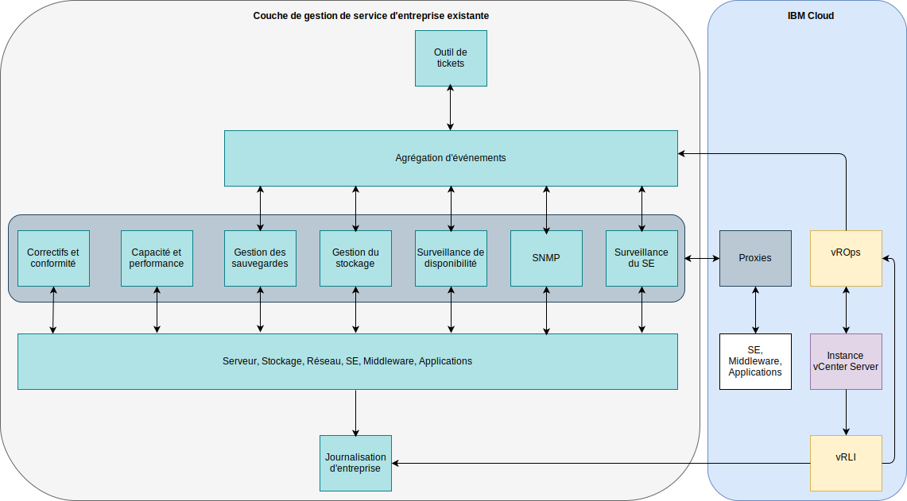

---

copyright:

  years:  2016, 2019

lastupdated: "2019-05-29"

---

# Intégration
{: #opsmgmt-integration}

Cette rubrique porte sur la couche de gestion opérationnelle de la conception. Toutefois, certaines entreprises peuvent souhaiter intégrer cette couche à leur couche de gestion de service. Cette section fournit des directives sur cette intégration. Dans cette conception, vROps est le point central où toutes les alertes sont affichées.

Les catégories d'intégration suivantes sont possibles :
* Vers les couches supérieures - Intégration depuis vROps à d'autres outils :
  * Notification d'alertes au serveur SMTP ou à des outils comme Slack ou PagerDuty.
  * Intégration des tickets dans un outil de centre de services tel que ServiceNow.
  * Lancement de vRealize Orchestrator pour résoudre un problème découvert par vROps.
* Vers les couches inférieures – Intégration à partir des outils de gestion des services ou de gestion du cloud :
  * L'automatisation de vRealize configure la surveillance lorsque de nouvelles charges de travail sont ajoutées.
  * Mise à jour des objets vROps avec enrichissement d'événements à partir de sources externes.

vROps fournit les plug-ins d'alertes sortantes suivants :
* Action automatisée - activée par défaut.
* E-mail standard - Utilise le protocole SMTP pour envoyer par e-mail des notifications d'alerte de vRealize Operations Manager aux personnes intéressées.
* SNMP Trap – Enregistre les alertes sur votre serveur SNMP Trap.
* Notification REST - Envoie les alertes de vROps à une autre application REST dans laquelle vous avez créé un service Web REST pour accepter ces messages.
* Fichier journal - Permet à vROps d'enregistrer des alertes dans un fichier sur chacun de vos noeuds vRealize Operations Manager. Si vous avez installé vRealize Operations Manager en tant que cluster à noeuds multiples, chaque noeud traite et enregistre les alertes pour les objets qu'il surveille. Chaque noeud consigne les alertes pour les objets qu'il traite.
* Notification Smarts SAM - Envoie des notifications d'alerte à EMC Smarts Server Assurance Manager.
* Partage réseau - envoie des rapports à un emplacement partagé, prend en charge la version SMB 2.0.

Les notifications sont des notifications d'alerte qui répondent aux critères de filtrage des règles de notification avant d'être envoyées vers les couches supérieures vers des systèmes externes. Les règles de notification sont configurées pour les alertes sortantes requises afin qu'elles puissent être filtrées avant d'être envoyées au système externe sélectionné. La liste des notifications est utilisée pour gérer ces règles.

## Scénario d'utilisation d'intégration
{: #opsmgmt-integration-usecase}

Cet exemple de cas d'utilisation est basé sur une couche de gestion des services existante utilisée par une entreprise. Le client a fourni une instance vCenter Server avec l'option de gestion des opérations et souhaite intégrer cette plateforme à sa plateforme de gestion des services. Il utilise un système d'agrégation d'événements pour intégrer les alertes générées par les outils de surveillance spécifiques au domaine :

* Un outil pour surveiller le système d'exploitation, le logiciel intermédiaire et les applications sur leurs charges de travail UNIX, Linux et Windows, mais cet outil ne surveille pas les composants d'infrastructure comme VMware, les périphériques réseau ou le stockage.
* Un gestionnaire SNMP pour recevoir les alertes SNMP de leur infrastructure réseau. Cet outil collecte également les métriques SNMP pour permettre l'alerte de performance et de capacité.
* Un outil de gestion des sauvegardes pour gérer les sauvegardes.
* Des outils de gestion de stockage pour gérer les grappes de stockage.
* Un outil de disponibilité qui utilise le ping pour tester l'accessibilité des périphériques.

Sa couche de gestion des services se compose également de :

* Un outil de capacité et de performance du serveur pour collecter des métriques afin de fournir des rapports.
* Un serveur de mise à jour et de conformité pour mettre à jour les systèmes d'exploitation, les logiciels intermédiaires et les applications et mesurer la conformité sur ces plateformes.
* Un outil de tickets utilisé pour gérer les tickets, les incidents, les problèmes et les changements. Cet outil est également la base de données de gestion de la configuration (CMDB) de l'entreprise. L'outil est capable d'envoyer des courriers électroniques aux équipes opérationnelles ainsi que des messages SMS.
* Un système de journalisation d'entreprise qui capture les journaux de tous les systèmes et qui est géré par l'équipe de sécurité.

Maintenant que le client possède vROps, il va intégrer cet outil à l'aide de la notification vers les couches supérieures en utilisant le plug-in SNMP Trap. Afin d'intégrer vROps, les alertes envoyées par vROps doivent être analysées de manière à ce que l'environnement de gestion des événements du client puisse créer des alertes et les enrichir. L'équipe de l'outil de gestion a téléchargé les MIB de VMware et les a installés dans son environnement de gestion des événements.

vRLI est configuré pour transmettre tous les événements au système de journalisation de l'entreprise conformément aux politiques du client.

Le client souhaite utiliser son système d'exploitation, son logiciel intermédiaire et ses outils de surveillance des applications existants pour avoir des proxys utilisés dans {{site.data.keyword.cloud}} pour collecter et transmettre les métriques et les alertes.

## Liens connexes
{: #opsmgmt-integration-related}

* [Présentation de vCenter Server on {{site.data.keyword.cloud_notm}} with Hybridity Bundle](/docs/services/vmwaresolutions/archiref/vcs?topic=vmware-solutions-vcs-hybridity-intro)
* [vRealize Operations RESTful API](https://docs.vmware.com/en/vRealize-Operations-Manager/7.0/vrealize-operations-manager-70-api-guide.pdf){:new_window}
* [VMware Code API Explorer](https://code.vmware.com/apis?socv=1&numPerPage=164&sorter=pv){:new_window}
* [Postman Client Collection Tool for vRealize Operations](https://code.vmware.com/samples/4663/postman-client-collection-for-vrealize-operations-rest-apis){:new_window}
* [VMware PowerCLI blog](https://blogs.vmware.com/PowerCLI/2016/05/getting-started-with-powercli-for-vrealize-operations-vr-ops.html){:new_window}
* [Webhook Shims](https://blogs.vmware.com/management/2017/01/vrealize-webhooks-infinite-integrations.html){:new_window}
