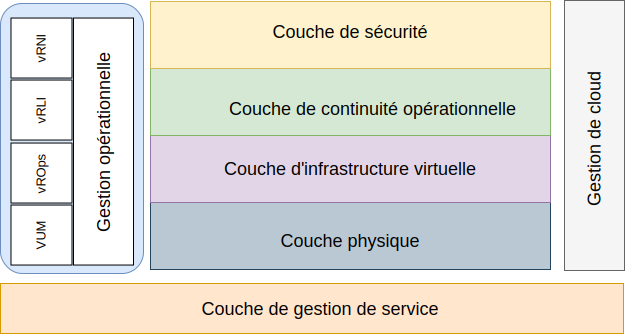

---

copyright:

  years:  2016, 2019

lastupdated: "2019-05-17"

---

# Introduction
{: #opsmgmt-intro}

Cette architecture de référence a pour but de guider et de contraindre les instanciations d'architectures {{site.data.keyword.vmwaresolutions_full}}.

Elle permet également :
* de fournir un langage commun aux différentes parties prenantes.
* de fournit une implémentation technologique cohérente pour résoudre les problèmes.
* de prendre en charge la validation des solutions par rapport à une architecture de référence éprouvée.
* d'encourager l'adhésion à des normes, spécifications et modèles communs.

L'objectif principal de cette architecture de référence est de documenter la capacité de gestion des opérations pour assurer la surveillance et les alertes de l'environnement {{site.data.keyword.vmwaresolutions_short}} déployé pour le client. Les outils ont été configurés avec les paramètres et les seuils recommandés à l'intention de l'équipe d'opération du client.

La conception permet au client de réaliser les tâches suivantes :
* Mise à l'échelle vers le haut ou vers le bas selon les besoins.
* Installation de ses propres outils de surveillance d'entreprise, conformément à ses politiques opérationnelles.
* Intégration des outils dans sa propre plateforme de gestion des services informatiques (ITSM).

## Gestion des opérations
{: #opsmgmt-intro-opsmgmt}

{{site.data.keyword.vmwaresolutions_short}} est basé sur les couches architecturales suivantes :

* Couche physique - La couche la plus basse de l'architecture est la couche physique qui se compose des composants de calcul, de réseau et de stockage utilisés par {{site.data.keyword.cloud_notm}} :
  * {{site.data.keyword.baremetal_short}} qui exécute la charge de travail de gestion, de périphérie et de calcul.
  * Le réseau {{site.data.keyword.cloud_notm}} qui est composé de réseaux VLAN, de sous-réseaux, et de routeurs client frontaux et de back-end (FCR/BCR).
  * Le stockage vSAN qui est une base de données consolidée des SSD dans le stockage {{site.data.keyword.baremetal_short}} ou Endurance.

* Couche d'infrastructure virtuelle - La couche d'infrastructure virtuelle s'exécute sur les composants de la couche physique. La couche d'infrastructure virtuelle contrôle l'accès à l'infrastructure physique sous-jacente et contrôle et alloue les ressources à la charge de travail de gestion et de calcul. Les charges de travail de gestion se composent d'éléments de la couche d'infrastructure virtuelle elle-même, ainsi que d'éléments des couches de gestion du cloud, de gestion des services, de continuité des activités et de sécurité.

* Couche de continuité d'activité - Cette couche contient des éléments qui permettent d'assurer la continuité des activités en assurant la sauvegarde, la restauration et la reprise après incident des données. Pour plus d'informations, voir l'architecture de sauvegarde et de restauration de {{site.data.keyword.vmwaresolutions_short}}, ainsi que les architectures de référence de reprise après incident Zerto, Veeam et Spectrum Protect Plus.

* Couche de sécurité - Cette couche contient les éléments permettant de réduire les risques et d'accroître la conformité. Pour plus d'informations, voir les architectures de référence Fortinet, F5, NSX, HyTrust et Caveonix.

Ce document ajoute la couche suivante à l'architecture {{site.data.keyword.vmwaresolutions_short}} :

* Couche de gestion des opérations - L'architecture de la couche de gestion des opérations comprend des composants de gestion qui prennent en charge les couches physique et virtuelle et, en option, les charges de travail de calcul, en temps réel. La couche de gestion des opérations comprend la topologie {{site.data.keyword.vmwaresolutions_short}} : ressources physiques, virtuelles, informatiques, réseau et de stockage. La couche de gestion des opérations consiste principalement en une fonctionnalité de surveillance et de journalisation.

  L'information est recueillie sous les formes suivantes :
    * Métriques - données structurées telles que la performance et la capacité
    * Journaux - données non structurées telles que les événements système 

La couche de gestion des opérations comprend les outils suivants :

* vRealize Operations Manager (vROps) - vROps utilise les données collectées des ressources système (objets) pour identifier les problèmes dans les composants système surveillés et, dans de nombreux cas, il suggère des actions correctives à prendre pour résoudre le problème. Pour les problèmes plus complexes, vROps offre des outils analytiques riches pour révéler les problèmes cachés, enquêter sur des problèmes techniques complexes, identifier les tendances ou effectuer une analyse plus approfondie pour évaluer la santé d'un objet spécifique.
* vRealize Log Insight (vRLI) - vRLI permet une gestion intelligente des journaux pour l'infrastructure et les applications dans tout environnement. Cette solution de gestion des journaux hautement évolutive fournit des tableaux de bord intuitifs et exploitables, des analyses sophistiquées et une extensibilité étendue à des environnements physiques, virtuels et de cloud.
* vRealize Network Insight (vRNI) - vRNI fournit des opérations intelligentes pour la sécurité et les réseaux définis par logiciel. Il offre une visibilité sur les réseaux virtuels et physiques, fournit des vues opérationnelles pour gérer et faire évoluer les déploiements NSX, et accélère la planification et le déploiement de la micro-segmentation.
* VMware Update Manager (VUM) - VUM permet une gestion centralisée et automatisée des correctifs et des versions pour VMware vSphere et les offres ; la mise à niveau et la correction des hôtes vSphere, l'installation et la mise à niveau des logiciels tiers sur les hôtes, et la mise à niveau du matériel de machines virtuelles, des outils VMware, et des dispositifs virtuels. 

Pour une architecture d'entreprise complète, les couches suivantes peuvent être requises mais ne font pas partie de l'architecture {{site.data.keyword.vmwaresolutions_short}} :

* Couche de gestion du cloud - La couche de gestion du cloud est la couche supérieure de l'architecture cloud. Cette couche demande des ressources et orchestre les couches inférieures à partir d'une interface utilisateur ou d'une interface de programmation d'application (API). vRealize Automation permet l'automatisation du cloud sur {{site.data.keyword.cloud_notm}}. Pour plus d'informations, voir [vRealize Automation (vRA) reference architecture](https://www.ibm.com/cloud/garage/files/IBM_Cloud_for_VMware_Solutions_VRA_Architecture_v1.pdf){:new_window}.

Pour plus d'informations sur la façon dont cette architecture peut être étendue à l'intégration Chef, voir [vRA with Chef integration reference Architecture](https://www.ibm.com/cloud/garage/files/IBM_Cloud_for_VMware_Solutions_VRA_Chef_Integration_Architecture.pdf){:new_window}.

* Couche de gestion des services - Cette couche se concentre sur le cycle de vie complet de l'environnement informatique et est généralement implémentée au niveau de l'entreprise en combinant les entrées de tous les silos des opérations et technologies informatiques. Cette couche a traditionnellement été architecturée sur des structures de gestion des services informatiques (ITSM) telles que l'IT Infrastructure Library (ITIL) et ISO/IEC 20000, qui constituent un ensemble des meilleures pratiques pour fournir les services informatiques dans les différents processus et étapes du cycle de vie du service informatique. Au niveau produit, ITSM est caractérisé par un système centralisé de gestion des flux de travail qui permet de gérer les incidents, les demandes de service, les problèmes, les changements et les connaissances liés à une base de données de gestion de configuration.

## Liens connexes
{: #opsmgmt-intro-related}

* [Présentation de vCenter Server on {{site.data.keyword.cloud_notm}} with Hybridity Bundle](/docs/services/vmwaresolutions/archiref/vcs?topic=vmware-solutions-vcs-hybridity-intro)
