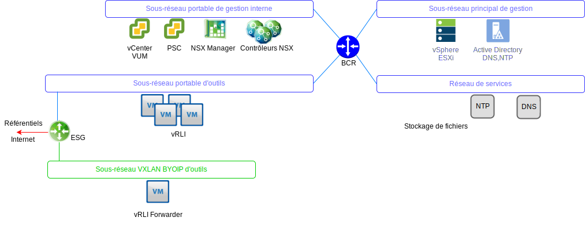
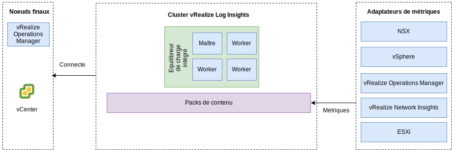

---

copyright:

  years:  2016, 2019

lastupdated: "2019-05-17"

---

# vRealize Log Insights
{: #opsmgmt-vrli}

L'environnement vRealize Log Insight (vRLI) est composé de quatre machines virtuelles avec un équilibreur de charge intégré.

Ce modèle prend en charge :
* 30 000 machines virtuelles
* Ingestion de journaux quotidienne de 75 Gbs
* 5 000 événements par seconde

vRealize Log Insight (vRLI) permet la journalisation en temps réel des composants dans l'environnement {{site.data.keyword.vmwaresolutions_full}}. La conception déploie un cluster vRLI qui se compose de quatre noeuds dans chaque instance. Cette configuration assure une disponibilité continue et des taux d'ingestion de journaux plus élevés.

Dans cette conception, chaque emplacement dispose d'un cluster vRLI indépendant déployé sur le cluster de gestion. Le cluster vRLI est déployé sur le sous-réseau d'outils à l'aide d'adresse IP {{site.data.keyword.cloud_notm}} portables. Ceci facilite la communication avec tous les composants qui sont adressés depuis l'espace d'adressage {{site.data.keyword.cloud_notm}} RFC1918. Les composants comprennent : les hôtes vSphere, vCenter, Platform Services Controller, NSX Manager et NSX Controllers. Un cluster vRLI contient un noeud maître et au moins deux noeuds worker avec un répartiteur de charge intégré.

* Noeud maître - noeud initial requis dans le cluster. Le noeud maître est responsable des requêtes et de l'ingestion des journaux. L'interface utilisateur Web du noeud maître est la seule interface de ce cluster vRealize Log Insight. Toutes les requêtes concernant les données sont dirigées vers le noeud maître qui, à son tour, répartit la charge de travail entre les noeuds worker.
* Noeud worker - trois noeuds minimum sont requis pour former un cluster avec la possibilité d'ajouter plus des noeuds worker supplémentaires si une mise à l'échelle est nécessaire. Un noeud worker ingère et stocke les journaux localement.
* Equilibreur de charge intégré - il offre une haute disponibilité grâce à une configuration d'équilibrage de charge propriétaire (aucun équilibreur de charge externe n'est requis).
* Log Insight Forwarder – il est déployé pour recevoir les journaux des composants NSX superposés. De plus, il peut être exploité par un client s'il souhaite envoyer des journaux à partir de machines virtuelles de calcul. Log Insight Forwarder est un noeud maître unique de vRealize Log Insight qui est utilisé comme agrégateur syslog distant pour transmettre les alertes au cluster vRLI. Comme les VXLAN sauvegardés sont adressés à partir de l'espace d'adressage BYOIP, les règles NAT doivent être implémentées sur la passerelle NSX ESG. Les tailles suivantes sont disponibles et la taille appropriée est sélectionnée :

 * Petit – 2000 événements par seconde
 * Moyen – 5000 événements par seconde
 * Grand – 15000 événements par seconde

vRLI recueille les journaux afin de fournir des informations de surveillance sur l'environnement à partir d'un emplacement central.

vRLI collecte les événements de journalisation à partir de l'infrastructure virtuelle et des composants de gestion du cloud suivants (clients de journalisation) :
* vCenter
* Hôtes ESXi
* NSX Manager
* Contrôleurs NSX
* Passerelles NSX Edge Services Gateway 
* Instances de routeurs logiques distribués NSX 
* Routeurs logiques distribués universels NSX
* Module de noyau ESXi de pare-feu distribué NSX
* Noeuds cluster d'analyse vRealize Operations Manager et collecteurs distants
* Instance vRLI dans les autres instances comme résultat de la transmission d'événement

Les clients de journalisation suivants sont pris en charge mais ne sont pas intégrés dans cette conception :
* Dispositif d'automatisation vRealize
* vRealize Orchestrator (intégré dans le dispositif vRealize Automation)
* Serveur Web vRealize IaaS
* Serveur de gestion vRealize IaaS
* DEM vRealize IaaS
* Agents proxy vRealize IaaS
* Serveur vRealize Business
* Collecteur de données vRealize Business

## Configuration requise
{: #opsmgmt-vrli-requirements}

Pour prendre en charge toutes les données de journaux provenant des sources de journaux dans l'environnement, les noeuds vRLI doivent avoir une taille correcte. Cette conception est basée sur des dispositifs de taille moyenne :

Tableau 1. Paramètres système des noeuds maître et de réplique de Log Insight 

| Attribut                | Spécification                     |
| ------------------------ | --------------------------------- |
| vCPU                     | 8                                 |
| Mémoire                   | 18 Go                             |
| Disque (allocation statique) | 530 Go (490 Go pour le stockage d'événement) |

Chaque dispositif virtuel vRLI a trois disques virtuels par défaut et peut utiliser des disques virtuels supplémentaires pour le stockage.
* Disque dur 1 - 20 Go pour le système de fichiers racine
* Disque dur 2 - 510 Go pour le déploiement de taille moyenne. Contient deux partitions :
  * /storage/var - pour les journaux système
  * /storage/core storage - pour les journaux collectés (approximativement 475 Go d'espace disque disponible)

## Mise en réseau
{: #opsmgmt-vrli-network}

Le déploiement du dispositif vRLI nécessite trois adresses IP du sous-réseau portable privé des outils. vRLI nécessite un accès :
* au dispositif vCenter
* au dispositif vRealize Log Insight
* aux dispositifs NSX-V/T 
* au réseau VXLAN de développement d'outils
* aux réseaux clients
* au serveur NTP (time.services.softlayer.com)
* à {{site.data.keyword.vmwaresolutions_short}} Active Directory/DNS
* Les collecteurs distants ont besoin des règles NAT sur la passerelle NSX ESG pour activer la connectivité au noeud maître, à la réplique de noeud maître et aux noeuds de données

## Ports
{: #opsmgmt-vrli-ports}

Tableau 2. Port de Log Insight

| Description                                                   | Port       | Protocole |
| ------------------------------------------------------------- | ---------- | -------- |
| Trafic syslog sortant configuré comme destination de réexpédition | 514        | TCP, UDP |
| Données syslog sur SSL                                        | 1514, 6514 | TCP      |
| API d'ingestion de Log Insight                                | 9000       | TCP      |
| API d'ingestion de Log Insight sur SSL                        | 9543       | TCP      |
| Accès SSH au dispositif                                       | 22         | TCP      |
| Interface utilisateur                                         | 80, 443    | TCP      |
| NTP                                                           | 123        | UDP      |
| SMTP                                                          | 25         | TCP      |
| DNS                                                           | 53         | UDP      |
| LDAP/LDAPS                                                    | 389, 636   | TCP      |
| LDAP GC                                                       | 3268/3269  | TCP      |
| vCenter                                                       | 443        | TCP      |
| Dispositif vRealize Operations Manager                        | 443        | TCP      |

## Authentification
{: #opsmgmt-vrli-auth}

La gestion des utilisateurs de vRLI nécessite VMware Identity Manager (vIDM), qui est intégré à Active Directory. Les comptes de service sont utilisés pour la communication d'application à application depuis vRealize Operations Manager vers les adaptateurs suivants avec l'ensemble minimum de permissions nécessaires pour la collecte de métrique et pour le mappage topologique. 
* NSX Manager
* vCenter
* vSAN

## Packs de contenu dans vRealize Log Insight
{: #opsmgmt-vrli-content}

Les packs de contenus fournissent une surveillance granulaire supplémentaire sur l'infrastructure virtuelle et permettent de récupérer, d'extraire et d'analyser les journaux dans un format lisible par l'homme. De cette façon, vRLI enregistre les requêtes et les alertes du journal, et vous pouvez utiliser des tableaux de bord pour une surveillance efficace.

Les éléments suivants sont installés par défaut :
* Eléments généraux
* VMware vSphere
* VMware vSAN
* VMware vROps

Cette conception installe également :
* VMware NSX for vSphere
* vRealize Network Insight

Les autres packs de contenus sont décrits dans la section [Pack de contenus de vRealize Log Insight](https://marketplace.vmware.com/vsx/?contentType=2&listingStyle=table){:new_window}.

## Liens connexes
{: #opsmgmt-vrli-related}

* [Présentation de vCenter Server on {{site.data.keyword.cloud_notm}} with Hybridity Bundle](/docs/services/vmwaresolutions/archiref/vcs?topic=vmware-solutions-vcs-hybridity-intro)
* [Redimensionnement du dispositif virtuel vRealize Log Insight](https://docs.vmware.com/en/vRealize-Log-Insight/4.6/com.vmware.log-insight.getting-started.doc/GUID-284FC5F4-B832-47A7-912E-D407A760CAE4.html){:new_window}
* [vRealize Log Insight](https://docs.vmware.com/en/vRealize-Log-Insight/index.html){:new_window}
