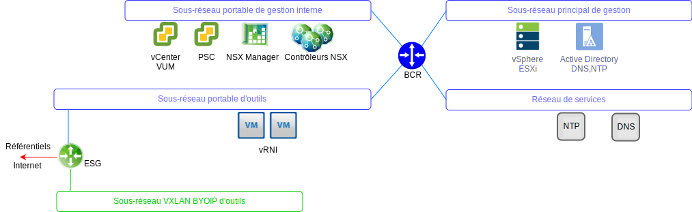
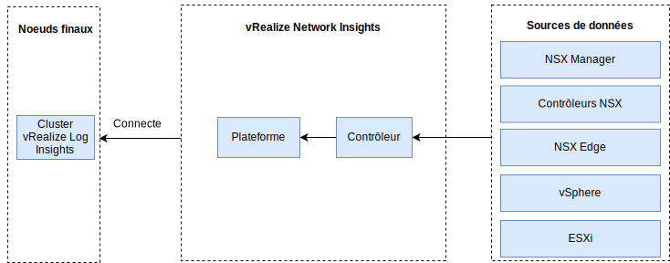

---

copyright:

  years:  2016, 2019

lastupdated: "2019-05-31"

---

# vRealize Network Insight
{: #opsmgmt-vrni}

L'environnement vRealize Network Insight (vRNI) est composé de deux machines virtuelles, d'une plateforme (interface utilisateur) et d'un noeud de contrôleur.

La plateforme vRNI fournit des analyses, une interface utilisateur et une gestion des données et se connecte au dispositif de contrôle qui collecte les données des différentes sources telles que NSX Edges, vCenter. Tous les composants vRNI utilisent des adresses IP portables privées {{site.data.keyword.cloud}}. vRLI est configuré comme serveur syslog pour vRNI.

## Configuration requise
{: #opsmgmt-vrni-requirements}

Cette architecture prend en charge 3000 machines virtuelles de taille moyenne.

Tableau 1. Configuration requise par la plateforme Network Insight

| Attribut | Spécification |
|---|---|
| vCPU | 8 |
| Mémoire | 32 Go |
| Disque (allocation dynamique) | 1 To |

Tableau 2. Configuration requise par le collecteur Network Insight

| Attribut | Spécification |
|---|---|
| vCPU | 4 |
| Mémoire | 12 Go |
| Disque (allocation dynamique) | 200 Go |

## Mise en réseau
{: #opsmgmt-vrni-network}

Le déploiement du dispositif vRNI nécessite deux adresses IP du sous-réseau portable privé des outils. En terme de connectivité réseau, vRNI nécessite un accès :
* au dispositif vCenter
* au dispositif vRealize Log Insight
* aux dispositifs NSX-V/T
* au réseau VXLAN de développement d'outils
* aux réseaux clients
* au serveur NTP (`time.services.softlayer.com`)
* à {{site.data.keyword.vmwaresolutions_short}} Active Directory/DNS

## Ports
{: #opsmgmt-vrni-ports}

Tableau 3. Ports de Network Insight

| Description |Port | Protocole |
|---|---|---|
| Communication entre les machines virtuelles de vRealize Network Insight | 443 | HTTPS |
| Services qui nécessitent un accès à Internet svc.ni.vmware.com support2.ni.vmware.com reg.ni.vmware.com|443|HTTPS
| API d'ingestion de Log Insight | 9000 | TCP |
| API d'ingestion de Log Insight sur SSL | 9543 | TCP |
| Interface utilisateur | 80,443 | TCP |
| NTP |123 | UDP |
| SMTP | 25 | TCP |
| DNS| 53 | UDP |
| LDAP/LDAPS | 389, 636 | TCP |
| ESXi | 2055 | TCP |
| VMware vSphere / NSX | 443 | TCP |

## Authentification
{: #opsmgmt-vrni-auth}

L'authentification utilisateur du vRNI s'effectue directement avec un serveur Active Directory.

## Liens connexes
{: #opsmgmt-vrni-links}

* [Présentation de vCenter Server on {{site.data.keyword.cloud_notm}} with Hybridity Bundle](/docs/services/vmwaresolutions/archiref/vcs?topic=vmware-solutions-vcs-hybridity-intro)
* [vRealize Network Insights](https://docs.vmware.com/en/VMware-vRealize-Network-Insight/index.html){:new_window}
