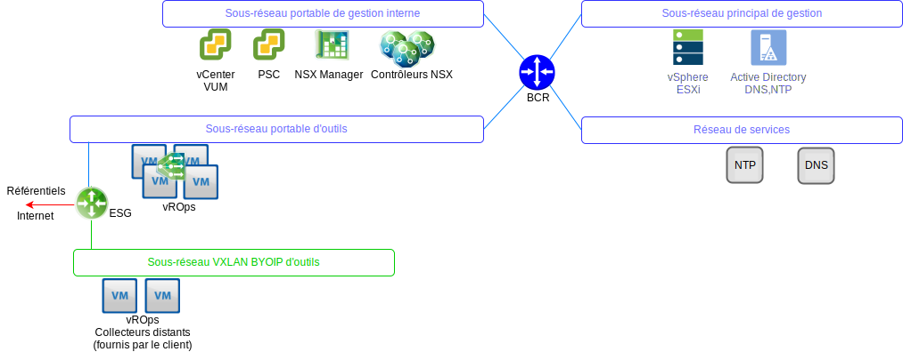
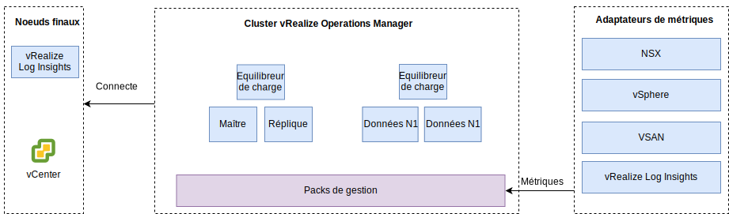

---

copyright:

  years:  2016, 2019

lastupdated: "2019-05-17"

---

# Conception de vRealize Operations Manager
{: #opsmgmt-vrops}

Le cluster d'analyse vROps contient les noeuds qui analysent et stockent les données des composants surveillés. Dans ce déploiement, quatre noeuds et deux équilibreurs de charge NSX sont déployés. Cette taille permet de surveiller jusqu'à 30.000 machines virtuelles et 9.000.000 de métriques à collecter.

Le cluster d'analyse à 4 noeuds se compose des éléments suivants :
* Le noeud maître : le noeud maître est le noeud initial dans un cluster vROps. Dans un environnement de grande dimension, ce noeud gère tous les autres noeuds.
* La réplique de noeud maître : ce noeud active la haute disponibilité du noeud maître.
* Les noeuds de données : ces noeud permettent la mise à l'échelle de vROps dans des environnements plus vastes. Deux noeuds de données sont déployés dans cette conception.

De plus, la conception utilise des noeuds collecteurs distants qui agissent en tant que serveur proxy ou de relais pour collecter les données uniquement et transmettre les données collectées aux noeuds maître/de données. Des noeuds de données et des collecteurs distants peuvent être ajoutés pour effectuer une mise à l'échelle en fonction de la taille de l'environnement. Le placement des composants vROps sur les réseaux VLAN/VXLAN est illustré dans le diagramme suivant.

* Le noeud maître, la réplique de noeud maître et les noeuds de données sont déployés sur le sous-réseau des outils à l'aide des adresses IP portables {{site.data.keyword.cloud_notm}} pour faciliter la communication vers tous les composants qui sont adressés depuis l'espace d'adresse RFC1918 d'{{site.data.keyword.cloud_notm}}, y compris les hôtes vSphere, vCenter, le contrôleur de service de plateforme, NSX Manager et les contrôleurs NSX. Un équilibreur de charge NSX est utilisé avec un VIP pour la haute disponibilité.
* Comme les charges de travail des clients utilisent l'adressage IP à partir de l'espace d'adressage BYOIP, cette conception utilise des collecteurs distants hébergés dans un VXLAN. Ces collecteurs distants ne sont pas configurés dans le cadre de l'automatisation {{site.data.keyword.vmwaresolutions_full}} et doivent être implémentés manuellement par le client.

Le cluster d'analyse vROps est accessible via une interface utilisateur de gestion ou à l'aide d'une API et s'intègre à :
* vCenter
* vRealize Log Insight

Le client peut s'intégrer manuellement dans les produits suivants, s'ils ont été déployés :
* vRealize Automation
* vRealize Business

vROps collecte les données de :
* vSphere - vCenter, Platform Services Controller, hôtes vSphere
* NSX - NSX Manager, contrôleurs NSX et périphéries NSX Edge
* vRLI

Le client peut configurer vROps manuellement pour collecter les données de vRealize Automation et vRealize Business for Cloud.

## Configuration requise
{: #opsmgmt-vrops-requirements}

Le cluster d'analyse est composé d'un noeud maître, d'une réplique de noeud maître et de deux noeuds de données qui permettent une mise à l'échelle et une haute disponibilité. Des noeuds de données additionnels peuvent être ajoutés si une mise à l'échelle est requise. Le cluster d'analyse peut être mis à l'échelle avec un maximum de 8 noeuds de taille moyenne.

Tableau 1. Paramètres système du noeud de réplique/maître d'Operations Manager

| Attribut | Spécification |
|---|---|
| vCPU | 8 |
| Mémoire | 32 Go |
| Disque (allocation statique) | 254 Go |

Tableau 2. Paramètres système des noeuds de données d'Operations Manager

| Attribut | Spécification |
|---|---|
| vCPU | 8 |
| Mémoire | 32 Go |
| Disque (allocation statique) | 254 Go |

Si la surveillance des machines virtuelles de calcul est nécessaire, le client doit installer deux noeuds de collecteurs distants sur un VXLAN. La taille du dispositif virtuel d'un collecteur distant standard est de 2 vCPU avec 4 Go de RAM et la taille du VMDK du dispositif par défaut est suffisante. Les noeuds des collecteurs distants sont déployés avec des disques à allocation dynamique car les collecteurs distants n'effectuent pas d'opérations d'analyse ni de stockage de données.

Tableau 3. Paramètres des équilibreurs de charge d'Operations Manager

| Paramètres | Equilibreur de charge 1 | Equilibreur de charge 2|
|---|---|---|
| Nom | vrops-ui | vrops-data |
| Intervalle | 30 | 5 |
| Délai d'attente | 5 | 15 |
| Maximum de tentatives | 3 | |
| Type | HTTPS | TCP |
| Méthode | Get | -- |
| URL | /suite-api/api/deployment/node/status | -- |
| Réception | ONLINE | -- |
| Algorithme | ROUND-ROBIN | LEASTCONN |
| Pool | 4 noeuds de vROPs | 4 noeuds de vROPs |

Pour plus d'informations, voir [vRealize Automation Load Balancing (PDF)](https://docs.vmware.com/en/vRealize-Automation/7.5/vrealize-automation-load-balancing.pdf){:new_window}.

## Mise en réseau
{: #opsmgmt-vrops-network}

Le déploiement du dispositif vROps nécessite six adresses IP du sous-réseau portable privé des outils. En terme de connectivité réseau, vROps nécessite un accès :
* au dispositif vCenter
* au dispositif vRealize Log Insight
* aux dispositifs NSX-V/T 
* au réseau VXLAN de développement d'outils
* aux réseaux clients
* au serveur NTP (time.services.softlayer.com)
* à {{site.data.keyword.vmwaresolutions_short}} Active Directory/DNS
* Les collecteurs distants ont besoin des règles NAT sur la passerelle NSX ESG pour activer la connectivité au noeud maître, à la réplique de noeud maître et aux noeuds de données

## Ports
{: #opsmgmt-vrops-ports}

Tableau 4. Ports d'Operation Manager

| Composant | Protocole | Port |
|---|---|---|
| vCenter | TCP | 443 |
| DNS | TCP/UDP | 53 |
| LDAP/LDAPS | TCP | 389/636 |
| LDAP GC | TCP | 3268/3269 |
| NTP | UDP | 123 |
| SMTP | TCP | 25 |
| SNMP | UDP | 161 |

### Authentification
{: #opsmgmt-vrops-auth}

La gestion des utilisateurs de vROps nécessite VMware Identity Manager (vIDM), qui est intégré à Active Directory. Les comptes de service sont utilisés pour la communication d'application à application depuis vRealize Operations Manager vers les adaptateurs suivants avec les autorisations minimales requises pour la collecte de métriques et pour le mappage topologique : 

* NSX Manager
* vCenter
* vSAN

## Packs de gestion
{: #opsmgmt-vrops-management}

Les packs de gestion de vROps étendent les capacités de gestion opérationnelle de la plateforme vROps pour fournir des alertes et des tableaux de bord spécifiques aux produits.

Les packs de gestion suivants sont installés dans vROps par défaut :
* Pack de gestion de VMware vCenter Server
* Pack de gestion de vRealize Log Insight
* Pack de gestion de vSAN
* Pack de gestion de vRealize Automation
* Pack de gestion de vRealize Business for Cloud

Les composants suivants sont installés par {{site.data.keyword.vmwaresolutions_short}} :
* Pack de gestion VMware SDDC Health Management Pack
* Pack de gestion de NSX for vSphere
* Pack de gestion vRealize Operations Federation Management Pack
* Pack de gestion de Hybrid Cloud Extension (HCX)

D'autres packs de gestion peuvent être installés par le client. Pour plus d'informations, voir [Management Packs at the VMware Exchange](https://marketplace.vmware.com/vsx/?contentType=1&listingStyle=table){:new_window}.

### Pack de gestion de VMware vCenter Server
{: #opsmgmt-vrops-management-vCenter}

Ce pack de gestion par défaut étend les fonctionnalités de vROps à vCenter pour permettre la collecte d'objets, de métriques et d'alertes.

### Pack de gestion de vRealize Log Insight
{: #opsmgmt-vrops-management-vrli}

Ce pack de gestion par défaut étend les fonctionnalités de vROps à vRLI pour permettre la surveillance de l'environnement vRLI ainsi que l'intégration d'événements et d'alertes de vRLI à vROps.

### Pack de gestion de vSAN
{: #opsmgmt-vrops-management-vsan}

Le pack vRealize Operations Management Pack for vSAN permet aux tableaux de bord spécifiques aux réseaux vSAN d'évaluer, de gérer et d'optimiser les performances des objets vSAN et des objets compatibles avec vSAN.

### Pack VMware SDDC Health Management Pack
{: #opsmgmt-vrops-management-sddc}

Le pack VMware SDDC Health Management Pack for vROps surveille la pile de gestion SDDC et fournit des métriques identifiées par un code couleur pour la santé et l'efficacité des différents composants présents dans la cadre de la pile de gestion SDDC. Les tableaux de bords du pack VMware SDDC Health Management Pack vous permettent de surveiller les composants suivants de l'instance vCenter Server et des outils de gestion :
* vRealize Operations Manager
* NSX for vSphere/VMware NSX-T
* VMware vSAN
* vRealize Log Insight
* vCenter Server

De plus, si le client a installé les produits suivants, ils peuvent également être surveillés :
* vRealize Automation
* vRealize Orchestrator
* vRealize Business for Cloud
* VMware Site Recovery Manager

Le pack VMware SDDC Health Management Pack fournit les tableaux de bord suivants :
* Tableau de bord récapitulatif de SDDC Management Health - Vous pouvez utiliser le tableau de bord récapitulatif de SDDC Management Health pour afficher et analyser les problèmes spécifiques aux applications dans les composants SDDC.
* Tableau de bord des tendances de l'historique de santé de SDDC - Le pack VMware SDDC Health Management Pack comporte un tableau de bord des tendances de l'historique de santé de SDDC qui affiche la tendance de chaque composant dans la pile SDDC.
* Tableau de bord du redimensionnement de vRealize Operations Manager de SDDC - Le tableau de bord de redimensionnement de vRealize Operations Manager de SDDC fournit au cluster vRealize Operations Manager la capacité de traiter les objets et les métriques.

Les plug-in du pack VMware SDDC Health Management Pack recueillent les métriques des types d'objets contenus dans les plug-in. Le pack de gestion collecte les métriques de santé des produits suivants :
* vCenter Server
* Pack de gestion de NSX for vSphere
* vRealize Automation
* vRealize Operations Manager
* vRealize Business
* vRealize Log Insight
* VMware Site Recovery Manager
* vCenter HA
* vMware vSAN Health
* Services dans le dispositif vCenter Server
* Redimensionnement de vRealize Operations Manager
* vRealize Orchestrator

### Pack de gestion de NSX-T
{: #opsmgmt-vrops-management-nsxt}

Le pack de gestion de NSX-T étend les capacités d'analyse, de corrélation, de prédiction et de visualisation de vROps aux réseaux virtuels. Le pack inclut :
* Assurance de la configuration
* Santé
* Performances
* Capacité
* Dépannage des objets NSX-T

### Pack de gestion de NSX for vSphere
{: #opsmgmt-vrops-management-nsxv}

Le pack de gestion de NSX for vSphere offre une couverture de gestion des opérations pour les déploiements des technologies de réseau virtuel NSX de VMware. Ce pack de gestion étend aux réseaux virtuels les capacités d'analyse, de corrélation, de prédiction et de visualisation de vROps. La couverture comprend l'assurance de configuration, la santé, la performance, la capacité et le dépannage pour les commutateurs logiques NSX, les routeurs logiques, les services de périphérie, les pare-feu distribués et les équilibreurs de charge.

Le pack de gestion de NSX for vSphere est étroitement intégré à vROps et les données hôte vSphere sont corrélées avec les services NSX fonctionnant sur ces hôtes. Avec l'intégration du journal via vRLI, les conditions d'erreur et de panne, déclenchées par des messages de journal, sont signalées dans la fenêtre des objets et problèmes du pack de gestion.

### Pack de gestion vRealize Operations Federation Management Pack
{: #opsmgmt-vrops-management-federation}

Le pack vRealize Operations Federation Management Pack permet un déploiement vROps multisite à travers une même interface. Il permet un déploiement de vROps avec la capacité de recevoir des métriques clés pour des objets spécifiques des déploiements vROps.

### Pack de gestion de Hybrid Cloud Extension (HCX)
{: #opsmgmt-vrops-management-hcx}

Le pack de gestion de vRealize Operations pour HCX étend les fonctionnalités de gestion des opérations de vROps aux fonctionnalités hybrides présentées par HCX. Avec le pack de gestion, vous pouvez collecter des informations sur les métriques, sur les événements de changement et sur la topologie des ressources dans HCX. Il permet la surveillance, l'isolement et la résolution des problèmes de performance dans les charges de travail HCX Interconnexions, Migrations ou Protection.

## Liens connexes
{: #opsmgmt-vrops-management-links}

* [Présentation de vCenter Server on {{site.data.keyword.cloud_notm}} with Hybridity Bundle](/docs/services/vmwaresolutions/archiref/vcs?topic=vmware-solutions-vcs-hybridity-intro)
* [vRealize Operations Manager 7.0 Sizing Guidelines](https://kb.vmware.com/s/article/57903){:new_window}
* [Documentation de vRealize Operations Manager](https://docs.vmware.com/en/vRealize-Operations-Manager/index.html){:new_window}
* [Management Pack for vSAN](https://marketplace.vmware.com/resources/vsx/product_files/31742/original/Management-Pack-for-vSAN-Guide6d2a8895b022a5f626a86e8e84b031b5.pdf){:new_window}
* [Mise à jour des clusters vSAN](https://cloud.ibm.com/docs/services/vmwaresolutions/archiref/vum/vum-updating-vsan.html#updating-vsan-clusters){:new_window}
* [Management-Pack-for-vSAN-Guide](https://marketplace.vmware.com/resources/vsx/product_files/31742/original/Management-Pack-for-vSAN-Guide6d2a8895b022a5f626a86e8e84b031b5.pdf){:new_window}
* [vSAN Health Check Information](https://kb.vmware.com/s/article/2114803){:new_window}
* [Operationalizing VMware NSX](https://www.vmware.com/content/dam/digitalmarketing/vmware/en/pdf/products/nsx/vmware-operationalizing-nsx.pdf){:new_window}
* [NSX Operations Guide](https://communities.vmware.com/servlet/JiveServlet/previewBody/30079-102-2-40474/NSX-Operations-Guide-v6.1.pdf){:new_window}
