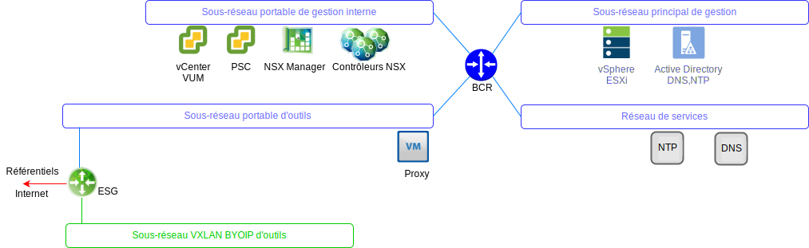

---

copyright:

  years:  2016, 2019

lastupdated: "2019-05-16"

---

# VMware Update Manager
{: #opsmgmt-vum}

VMware Update Manager (VUM) permet une gestion centralisée et automatisée des correctifs et des versions de VMware vSphere et vous permet de réaliser les tâches suivantes dans votre serveur VMware vCenter dans un environnement {{site.data.keyword.cloud}} :
* Mettre à jour et corriger les hôtes vSphere ESXi
* Installer et mettre à jour les logiciels tiers sur les hôtes
* Mettre à niveau le matériel de machine virtuelle, VMware Tools et les dispositifs virtuels

Pour une description détaillée de VMware Update Manager, voir [Introduction à VMware Update Manager](https://cloud.ibm.com/docs/services/vmwaresolutions/archiref/vum/vum-intro.html#vmware-update-manager-introduction){:new_window}.

## Liens connexes
{: #opsmgmt-vum-links}

* [Présentation de vCenter Server on {{site.data.keyword.cloud_notm}} with Hybridity Bundle](/docs/services/vmwaresolutions/archiref/vcs?topic=vmware-solutions-vcs-hybridity-intro)
* [VMware Update Manager](https://docs.vmware.com/en/VMware-vSphere/6.5/com.vmware.vsphere.update_manager.doc/GUID-F7191592-048B-40C7-A610-CFEE6A790AB0.html){:new_window}
