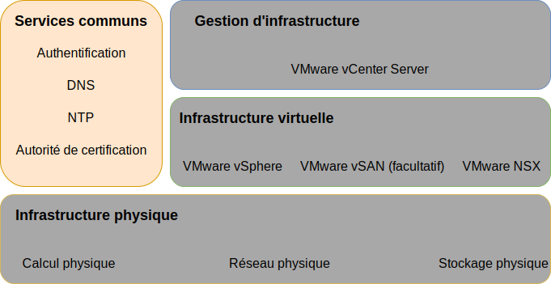
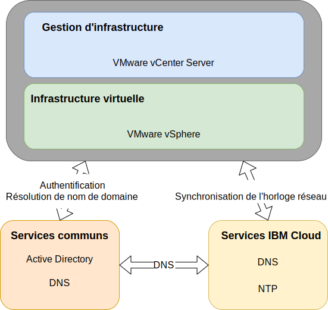

---

copyright:

  years:  2016, 2019

lastupdated: "2019-07-09"

subcollection: vmware-solutions

---

{:tip: .tip}
{:note: .note}
{:important: .important}

# Conception des services communs
{: #design_commonservice}

Les services communs fournissent les services qui sont utilisés par d'autres services de la plateforme de gestion du cloud. Les services communs de la solution comprennent des services d'identité et d'accès, des services de nom de domaine, des services NTP, des services SMTP et des services d'autorité de certification.

## Services d'identité et d'accès
{: #design_commonservice-identity-access}

Dans cette conception, Microsoft Active Directory (MSAD) est utilisé pour la gestion des identités. La conception déploie une ou deux machines virtuelles Active Directory dans le cadre de l'automatisation du déploiement vCenter Server. vCenter est configuré de manière à utiliser l'authentification MSAD.

### Microsoft Active Directory
{: #design_commonservice-msad}

Par défaut, une seule interface de serveur virtuel est déployée sur l'infrastructure {{site.data.keyword.cloud}}.

La conception permet également de déployer deux serveurs MSAD haute disponibilité en tant que machines virtuelles Windows Server dédiées dans le cluster de gestion.

Si vous sélectionnez l'option avec deux serveurs MSAD haute disponibilité, vous êtes tenu de fournir l'octroi de licence et l'activation Microsoft.
{:note}

Active Directory sert à authentifier les accès uniquement pour gérer l'instance VMware et non pour héberger les utilisateurs des charges de travail dans les instances déployées. Le nom de domaine racine de forêt du serveur Active Directory est identique au nom de domaine DNS (Domain Name Services) que vous spécifiez. Ce nom de domaine est indiqué uniquement pour l'instance vCenter Server principale si plusieurs instances sont liées. Pour les instances liées, chaque instance contient un serveur Active Directory qui se trouve dans l'anneau de réplique racine de forêt. Les fichiers de la zone DNS sont également répliqués sur les serveurs Active Directory.

### Domaine SSO (Single Sign On) vSphere
{: #design_commonservice-vsphere-sso}

Le domaine SSO (Single Sign On) vSphere est utilisé comme mécanisme d'authentification initial pour une seule instance ou pour plusieurs instances liées. Le domaine SSO est également utilisé pour connecter une instance VMware à plusieurs instances liées au serveur MSAD. La configuration SSO suivante est appliquée :  
* Le domaine SSO `vsphere.local` est déjà utilisé
* Pour les instances VMware liées à une instance existante, le contrôleur PSC intégré est joint au domaine SSO de l'instance existante
* Le nom de site SSO est identique au nom de l'instance

## Services de noms de domaine
{: #design_commonservice-dns}

Dans cette conception, les services de noms de domaine (DNS) concernent uniquement les composants d'infrastructure et de gestion de cloud.

### Instance vCenter Server principale
{: #design_commonservice-primary-vcs}

Le déploiement vCenter Server utilise les instances de serveur virtuel AD déployées comme serveurs DNS pour l'instance. Tous les composants
déployés (vCenter avec contrôleur PSC intégré, NSX, hôtes ESXi) sont configurés pour pointer vers le serveur AD en tant que serveur DNS par défaut. Vous pouvez personnaliser la configuration
de zone DNS si cela n'interfère pas avec la configuration des composants déployés.

Cette conception intègre les services DNS sur les instances de serveur virtuel AD dans la configuration suivante :
* La structure de domaine est spécifiée par l'utilisateur.
* Le nom de domaine peut comporter un nombre quelconque de niveaux, jusqu'au nombre maximum pouvant être géré par les composants vCenter Server, en garantissant que le niveau le plus bas est le sous-domaine de l'instance.
* Les serveurs AD/DNS sont configurés comme faisant autorité pour le domaine et l'espace de sous-domaine DNS.
* Les serveurs AD/DNS sont configurés pour pointer vers les serveurs DNS {{site.data.keyword.cloud_notm}} pour toutes les autres zones.
* Toutes les régions de cloud secondaires intégrées à la première région de cloud ou à la région de cloud cible déployée doivent utiliser la même structure de nom DNS au-dessus du sous-domaine.
* Vous pouvez éventuellement déployer des serveurs DNS redondants dans le cluster vCenter Server. Deux serveurs AD/DNS sans licence sont configurés. Il vous incombe de fournir les licences des systèmes d'exploitation Windows pour ces serveurs.
* Lorsqu'un seul site est mis à disposition avec un seul serveur AD/DNS, tous les composants vCenter Server configurés doivent avoir uniquement cette seule adresse IP comme entrée DNS.

### Instances vCenter Server secondaires
{: #design_commonservice-secondary-vcs}

Pour une redondance entre les instances, lorsque la première instance vCenter Server secondaire est ajoutée à une instance vCenter Server principale existante ou à l'instance vCenter Server autonome en cours, l'adresse IP du serveur AD DNS de cette instance principale est utilisée dans l'instance vCenter Server secondaire et dans toutes les entrées “DNS secondaire” des instances vCenter Server secondaires suivantes pour tous les composants qui nécessitent une entrée de serveur DNS. Par exemple, ESXi, vCenter et NSX manager, ainsi que des composants complémentaires tels que HCX, Zerto et Veeam. L'entrée DNS secondaire du site principal est alors remplacée par la première adresse IP AD/DNS des instances vCenter Server secondaires.

## Services NTP
{: #design_commonservice-ntp}

Cette conception utilise les serveurs NTP de l'infrastructure {{site.data.keyword.cloud_notm}}. Tous les composants déployés sont configurés pour utiliser ces serveurs NTP. Il est essentiel que tous les composants de la conception utilisent le même serveur NTP pour que les certificats et l'authentification Active Directory fonctionnent correctement.

## Services d'autorité de certification
{: #design_commonservice-cas}

Par défaut, VMware vSphere utilise les certificats TLS qui sont signés par l'autorité de certification VMware (VMCA), qui se trouve sur le dispositif VMware Platform Services Controller.Ces certificats ne sont pas sécurisés par les terminaux ou les navigateurs de l'utilisateur final. La meilleure pratique en matière de sécurité consiste à remplacer les certificats d'utilisateur par des certificats qui sont signés par un tiers ou une autorité de certification d'entreprise. Les certificats pour la communication entre machines peuvent être conservés en tant que certificats signés par l'autorité de certification VMware (VMCA). Cependant, il est recommandé de suivre les meilleures pratiques pour votre organisation, ce qui implique généralement d'utiliser une autorité de certification d'entreprise identifiée.

Vous pouvez utiliser les serveurs Windows AD dans cette conception pour créer des certificats qui sont signés par l'instance locale. Cependant, vous pouvez également choisir de configurer des services d'autorité de certification si nécessaire.

## Liens connexes
{: #design_commonservice-related}

* [Conception de l'infrastructure physique](/docs/services/vmwaresolutions/archiref/solution?topic=vmware-solutions-design_physicalinfrastructure)
* [Conception de l'infrastructure virtuelle](/docs/services/vmwaresolutions/archiref/solution?topic=vmware-solutions-design_virtualinfrastructure)
* [Conception de la gestion d'infrastructure](/docs/services/vmwaresolutions/archiref/solution?topic=vmware-solutions-design_infrastructuremgmt)
