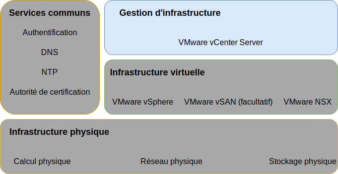

---

copyright:

  years:  2016, 2019

lastupdated: "2019-03-19"

subcollection: vmwaresolutions

---

{:tip: .tip}
{:note: .note}
{:important: .important}

# Conception de gestion d'infrastructure
{: #design_infrastructuremgmt}

La gestion d'infrastructure fait référence aux composants qui gèrent l'infrastructure VMware.
* vCenter Server avec contrôleur PSC (Platform Services Controller) intégré est la plateforme centralisée dédiée à la gestion des environnements vSphere ; il s'agit de l'un des composants fondamentaux de cette solution.
* Le contrôleur PSC est utilisé dans cette solution pour fournir un ensemble de services d'infrastructure, y compris VMware vCenter Single Sign On, un service de licence, un service de consultation et l'autorité de certification VMware.

Cette conception utilise une fonction PSC intégrée dans une instance vCenter Server. La fonction PSC et l'instance vCenter Server sont hébergées sur la même machine virtuelle.

Figure 1. Gestion d'infrastructure 

Le domaine SSO par défaut `vsphere.local` est affecté au contrôleur PSC situé dans l'instance principale.

## Conception de vCenter Server
{: #design_infrastructuremgmt-vcenter}

vCenter Server avec contrôleur PSC intégré est installé sur un sous-réseau portable sur le réseau local virtuel (VLAN) privé associé aux machines virtuelles de gestion. L'adresse IP affectée sur le routeur BCR pour ce sous-réseau spécifique lui sert de passerelle par défaut. Le dispositif virtuel est configuré avec les spécifications décrites dans le tableau suivant.

Tableau 1. Spécifications vCenter Server Appliance

| Attribut                    | Spécification                       |
|------------------------------|-------------------------------------|
| vCenter Server               | Dispositif virtuel                   |
| Taille d'installation du dispositif  | Grand (jusqu'à 1 000 hôtes et 10 000 machines virtuelles) |
| Contrôleur PSC (Platform Services Controller) | Intégré                            |
| Nombre d'unités centrales virtuelles              | 16                                   |
| Mémoire                       | 32 Go                               |
| Disque                         | 990 Go sur le magasin de données local (déploiement de disque de grande taille) |
| Type de disque                    | A allocation dynamique                    |

### Base de données vCenter Server
{: #design_infrastructuremgmt-vcenter-db}

La configuration de vCenter Server utilise une base de données PostgreSQL imbriquée locale qui est incluse avec le dispositif. La base de données imbriquée est utilisée pour retirer les dépendances sur les bases de données externes et l'octroi de licence.

### Spécification de cluster vCenter Server
{: #design_infrastructuremgmt-vcenter-cluster}

Cette conception vous permet de regrouper en cluster les hôtes vSphere ESXi qui sont mis à disposition via la solution. Toutefois, avant les clusters, un objet de centre de données est créé afin de signifier l'emplacement des hôtes vSphere ESXi, ainsi que celui du pod dans le centre de données. Un cluster est créé une fois l'objet de centre de données créé. Le cluster est déployé avec la haute disponibilité VMware vSphere et le planificateur DRS (Distributed Resource Scheduler) VMware vSphere activés.

### Planificateur DRS (Distributed Resource Scheduler) vSphere
{: #design_infrastructuremgmt-vsphere-drs}

Cette conception utilise la planification DRS (Distributed Resource Scheduling) vSphere dans le cluster initial pour placer les machines virtuelles et dans les autres clusters pour faire migrer dynamiquement des machines virtuelles afin d'obtenir des clusters équilibrés. La valeur "Fully Automated" est affectée au paramètre Automation Level, par conséquent, les recommandations de placement initial et de migration sont automatiquement exécutées par vSphere. En outre, le seuil de migration défini est modéré, ainsi, vCenter applique les recommandations de priorité 1, 2, 3 pour obtenir au moins une amélioration décente de l'équilibrage de charge du cluster.

La gestion de l'alimentation via la fonction **Distributed Power Management** n'est pas utilisée dans cette conception.
{:note}

### Haute disponibilité vSphere
{: #design_infrastructuremgmt-vsphere-ha}

Cette conception utilise la haute disponibilité vSphere dans le cluster initial et les autres clusters pour détecter les pannes de traitement et récupérer les machines virtuelles qui s'exécutent dans un cluster. La haute disponibilité vSphere dans cette conception est configurée avec les options de **surveillance hôte** et de **contrôle d'admission** activées dans le cluster. De plus, le cluster initial réserve les ressources d'un noeud comme capacité de secours pour la règle de contrôle d'admission.

Vous êtes chargé d'ajuster la règle de contrôle d'admission lorsque le cluster est développé ou réduit par la suite.
{:note}

Par défaut, une valeur moyenne est affectée à l'option de **priorité de redémarrage des machines virtuelles** et l'option de **réponse d'isolement hôte** est désactivée. De plus, l'option de **surveillance des machines virtuelles** est désactivée et la fonction de **pulsation de magasin de données** est configurée pour inclure n'importe lequel des magasins de données de cluster. Cette approche utilise les magasins de données NAS éventuellement présents.

## EVC (Enhanced vMotion Compatibility)
{: #design_infrastructuremgmt-evc}

Pour simplifier la compatibilité vMotion entre les noeuds de cluster ayant des fonctionnalités d'UC potentiellement différentes, le mode EVC (Enhanced vMotion Compatibility, compatibilité vMotion étendue) est activé au niveau Skylake afin de garantir la compatibilité vMotion entre les noeuds de cluster lorsque de nouveaux processeurs sont ajoutés à l'inventaire {{site.data.keyword.cloud_notm}} et permettre l'extension ultérieure du cluster si les serveurs à processeur Skylake ne figurent pas dans l'inventaire.

### IBM CloudDriver
{: #design_infrastructuremgmt-cloud-driver}

La pierre angulaire de ces solutions est l'automatisation. L'automatisation réduit la complexité du déploiement, réduit considérablement le temps nécessaire au déploiement et garantir que l'instance VMware est déployée de manière cohérente.

IBM CloudBuilder est une instance de serveur virtuel de machine virtuelle {{site.data.keyword.cloud_notm}} qui s'emploie à activer une nouvelle à instance VMware et qui exécute des fonctions de gestion du cycle de vie. Cette instance est déployée lorsqu'une gestion globale des instances vCenter Server est requise puis supprimée une fois le processus achevé.

Le composant IBM CloudDriver peut être configuré de manière à répondre à l'infrastructure de gestion {{site.data.keyword.vmwaresolutions_short}} sur une connexion de réseau public, ou éventuellement privé, via un stockage d'objets {{site.data.keyword.cloud_notm}} faisant office de file d'attente de messages. IBM CloudDriver est un composant développé par IBM, non accessible aux utilisateurs, dont la fonction et les attributs sont les suivants :

- Déploiement et configuration de l'instance vCenter Server dans le compte utilisateur.
- Ajout et suppression d'hôtes dans les clusters vCenter Server.
- Ajout et suppression de clusters dans des instances vCenter Server.
- Ajout et suppression de services ou de fonctions dans des instances vCenter Server.

### Flux d'automatisation
{: #design_infrastructuremgmt-auto-flow}

La procédure suivante décrit l'ordre dans lequel les événements se déroulent lorsque vous utilisez la console {{site.data.keyword.vmwaresolutions_short}} pour commander une instance VMware :
1. Commande de VLAN et de sous-réseaux pour la mise en réseau à partir d'{{site.data.keyword.cloud_notm}}
2. Commande d'{{site.data.keyword.cloud_notm}} {{site.data.keyword.baremetal_short}} avec vSphere Hypervisor installé.
3. Commande d'une instance de serveur virtuel Microsoft Windows qui servira de contrôleur de domaine Active Directory.
4. Déploiement de l'instance de serveur virtuel Cloud Driver.
5. Validation du matériel mis en réseau et déployé
6. Le cas échéant, configuration initiale d'un réseau de stockage virtuel (vSAN) de noeud unique.
7. Déploiement et configuration de vCenter (avec contrôleur PSC intégré) et de NSX.
8. Regroupement en cluster des autres noeuds ESXi, développement de vSAN, le cas échéant, et configuration des composants NSX (VTEP)
9. Validation de l'installation et de la configuration de l'environnement
10. Déploiement de services facultatifs, tels que le serveur de sauvegarde et le stockage
11. Suppression de l'instance de serveur virtuel Cloud Driver.

## ID et mots de passe
{: #design_infrastructuremgmt-ids-pwd}

L'infrastructure de gestion IC4V stocke tous les ID et mots de passe chiffrés que contient vCenter Server dans le plan de gestion {{site.data.keyword.cloud_notm}}. Toute modification apportée à ces mots de passe par l'utilisateur peut perturber les capacités d'automatisation au sein de vCenter Server.

Vous pouvez fournir des mots de passe modifiés dans le portail de solutions IC4V de sorte que le processus d'automatisation puisse traiter des fonctions sans interruption. Le portail de solutions offre la possibilité de vérifier les mots de passe entrés.

## Liens connexes
{: #design_infrastructuremgmt-related}

* [Conception d'infrastructure physique](/docs/services/vmwaresolutions/archiref/solution?topic=vmware-solutions-design_physicalinfrastructure)
* [Conception d'infrastructure virtuelle](/docs/services/vmwaresolutions/archiref/solution?topic=vmware-solutions-design_virtualinfrastructure)
* [Conception des services communs](/docs/services/vmwaresolutions/archiref/solution?topic=vmware-solutions-design_commonservice)
