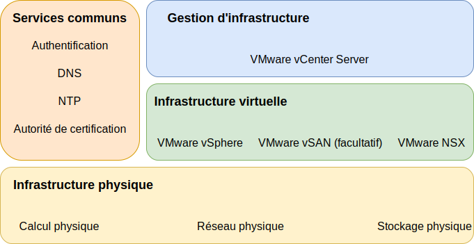

---

copyright:

  years:  2016, 2019

lastupdated: "2019-03-15"

subcollection: vmware-solutions

---
# Composants d'IBM Cloud for VMware Solutions
{: #design_overview}

{{site.data.keyword.vmwaresolutions_full}} fournit l'automatisation du déploiement des composants de technologie VMware dans les {{site.data.keyword.CloudDataCents_notm}} situés dans le monde entier.

Les offres de ce portefeuille de solutions incluent des produits VMware vSphere dans un cluster automatiquement déployé et configuré : VMware vSphere ESXi, VMware vCenter Server Appliance avec contrôleur PSC (Platform Services Controller) intégré, VMware NSX-V ou NSX-T et, en option, VMware vSAN.

L'architecture est composée d'une région de cloud et a la capacité de s'étendre dans d'autres régions de cloud situées dans une autre zone géographique et dans un autre pod {{site.data.keyword.cloud_notm}} au sein du même centre de données. Une région est définie en tant qu'unique instance vCenter Server. Cette conception permet l'extension et la contraction automatisées de la capacité virtuelle dans une instance vCenter Server.

Figure 1. Composants d'{{site.data.keyword.vmwaresolutions_short}}

## Liens connexes
{: #design_overview-related}

* [Conception de l'infrastructure physique](/docs/services/vmwaresolutions/archiref/solution?topic=vmware-solutions-design_physicalinfrastructure)
* [Conception de l'infrastructure virtuelle](/docs/services/vmwaresolutions/archiref/solution?topic=vmware-solutions-design_virtualinfrastructure)
* [Conception des services communs](/docs/services/vmwaresolutions/archiref/solution?topic=vmware-solutions-design_commonservice)
* [Conception de la gestion d'infrastructure](/docs/services/vmwaresolutions/archiref/solution?topic=vmware-solutions-design_infrastructuremgmt)
