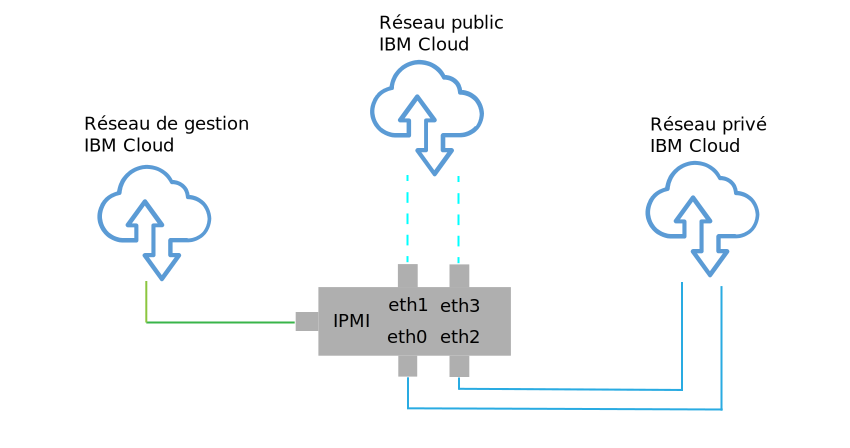

---

copyright:

  years:  2016, 2018

lastupdated: "2018-10-29"

---

{:tip: .tip}
{:note: .note}
{:important: .important}

# Conception d'infrastructure physique

L'infrastructure physique est constituée des composants suivants :

<dl class="dl">
  <dt class="dt dlterm">Calcul physique</dt>
  <dd class="dd">Le calcul physique fournit le traitement et la mémoire physiques utilisés par l'infrastructure de virtualisation. Pour cette conception, les composants de calcul sont fournis par les serveurs bare metal IBM Cloud et sont répertoriés dans le document [VMware Hardware Compatibility Guide (HCG)](https://www.vmware.com/resources/compatibility/search.php).</dd>
  <dt class="dt dlterm">Stockage physique</dt>
  <dd class="dd">Le stockage physique fournit la capacité de stockage brut qui est utilisée par l'infrastructure de virtualisation. Les composants de stockage sont fournis par les serveurs  {{site.data.keyword.baremetal_short}} ou par la matrice NAS (Network Attached Storage) partagée à l'aide de NFS v3.</dd>
  <dt class="dt dlterm">Réseau physique</dt>
  <dd class="dd">Le réseau physique fournit la connectivité réseau dans l'environnement qui est ensuite utilisé par la virtualisation de réseau. Le réseau est fourni par le réseau des services {{site.data.keyword.cloud_notm}} et comprend d'autres services, tels que DNS et NTP.</dd>
</dl>

Pour plus d'informations sur les composants physiques, voir la nomenclature pour l'[instance Cloud Foundation](../../sddc/sd_bom.html) ou l'[instance vCenter Server](../../vcenter/vc_bom.html).

Pour plus d'informations sur le stockage, voir la documentation sur l'[architecture de stockage partagé](https://www.ibm.com/cloud/garage/files/AttachedStorageSolutionArchitecture_v1.0.pdf).

## Conception d'hôte physique

L'hôte physique fait référence aux serveurs {{site.data.keyword.baremetal_short}} dans l'environnement qui sert les ressources de calcul. Les serveurs bare metal appliqués dans cette solution sont certifiés par VMware et répertoriés sur le site [VMware Compatibility Guide](http://www.vmware.com/resources/compatibility/search.php).

Les configurations de serveur disponibles dans la solution sont conformes ou supérieures aux exigences minimales relatives à l'installation, la configuration et la gestion de vSphere ESXi. Différentes configurations sont disponibles pour satisfaire différentes exigences. Pour obtenir la liste détaillée des spécifications exactes utilisées pour la solution VMware on {{site.data.keyword.cloud_notm}}, voir la nomenclature pour l'[instance Cloud Foundation](../../sddc/sd_bom.html) ou l'[instance vCenter Server](../../vcenter/vc_bom.html).

Les serveurs {{site.data.keyword.baremetal_short}} résident dans {{site.data.keyword.cloud_notm}}.
{:note}

Chaque instance Cloud Foundation commence avec un déploiement de 4 hôtes, et chaque instance vCenter Server commence avec un déploiement de 3 ou 4 hôtes selon la solution de stockage choisie.

L'hôte physique emploie deux disques connectés localement destinés à être alloués à l'hyperviseur vSphere ESXi. Vous pouvez allouer davantage de disques en utilisant vSAN comme indiqué dans la section _Conception de stockage physique_ ou en utilisant NetApp ONTAP comme indiqué dans la documentation sur l'[architecture NetApp ONTAP Select](https://www.ibm.com/cloud/garage/files/IBM_Cloud_for_VMware_Solutions_NetApp_Architecture.pdf). Chaque hôte physique comporte des connexions réseau 10 Gbps redondantes pour l'accès au réseau public et l'accès au réseau privé.

Les spécifications du serveur bare metal sont les suivantes :
* Unité centrale : Dual Intel Xeon, configuration coeur et vitesse variable
* Mémoire : Configuration variable, 128 Go ou plus
* Réseau : 4 x 10 Gbps
* Nombre d'unités : Au moins 2

## Conception de réseau physique

Cette section décrit le réseau physique qui est fourni par {{site.data.keyword.cloud_notm}} et les connexions hôte physiques (VLAN, MTU) qui sont associées aux hôtes physiques.

Le réseau physique d'{{site.data.keyword.cloud_notm}} est divisé en trois réseaux distincts : public, privé et gestion. Pour obtenir une illustration des trois réseaux et de leur fonctionnement, voir [Le réseau {{site.data.keyword.cloud_notm}}](https://www.ibm.com/cloud-computing/bluemix/our-network).

### Réseau public

{{site.data.keyword.CloudDataCents_notm}} et les points de présence (PoP) sont dotés de plusieurs connexions 1 Gbps ou 10 Gbps aux opérateurs réseau d'appairage et de transit de premier plan.

Le trafic réseau externe depuis n'importe où dans le monde se connecte au PoP de réseau le plus proche et transite directement par le réseau vers son centre de données, réduisant ainsi le nombre de segments réseau et de relais entre les fournisseurs.

Au sein du centre de données, {{site.data.keyword.cloud_notm}} fournit 1 Gbps ou 10 Gbps de bande passante réseau à des serveurs individuels via une paire de commutateurs client frontaux distincts homologues. Ces commutateurs agrégés sont connectés à une paire de routeurs client frontaux (FCR) distincts pour la mise en réseau L3.

Cette conception multiniveau permet la mise à l'échelle du réseau dans des armoires, des lignes et des pods au sein d'un {{site.data.keyword.CloudDataCent_notm}}.

### Réseau privé

Tous les {{site.data.keyword.CloudDataCents_notm}} et PoP sont connectés par un réseau principal privé. Le réseau privé est distinct du réseau public et il permet la connectivité aux services dans des {{site.data.keyword.CloudDataCents_notm}} situés dans le monde entier. Le transfert de données entre plusieurs {{site.data.keyword.CloudDataCents_notm}} est effectué via plusieurs connexions 10 Gbps ou 40 Gbps au réseau privé.

Similaire au réseau public, le réseau privé est multiniveau, ce qui signifie que les serveurs et les autres composants d'infrastructure sont connectés aux commutateurs client frontaux (BCS)agrégés. Ces commutateurs agrégés sont connectés à une paire de routeurs client frontaux (BCR) distincts pour la mise en réseau L3. Le réseau privé prend également en charge l'utilisation de trames jumbo (MTU 9000) pour des connexions hôte physiques.

### Réseau de gestion

Outre les réseaux publics et privés, chaque serveur {{site.data.keyword.cloud_notm}} est connecté à un serveur de gestion externe. Ce réseau de gestion, accessible via VPN, permet un accès IPMI (Intelligent Platform Management Interface) au serveur quels que soient son unité centrale, son microprogramme et son système d'exploitation, à des fins de maintenance et d'administration.

### Blocs d'adresses IP principales et portables

{{site.data.keyword.cloud_notm}} alloue deux types d'adresses IP à utiliser dans l'infrastructure {{site.data.keyword.cloud_notm}} :
* Les adresses IP principales sont affectées aux unités, aux serveurs bare metal et aux serveurs virtuels qui sont mis à disposition par {{site.data.keyword.cloud_notm}}. Vous ne devez pas affecter d'adresses IP dans ces blocs.
* Des adresses IP portables vous sont fournies et vous pouvez les affecter et les gérer en fonction de vos besoins.

Les adresses IP principales ou portables peuvent devenir routables vers n'importe quel VLAN au sein du compte client lorsque le **VLAN spanning** est activé dans le portail {{site.data.keyword.slportal}} ou que le compte est configuré en tant que compte **d'acheminement et de routage virtuels (VRF)**.

### VLAN spanning

Le **VLAN Spanning** est un paramètre de compte de portail client d'infrastructure IBM Cloud qui permet au bloc d'adresses IP de sous-réseau portables et principales de tous les VLAN du compte d'être routables entre elles. Lorsque le **VLAN Spanning** est désactivé, les blocs d'adresses IP peuvent tout de même être routés vers les services {{site.data.keyword.cloud_notm}}, mais pas entre eux.

Pour permettre des connexions transparentes entre les différents sous-réseaux sur lesquels résident les composants de solution, vous devez activer **VLAN Spanning** dans le compte de portail client d'infrastructure IBM Cloud sur lequel les instances Cloud Foundation et vCenter Server sont déployées.

### Acheminement et routage virtuels (VRF)

Vous pouvez également configurer le compte {{site.data.keyword.slportal}} comme compte VRF pour fournir une fonctionnalité similaire à VLAN spanning et activer ainsi le routage automatique entre les blocs d'adresses IP de sous-réseau. Tous les comptes dotés de connexions Direct Link doivent être convertis en ou créés en tant que compte VRF.

La console {{site.data.keyword.vmwaresolutions_short}} ne peut pas déterminer si VRF est activé dans le portail client d'infrastructure IBM Cloud. Vous recevrez un avertissement vous rappelant que vous devez vérifier que **VLAN spanning** ou VRF est activé dans votre compte de portail client d'infrastructure IBM Cloud.

### Connexions d'hôte physique

Chaque hôte physique de la conception possède deux paires redondantes de connexions Ethernet 10 Gbps dans chaque commutateur {{site.data.keyword.cloud_notm}} de niveau supérieur (ToR) (public et privé). Les adaptateurs sont configurés comme des connexions individuelles (non liées) pour un total de 4 connexions 10 Gbps. Cela permet aux connexions de carte d'interface réseau (NIC) de fonctionner indépendamment les unes des autres.

Figure 1. Connexions NIC d'hôte physique

### Réseaux locaux virtuels

Les offres {{site.data.keyword.vmwaresolutions_short}} sont conçues avec 3 réseaux locaux virtuels, un public et deux privés, affectés lors du déploiement. Comme illustré dans la figure 2, le réseau local virtuel public est affecté à eth1 et eth3 et les réseaux locaux virtuels privés sont affectés à eth0 et eth2.

Le réseau local virtuel public et le premier réseau local virtuel privé créés et affectés dans cette conception ne sont pas balisés dans {{site.data.keyword.cloud_notm}}. Le réseau local virtuel privé supplémentaire est joint sur les ports de commutation physique et balisé dans les groupes de ports VMware qui utilisent ces sous-réseaux.

Le réseau privé est composé de deux réseaux locaux virtuels dans cette conception. Trois sous-réseaux sont alloués au premier de ces réseaux locaux virtuels (appelé ici VLAN privé A) :
* Le premier sous-réseau est une plage de sous-réseaux d'adresses IP privées principales affectées par {{site.data.keyword.cloud_notm}} aux hôtes physiques.
* Le deuxième sous-réseau est utilisé pour les machines virtuelles de gestion, telles que vCenter Server Appliance et Platform Services Controller.
* Le troisième sous-réseau est utilisé pour les VTEP (VXLAN Tunnel Endpoint) affectés à chaque hôte via VMware NSX Manager.

Outre VLAN privé A, il existe un deuxième réseau local virtuel (appelé ici VLAN privé B) permettant la prise en charge de fonctions VMware, telles que vSAN et vMotion, ainsi que la connectivité au stockage NAS. En tant que tel, le réseau local virtuel est divisé en deux ou trois sous-réseaux portables.

* Le premier sous-réseau est affecté à un groupe de ports de noyau pour le trafic vMotion.
* Les autres sous-réseaux sont utilisés pour le trafic de stockage :
   * Lorsque vSAN est utilisé, un sous-réseau est affecté aux groupes de ports de noyau qui sont utilisés pour le trafic vSAN.
   * Lorsque NAS est utilisé, un sous-réseau est affecté au groupe de ports qui est dédié au trafic NFS.

Tous les sous-réseaux qui sont configurés dans le cadre d'un déploiement vCenter Server ou Cloud Foundation automatisé utilisent des plages gérées par {{site.data.keyword.cloud_notm}}. Cela garantit que toutes les adresses IP peuvent être routées vers n'importe quel centre de données dans le compte {{site.data.keyword.cloud_notm}} lorsque vous avez besoin de la connexion que ce soit immédiatement ou ultérieurement.

Voir le tableau 1.

Tableau 1. Récapitulatif VLAN et sous-réseau

| VLAN | Type | Description |
|:---- |:---- |:----------- |
| Public| Principal  | Affecté à des hôtes physiques pour l'accès au réseau public. Non utilisé lors du déploiement initial. |
| Privé A | Principal  | Sous-réseau unique affecté aux hôtes physiques affectés par {{site.data.keyword.cloud_notm}}. Utilisé par l'interface de gestion pour le trafic de gestion vSphere. |
| Privé A | Portable | Sous-réseau unique affecté aux machines virtuelles fonctionnant comme des composants de gestion. |
| Privé A | Portable | Sous-réseau unique affecté à NSX VTEP. |
| Privé B | Portable | Sous-réseau unique affecté pour vSAN, si utilisé. |
| Privé B | Portable | Sous-réseau unique affecté pour NAS, si utilisé. |
| Privé B | Portable | Sous-réseau unique affecté pour vMotion. |

Dans cette conception, tous les hôtes et machines virtuelles VLAN sont configurés pour pointer vers le routeur client "réseau privé" dorsal {{site.data.keyword.cloud_notm}} comme route par défaut. Bien que les instances vCenter Server et Cloud Foundation activent l'utilisation de la mise en réseau définie par logiciel, les réseaux dissociés créés dans une instance VMware qui incluent le routage vers des sous-réseaux internes ne sont pas connus par les routeurs gérés par {{site.data.keyword.cloud_notm}}. Par conséquent, vous devrez peut-être créer des routes statiques dans l'instance VMware sur certains ou la totalité des composants de gestion.

Les connexions de réseau privé sont configurées pour utiliser 9000 comme taille MTU de trame jumbo afin d'améliorer les performances des transferts d'importantes quantités de données, comme le stockage et vMotion. Il s'agit de la MTU maximale autorisée dans VMware et par {{site.data.keyword.cloud_notm}}. Les connexions de réseau public utilisent 1500 comme taille MTU Ethernet standard. Cette valeur doit être conservée ; tout changement peut provoquer une fragmentation des paquets sur Internet.

## Conception de stockage physique

La conception de stockage physique fait référence à la configuration des disques physiques qui sont installés dans les hôtes physiques et à la configuration du stockage de niveau fichier partagé. Cela inclut les disques de système d'exploitation de l'hyperviseur vSphere ESXi et les disques qui sont utilisés pour le stockage des machines virtuelles. Le stockage des machines virtuelles peut être constitué de disques locaux qui sont virtualisés par VMware vSAN, ou de stockage de niveau fichier partagé.

### Disques de système d'exploitation

L'hyperviseur vSphere ESXi est conçu pour être installé dans un emplacement persistant. Par conséquent, les hôtes physiques contiennent deux disques SATA 1 To dans la configuration RAID-1 afin d'assurer la prise en charge de la redondance pour l'hyperviseur vSphere ESXi.

### Stockage de machine virtuelle

Cette conception permet d'utiliser le stockage VMware vSAN ou le stockage de niveau fichier partagé comme magasin de données principal pour les machines virtuelles.

### Disques vSAN

Lorsqu'il est utilisé, VMware vSAN est configuré à l'aide d'une configuration All-Flash. Cette conception offre plusieurs options de configuration, y compris les châssis 2U et 4U, différents nombres de disques et différentes tailles de disque. Toutes les configurations utilisent deux groupes de disques vSAN, avec un disque SSD pour le cache et un ou plusieurs disques SSD pour la capacité. Toutes les unités qui sont allouées pour la consommation vSAN sont configurées en RAID-0 à un disque.

Pour en savoir plus sur les configurations prises en charge, voir la nomenclature pour l'[instance Cloud Foundation](../../sddc/sd_bom.html) ou pour l'[instance vCenter Server](../../vcenter/vc_bom.html).

### Stockage de niveau fichier partagé entre plusieurs hôtes

Lors de l'utilisation d'un stockage de niveau fichier partagé, un partage NFS de 2 To est associé aux hôtes qui constituent le cluster VMware initial. Ce partage, appelé partage de gestion, est utilisé pour les composants de gestion, tels que VMware vCenter Server, Platform Services Controller et VMware NSX. Le stockage est associé à l'aide du protocole NFSv3 et peut prendre en charge jusqu'à 4 000 IOPS.

Figure 2. Partages NFS associés au déploiement VMware

Vous pouvez allouer et monter des partages de fichiers supplémentaires pour vos charges de travail au moment de l'achat ou ultérieurement dans la console. Vous pouvez effectuer une sélection parmi les niveaux de performance et les options de capacité de stockage de fichiers {{site.data.keyword.cloud_notm}} Endurance disponibles dans l'{{site.data.keyword.CloudDataCent_notm}} correspondant. Tous les partages sont associés à l'aide du protocole NFSv3. En outre, il est possible d'associer des partages de fichiers NFSv3 en appliquant l'offre NetApp ONTAP Select.

Les {{site.data.keyword.CloudDataCents_notm}} qui offrent le niveau de performance 10 IOPS/Go incluent également le chiffrement géré par le fournisseur des données au repos (chiffrement AES-256) et sont sauvegardés par le stockage All-flash. Ce niveau de performance est limité à une capacité maximale de 4 To. Pour plus d'informations sur le stockage NAS partagé utilisé dans cette solution, voir la documentation sur l'[architecture de stockage partagé](https://www.ibm.com/cloud/garage/files/AttachedStorageSolutionArchitecture_v1.0.pdf).

### Liens connexes

* [Nomenclature de Cloud Foundation](../../sddc/sd_bom.html)
* [Nomenclature de vCenter Server](../../vcenter/vc_bom.html)
* [Architecture de stockage partagé](https://www.ibm.com/cloud/garage/files/AttachedStorageSolutionArchitecture_v1.0.pdf)
* [Architecture de NetApp ONTAP Select](https://www.ibm.com/cloud/garage/files/IBM_Cloud_for_VMware_Solutions_NetApp_Architecture.pdf)
